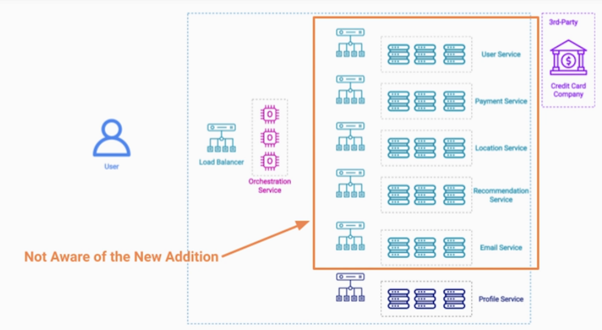
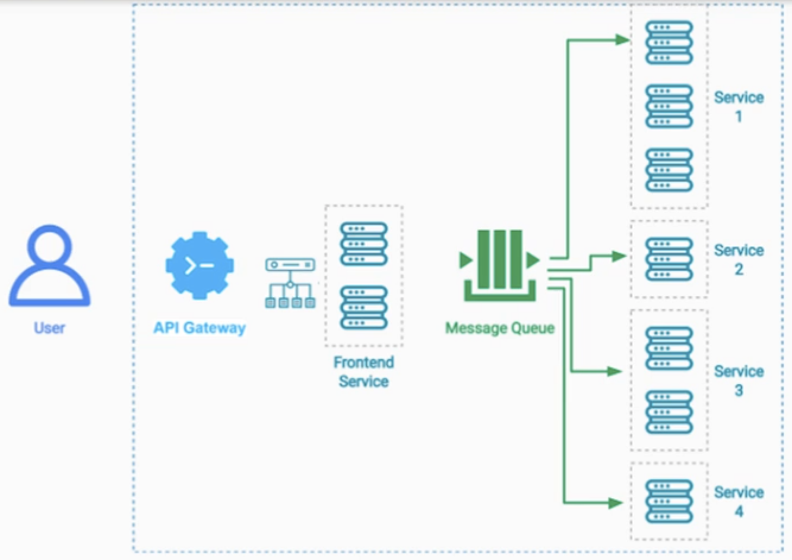

# Cloud SW 아키텍처 패턴:Scalability Patterns

- [Cloud SW 아키텍처 패턴:Scalability Patterns](#cloud-sw-아키텍처-패턴scalability-patterns)
  - [Scalability Patterns](#scalability-patterns)
  - [LoadBalancing Pattern](#loadbalancing-pattern)
    - [기본](#기본)
    - [Cloud LoadBalancing Service](#cloud-loadbalancing-service)
    - [Message Broker, Distributed Message Queue](#message-broker-distributed-message-queue)
    - [LoadBalancing Algorithm](#loadbalancing-algorithm)
      - [라운드 로빈 방식](#라운드-로빈-방식)
      - [Sticky Session / Session Affinity](#sticky-session--session-affinity)
      - [Least Connection](#least-connection)
  - [Pipes and Filters Pattern](#pipes-and-filters-pattern)
    - [기본](#기본-1)
    - [사례 - MPS](#사례---mps)
    - [고려할 점](#고려할-점)
  - [Scatter Gather Pattern](#scatter-gather-pattern)
    - [기본](#기본-2)
    - [사례:문서 검색 서비스](#사례문서-검색-서비스)
    - [사례:항공권 검색 서비스](#사례항공권-검색-서비스)
    - [고려할 점](#고려할-점-1)
  - [Orchestrator Pattern](#orchestrator-pattern)
    - [기본](#기본-3)
    - [예시](#예시)
    - [고려할 점](#고려할-점-2)
  - [Choreography Pattern](#choreography-pattern)
    - [기본](#기본-4)
    - [예시](#예시-1)
    - [고려점](#고려점)

## Scalability Patterns
---

1.확장성 아키텍처 패턴 - Scalability Patterns 

확장성 패턴을 도입으로 얻는 이점은 무엇일까?  
- 하루에 수십억개의 요청을 처리할 수 있다.   
- Petabytes급의 데이터를 처리할 수 있다.  
- 비용을 절감할 수 있다.  

 

## LoadBalancing Pattern
---
### 기본

  
트래픽을 분산시킬 수 있는 로드밸런서를 어플리케이션 앞단에 두는것이다.   

 
  
MSA환경에서는 위 그림처럼 N티어 구성으로 배치가 된다.  
트래픽에 유입에 따라서 특정 서비스만 어플리케이션을 늘리면 된다. 그래서 비용절감효과가 있다.     

### Cloud LoadBalancing Service

  
- 첫번째 로드밸러스 패턴 테크닉  
- 단일 고장점이 없도록, Zone마다 LB를 배치한다.  

### Message Broker, Distributed Message Queue

  
- 두번째 로드밸러스 패턴 테크닉  
- 메시지 브로커는 로드밸런싱 목적이 아니긴 하다.  
- 내부 서비스간에 연결에만 사용  

 

### LoadBalancing Algorithm
---

#### 라운드 로빈 방식  
- 순차적으로 로드를 전달한다.  
- stateless의 경우에 잘 작동한다.  
- 특정 클라이언트와 세션을 유지하는 경우에는 그렇지 않다.

#### Sticky Session / Session Affinity
- 세션을 고정하거나, 세션을 선호하도록 만든다.  

#### Least Connection
- 가장 적은 요청을 처리하는 서버에게 트래픽을 우선 부여한다.  

 

## Pipes and Filters Pattern
---

### 기본

  

- 파이프&필터 패턴은 원천 데이터를 일종의 파이프라인을 따라 흐르게 하면서, 데이터를 가공하여 최종 데이터를 저장하는 과정이다.   
- 데이터의 시작 = data source, 데이터 끝 = data sink 라고 정의한다.   
- 각 컴포넌트에서 데이터 처리가 끝난후 서로 메시지만 주고 받아도 된다.   
- 데이터를 반드시 넘길 필요는 없고, 중앙저장소에서 데이터를 읽고 다시 저장해도 괜찮다.   

왜 필요할까?  
- 각 데이터를 처리하는 서비스(언어)가 다른 경우 대응 가능   
- 전문 팀들이 만든 각각의 독립적인 서비스가 구동되는 환경    
- 서비스마다 GPU, CPU, Memory 등 리소스 환경 구성이 다른 경우에 대응  
- 예) Java 어플리케이션 서버 / 파이썬 머신러닝 모델 서비스 / c++ cpu 고성능 처리 서비스 => 모두 거쳐 최종 데이터를 만드는 케이스  

이점  
- 다른 언어를 사용하여 개발이 가능하다.  
- 전체 파이프라인을 비용과 성능에 최적화 할 수 있다. 
- 높은 확장성을 가진다. 각 파이프라인의 단계마다 인스턴스 수를 조정할 수 있다.  
- 높은 처리량, 평행하게 데이터 처리를 수행할 수 있다.  

사례  

- Processing of User Activity data in digital advertising business  
- Processing data from IOT (Internet Of Things) Devices   
- Ingesting and Processing of Video and Audio files  

### 사례 - MPS

  

비디오를 업로드하면 여러가지 데이터 처리 과정이 필요하다.    

main pipe
  - 하나의 비디오 파일을 각 청크별로 나누는 단계   
  - 각 청크마다 썸네일을 만들어서, 영상의 미리보기를 만드는 것  
  - 비디오를 여러 해상도로 처리하여, adaptive byterate 로 구현  
  - 여러 비디오 확장자로 인코딩을 처리한다.    

pipe2
  - sound > speech 로 만드는 파이프 
  - 여러 언어로 번역하는 파이프  
  - 캡션생성처리 단계  

pipe3
  - 저작권 스캐너  
  - 부적절한 콘텐츠 스케너 및 노티서비스  

### 고려할 점  

- Pipe&Filter 패턴은 오버헤드와 복잡성을 포함하고 있기때문에, 트레이드 오프를 잘 생각해야 한다.   
- 각 필터들은 stateless를 유지 해야하며, 충분한 메타데이터를 인풋해야 한다.  
- 분산환경에서 트랜젝션이 발생하므로, 단일 트랜젝션의 필요한 경우에는 이 패턴이 적절하지 않다.  

 

## Scatter Gather Pattern
---

### 기본

  

하나의 요청을 받고 여러 서비스들에게 분산하여 요청을 분리한다. 그리고 이를 하나로 합친다.  
분할 정복 알고리즘 처럼 작동하는것 같다. 로드밸런서는 뒷단의 서버하나를 골라 트래픽을 주지만 이 패턴을 모든 서비스에 작업을 전달한다.  
각 서비스는 다른 데이터와 다른 로직을 처리해도 좋다.  

핵심 원칙  
- 워커는 독립적이며, 보내는 요청 또한 독립적이여야 한다.   
- 평행하게 동시에 많은 요청을 처리할 수 있다.   
- 일정 시간안에 많은 양의 데이터를 제공할 수 있다.   

### 사례:문서 검색 서비스

  

사용자가 키워드를 통해 검색한다.  
샤딩된 데이터를 관리하는 각 검색 서비스에 키워드로 요청을 보낸다.  
각 워커의 검색 결과를 랭킹을 매기고 하나의 결과로 합친다.  

### 사례:항공권 검색 서비스

사용자가 원하는 항공일정을 입력한다.   
예매정보가 있는 서비스들에게 요청을 보내고, 그 결과를 하나로 합친다  

 

### 고려할 점

장점  
- 사용자에게 워커의 수에 관계없이 유사한 경험을 제공해줄 수 있다.  
- 사용자는 워커가 내부서비스인지 외부서비스인지 모른다.

고려점
- 1.워커가 데이터를 처리할 수 없는경우, timeout 처리 후 aggreated 데이터를 요청에 응답해야 한다.  
- 2.dispatcher와 워커를 비동기로 분리해야 할 수 있다.  

항공권 검색 서비스인 경우 10초 이내에 워커가 데이터를 가져오지 못하면, 해당 워커의 데이터는 무시하면 된다.    

보고서 요청 서비스 같은 경우에는 응답결과를 계속 기다리는것 대신에, Message Broker를 두고 검색결과를 비동기적으로 읽어갈 수 있다.     
사용자 요청에 Topic을 발행하고, 각 워커가 데이터를 읽고 결과를 Results Topic에 발행. 그 이후 데이터를 추합해서 응답을 보내주자.    

  

데이터 분석 후 한 시간 정도 보고서를 만드는 등의 작업이 소요된다고 가정하자.    

그렇다면 aggregator를 서비스를 분리해도 좋다.   
각 워커들은 데이터를 수집한 이후 Results Topic에 발행한다.   
데이터 처리가 끝났다는 메시지가 쌓이면 aggregator가 데이터를 모아서 처리 후 DB에 저장해 둔다.   
그리고 사용자는 데이터를 조회할때 key(= identifier)로 접근하여 최종 결과를 받아볼 수 있다.  

 

## Orchestrator Pattern
---

### 기본

  

Scatter Gather Pattern 처럼 여러 워커에게 요청을 분산하는것은 맞지만,  
orchestrator 패턴에서는 하위 서비스들에게 순차적으로 요청을 보내고, retry, 예외처리 등의 작업과 현재 플로우의 상태를 유지관리한다.   

### 예시

  
VOD 구독형 서비스를 결제하는 시나리오를 가정해보자.  
- 1.사용자 Password, credit info로 구독을 요청
- 2.UserService에서 인증을 먼저 받는다.  
- 3.결제 서비스에서 카드 정보를 확인하고 결제를 시도한다.  
- 4.이메일 서비스에게 구독정보를 공지해주고, 위치 서비스를 이용해서 사용 가능한 VOD를 풀어준다. 
- 5.추천서비스에게 새로운 유저의 인입을 알려준다.  
- 추후 ProfileService가 추가되더라도, 다른 서비스에는 영향이 가지 않는다는점이 중요하다.  

### 고려할 점

- 오케스트레이션 서버는 중앙에서 애러로그와 추적을 용이하게 한다.  
- 오케스트레이션 서버 자체가 다운되어도 작업을 다른 파드가 이어서 진행하기 위해 state를 저장할 DB를 둔다.  
- 흔한 실수 : 오케스트레이션 서버에 비즈니스 로직을 넣지 말자. 이는 모놀리틱과 유사해진다.  

 

## Choreography Pattern
---

### 기본
  

오케스트레이션 패턴과 유사하지만, Message Broker를 두어 비동기적으로 서비스들을 처리한다.  

### 예시

   
구직자에게 적절한 채용공고를 알려주는 서비스 시나리오  
- 1.구직자가 이력서를 업로드를 한다.  
- 2.이벤트를 받은 구직자 서비스에서 구직자 정보를 db에 저장한다.
- 3.이메일 확인 서비스(서버리스)를 호출하고 구직자가 확인을 하면 또 Topic을 발행한다.  
- 4.구직자의 스킬을 파싱하는 서비스가 작동하고 작업이 끝나면 Topic을 발행한다.  
- 5.Job Search 서비스가 작동하며 종료되면 Topic을 발행하고
- 6.이는 이메일 서비스가 구직자에게 채용공고를 보내도록 작동한다.  

### 고려점 
- 진행상태는 메시지 브로커에 저장되기 때문에 따로 상태관리를 하지 않아도 된다.  
- 새로운 서비스가 추가되더라도, 다른서비스에는 영향이 가지 않는다.  
- 비동기적으로 서비스 이곳저곳을 쑤시고 다니기 때문에 트러블 슈팅이 쉽지 않다.  
- 복잡한 통합테스트가 필요로 한다.  
- 서비스가 작고 간단한 패턴에 적합하며, 서비스간의 의존도가 낮아야 하는 상황에 적합하다.  