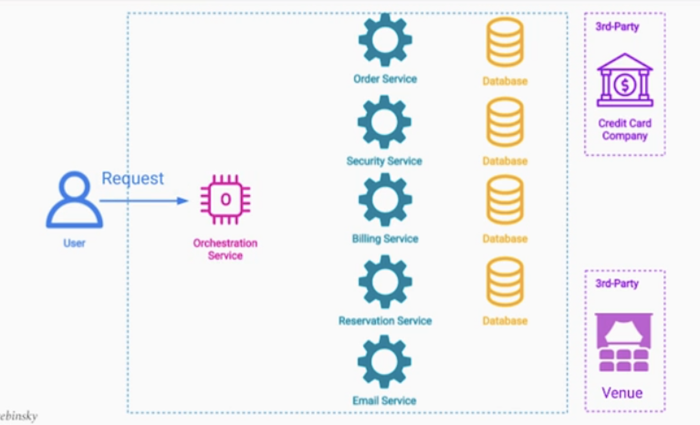
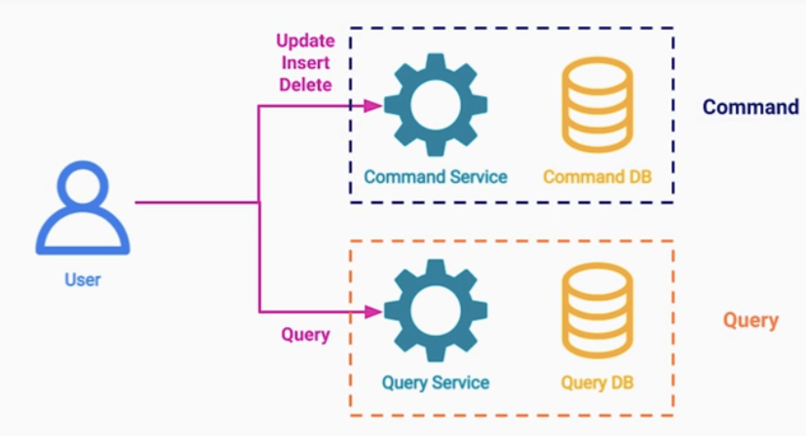
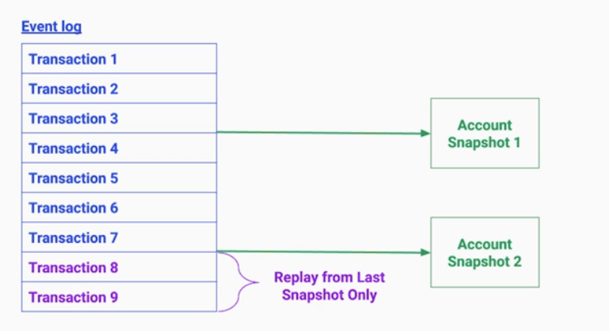

# Cloud SW 아키텍처 패턴:Performance Patterns

- [Cloud SW 아키텍처 패턴:Performance Patterns](#cloud-sw-아키텍처-패턴performance-patterns)
  - [Performance Patterns for Data Intensive Systems](#performance-patterns-for-data-intensive-systems)
  - [Map Reduce Pattern](#map-reduce-pattern)
    - [대용량 데이터 처리의 문제점](#대용량-데이터-처리의-문제점)
    - [MapReduce UseCase](#mapreduce-usecase)
    - [MapReduce 기본 구조](#mapreduce-기본-구조)
    - [MapReduce 예시](#mapreduce-예시)
    - [아키텍처 구조](#아키텍처-구조)
    - [이점](#이점)
    - [실패 및 복구 전략](#실패-및-복구-전략)
    - [고려점](#고려점)
  - [Saga Pattern](#saga-pattern)
    - [문제 및 해결](#문제-및-해결)
    - [Saga Pattern 기본 구조](#saga-pattern-기본-구조)
    - [예시 - 콘서트 티켓 판매 서비스](#예시---콘서트-티켓-판매-서비스)
    - [예시 - 콘서트 티켓 판매 서비스 - 2](#예시---콘서트-티켓-판매-서비스---2)
    - [Saga Pattern 특징](#saga-pattern-특징)
  - [Transactional Outbox Pattern](#transactional-outbox-pattern)
    - [문제점](#문제점)
    - [해결](#해결)
    - [가능한 문제점 1](#가능한-문제점-1)
    - [가능한 문제점 2](#가능한-문제점-2)
    - [가능한 문제점 3](#가능한-문제점-3)
    - [결론](#결론)
  - [Materialized View Pattern](#materialized-view-pattern)
    - [문제점](#문제점-1)
    - [해결 방법](#해결-방법)
    - [예시 - 온라인 교옥 플랫폼](#예시---온라인-교옥-플랫폼)
    - [고려점](#고려점-1)
    - [코멘트](#코멘트)
  - [CQRS Pattern](#cqrs-pattern)
    - [용어](#용어)
    - [문제 정의 1](#문제-정의-1)
    - [문제 정의 2](#문제-정의-2)
    - [기본 구조](#기본-구조)
    - [데이터 동기화 방법](#데이터-동기화-방법)
    - [이점 및 고려점](#이점-및-고려점)
    - [사례 - 이커머스](#사례---이커머스)
  - [Event Sourcing Pattern](#event-sourcing-pattern)
    - [문제 정의](#문제-정의)
    - [해결책 : 이벤트 소싱 패턴](#해결책--이벤트-소싱-패턴)
    - [이벤트를 저장하는 방법](#이벤트를-저장하는-방법)
    - [Replay 전략](#replay-전략)

## Performance Patterns for Data Intensive Systems  
---

2.데이터 집약 시스템을 위한 성능 아키텍처 패턴 - Performance Patterns for Data Intensive Systems   

데이터 집약 시스템을 위한 성능 패턴을 도입으로 얻는 이점은 무엇일까?  
- 아키텍처 변경없이 대용량 데이터 처리  
- 분산트랙젝션 가능 (ACID 유지)  

 

## Map Reduce Pattern
---

### 대용량 데이터 처리의 문제점  

대용량 데이터 세트 처리의 문제점은 데이터 처리를 위해서 수백~수천 대의 머신에 분산처리 시켜야 하는 점이다.  
- 데이터 병렬화, 데이터 분산 배포, 결과 추합
- 실행 예약, 실패 처리, 복구 문제
- 많은 처리 소스 코드 및 인프라 구성  

맵리듀스 패턴을 사용하면, 아키텍처의 변경없이 많은 양의 데이터를 처리할 수 있는 시스템이 구성된다.  

### MapReduce UseCase  

- 머신러닝
- 로그 파일 필터 및 분석
- 역색인 구성
- 웹링크 그래프 순회
- 분산 정렬  

### MapReduce 기본 구조
  

Input data: key-value 쌍으로 구성된 데이터를 입력  
1. Map : Map를 통과하면 중간 key-value쌍이 나오게 된다.  
2. intermediate data : Map 중간 key-value 결과물 
3. Reduce : Reduce 함수에서 중간 key-value를 grouping하고(정렬) Reduce 로직 수행 후 최종 데이터를 출력한다.
Output data : 최종데이터   
* 사실상 위 구조만 봤을때는 잘 이해되지 않는다.    

### MapReduce 예시 
  

Goal : 수많은 파일들을 분석해서, 특정 단어의 수를 카운트 하자.  

Input data: key는 파일이름, value는 파일 내용물   

1. Map : 각각의 text file을 대상으로 단어의 갯수들을 출력한다. 이는 key-value쌍으로 출력 가능.    
2. intermediate data : 각 파일의 단어수가 적힌 key-value 데이터 셋 

  
3. Reduce : key값이 단어이므로, 단어순으로 정렬를 먼저 한다. 
- 그리고 각 단어들의 갯수를 추합하여 최종 데이터를 출력한다.      
- *리듀스 함수를 통과시키는데 key에 대해서 반복자를 돌린다. 중간키에 대한 값이 많아서 메모리에 한번에 로드 불가능   

Output data : key-value(단어,갯수)의 리스트  

### 아키텍처 구조

  

크게 3가지의 컴포넌트로 구성된다. 마스터노드, 맵워커, 리듀스 워커  

1.마스터 노드 
- 전체 MapReduce 작업 예약 및 컨트롤  
- 전체 데이터를 청크단위로 나누어서, Map Workder들에게 할당한다. (실제 데이터 주는것이 아닌 임무를 부여)  

2.Map Workers  
- Map 함수를 실행하는 수백 ~ 수천개의 컴퓨터  
- 그냥 데이터를 저장하지 않고, Region을 분리해서 저장한다.  
- Region = hash(key) mod R : 을 통해서 어떤 Region에 저장할지 결정 가능하다.  

3.Reduce Workers
- 마스터는 각 Region을 담당하고 있는 워커에게 작업을 분배한다.
- 리듀스 워커가 데이터를 읽어간다. 
- 키를 그룹 및 정렬하는 과정 (셔플링) > Reduce 연산을 수행  

### 이점  

- 같은 SW아키텍처를 재활용할 수 있다. Map,Reduce함수만 바꾸면 된다. 
- 테스크의 스케일링이 가능.  
- 많은 워커에게 평행하게 작업 분배 가능    
- 짧은 시간안에 대용량의 데이터를 처리할 수 있음.  

### 실패 및 복구 전략
- 마스터가 리듀스 워커들을 관찰하며, 실패한 작업을 다시 다른 워커에게 할당
- 맵 워커가 실패한 경우도 다른 워커에게 작업을 할당하며 이때 바뀐 중간 key-value 값위치도 리듀스워커에게 알려야한다.  
- 마스터 워커가 장애날 확률은 적지만, 작업에 대한 상태를 스냅샷을 두거나 백업 마스터를 둔다.  

### 고려점
- 직접 Map,Reduce 아키텍처를 구성할 일은 없다. 
- 오픈소스/클라우드 서비스 이용한다.  
- 클라우드 환경을 이용해서 필요한 만큼 컴퓨터를 대여하고 반납한다.  
  - ㄴ ( on demand | on scheduled Batch )
- 시스템은 구성을 신경스지 않고, 비즈니스에 집중 가능하다.
  - ㄴ 데이터모델링, map-reduce 모델링, execution parameters 정의 ..등  

 

## Saga Pattern
---

### 문제 및 해결

MSA는 빠른 엔지니어링 속도, 확장성 등 이점이 있다.   
- 한가지 중요한 원칙이 마이크로 서비스 하나당 DB가 하나여야 한다.    
- 만약에 여러 팀이 DB커넥션을 맺으면, 모든 변경사항에 대해서 합의가 필요하다.  
- 이는 마이크로 서비스들이 database를 공유하는것은 MSA안티 패턴이다.  

하지만 서비스 마다 DB로 분리하는 순간 ACID 트랜잭션 이라는 특성을 잃게 된다.    
- *리마인드) 트랜젝션 : 외부 옵저버에 단일 작업으로 표시돼야 하는 작업의 시퀀스  
- 분산 환경에서 데이터의 일관성을 유지하는 방법이 saga패턴이다.  

### Saga Pattern 기본 구조

saga 패턴은 다음의 과정을 통해서 분산환경에서 ACID를 유지 힌다. 
- local 트랜젝션1 을 수행하고 다음 서비스에서 트랜젝션 시퀀스를 이어 간다.  
- 그러다 만약 작업이 실패하면, 기존에 수행한 작업을 롤백하기 위한 과정이 있다.  
- 기존 작업에 대한 보상 작업(보상 트랙젝션) 이라고 한다.  
- *트랜젝션 시퀀스가 성공할때까지 위 과정을 반복한다.  

saga 패턴 구현방법  
1. Orchestrator Pattern : 오케스트레이터 서버로 트렉젝션 시퀀스 및 보상 관리
2. Choreography Pattern : 메시지 브로커로 트렉젝션 시퀀스 및 보상 관리

### 예시 - 콘서트 티켓 판매 서비스

요구사항 
- 행사 티켓 및 티켓 전용 좌석을 예약    
- 블랙리스트 상 유저인지 체크 
- 결제금액을 받았는지 체크 
- 고객 1명당 1개 좌석인지 체크

*보상 트렌젝션 : pending상태를 원래상태로 되돌리는 트렌젝션    
*Pivot Operation : pending상태를 성공상태로 바꾸는 작업들  

1.Order Service : 
- 좌석예약 상태로 DB를 업데이트 (pending) 후 이어서 진행  
- pending 상태이므로, 다른 사용자가 같은 자리를 예약 시도 -> 실패 및 retry 안내   
- 만약 트랜젝션이 실패하면 다른 사용자가 이용 가능    

2.Security Service : 사용자가 유효한지 체크  
- 만약 블랙리스트라면 rollback ( > Order Service 보상 )
- 아니라면 이어서 진행

3.Billing Service : 3rd party에 결제 시도  
- 결제 오류라면 rollback ( > Order Service 보상 )
- 아니라면 DB를 업데이트 (pending) 및 결제 (pending) 후 이어서 진행

4.Reservation Service : 3rd party 좌석 예매 시스템  
- 만약 누군가가 이미 예매했다면 rollback ( > Billing Service 보상 > Order Service 보상 )
- 아니라면 좌석 티켓 예약 성공 및 DB업데이트 (reserved)  

5.Pivot Operation 
- Billing Servce : pending > 사용자에게 결제 요청 API > 성공 > charged
- Order Service : panding > purchased 
- Email Service : 결제성공알람  

### 예시 - 콘서트 티켓 판매 서비스 - 2  

위 과정을 메시지 브로커를 통해서 작동하도록 로직을 구성한다.  
- 메시지 브로커를 사용하면 문제점이 있다.  
- ACID가 지켜지지 않는데, 이는 다음패턴에서 해결  

### Saga Pattern 특징    
- 성공,실패 모두 오퍼레이션이 있다.  
- 실패하는 경우 롤백 오퍼레이션 (보상 트렌젝션)    
- 성공하는 경우 피봇 오퍼레이션  

## Transactional Outbox Pattern

### 문제점  

위 구인구직 추천서비스를 예로들면  
- 사용자가 회원가입 이후, 신규 유저 가입 이벤트 메시지를 보내야 한다.  
- DB와 메시지 브로커는 단일 트렉젝션이 아니므로, 충분히 신규 회원가입의 이벤트 메시지를 못받을 수 있다.  
- 특히나 결제관련된 이벤트 라면, 영원히 결제 pending 일 수 있다.  

### 해결

해결방법 : Transactional Outbox Pattern

1.메시지를 관련 레코드도 DB에 기록한다.   
- ( 메시지를 보내야함, 메시지를 성공적으로 보냈음 등의 상태를 Table에 기록한다. )    
- 이때, 사용자 생성 Row 및 메시지 레코드는 단일 트랜젝션으로 만든다.  
  - 즉 사용자 생성이 안되면, 메시지 레코드 역시 만들어지지 않는것이다.  

2.메시지를 레코드가 생성되면 이를 관찰하는 서비스에서 메시지를 보낸다.  
- 메시지 브로커에 메시지가 확실하게 전달되었는지를 확인할 수 있다.  
- 그러면 메시지 레코드를 전송완료 상태로 업데이트 한다. 혹은 삭제 한다.  

### 가능한 문제점 1

Message Relay service가 메시지를 두번 보내는 경우  
- 아웃박스 테이블의 메시지 레코드를 읽고 메시지를 보냈음  
- 그리고 전송완료로 레코드를 업데이트 하기 전에 서버가 다운되는 경우가 발생
- 그러면 동일한 메시지가 2번 전송될 수 있다.  

만약 메시지 중복이 되더라도 괜찮은 경우가 있다. ( At Least Once ) 
- 멱등 연산인 경우이다. 
- 결제처럼 중복이 일어나면 안되는 경우를 멱등연산으로 만들면된다. 
- *결제 ID를 부여해서 동일한 결제 ID 로 결제요청이 2번 들어오면 
- 최초의 결제만 허용하고, 2번째 결제는 무시하면 된다.  

### 가능한 문제점 2

atomic transaction을 DB에서 지원하지 않는 경우 
- 대표적으로 nosql이 있다.  
- document model에 outbox 데이터 자체를 추가하면 된다. 

### 가능한 문제점 3

이벤트의 순서가 중요한 경우
- 예를들어 사용자가 구독을 하고, 바로 구독취소를 하는 경우이다.  
- 메시지가 - 구독 취소 메시지 후 구독 메시지로 순서가 바뀔 수 있다.  
- outbox 테이블에 시퀀스 ID를 부여해서 해결한다.   
- 항상 시퀀스 ID가 낮은 순서대로 메시지를 읽어서 처리해야 한다.  

### 결론 

트렌젝션과 다르게 비동기 이벤트를 처리하는 경우 원자성이 보장되지 않을 수 있다.   
그럴땐, 비동기 이벤트 처리 로직도 트렌젝션 로직으로 감싸서 처리하여 원자성을 보장하자.  

## Materialized View Pattern

### 문제점  

비즈니스 로직이 복잡해지면서 여러 테이블의 데이터를 필요한 경우가 있다.  
- 복잡한 연산이 필요하거나 ( 합계 )
- 데이터 조인이 필요하거나 ( Join )
- 하나의 쿼리 자체가 속도가 느려지고 (Performance) 
- 비용이 비싸질 수 있다. ( Efficiency & Cost )

### 해결 방법

Materialized View 를 이용해서 해결이 가능하다.  
- 구체화된 읽기 전용 테이블(뷰)를 만들어 주는 것이다.  
- 쿼리의 결과값들을 미리 채워 둔다.  
- aggrate fun, join 등의 연산 시간과 오버헤드를 줄일 수 있다.  
- 이는 동일 database안의 테이블이라면 가능하다. 

### 예시 - 온라인 교옥 플랫폼

시나리오 : 강의에는 수강생들의 후기와 별점들이 남는다.  
- course.topic : 강의의 카테고리 정보   
- reivew : 리뷰 테이블에는 학생아이디, 별점, 리뷰들이 존재한다.  
- 쿼리 요청 
  - 프로그래밍 카테고리의 강의중에서 평균 별점점이 가장 높은 강의들을 순서대로 정렬해서 가져와라.
  - 아트 카테고리의 강의중에서 평균 별점점이 가장 높은 강의들을 순서대로 정렬해서 가져와라.
- 이런 요청들은 하루에 수백 ~ 수천번 일어난다고 가정한다.  

아래와 같은 뷰 테이블을 미리 만들어준다.  
- Top_Programming_Courses_MV : 프로그래밍 카테고리의 강의별 평균 별점 점수 뷰 테이블
- Top_Art_Courses_MV : 예술 카테고리의 각 강의별 평균 별점 점수 뷰 테이블

### 고려점 

1.미리 DB 공간을 차지할 만큼 뷰테이블을 만들 가치가 있는가?
- 디스크 공간과 성능의 트레이드 오프

2.데이터 저장을 db에 하는것과 redis에 하는것중 뭐가 더 좋을까?  

2.1. 동일한 DB안에서 하는 경우에는, View Automatic Update 될 수 있다.  
- 하지만 업데이트가 자주 발생한다면, View 갱신 주기를 조정할 필요가 있다.  

2.2. Redis같은 인메모리에 저장한다.  
- Redis + 백업 DB 구조의 이중화가 가능하다.  
- 업데이트 방식을 프로그래밍으로 제어해야 한다.  

### 코멘트

DB조회가 느린 경우 말고도, 서드파티 API가 느린 경우에도 사용할 수 있겠다. 

## CQRS Pattern

### 용어 

Command and Query Responsibility Segregation  
- 명령과 쿼리의 역할 분리

Command : 데이터 Mutation이 발생하는 연산
- 사용자 추가, 리뷰 업데이트, 삭제 등

Query : 데이터를 읽는 연산들  
- 특정 카테고리의 모든 프로덕트를 가져와라.  

### 문제 정의 1

- 데이터의 빈번한 읽기과 쓰기가 발생한다.  
- 데이터의 쓰기가 발생할때 복잡한 로직이 있다.  
- 데이터의 읽기연산에 높은 성능이 필요 하다.    
- 해결방법 : CQRS Pattern

### 문제 정의 2

MSA환경에서는 DB들이 분리되어 있으므로, 단일 DB안에서 View를 만들 수 없다.  
- 이는 programmactic aggregation 으로 가능은하다.  
- 하지만 Join 연산도 느린 마당에, 각 MSA 서비스를 호출하고 합치는것은 오버헤드가 크다. 
- 해결방법 : Materialized View + CQRS Pattern

### 기본 구조   

Command Service : 비즈니스 로직 처리, 데이터 유효성 검사, 권한 검사 등 (CUD)  
Query Service : 데이터를 읽는 로직만 처리한다. (R)
- 두 서비스는 독립적으로 분리한다. 
- Command DB, Query DB는 지속적으로 동기화 한다.  
- 구체화된 뷰 패턴보다 한 단계 더 발전 되었다.  
- 각 서비스는 Mutation에 최적화, Query에 최적화된 시스템을 가진다.  

### 데이터 동기화 방법  

- DB와 커넥션으로 직접 데이터를 가져올 수 없다.  
- API 사용도 금지 이다.  

1.Message Queue 데이터 Sync

- Update/Insert/Delete 가 발생하면
- 이벤트를 발생시켜, Query Service가 적절한 조취를 취하도록 한다.  
- 이때 트렌젝셔널 아웃박스 패턴도 사용 가능하다.  

2.Cloud Function 데이터 Sync

### 이점 및 고려점   

이점
- 읽기와 쓰기에 모두 최적화된 시스템을 구성할 수 있다.  
- 높은 확장성을 가져간다.   

트레이드 오프 : 복잡한 시스템 구조를 가져가게 된다.  
- 읽기와 쓰기가 매우 많은 경우에 적합하다.  
- 실시간으로 데이터의 동기화가 필요하거나, 
- 데이터의 엄격한 일관성이 필요하다면 적절하지 않다.    

### 사례 - 이커머스 

쓰기 서비스의 복잡성 및 요구사항
- 사용자의 주문기록이 있어야 한다.  
- 중복된 리뷰를 쓰면 안된다.  
- 부적절한 언어가 포함되었는지 확인해야 한다.  
- 블랙리스트 회원인지 확인  

읽기 서비스의 복잡한 요구사항  
- 다수의 제품에 대한 모든 후기와 평점 리뷰를 불러와야 한다.  
- 사용자의 위치에 따라서 리뷰들도 달라진다.
- 사용자의 공용이름 표기 ? 

읽기 서비스는 
- 리뷰 테이블은 사용자 관련 위치정보등을 포함하기 때문에 데이터를 가져오는데 연산이 적고 필터링이 쉽다.  
  - 리뷰 테이블이 업데이트 되면, 메세지를 발행해서 뷰를 갱신. 
  - 리뷰 데이터는 일정량이 쌓이면, 뷰 테이블을 갱신시켜도 된다.  
- 상품의 평균 평점을 사실 아주 정확할 필요는 없다. 데이터 업데이트 주기를 하루 단위로 가능
- 그 외 상품상세설명, 인벤토리, 추천, 트랜딩 데이터 등 확장이 용이하다.  
- NoSQL DB로 구성되며 읽기에 최적화되어있다. 
- 특별한 비즈니스 로직 유효성 검사 등 필요없고, 퍼블릭에 공개가능한 데이터만 존재한다.  

스케일업 프로비저닝 

- 읽기 연산이 더 필요하면 관련된 서비스들의 인스턴스들을 늘린다.  

## Event Sourcing Pattern

### 문제 정의  

온라인 뱅킹에서 현재 잔고 외에 잔고의 히스토리 정보까지 보관해야 한다.  
- Current State + Every State 보관이 필요하다.  
- 데이터 시각화, 감사, 정확성을 위해서 필요하다.  
- 즉, 히스토리 데이터를 모두 저장하는 것이다.  
- 고객의 잘못인지, 시스템 오류인지 등을 알 수 있다.  
- 소비 트랜드 또한 알 수 있다.  

이커머스 서비스에서 이런 경우도 발생  
- 최초 제품의 제고량이 200개 이다.  
- 판매가 100개 발생 + 어제 물건의 반품이 100개 발생
- 그러면 판매가 일어났지만 여전히 재고는 200개 이다.  
- 현재 상태에 도달한 기록이 없다.  

히스토리성 데이터를 많이 쓰고 많이 읽는 서비스에 대한 시스템

### 해결책 : 이벤트 소싱 패턴

사건의 정보 및 변경 사실을 담은 데이터(이벤트)를 기록하는 DB를 저장한다.  
- 한번 들어오 데이터는 불변성을 가져야 한다.  
- 새로운 이벤트는 Append 된다.  
- 이벤트 테이블을 모두 가져온다면, 최초의 상태에서 현재 상태로 복원시킬 수 있다.  

### 이벤트를 저장하는 방법 

1.DB에 저장하는 방법
- 이벤트별로 레코드를 분리해서 저장 가능
- 많은 쓰기가 발생하면 퍼포먼스가 낮아진다.  

2.메시지 브로커에 저장하는 방법
- 높은 쓰기속도를 가진다.  
- 메시지 브로커에 데이터를 영구적으로 저장이 가능한지 체크.  

### Replay 전략

1.스냅샷
- 특정 시점에 모든 이벤트 로그를 주기적으로 스냅샷을 저장하는 것

2.CQRS 패턴

- Event Sourcing + CQRS 패턴은 인기가 많다.
- 히스토리와 감사 데이터를 얻을 수 있다. 
- 읽기 쓰기 모두 빠르게 가져간다.  

2.1 Redis
- 이벤트 데이터를 쓰는 전용 DB를 둔다. (저장)  
- 이벤트가 발생되면 이를 Redis에 저장한다. (읽기)  

2.2 MessageQueue

- 이벤트 데이터는 메시지 큐에 저장한다. (저장)
- 이벤트가 발생되면 이를 View DB를 갱신한다.(읽기) 
