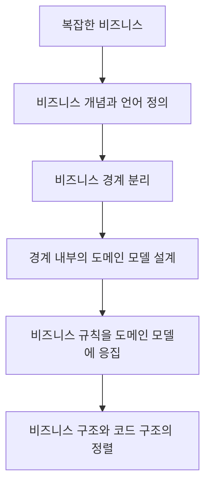
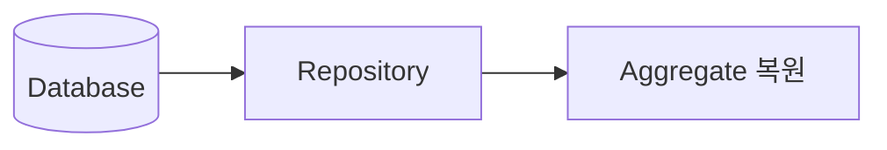
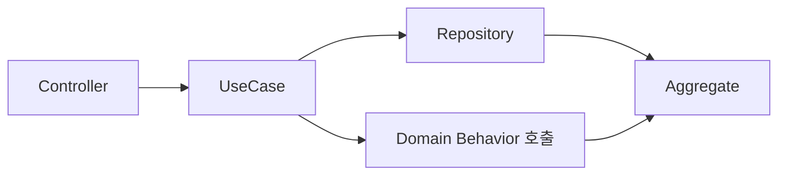
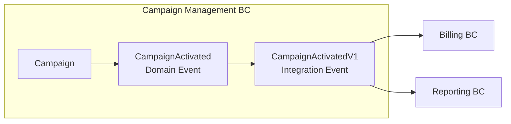
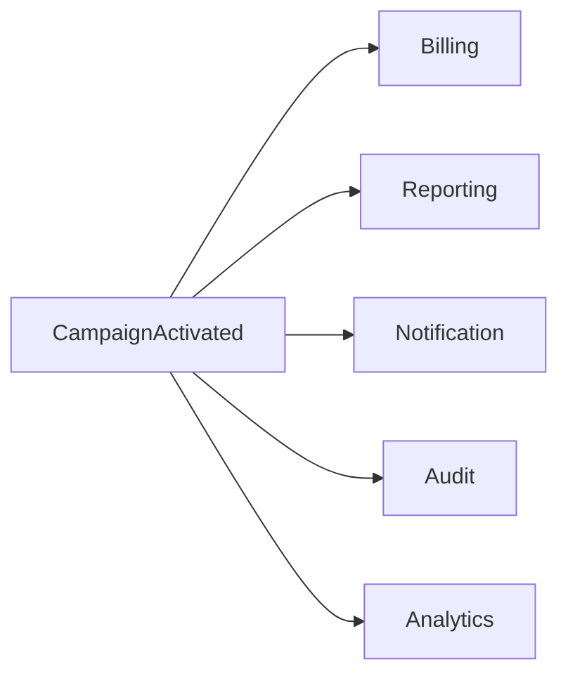
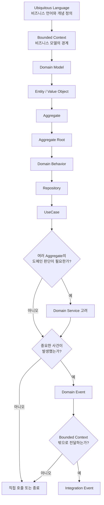

# DDD 핵심 개념과 실전 설계 흐름

Domain-Driven Design(DDD)은 Entity나 Repository 같은 패턴을 적용하는 기법에 그치지 않는다. 복잡한 비즈니스를 적절한 언어, 경계, 모델로 표현하고 그 구조가 코드에도 드러나게 만드는 설계 접근법이다.

이 글에서는 광고 플랫폼의 `Campaign` 도메인을 예로 들어 DDD의 핵심 개념과 실제 설계 순서를 연결한다.

## 1. DDD는 무엇을 해결하려는가?

비즈니스가 복잡해질수록 실제 업무와 코드 사이의 거리가 벌어지기 쉽다.

- 같은 단어를 기획자와 개발자가 다르게 이해한다.
- 하나의 모델이 너무 많은 책임을 가진다.
- 비즈니스 규칙이 Controller, Service, Repository에 흩어진다.
- 하나의 기능을 수정했는데 예상하지 못한 다른 기능이 깨진다.
- 코드를 읽어도 실제 비즈니스가 어떻게 동작하는지 이해하기 어렵다.

DDD는 이 문제를 다음 흐름으로 다룬다.



DDD의 본질은 패턴의 개수가 아니라 **비즈니스가 사용하는 개념과 규칙을 코드가 얼마나 정확하게 표현하는가**에 있다.

:::note DDD는 객체지향 전용 설계가 아니다

이 글은 익숙한 설명을 위해 class와 객체 메서드를 주로 사용하지만, DDD의 경계와 모델링 원칙은 프로그래밍 패러다임과 무관하다. 함수형 TypeScript와 React에서는 불변 데이터, 판별 유니온, 순수한 상태 전이 함수로 같은 개념을 표현할 수 있다.

구체적인 구현 방법은 [함수형 DDD와 React 적용](../../../g-fe/0-common/6-ddd/ddd-8-functional-react.md)에서 이어서 다룬다.

:::

## 2. Ubiquitous Language

DDD의 출발점은 비즈니스 언어를 통일하는 것이다. 이를 **Ubiquitous Language(보편 언어)**라고 한다.

비즈니스에서는 “캠페인을 활성화한다”라고 말하지만 코드가 다음과 같다면 비즈니스 언어와 구현이 분리되어 있다.

```ts
campaign.status = 1;
```

가능하면 코드에도 같은 의도를 드러낸다.

```ts
campaign.activate();
```

### Glossary 예시

복잡한 시스템에서는 간단한 용어집으로 보편 언어를 관리할 수 있다.

| 용어 | 정의 |
| --- | --- |
| Campaign | 광고주가 광고 목적을 달성하기 위해 생성하는 광고 관리 단위 |
| Activation | Campaign을 광고 집행 가능한 상태로 전환하는 행위 |
| AdGroup | Campaign 아래에서 Targeting과 Creative를 관리하는 광고 집행 단위 |

Glossary가 DDD의 필수 산출물은 아니지만, 여러 팀이 협업하거나 같은 단어가 여러 의미로 쓰이는 시스템에서는 큰 도움이 된다.

> 문서의 언어 = 회의의 언어 = 코드의 언어

## 3. Bounded Context

언어를 정의했다면 그 언어와 모델이 유효한 **비즈니스 경계**를 찾는다. 이 경계를 Bounded Context라고 한다.

광고 시스템 전체가 하나의 모델일 필요는 없다. 같은 `Campaign`도 Context에 따라 관심사가 다르다.

| Campaign Management | Reporting |
| --- | --- |
| Budget | CampaignId |
| Schedule | Impression |
| Targeting | Click |
| Status | Conversion, ROAS |

Campaign Management는 캠페인의 생성과 집행 규칙에 관심이 있고, Reporting은 성과 집계와 분석에 관심이 있다. 같은 단어를 사용하더라도 의미와 규칙이 다르므로 서로 다른 Bounded Context로 분리할 수 있다.

### Bounded Context를 나누는 기준

가장 중요한 질문은 **같은 비즈니스 규칙과 모델을 공유해야 하는가?**이다.

| 질문 | 분리 신호 |
| --- | --- |
| 해결하려는 비즈니스 목적이 다른가? | 높음 |
| 같은 용어의 의미가 다른가? | 매우 높음 |
| 적용되는 비즈니스 규칙이 다른가? | 매우 높음 |
| 서로 다른 이유로 변경되는가? | 높음 |
| 라이프사이클이 독립적인가? | 높음 |
| 담당 조직이나 팀이 다른가? | 참고 신호 |

정리하면 **같이 변하고, 같은 규칙을 적용받고, 같은 의미로 이야기되는 것끼리 묶는다.** 조직 구조는 유용한 단서지만 그 자체가 경계를 결정하지는 않는다.

## 4. Domain Model

Bounded Context를 찾았다면 Context 내부의 개념과 관계를 모델링한다.

```text
Campaign Management
├── Campaign
├── AdGroup
├── Creative
├── Budget
├── Schedule
└── Targeting
```

여기서부터 Entity, Value Object, Aggregate 같은 **전술적 DDD(Tactical DDD)**를 적용한다.

## 5. Entity와 Value Object

### Entity

Entity는 속성보다 **정체성(Identity)**이 중요한 객체다.

```text
Campaign #123, name = "여름 광고"
              ↓ 이름 변경
Campaign #123, name = "여름 광고 v2"
```

이름이 변경되어도 같은 `Campaign #123`이다.

```ts
class Campaign {
  constructor(
    readonly id: CampaignId,
    private name: string,
    private status: CampaignStatus,
  ) {}
}
```

### Value Object

Value Object는 정체성보다 **값 자체**가 중요한 객체다. 일반적으로 불변으로 만들고, 속성 전체가 같으면 같은 값으로 본다.

```ts
class Money {
  constructor(
    readonly amount: number,
    readonly currency: Currency,
  ) {}

  equals(other: Money): boolean {
    return this.amount === other.amount
      && this.currency === other.currency;
  }
}
```

다음 질문으로 두 개념을 구분할 수 있다.

> 속성이 바뀌더라도 계속 같은 대상으로 추적해야 하는가?

- Yes: Entity
- No, 값 전체가 의미를 결정한다: Value Object

## 6. Aggregate

Entity와 Value Object를 식별했다면 다음으로 **일관성의 경계**를 결정한다.

Aggregate는 단순한 객체 묶음이 아니다.

> 하나의 트랜잭션에서 함께 일관성을 보장해야 하는 도메인 객체들의 경계

예를 들어 같은 Campaign Management Context 안에서도 다음처럼 Aggregate를 나눌 수 있다.

```text
Campaign Aggregate
├── Campaign
├── Budget
└── Schedule

AdGroup Aggregate
├── AdGroup
├── Creative
└── Targeting
```

Aggregate를 지나치게 크게 만들면 매번 불필요한 데이터를 읽고 잠금 충돌이 늘어난다. 반대로 너무 작게 나누면 반드시 지켜야 할 규칙을 한 트랜잭션에서 보장하기 어렵다. **변경 단위와 강한 일관성 요구**가 경계를 결정하는 핵심이다.

## 7. Aggregate Root

각 Aggregate에는 외부 접근을 대표하는 Entity인 **Aggregate Root**가 있다.

```text
AdGroup Aggregate
└── AdGroup        ← Aggregate Root
    ├── Creative   ← Entity
    └── Targeting  ← Value Object
```

외부에서는 내부 객체를 직접 변경하지 않고 Root를 통해 행동을 요청한다.

```ts
// 권장
adGroup.addCreative(creative);
adGroup.removeCreative(creativeId);
```

```ts
// 지양
creative.update(...);
await creativeRepository.save(creative);
```

Aggregate Root는 Aggregate의 불변 조건을 지키는 대표 Entity이자 외부 변경의 진입점이다. **모든 Aggregate Root는 Entity지만 모든 Entity가 Aggregate Root인 것은 아니다.**

## 8. Bounded Context와 Aggregate의 차이

두 경계는 목적과 크기가 다르다.

| 개념 | 의미 | 핵심 질문 |
| --- | --- | --- |
| Bounded Context | 비즈니스 모델과 언어의 경계 | 이 언어와 모델은 어디까지 같은 의미인가? |
| Aggregate | 트랜잭션과 일관성의 경계 | 무엇을 한 번에 일관되게 변경해야 하는가? |

하나의 Bounded Context 안에는 여러 Aggregate가 존재할 수 있다.

```text
Campaign Management Bounded Context
├── Campaign Aggregate
│   └── Campaign ← Root
└── AdGroup Aggregate
    ├── AdGroup ← Root
    └── Creative
```

Campaign, AdGroup, Creative가 각각 Entity라고 해서 별도의 Bounded Context가 되는 것은 아니다. 반대로 서로 다른 비즈니스 목적, 규칙, 언어를 가진다면 별도 Context가 될 수 있다.

## 9. Domain Behavior와 Business Rule

Aggregate 경계를 정했다면 실제 비즈니스 행동과 규칙을 모델에 넣는다.

예를 들어 “Budget과 Schedule이 있어야 Campaign을 활성화할 수 있다”라는 규칙은 `Campaign`의 행동으로 표현할 수 있다.

```ts
class Campaign {
  activate(): void {
    if (!this.budget) {
      throw new BudgetRequired();
    }
    if (!this.schedule) {
      throw new ScheduleRequired();
    }

    this.status = CampaignStatus.ACTIVE;
  }
}
```

UseCase가 상태를 직접 해석하고 변경하면 규칙이 여러 곳에 중복될 수 있다.

```ts
// 지양
if (campaign.budget > 0 && campaign.schedule) {
  campaign.status = "ACTIVE";
}
```

대신 `campaign.activate()`처럼 코드 자체가 비즈니스 언어를 표현하게 한다.

## 10. Repository

Repository는 일반적으로 **Aggregate Root 단위**로 만든다.

```text
Campaign Aggregate → CampaignRepository ✅
AdGroup Aggregate  → AdGroupRepository  ✅
Creative Entity    → CreativeRepository ❌ (일반적으로 만들지 않음)
```

Repository의 역할은 DB 행을 그대로 반환하는 것이 아니라 영속화된 데이터로부터 Aggregate를 복원하고 저장하는 것이다.



```ts
async findById(id: CampaignId): Promise<Campaign> {
  const row = await db.campaign.findUniqueOrThrow({
    where: { id: id.value },
  });

  return Campaign.restore({
    id: new CampaignId(row.id),
    budget: new Money(row.budget, row.currency),
    status: CampaignStatus.from(row.status),
  });
}
```

도메인 계층은 Repository 인터페이스만 알고, DB나 ORM을 사용하는 구현체는 Infrastructure 계층에 두면 도메인 모델을 기술 세부사항과 분리할 수 있다.

## 11. Application UseCase

UseCase는 실제 사용자 요청을 완성하는 **실행 순서와 조율(orchestration)**을 담당한다.

```ts
class ActivateCampaignUseCase {
  constructor(
    private readonly campaignRepository: CampaignRepository,
  ) {}

  async execute(campaignId: CampaignId): Promise<void> {
    const campaign = await this.campaignRepository.findById(campaignId);

    campaign.activate();

    await this.campaignRepository.save(campaign);
  }
}
```

| 구성 요소 | 책임 |
| --- | --- |
| UseCase | 입력 처리, 실행 순서, 트랜잭션과 협력 객체 조율 |
| Aggregate | 비즈니스 규칙 검증과 상태 변경 |
| Repository | Aggregate 조회와 저장 |

일반적인 호출 흐름은 다음과 같다.



## 12. 하나의 UseCase가 여러 Aggregate를 사용할 수 있다

Aggregate 경계와 UseCase 경계는 다르다. 하나의 업무 시나리오를 완성하기 위해 여러 Aggregate를 조회하는 것은 자연스럽다.

예를 들어 활성화 조건이 “Creative가 존재하는 AdGroup이 하나 이상 있어야 한다”라면 `Campaign`만으로 판단할 수 없다.

```ts
const campaign = await campaignRepository.findById(campaignId);
const adGroups = await adGroupRepository.findByCampaignId(campaignId);
```

UseCase는 필요한 Aggregate를 준비하고 업무 흐름을 조율할 수 있다. 다만 다른 Aggregate의 내부 상태를 직접 수정해서 각 Root의 불변 조건을 우회해서는 안 된다.

## 13. Domain Service

여러 Aggregate를 알아야 하는 중요한 도메인 규칙이 어느 한 Entity에도 자연스럽게 속하지 않는다면 **Domain Service**를 고려한다.

```ts
class CampaignActivationPolicy {
  canActivate(campaign: Campaign, adGroups: AdGroup[]): boolean {
    if (!campaign.hasBudget()) {
      return false;
    }

    return adGroups.some((adGroup) => adGroup.hasCreative());
  }
}
```

UseCase는 Aggregate를 준비하고 Domain Service의 판단 결과를 Aggregate의 행동에 전달한다.

```ts
const campaign = await campaignRepository.findById(id);
const adGroups = await adGroupRepository.findByCampaignId(id);
const canActivate = activationPolicy.canActivate(campaign, adGroups);

campaign.activate(canActivate);

await campaignRepository.save(campaign);
```

```text
UseCase
├── 필요한 Aggregate 조회
├── Domain Service 호출
│   └── 도메인 규칙 판단
├── Aggregate 행동 호출
└── 저장
```

Domain Service는 Entity에 넣기 애매한 로직을 모아 두는 장소가 아니다. **중요한 도메인 규칙이지만 특정 Entity나 Aggregate 하나에 자연스럽게 귀속되지 않을 때** 사용한다.

## 14. 여러 Aggregate를 사용하는 것과 Aggregate 경계

UseCase가 여러 Aggregate를 조회하는 것은 일반적이다.

```text
ActivateCampaignUseCase
├── Campaign 조회
├── AdGroup 조회
├── 규칙 판단
└── Campaign 변경
```

하지만 여러 Aggregate를 항상 함께 변경하고, 그 변경이 반드시 하나의 트랜잭션으로 성공해야 한다면 경계를 다시 검토해야 한다.

```text
Campaign 변경 + AdGroup 변경
             ↓
항상 원자적 성공이 필요한가?
             ↓ Yes
Aggregate 경계가 잘못 나뉘었는지 검토
```

그렇다고 Aggregate를 바로 합쳐야 하는 것은 아니다. 비즈니스가 정말 즉시 일관성을 요구하는지, 보상 처리나 최종적 일관성으로 해결할 수 있는지도 함께 판단한다.

## 15. Domain Event

Domain Event는 도메인에서 **이미 발생한 중요한 비즈니스 사건**을 표현한다. 보통 과거형으로 이름을 짓는다.

```ts
class CampaignActivated {
  constructor(
    readonly campaignId: CampaignId,
    readonly occurredAt: Date,
  ) {}
}
```

```text
Campaign.activate()
        ↓
CampaignActivated
```

이벤트에는 소비자가 필요로 할 가능성이 있다는 이유로 Aggregate 전체를 담기보다, 사건을 식별하는 데 필요한 최소한의 안정적인 정보를 담는다.

## 16. Domain Event와 Integration Event

Domain Event가 반드시 시스템 간 메시지를 의미하지는 않는다. 같은 Bounded Context 안에서도 후속 도메인 처리를 분리하는 데 사용할 수 있다.

다른 Bounded Context나 외부 시스템에 전달할 때는 내부 Domain Event를 외부 계약인 **Integration Event**로 변환하는 방식을 많이 사용한다.



| 구분 | 의미 |
| --- | --- |
| Domain Event | 도메인 내부에서 발생한 사건을 표현하는 모델 |
| Integration Event | 다른 Context나 시스템에 공개하는 버전 관리 대상 통신 계약 |

내부 모델과 외부 계약을 분리하면 도메인 모델의 변경이 소비자에게 그대로 전파되는 것을 막을 수 있다.

## 17. Event와 Pub/Sub은 다른 개념이다

Domain Event는 비즈니스 개념이고 Pub/Sub은 전달 기술이다.

```text
CampaignActivated
        ↓ 전달 방법 선택
In-memory Event Bus / EventEmitter / Kafka / RabbitMQ / SNS·SQS / Outbox
```

따라서 `Domain Event = Kafka`가 아니다. DDD는 **무슨 사건이 발생했는가**를 모델링하고, Infrastructure는 **그 사건을 어떻게 전달할 것인가**를 결정한다.

## 18. 같은 코드베이스라면 Event를 반드시 써야 하는가?

아니다. 특히 Modular Monolith에서는 명시적인 직접 호출이 더 단순하고 이해하기 쉬울 수 있다.

Campaign 활성화 직후 Billing 처리가 반드시 필요하고 두 모듈 사이의 의존이 명확하다면 Application 계층에서 직접 호출할 수 있다.

```ts
class ActivateCampaignUseCase {
  async execute(id: CampaignId): Promise<void> {
    const campaign = await campaignRepository.findById(id);

    campaign.activate();
    await campaignRepository.save(campaign);
    await billingService.startBilling(id);
  }
}
```

이 경우 실패 시 트랜잭션 범위와 재시도 정책이 무엇인지 명확히 해야 한다. 단순히 같은 코드베이스에 있다는 이유만으로 분산 트랜잭션 문제가 사라지는 것은 아니다.

## 19. 언제 Event를 사용하는가?

직접 호출이 계속 늘어나면 원래 UseCase가 모든 후속 기능을 알아야 하는 결합이 생긴다.

```ts
campaign.activate();
await billing.start();
await reporting.update();
await notification.send();
await audit.record();
await analytics.track();
```

후속 작업들이 서로 독립적이라면 이벤트를 통해 발행자와 소비자를 분리할 수 있다.



| 상황 | 우선 고려할 접근 |
| --- | --- |
| 같은 코드베이스의 단순한 협력 | 직접 호출 |
| 호출 즉시 결과가 필요함 | 동기 호출 |
| 하나의 업무 흐름을 명확히 조율할 수 있음 | UseCase |
| 여러 Aggregate에 걸친 도메인 판단 | Domain Service |
| 독립적인 여러 후속 작업 | Domain Event |
| 다른 Bounded Context나 서비스에 사건 전달 | Integration Event |
| 비동기 처리와 최종적 일관성을 허용함 | Event 기반 처리 |
| 프로세스 밖으로 신뢰성 있게 전달해야 함 | 메시지 브로커와 Transactional Outbox 고려 |

이벤트는 결합도를 낮추지만 흐름 추적, 중복 처리, 순서 보장, 재시도, 장애 복구를 어렵게 만든다. 따라서 소비자는 가능한 한 멱등하게 설계하고, 비동기 이벤트는 관찰 가능성과 실패 처리 전략을 함께 마련해야 한다.

## 20. 전체 설계 흐름

지금까지의 개념은 다음 순서로 연결된다.



### 실전 체크리스트

설계할 때는 패턴부터 고르기보다 다음 질문을 순서대로 던지는 편이 좋다.

1. 이 업무에서 사용하는 핵심 용어와 정확한 의미는 무엇인가?
2. 같은 용어와 모델이 유효한 비즈니스 경계는 어디까지인가?
3. 각 Context에서 정체성이 중요한 객체와 값이 중요한 객체는 무엇인가?
4. 한 트랜잭션에서 반드시 함께 일관성을 지켜야 하는 범위는 어디까지인가?
5. 외부 변경은 어떤 Aggregate Root를 통해서만 들어와야 하는가?
6. 상태 변경 규칙이 UseCase가 아니라 도메인 모델에 응집되어 있는가?
7. 여러 Aggregate가 필요한 규칙은 어디에 가장 자연스럽게 속하는가?
8. 후속 처리는 직접 호출이 단순한가, Event로 분리할 가치가 있는가?
9. Context 밖으로 공개할 사건은 별도의 Integration Event 계약이 필요한가?

## 마무리

DDD의 핵심은 모든 프로젝트에 복잡한 계층과 패턴을 도입하는 것이 아니다. 복잡성이 높은 영역을 찾아 공통 언어를 만들고, 모델의 경계와 일관성의 경계를 분리해서 사고하며, 중요한 비즈니스 규칙을 코드의 중심에 놓는 것이다.

좋은 DDD 설계에서는 코드를 읽을 때 기술적인 저장 방식보다 “이 비즈니스가 어떤 규칙으로 움직이는가”가 먼저 보인다.
