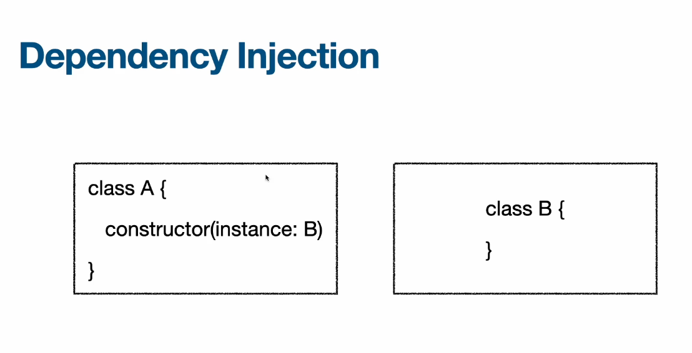

# 핵심 이론 - 1  

## Dependency Injection & Inversion of Control (의존성 주입 & 제어의 역전)

  

의존성 주입 (DI)  
- A클래스의 인스턴스가 작동하려면 B클래스의 인스턴스가 있어야 한다.  
- A가 생성될때 B의 인스턴스를 내부 프로퍼티로 가지고 있다면 의존성이 강하게 결합되어 있다.  
- 이는 테스트를 어렵게 만든다.  
- 그래서 A가 필요로 하는 B 클래스의 인스턴스를 외부에서 넣어주는것이 DI 이다 . 

제어의 역전, Inversion of Control  
- 제어 : 객체의 생명주기를 다룬다는 말  
- 역전 : 생명주기를 개발자가 관리하지 않고 다른 프레임워크가 관리하는 것, new 연산자를 쓰지않고 객체가 생성되어 알아서 주입된다.  

의존성 역전 원칙, DIP  
- 의존성 : 어떤 코드 A가 실행되려면, 코드 B가 필요하다면 B에 의존성이 있다라고 한다.  
  - 의존성에 대한 방향 : 상위 모듈은 하위 모듈에 의존한다. 상위 모듈은 고수준, 하위 모듈은 저수준이라고 생각.  
  - 예, (고수준/상위) 컨트롤러 클래스 -> 서비스 클래스 -> 레포지토리 클래스 (저수준/하위)  
- 역전 : A는 B에 의존하는 관계였는데, 이 관계를 끊어낸 것.    
- 이 원칙에서는 A는 C에 의존하고, B도 C에 의존하게 된다. A와 B를 연결하는 중간다리에 추상화 계층 하나를 넣은 것  
  - 포장 기계는 빵에 의존하고 레시피는 빵에 의존하게 만든다.  
  - 화이트 브레드, 오트 브레드 등 대신에 빵이라고 추상화 후 빵에 의존하도록 한다. 그럼 포장 기계는 어떤 빵인지는 몰라도 모든 빵에 대응 가능.    
- DIP를 하는 방법 중 하나가 의존성 주입 (DI) 이다.    

## Module, Provider 그리고 Inversion of Control 코드로 이해하기

## AppModule과 main.ts 파일

