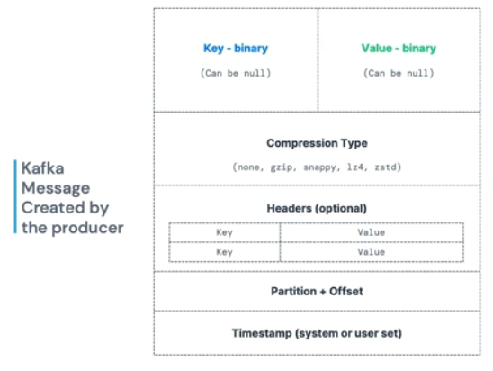
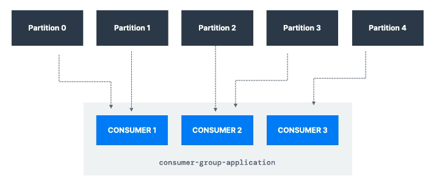
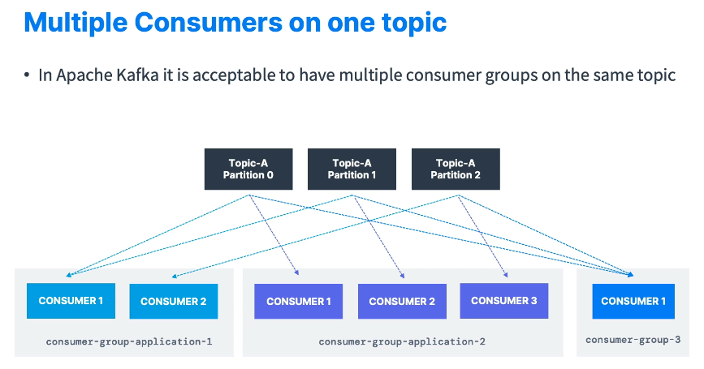
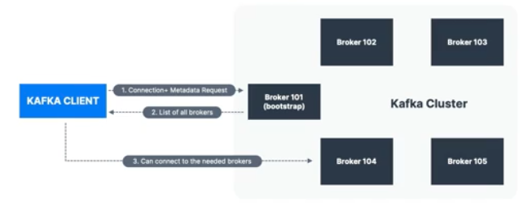
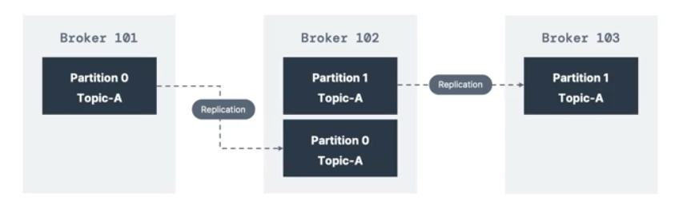
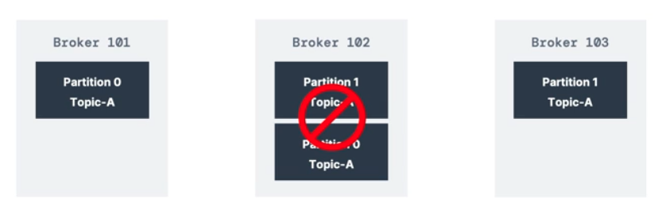
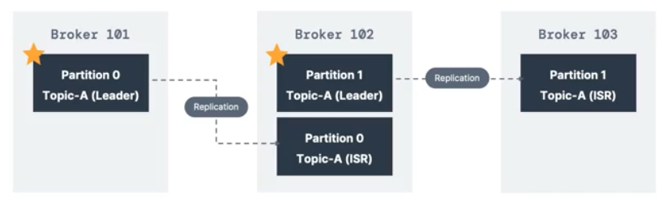

# 초보자를 위한 kafka-2 주요개념

- [초보자를 위한 kafka-2 주요개념](#초보자를-위한-kafka-2-주요개념)
  - [1. 토픽, 파티션 오프셋](#1-토픽-파티션-오프셋)
    - [예](#예)
  - [2. 프로듀서 \& 메시지 키](#2-프로듀서--메시지-키)
    - [메시지 구조](#메시지-구조)
    - [Kafka Message Serializer](#kafka-message-serializer)
    - [Kafka Message Key Hashing](#kafka-message-key-hashing)
  - [3. 컨슈머 \& 역직렬화](#3-컨슈머--역직렬화)
    - [Consumer Deserializer](#consumer-deserializer)
  - [4. 컨슈머 그룹 \& 컨슈머 오프셋](#4-컨슈머-그룹--컨슈머-오프셋)
    - [Delivery semantics for consumers](#delivery-semantics-for-consumers)
  - [5. 브로커 \& 토픽](#5-브로커--토픽)
  - [6. 토픽 복제](#6-토픽-복제)
    - [topic replication factor](#topic-replication-factor)
    - [파티션 리더 개념](#파티션-리더-개념)
  - [7. 프로듀서 확인 \& 토픽 내구성](#7-프로듀서-확인--토픽-내구성)
    - [Producer Acknowledgements acks](#producer-acknowledgements-acks)
    - [Topic Durability](#topic-durability)
  - [8. 주키퍼](#8-주키퍼)
  - [9. Kafka KRaft - 주키퍼 지우기](#9-kafka-kraft---주키퍼-지우기)


## 1. 토픽, 파티션 오프셋


토픽이란 : 데이터 스트림의 일부분.  
- 카프카는 클러스터 환경에서 구동된다. 즉 여러개의 노드로 구성된다. 
- 카프카 안에는 여러가지 토픽들이 존재한다.  
- db로 비유하면 여러 테이블이 존재하는것과 동일하다. 
- 다양한 토픽들을 생성할 수 있고, 토픽은 이름은 식별자이므로 중복되지 않는다.  
- 어떠한 메시지 포멧도 받으며, 토픽들은 컨슈머나,프로듀서에서 쿼리할 수 없다.  
- 토픽 안에는 메시지들의 시퀀스가 존재한다. 그래서 카프카를 스트리밍 플랫폼이라고 한다.  

파티션  
- 토픽안은 또 여러개의 파티션으로 분리된다. 예를들어 하나의 토픽에 100개의 파티션이 존재할 수 있다.  
- 메시지시들은 각 파티션에 들어가며, id값을 증가시키며 들어간다.  
- 카프카의 토픽은 불변성을 가지고 있다. 그래서 메시지를 한번 넣으면 수정이나 삭제가 불가능 하다.  
- 메시지는 불변성이나, 디폴트로 1주일 후에 사라진다.  

오프셋 
- 메시지들의 id를 파티션의 오프셋이라고 한다.  

### 예

truck_gps 라는 토픽이 있다고 예를 들어 본다.   
- 수많은 트럭들이 존재하고, 20초마다 gps 위치정보를 카프카에 전송하는 상황이다. 
- 각 트럭은 truckID, truckPosition 데이터가 있다.
- 이 토픽을 구독하고 있는 서비스는, location map / notification service 이다.

<br/>

## 2. 프로듀서 & 메시지 키

프로듀서 : 토픽에 메시지를 보내는 주체이다. 
- 토픽에는 파티션이 존재하고, 프로듀서는 어느 파티션에 메시지를 쓸지 알고 있다.  
- 만약에 카프카 브로커가 메시지 수신에 실패하면, 프로듀서가 리커버리 해야한다. 

메시지 키 
- 프로듀서가 메시지를 보낼때는 키라는 메타데이터와 함께 보낸다.  
- 메시지는 string, number, binary 등이 될 수 있으며 null도 가능하다.  
- null값인 경우에는 임의의 파티션에 메시지가 기록된다.  
- null값이 아닌 경우에는, 메시지는 특정 파티션에 기록된다.   
- 파티션에 들어가기 전에 해시함수가 있다. 그래서 특정 키값은 언제나 같은 파티션에 들어간다.  
- 만약에, 트럭ID를 키값으로 사용하고, gps정보를 계속 보낸다면 이 메시지는 동일한 파티션에 모두 들어간다.  

### 메시지 구조



카프카의 메시지 구조는 위 그림과 같다.   
- key : 바이너리, nullable
- value : 바이너리, nullable
- compression Type : 압축 매커니즘 적용 가능
- headers : optional 
- partition + offset
- timestamp

### Kafka Message Serializer  

카프카는 오직 bytes 만 입출력이 허용된다.  
- 프로듀서와 컨슈머는 데이터를 시리얼라이즈 해야한다.  
- 여기서 시리얼라이즈라는 말은, 바이너리(0,1)형태로 데이터를 변환해야 한다.  
- string (json포함), int, float, protobuf 등 모두 바이너리 데이터로 바꾸어야 한다.  

### Kafka Message Key Hashing 

카프카 파티셔널 로직에서 사용되는 해싱로직은 marmar2 알고리즘이다.  
- ```targetPartition = Math.abs(murmur2(keyBytes)) % (numPartitions - 1)  ```  
- 카프카의 레코드에서 위 해싱 로직을 태우고, 파티션에 전달하는 과정이 내부적으로 존재  
- 중요한점은 프로듀서도 어느 파티션에 데이터가 저장될지 알고 있다.  

<br/>

## 3. 컨슈머 & 역직렬화

컨슈머는 토픽의 메시지를 읽는데, pulling방식으로 데이터를 읽는다.  
- 컨슈머는 자동으로 어떤 파티션에서 데이터를 읽을지 알고 있다.  
- 브로커가 장애가 발생했을때도, 리커버리 방식도 알고있다. 
- 데이터는 낮은 오프셋에서 높은 오프셋으로 읽는데, 어떤 파티션에서 먼저 읽는지는 순서가 보장되지 않는다. 

### Consumer Deserializer 

컨슈머는 데이터를 읽고나면 Deserializer 과정이 있다.  
- 바이너리 값인 키값은 정수로 변환하고, 바이너리 값인 value는 string으로 변환하는 등의 작업이 있다.  
- 조립과 분해의 과정처럼 Serializer-Deserializer 과정이 있는것이다.
- 그래서 topic lifecyle 안에는 데이터의 타입이 변경되면 안된다.  
- 데이터 타입의 변경이 필요한 경우에는 새로운 토픽을 만들어야 한다.  

<br/>

## 4. 컨슈머 그룹 & 컨슈머 오프셋



컨슈머 그룹 : 모든 컨슈머는 그룹을 만들어서 데이터를 소비한다.  
- 각 컨슈머는 파티션을 독점적으로 읽는다.   
- 동시에 여러 컨슈머가 동일한 파티션을 읽지 않는다.  
- 만약에 파티션보다 컨슈머가 더 많다면, 비활성화된 컨슈머 그룹이 생긴다.  



위 그림은 n개의 컨슈머, m개의 컨슈머 그룹, k개의 파티션에 대한 그림니다.  
- 파티션은 여러 컨슈머 그룹을 가질 수 있다.  
- 하지만, 한개의 파티션은 그룹당 하나의 컨슈머만 읽어간다.  
- 예) 트럭 위치정보 토픽&파티션을 읽어가는 서비스들이라면, 
  - 1번 컨슈머 그룹 : 위치 서비스에 사용
  - 2번 컨슈머 그룹 : 알림 서비스에 사용 

컨슈머 오프셋 : 데이터를 어디까지 읽었는지 북마크 같은 기능 
- 카프카가 오프셋 정보를 컨슈머 그룹별로 저장하고 있다.  
- 오프셋 정보는 토픽에 커밋된다. __consumer_offsets 이라는 변수명  
- 만약 컨슈머가 죽게된다면, 어디까지 읽었는지 기록을 두었으니 이어서 읽게 된다.  

### Delivery semantics for consumers

기본적으로 자바 컨슈머는 at least once로 자동 커밋된다.  
- 3가지 다른 옵션들이 있다.  

1.at least once : 최소한 한번 / 보통의 경우에 추천된다.   
- 메시지를 읽고나면 오프셋이 커밋된다.  
- 메시지를 다시 읽을 기회가 주어진다. 따라서 멱등의 경우에만 사용해야 한다.  

2.at most once : 최대한 한번 
- 컨슈머가 메시지를 받자마자 오프셋을 커밋하게 된다.  
- 만약에 메시지에 대한 일처리가 잘못되면, 일부 메시지를 잃을 수 있다.  
- 잘못된 처리를 되돌리기전에 이미 커밋을 해버린 상황이니까  

3.exactly once : 정확히 한번
- 토픽을 읽고 잘 처리가 되면 트랜젝션 API를 호출해서 커밋한다.  
- 외부시스템으로 가는 경우에는 멱등 컨슈머를 사용한다 ? 

```
매우 중요: 브로커 하나에만(어떤 브로커든) 연결하고, 쓰고 싶은 토픽 이름만 제공하면 됩니다. 
카프카 클라이언트가 데이터를 적당한 브로커와 파티션으로 라우팅해 줍니다!

매우 중요: 브로커 하나에만(어떤 브로커든) 연결하고, 읽어 오고 싶은 토픽 이름만 제공하면 됩니다. 
카프카가 호출을 적당한 브로커와 파티션으로 라우팅해 줍니다!
```

<br/>

## 5. 브로커 & 토픽

카프카의 클러스터에는 다수의 브로커로 구성될 수 있다.  
- 여기서 브로커는 그냥 하나의 서버이다.  
- 각 브로커는 식별자ID를 가지고 있으며, 토픽의 파티션들을 보관하고 있다.  
- 특정 브로커 (=bootstrap broker)와 연결만 하면 나머지 브로커들과도 연결될 수 있다.  
- 시작은 3개의 브로커를 두는게 좋고, 큰 규모의 카프카 클러스터는 100개 이상의 브로커도 존재한다.    


예) 브로커 3개, 파티션 3개인 토픽A, 파티션 2개인 토픽B
- 파티션이 3개인 토픽A는 모든 브로커에 분산되어 있다.  
- 하지만 파티션이 2개인 토픽B는 브로커 101, 102에만 있다.  
- 수평적 스케일링 결과, 자동으로 파티션을 적절하게 나누어 주었다.  


  
카프카 클러스터 내 모든 브로커들은 부트스트랩 브로커서버라고도 부른다.  
- 즉 하나의 브로커에만 연결이 된다면, 모든 브로커에 연결된다.  
- 각 브로커들은 다른 브로커의 리스트와 메타데이터(토픽,파티션 정보들) 또한 모두 알고있다.  

<br/>

## 6. 토픽 복제 

### topic replication factor

  

토픽은 replication fator값이 존재한다. 1,2,3 옵션이 있다.  
- 보통 2,3을 사용하고 1을 사용하면 복제가 되지 않는다.  
- 만약에 브로커가 다운되는 경우를 대비해서, 다른 브로커가 토픽들을 복제해 두고 있다.  
- 위 사진에서, 브로커 101 토픽A-파티션0 >>> 브로커 102로 복제되었다.  


   

만약에 장애 상황을 가정해서, 브로커 102가 다운되었다.  
- 그럼에도 여전히 토픽A는 제공이 가능하다.  


### 파티션 리더 개념

   

각 파티션은 원본데이터를 가지고 있는 리더들이 있다.  
- 파티션 원본을 가진 파티션 리더와 복제본의 파티션으로 구성
- 즉, One leader + ISR ( in-sync replica ) 모델이다.
- 프로듀서는 파티션 리더들에게만 데이터를 전송
- 컨슈머역시 파티션 리더에서만 데이터를 읽는다.  
- 브로커가 다운되었을때 파티션 리더가 다시 선출되어 데이터를 처리한다.  

+ 카프카 버전이 올라가면서 추가된 기능중 하나 (2.4ver+)  
  - 컨슈머에게 가까운 브로커의 replica를 읽을 수 있는 기능  


<br/>

## 7. 프로듀서 확인 & 토픽 내구성

### Producer Acknowledgements acks  

프로듀서는 데이터를 보내고 응답받는 acks 방식을 고를 수 있다.  
- acks = 0 : 프로듀서는 acks를 기다리지 않는다. (데이터 전송 유실가능성이 있다.)    
- acks = 1 : 프로듀서는 리더가 선출까지 acks를 받는다. ( 장애시 데이터 손실 가능성이 있다. )    
- acks = 2 : 프로듀서는 리더선출 및 데이터복제까지 acks를 반는다. ( 데이터 loss가 없다. )   

### Topic Durability  

위에서 topic replication factor에 대해서 다루었다.    

- factor가 1인 경우, 브로커 1개라도 고장나면 데이터 유실이 발생할 수 있다.   
- factor가 2인 경우, 브로커 1개가 고장나도 여전히 가용가능(가용성 O).   
- factor가 3인 경우, 브로커 2개가 고장나도 여전히 가용가능(가용성 O).     
- **factor가 N인 경우, 브로커 N-1개가 고장나도 여전히 가용가능(가용성 O).**  

<br/>

## 8. 주키퍼 

주키퍼는 앞으로 사라질 예정이다.   
주키퍼는 카프카 브로커를 매니징 하는 역할이다. 브로커가 다운될때마다 파티션 리더를 선출하는데 도움 준다.  
많은 메타데이터들의 수정에 대해 브로커들에게 알림을 준다.  

카프카 버전 2.8까지는 반드시 주키퍼가 필요하다.  
하지만 버전 3.x 부터는 주키퍼의 의존성이 사라졌다. ( Kafka Raft 매커니즘이라고 한다. )  

주키퍼는 1,3,5..의 홀수를 가지게 된다.  
- 주키퍼에도 리더 개념이 있어서, 리더는 쓰기를 담당하고 나머지는 읽기에 사용 한다.  
- 오프셋 정보도 주키퍼에 저장을 했다.  

  

주키퍼 또한 위 구성처럼 여러개의 노드로 구성한다.  
- 카프카 브로커를 관리해야 한다면, kafka 4.0버전이 나오기 전까지 주키퍼를 사용해야 한다.  
- 카프카 클라이언트로 주키퍼를 연결하고 서비스를 주키퍼로 연결해왔지만, 이제 엔드포인트로 직접 브로커로 연결해야한다.  
- 주키퍼와 카프카의 클러스터 조합은 안정적이지 않은구조이다. 앞으로는 주키퍼가 없어지는 구조를 택해야 한다.   


<br/>

## 9. Kafka KRaft - 주키퍼 지우기


Kafka KRraft   
- 카프카 버전 3부터 시작되었으며 주키퍼 의존성을 제거하고자 하는 목적이다.  
- 클러스터에 파티션이 100,000 이상일때 주키퍼는 스케일링 이슈를 보여주고 있다.  
- 주키퍼를 제거하면, 확작성, 보완, 모니터링, 안정성, 유지보수 등 개선된다.  

  

Quorum Leader : Kafka 브로커를 관리하는 리더  
- 주키퍼에서 리더가 선출되어 관리한다.  
- 하지만 kafka에 Quorum Controller가 있다면 훨씬 구조가 간단해진다.   