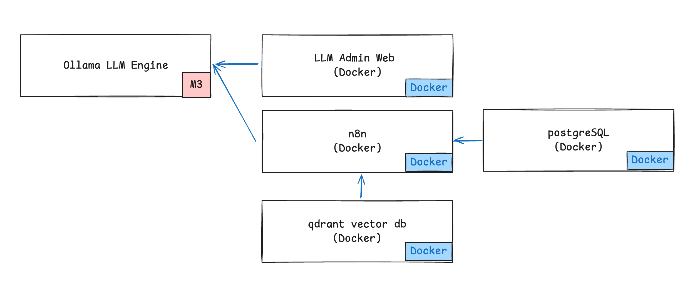

# n8n -1 About n8n   

## About n8n   

n8n은 노코드/로우코드 워크플로우 자동화 플랫폼입니다:  
  

### 주요 특징:

1. **워크플로우 자동화** 
   - 다양한 앱/서비스 연동 및 자동화  
   - 드래그 앤 드롭 방식의 시각적 워크플로우 구성  
   - 코딩 없이도 복잡한 자동화 구현 가능  

2. **주요 기능**  
   - 200+ 서비스와 통합 (API 연동)    
   - 커스텀 코드 실행 가능 (JavaScript/Python)
   - 스케줄링, 트리거 기반 실행 
   - API 엔드포인트 생성  

3. **장점**
   - 오픈소스 (자체 호스팅 가능)  
   - Zapier나 Make(Integromat)의 대안 
   - 높은 확장성과 유연성  
   - 데이터 프라이버시 보장  

### Workflow Automation Templates  

https://n8n.io/workflows/  
- AI/챗봇 관련 템플릿이 상위권 차지
- 데이터 처리와 통합 관련 워크플로우 다수
- 실용적인 자동화 사례 중심

사례
1. **AI agent chat**   - OpenAI Chat Model을 활용한 AI 에이전트 채팅 시스템
2. **Creating an API endpoint**  - Webhook 노드를 사용한 간단한 API 엔드포인트 생성
3. **Scrape and summarize webpages with AI** - 웹페이지 스크래핑 및 AI 요약 기능
4. **Very quick quickstart**  - n8n 빠른 시작 가이드 워크플로우
5. **AI agent that can scrape webpages** - 웹 스크래핑이 가능한 AI 에이전트
6. **Building Your First WhatsApp Chatbot**  - WhatsApp 챗봇 구축 워크플로우
7. **Pulling data from services** - 다양한 서비스에서 데이터 추출
8. **Telegram AI Chatbot** - Telegram 기반 AI 챗봇
9. **Joining different datasets** - 서로 다른 데이터셋 결합 워크플로우
10. **Ask questions about a PDF using AI** - PDF 문서에 대한 AI 기반 질의응답 시스템

## Starter 아키텍처  

     

- Ollama LLM Engine: AI 모델 실행 엔진 (M3 Pro 칩 사용)  
- LLM Admin Web: Ollama 관리용 웹 인터페이스  
- n8n: 워크플로우 자동화 도구 
- PostgreSQL: n8n용 메인 데이터베이스  
- Qdrant: 벡터 데이터베이스 (AI 데이터 저장)  

