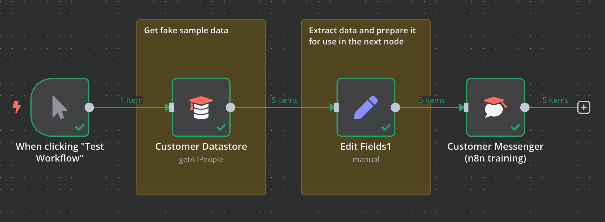
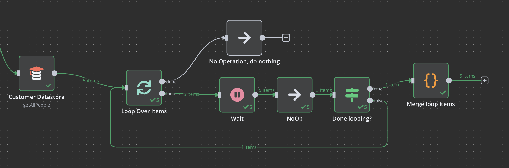
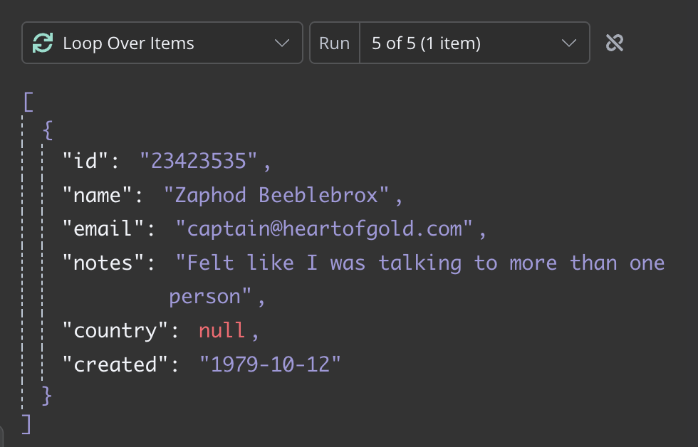
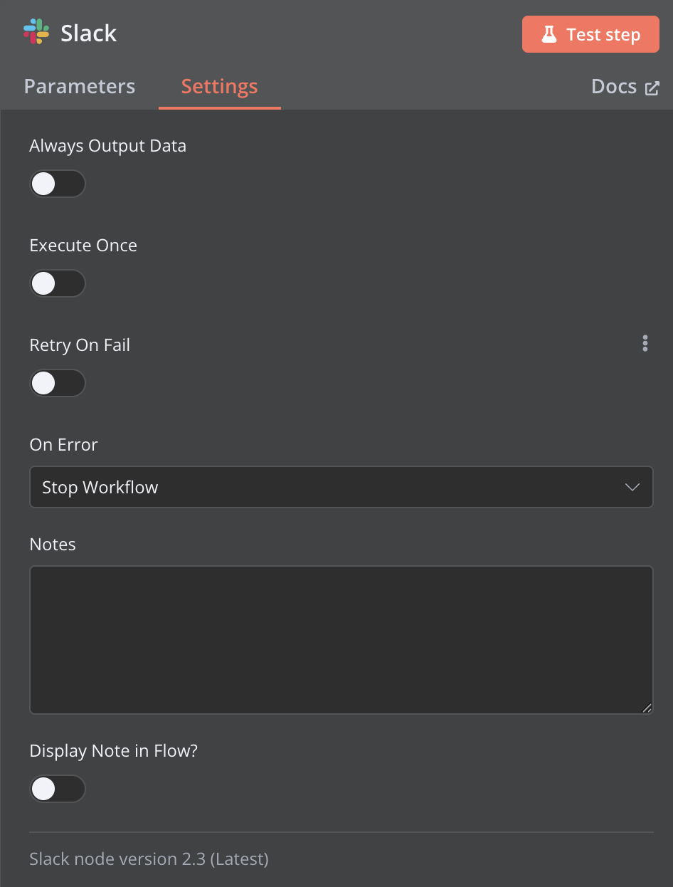
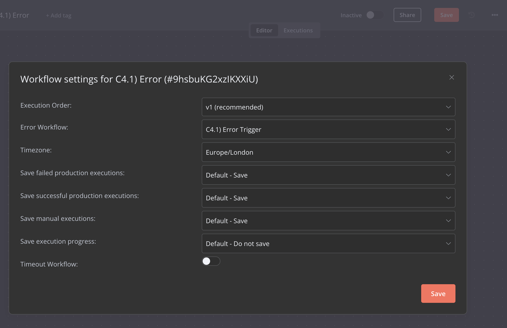
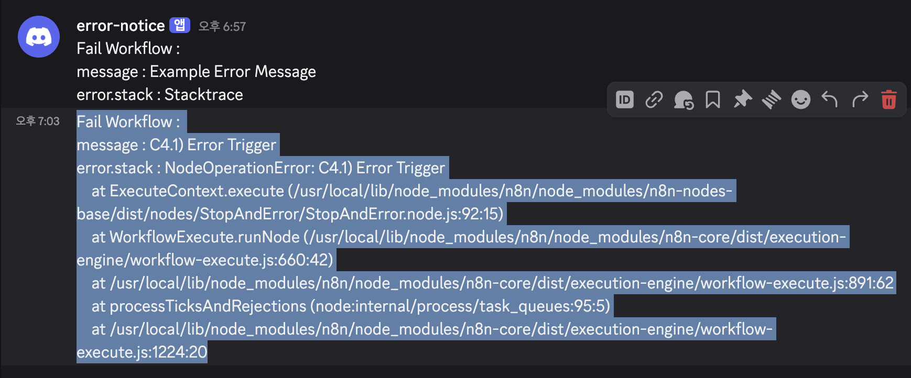
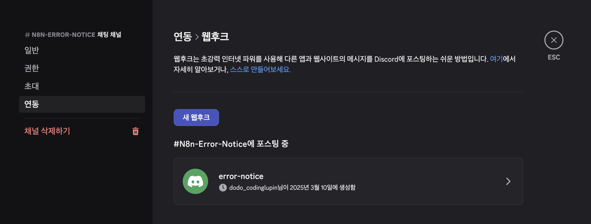

# n8n - 5 기본노드  

## Part 1 Flow Logic

## C1. Quickstarts  

The very quick quickstart  
https://docs.n8n.io/try-it-out/quickstart/  

  

A longer introduction

참고 
- n8n uses Luxon to work with date and time, and also provides two variables for 
- convenience: $now and $today. For more information, refer to Expressions > Luxon.


정리
- IF 노드 : 특정 조건으로 데이터 스트림을 분리할 수 있다.  
- Edit Fields 노드 : Map 함수  


## C2 Merging data  

https://docs.n8n.io/flow-logic/merging/  

C2.1 다양한 데이터 스트림의 데이터 병합  

Merge 노드  
- Table(데이터 스트림)을 Join 할 때 사용.
- Mode:Combine : left join, right join, outter join, inner join 지원.  
- Mode:append : A에 B데이터를 그냥 이어 붙인다.    


C2.2 여러 노드 실행에서 데이터 병합  
  

📕 개념
- 바로 이전 외에도 멀리 떨어진 이전의 노드도 참조가능하다.  
- 아래는 Loop 노드의 흐름인데, data stream이 item 단위로 분리되어 볼 수 있다.  
  - 신기한건 item도 배열의 형태를 띄고 있다. Loop의 Batch Size 개념덕분이다.  즉, Loop는 각 데이터 스트림을 청킹해서 처리한다.  



노드 정리  
- Wait 노드 : n초 기다릴 수 있음.  
- NoOp 노드 : 아무것도 안함. 장식용  
- If 노드, Loop done 여부, 아래처럼 node의 컨텍스트를 볼 수 있다.  
  - `{{$node["Loop Over Items"].context["noItemsLeft"]}}`  
  - If 노드의 재미는점은, 여러 조건들을 설정할 수 있으며 All, Some 연산 지원.  
- Code 노드 : `Merge loop items`
  - JS코드 작성이 가능하며, 변수는 그들만의 문법을 사용해야 한다.  

```js
let results = [];

for (let i = 0;; i++) {
  try {
    results = results.concat($("NoOp").all(0, i));
  } catch (error) {
    return results;
  }
} 
```
- Code 노드는 2가지 방식,
  - Run Once for All Items: 기본값, Data Stream Level에 코드를 작성해야 한다. (한번만 실행, 리턴값은 데이터 스트림)
  - Run Once for Each Item: Item Level의 코드 작성 가능, 아이템 수 만큼 실행한다. lambda 혹은 forEach 문의 함수를 작성한다고 생각하면 된다.  


C2.3 비교하고, 병합하고, 다시 분할하세요  


Compare Datasets 노드  
- 2가지 입력값을 특정 키 기준으로 비교한다.  
  - A만 있는거, B만 있는거, 같은거, 일부만 다른것 4가지 출력이 나옴.  
  - 이렇게 복잡한 케이스를 처리해야할때가 있나?  

## C3. Looping

📕 언제 사용?
루프 노드는 데이터 스트림에서 Item 단위로 처리할때 유용하다.  
- 예를들어 배열지원이 없느 HTTP Request를 보내는 경우,  
- Code node in Run Once for All Items 의 경우, Item Level로 까야한다.  
- Execute Workflow 도 1번만 실행되니, Item Level로 까야 한다.  
  - 참고, Workflow Queue모드도 있으나 개별 워크플로우에는 적용 불가능하다.  Queue를 외부에 구현해야 한다.  
- Loop 만드는 방법. 
  - 1) IF문으로 조건이 충족될때까지 무한루프 고리 만들기.  
  - 2) Loop 노드 사용.  

📕 노드의 글로벌 셋팅
  
- Execute Once라는 항목이 있다. 해당 옵션이 켜지면 첫번째 Loop에만 실행된다. (워크 플로우 Level에서 한번만 수행되는 듯     
- Always Output Data를 on하면 빈 배열을 리턴하며, 이는 워크플로우를 계속 수행하게 함 ( null이면 워크플로우 중단됨 )    
- Retry on Fail : 자체 재시작.  
- Display Note in Flow : 노트 텍스트를 보여주는 기능.  


📕 참고 Sub-workflows 
- 큰 워크플로우를 분리하거나, 다중 실행 구성을 위해서 서브 워크플로우를 만들 수 있다.
- 상위 워크플로우의 출력 데이터를 이어 받아서 수행 가능하다.  

📕 참고 워크플로 실행 순서 (Execution order in multi-branch workflows)  
- 워크플로우를 많이 만들면 논리적으로 동시에 실행되는것 처럼 보이지만 순서가 있다. 
- 노드의 위치상 위에서 아래로 수행 ( 높이가 같다면 왼쪽 먼저 )  


## C4. Part Error handling  

📕 애러 핸들링  
워크플로우를 작성하다보면 애러를 다루어야 한다. 여기서 애러 핸들링은 좀 다른 개념이다.  
- 예를들어 http요청 결과 4xx, 5xx 애러가 발생해서 노드가 실패할 수 있다.  
- n8n워크플로우 입장에서는 이것을 워크플로우 자체의 실패로 판정할지, IF문을 이용해서 적절한 조취를 할지는 사용자에게 달려 있다.  
- Case 1. 만약에 반드시 성공해야할 http 요청이였다면(그래야 워크플로우가 의미가 있는 경우) 워크플로우 자체의 애러를 던지는것도 좋다.  
- Case 2. 데이터 수집을 하는 워크플로우의 경우, 데이터가 없는 경우라면 IF문 처리 이후 다음 Loop를 이어가는게 맞다.  
  - *HTTP Request 노드에는 4xx,5xx 를 무시하는 설정이 있다.  

📕 애러 핸들링 트리거 노드  
워크플로우의 실패를 감지해서 트리거 가능한 워크플로우가 있다.

- 넘겨받는 데이터 형태  
```json
{
  "trigger": {
    "error": {
      "context": {},
      "name": "WorkflowActivationError",
      "cause": {
        "message": "",
        "stack": ""
      },
      "timestamp": 1654609328787,
      "message": "",
      "node": {
        . . . 
      }
    },
    "mode": "trigger"
  },
  "workflow": {
    "id": "",
    "name": ""
  }
}
```

C4.1 애러핸들링 예제 
  
- 위 사진처럼 워크플로우 셋팅에서 애러 트리거 워크플로우를 설정해야 한다.  
- Webhook 노드를 만들어서 Production 모드로 테스트를 진행하면, 아래와 같은 결과.  



사용 노드 정리  
- Stop and Error 노드 : 애러 발생시킴
  - 애러 메시지 전달 가능.  
- Error Trigger 노드 : 워크플로우의 설정에 연결된 애러트리거를 받는 노드  
- Discord Send 노드 : 아래 웹후크 방식으로 연동.  
  - 


--- 

## Part 2 Data


n8n에서 워크플로우에서 데이터는 데이터 스트림이라는 개념으로 다루어 진다.  
- 데이터 스트림은 item 배열이다. 

## Data structure  

--- 

## Part Code in n8n  
https://docs.n8n.io/code/     


📕 알아둘점  
- Code에서 console.log 을 작성하면 브라우저의 콘솔로그에서 확인 가능하다.     
- n8n에서 데이터 자료구조가 중요하다. 사전에 정의된 메서드로 데이터를 참조하는 별도의 프레임워크가 있다.     


## Usage) Trigger

Click, Web hook, Batch, on Fail Workflow, Error Trigger 


## Usage) Notifier    

Discord, Email, Telegram, (firebase FCM)

## Usage) Data Source  


