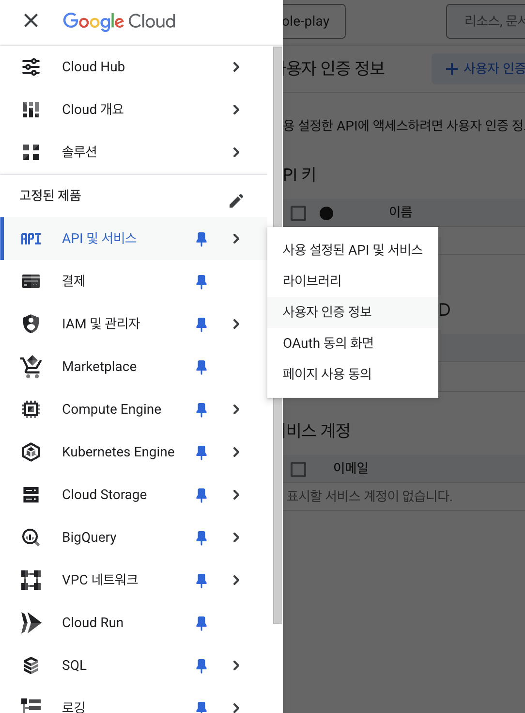
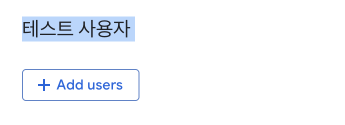
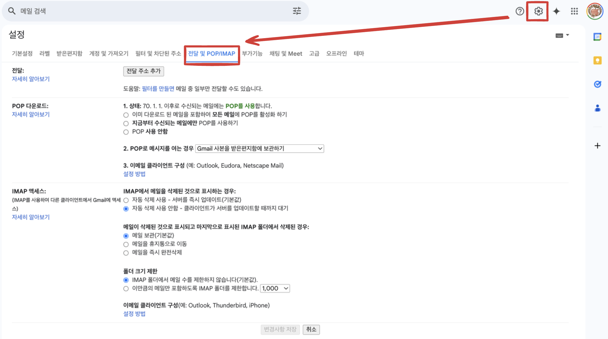
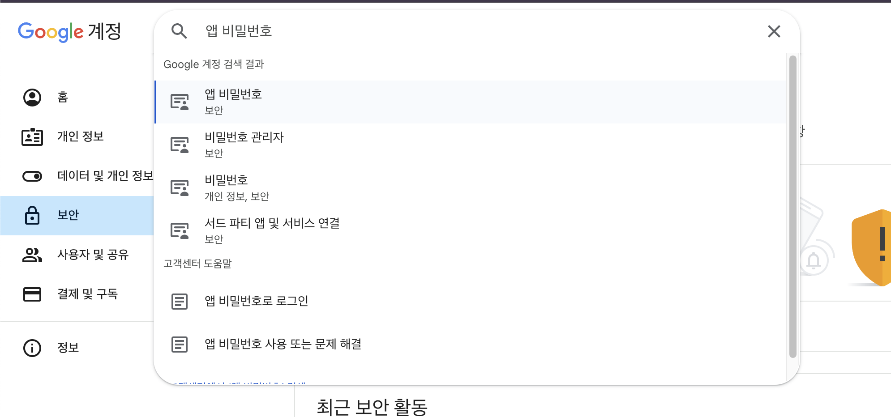
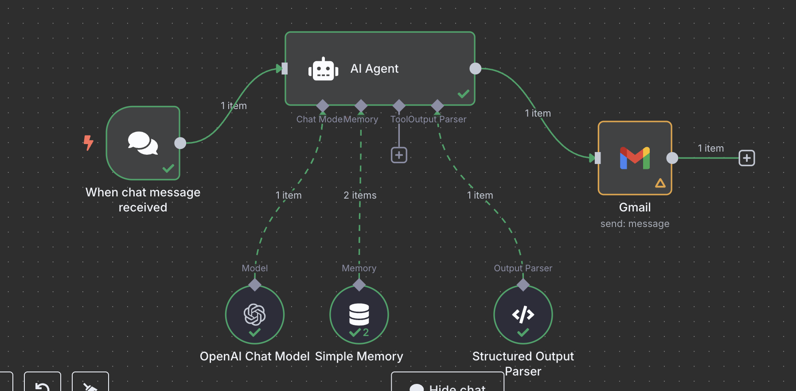

# 10. Google Service

## 1.구글 Credentials  

### OAuth
1.1 OAuth 인증 만들기  
  
- OAuth2 인증방식의 Client ID, Client Secret 를 얻어야 한다.   
- https://console.cloud.google.com/apis/credentials?hl=ko    

과정
- 1.사용자 인증 정보 탭으로 접속 > 사용자 인증 정보 만들기 
- 2.+ 사용자 동의 화면 만들기 
  - > OAuth 2.0 클라이언트 ID 추가됨 확인   

1.2 (예) gDrive API 활성화 및 권한 부여  
  
- *G-Mail 등 다른 Application도 똑같이 사용버튼만 눌러주면 된다.  

1.3 앱 게시 상태 변경   

1.2까지 과정을 거치면 아래 오류가 발생한다.  
- 오류 : 액세스 차단됨: xxx 앱이 Google의 인증 절차를 완료하지 않았습니다.  

해결1. 테스트 앱에서 게시로 변경한다.  
  

해결2. 혹은 아래처럼 테스트 계정을 추가해도 된다.  
  
- 본인의 gmail 계정 입력  

### 테스트 실패)G Mail IMAP방식 인증    

  
- 이메일 자체에서 딱히 건드릴건 없다.  

- 0.커뮤니티 노드 설치하기 : n8n-nodes-imap  
  - ( https://www.npmjs.com/package/n8n-nodes-imap )
- 1.google 계정에서 2차 인증 활성화를 해야 한다.  
- 2.인증 정보 만들기
  - ID : ypd03008@gmail.com
  - PW : 계정 > 앱 비밀번호 생성  
  - Host : imap.gmail.com  

  

## Gmail  

C10.1 메일 보내기 with gpt  
- Operation:Send

