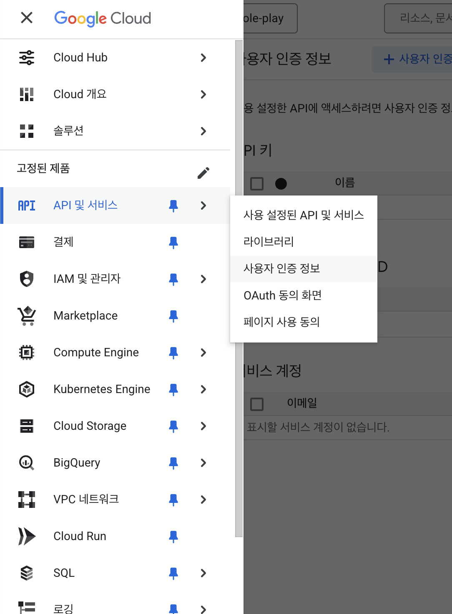

# 2. RAG Chatbot With Supabase Vector DB  


- [2. RAG Chatbot With Supabase Vector DB](#2-rag-chatbot-with-supabase-vector-db)
  - [사전준비](#사전준비)
    - [1.구글 Credentials](#1구글-credentials)
    - [2.Supabase](#2supabase)
  - [노드 구성](#노드-구성)
  - [Refs](#refs)


## 사전준비  

### 1.구글 Credentials  

1.1 OAuth 인증 만들기  
  
- OAuth2 인증방식의 Client ID, Client Secret 를 얻어야 한다.   
- https://console.cloud.google.com/apis/credentials?hl=ko    

과정
- 사용자 인증 정보 탭으로 접속 > 사용자 인증 정보 만들기 
- + 사용자 동의 화면 만들기 
- > OAuth 2.0 클라이언트 ID 추가됨 확인   


1.2 gDrive API 활성화 및 권한 부여  
  


1.3 앱 게시 상태 변경   

오류 : 액세스 차단됨: xxx 앱이 Google의 인증 절차를 완료하지 않았습니다.  

해결1. 테스트 앱에서 게시로 변경한다.  
  

해결2. 혹은 아래처럼 테스트 계정을 추가해도 된다.  
  
- 본인의 gmail 계정 입력  


### 2.Supabase 

2.1 Auth 설정  

  
- Supabase에서 Host, Service Role Key를 찾아온다.  
- 참고로 Service Role Key는 슈퍼 어드민 키 이므로 이것이 누출되면 다 털린다.  

2.2 DDL 생성 

```sql
-- Enable the pgvector extension to work with embedding vectors
create extension vector;

-- Create a table to store your documents
create table documents (
  id bigserial primary key,
  content text, -- corresponds to Document.pageContent
  metadata jsonb, -- corresponds to Document.metadata
  embedding vector(1536) -- 1536 works for OpenAI embeddings, change if needed
);

-- Create a function to search for documents
create function match_documents (
  query_embedding vector(1536),
  match_count int default null,
  filter jsonb DEFAULT '{}'
) returns table (
  id bigint,
  content text,
  metadata jsonb,
  similarity float
)
language plpgsql
as $$
#variable_conflict use_column
begin
  return query
  select
    id,
    content,
    metadata,
    1 - (documents.embedding <=> query_embedding) as similarity
  from documents
  where metadata @> filter
  order by documents.embedding <=> query_embedding
  limit match_count;
end;
$$;
```

- `1 - (documents.embedding <=> query_embedding)` 는 L2 거리(유클리드 거리 구하는 것).
- metadata @> filter JSONB를 포함하는지 검사하는 조건  

```
{
  "topic": "AI",
  "language": "Korean"
}
 @>  ( 해석 : 왼쪽이 오른쪽보다 확장되었는가? )
{
  "language": "Korean"
}
```

## 노드 구성  


   

1.백터 저장 플로우   

트리거 : 클릭 혹은 웹훅    
- gDrive에서 특정 폴더의 파일 목록을 가져온다.  
- gDrive에서 파일들을 읽는다.    
- 파일에서 데이터를 읽어서 JSON으로 변환한다.  
- Supabase 백터 저장 과정
  - Prepare단계에서 사전에 정의된 테이블 스키마와 DB함수를 인자로 넣는다.  
  - Embeddings OpenAI 모델은 text-embedding-3-small 사용한다.  
  - 청크 사이즈가 너무 작으면 안된다. 5000정도로 진행함.  

2.Chat Flow 

트리거 : Chat Message  
- Question and answer Chain 
  - Embeddings OpenAI 모델은 text-embedding-3-small으로 위와 같아야 한다.  
  - Vector Store Retriever에서는 limit 6 설정  
  - Supabase Vector Store는 document를 설정한다.  


## Refs
- https://datapopcorn.notion.site/n8n