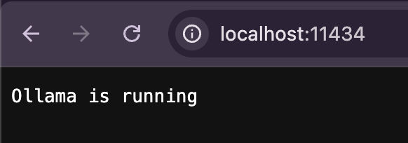
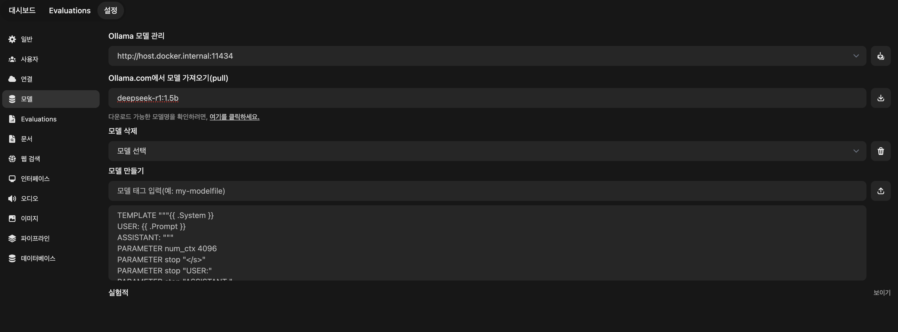
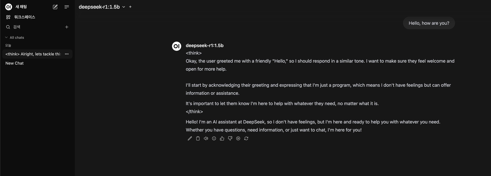
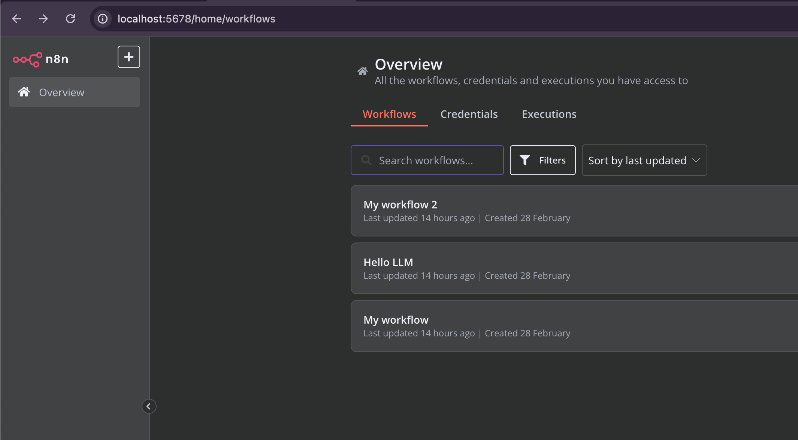
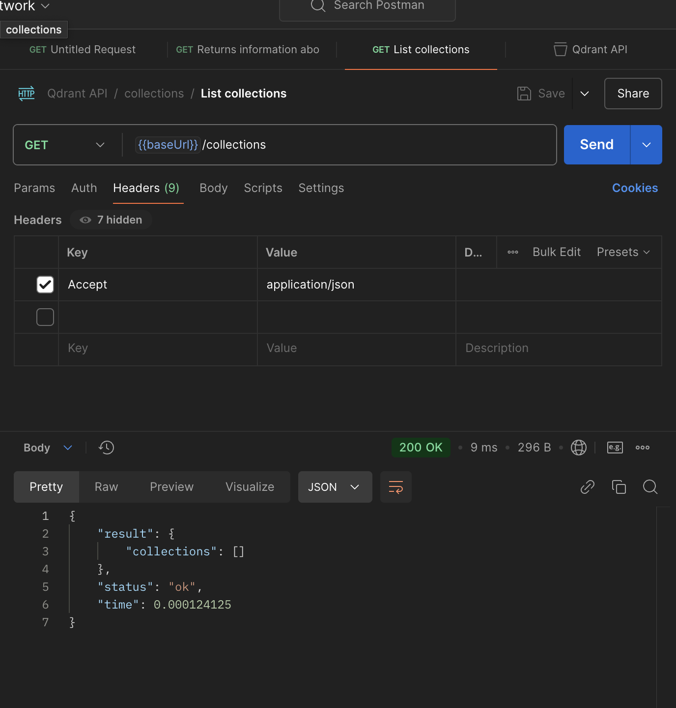

# n8n - 2  

- [n8n - 2](#n8n---2)
  - [아키텍처 구현하기](#아키텍처-구현하기)
  - [Ollama LLM Engine: AI 모델 실행 엔진 (M3 Pro 칩 사용)](#ollama-llm-engine-ai-모델-실행-엔진-m3-pro-칩-사용)
  - [LLM Admin Web: Ollama 관리용 웹 인터페이스](#llm-admin-web-ollama-관리용-웹-인터페이스)
  - [PostgreSQL: n8n용 메인 데이터베이스](#postgresql-n8n용-메인-데이터베이스)
    - [Container](#container)
    - [Change SuperUser Password](#change-superuser-password)
    - [n8n 워크플로우로 사용할 DB하나 만들자.](#n8n-워크플로우로-사용할-db하나-만들자)
  - [n8n: 워크플로우 자동화 도구](#n8n-워크플로우-자동화-도구)
    - [접속 테스트](#접속-테스트)
  - [Qdrant: 벡터 데이터베이스 (AI 데이터 저장)](#qdrant-벡터-데이터베이스-ai-데이터-저장)
      - [curl 테스트](#curl-테스트)
      - [postman 테스트](#postman-테스트)
  - [Ref](#ref)


## 아키텍처 구현하기
     

- Ollama LLM Engine: AI 모델 실행 엔진 (M3 Pro 칩 사용)  
- LLM Admin Web: Ollama 관리용 웹 인터페이스  
- PostgreSQL: n8n용 메인 데이터베이스  
- n8n: 워크플로우 자동화 도구 
- Qdrant: 벡터 데이터베이스 (AI 데이터 저장)  

## Ollama LLM Engine: AI 모델 실행 엔진 (M3 Pro 칩 사용)  

1.ollama 엔진 다운로드  
https://ollama.com/download  

  
- http://localhost:11434/ 접속 후 확인해보자.  
- 아래 명령어로 ollama와 소통할 수 있다만, WebUI가 없어 불편하다.!  

```
# 기본 모델 다운로드
ollama pull llama2

# 모델 실행
ollama run llama2

# 다른 인기 모델들
ollama pull mistral   # Mistral 7B
ollama pull codellama # Code 특화
ollama pull gemma     # Google의 Gemma  
---
# curl로 테스트 
curl http://localhost:11434/api/generate -d '{
  "model": "llama2",
  "prompt": "Hello, how are you?"
}'
```

## LLM Admin Web: Ollama 관리용 웹 인터페이스  

도커 설치 후 아래 컨테이너를 실행하자.  

```
docker compose up         # 포그라운드 실행
docker compose up -d      # 백그라운드 실행 (detached 모드)
docker compose ps         # 실행 중인 컨테이너 목록
docker compose down
```

```yml
services:
  openWebUI:
    image: ghcr.io/open-webui/open-webui:main
    restart: always
    ports:
      - "8080:8080"
    # 호스트 시스템에서 실행 중인 웹 서버, 데이터베이스, API 서버 등에 Docker 컨테이너가 직접 접근 가능.
    extra_hosts:
      - "host.docker.internal:host-gateway"
    volumes:
      - ./:/app/backend/data
  # on device 
  # ollama:
  #   image: ollama/ollama
  #   ports:
  #     - "11434:11434"
  #   volumes:
  #     - ./volumes/ollama:/root/.ollama
```

딥시크 다운로드 받기  
- https://ollama.com/library
- >https://ollama.com/library/deepseek-r1 가 보인다.  
-   
- deepseek-r1:1.5b 모델을 다운 받자.!  
- >https://ollama.com/library/nomic-embed-text  
- nomic-embed-text 임베딩 모델도 다운 받자.!  

  

Chat을 날려보면 잘 대답해준다. 
- 한국어는 못함... 중국어, 영어만 배웠다.  
- 성능상 AI온디바이스로 손색이 없다.   

## PostgreSQL: n8n용 메인 데이터베이스  

### Container  
```yml
version: "0.2"

services:
  postgres_db:
    image: postgres:13
    container_name: postgres_db
    restart: always
    volumes:
      - ${VOLUME_DIR_POSTGRES}:/var/lib/postgresql/data
    ports:
      - "${PORT_POSTGRES}:5432"
    environment:
      - POSTGRES_PASSWORD=${POSTGRES_PASSWORD}
    healthcheck:
      test: pg_isready -U postgres -h localhost
      interval: 5s
      timeout: 5s
      retries: 10
--- 
PREFIX_VOLUME_DIR=***
VOLUME_DIR_POSTGRES=${PREFIX_VOLUME_DIR}/postgres
COMMON_PASSWORD=***
POSTGRES_PASSWORD=${COMMON_PASSWORD}
PORT_REDIS_COMMANDER=6378
```

### Change SuperUser Password    

- 환경변수의 POSTGRES_PASSWORD는 새로운 볼륨이 만들어지는 초기화 단계에서만 유효 
- `docker exec -it my-container bash` bash 접속 후 
- `psql -h localhost -U <username> -W` postgres(기본 슈퍼유저)로 접속하자.  
- 아래 방법으로 비빌번호 리셋  

```
ALTER USER postgres WITH PASSWORD 'newpassword123';
```

### n8n 워크플로우로 사용할 DB하나 만들자.  
- DBeaver로 하면 편함.  


## n8n: 워크플로우 자동화 도구   

```yml
volumes:
  n8n_storage:
  ollama_storage:
  qdrant_storage:

networks:
  n8n-workflow:

x-n8n: &service-n8n
  image: n8nio/n8n:latest
  networks: ['n8n-workflow']
  environment:
    - DB_TYPE=postgresdb
    - DB_POSTGRESDB_HOST=${DB_POSTGRESDB_HOST}
    - DB_POSTGRESDB_PORT=5432
    - DB_POSTGRESDB_USER=postgres
    - DB_POSTGRESDB_DATABASE=n8n
    - DB_POSTGRESDB_PASSWORD=${DB_POSTGRESDB_PASSWORD}
    - N8N_DIAGNOSTICS_ENABLED=false
    - N8N_PERSONALIZATION_ENABLED=false
    - N8N_ENCRYPTION_KEY=c8d1b1b58ac8292e6f6bda9398b9454b8f18b93e8a1186d35c10cbe1214 # change 
    - N8N_USER_MANAGEMENT_JWT_SECRET=23894678956234567893456789345678934567856789345678 # change

services:
  n8n-import:
    <<: *service-n8n
    container_name: n8n-import
    entrypoint: /bin/sh
    command:
      - "-c"
      - "n8n import:credentials --separate --input=/backup/credentials && n8n import:workflow --separate --input=/backup/workflows"
    volumes:
      - ./n8n/backup:/backup

  n8n:
    <<: *service-n8n
    container_name: n8n
    extra_hosts:
      - "host.docker.internal:host-gateway"
    restart: unless-stopped
    ports:
      - 5678:5678
    volumes:
      - n8n_storage:/home/node/.n8n
      - ./n8n/backup:/backup
      - ./shared:/data/shared
    depends_on:
      n8n-import:
        condition: service_completed_successfully
---
//.env
DB_POSTGRESDB_PASSWORD= ***
DB_POSTGRESDB_HOST= *** 
```  

### 접속 테스트  
  
- http://localhost:5678/home/workflows  
  - 이메일 가입 하자. 어차피 로컬 DB에 저장된다.  


## Qdrant: 벡터 데이터베이스 (AI 데이터 저장)  

- 보안:  https://qdrant.tech/documentation/guides/security/#authentication    
- PostMan API추가하기 : https://github.com/qdrant/qdrant/blob/master/docs/redoc/master/openapi.json  


```yml
networks:
  n8n-workflow:

services:
  qdrant:
    image: qdrant/qdrant
    container_name: qdrant
    networks: ['n8n-workflow']
    restart: unless-stopped
    environment:
      - QDRANT__SERVICE__API_KEY=${QDRANT__SERVICE__API_KEY}  
      - QDRANT__SERVICE__READ_ONLY_API_KEY=${QDRANT__SERVICE__READ_ONLY_API_KEY}
    ports:
      - 6333:6333
    volumes:
      - ./qdrant_storage:/qdrant/storage
---
QDRANT__SERVICE__API_KEY=***
QDRANT__SERVICE__READ_ONLY_API_KEY=***  
```

참고 - api키 대신 JWT 기반 RBAC 지원  
- 더 복잡한 사례의 경우 Qdrant는 JSON 웹 토큰(JWT)을 사용하여 세부적인 액세스 제어를 지원합니다. 
- 이를 통해 클러스터에 저장된 데이터에 대한 액세스를 제한하는 토큰을 만들고 그 위에 역할 기반 액세스 제어(RBAC)를 구축할 수 있습니다. 
- 이런 방식으로 사용자에 대한 권한을 정의하고 중요한 엔드포인트에 대한 액세스를 제한할 수 있습니다.

#### curl 테스트 

```js
curl -X GET http://localhost:6333 \
  --header 'api-key: your_secret_api_key_here'
```  

#### postman 테스트  
- API키 넣어야 함  
- 

## Ref 

- https://github.com/n8n-io/self-hosted-ai-starter-kit  
- https://www.youtube.com/watch?v=ZUwWpNEu8-k  
- https://velog.io/@martin-han/n8n-ollama-chatGPT-%EC%82%AC%EC%9A%A9%ED%95%B4%EB%B3%B4%EA%B8%B0#webhook-%ED%8A%B8%EB%A6%AC%EA%B1%B0 