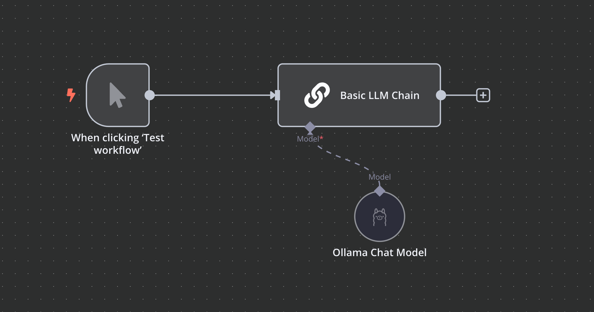
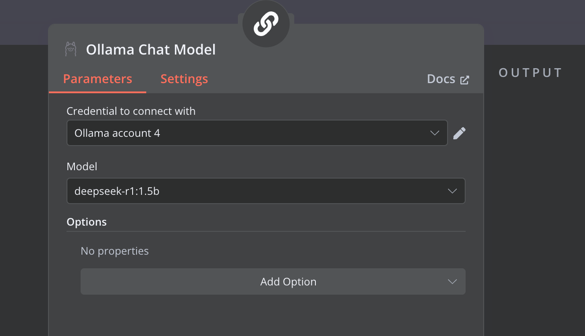
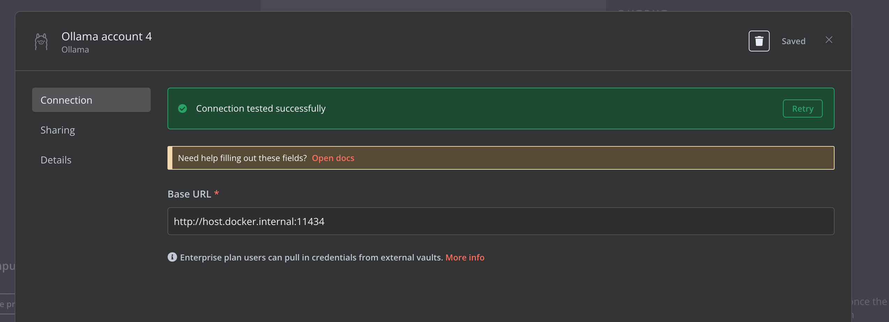
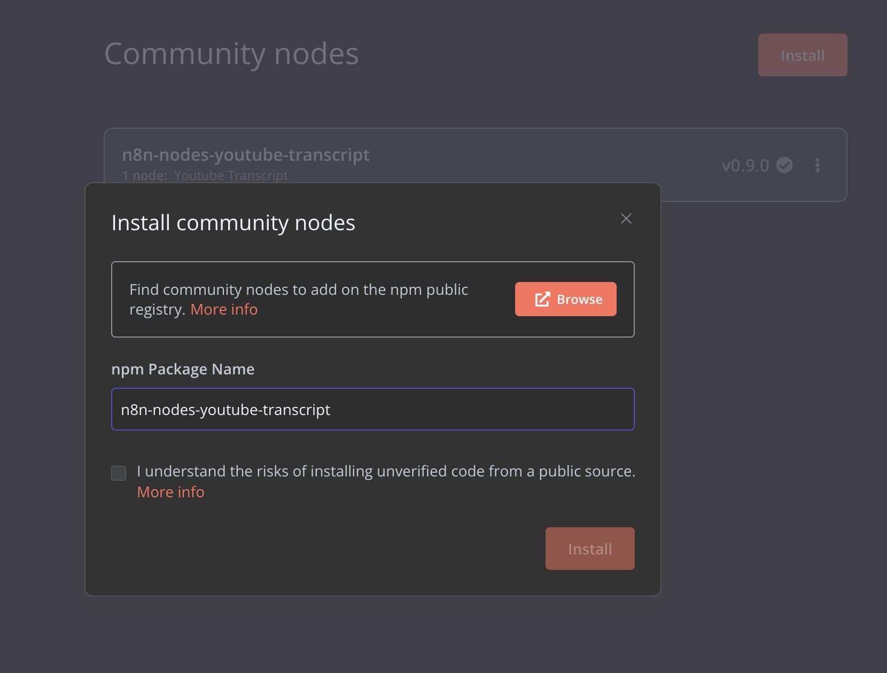
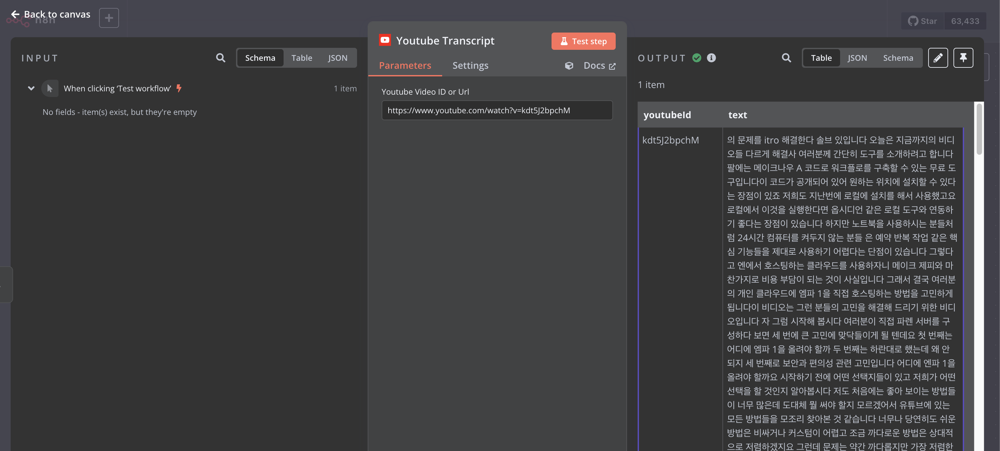
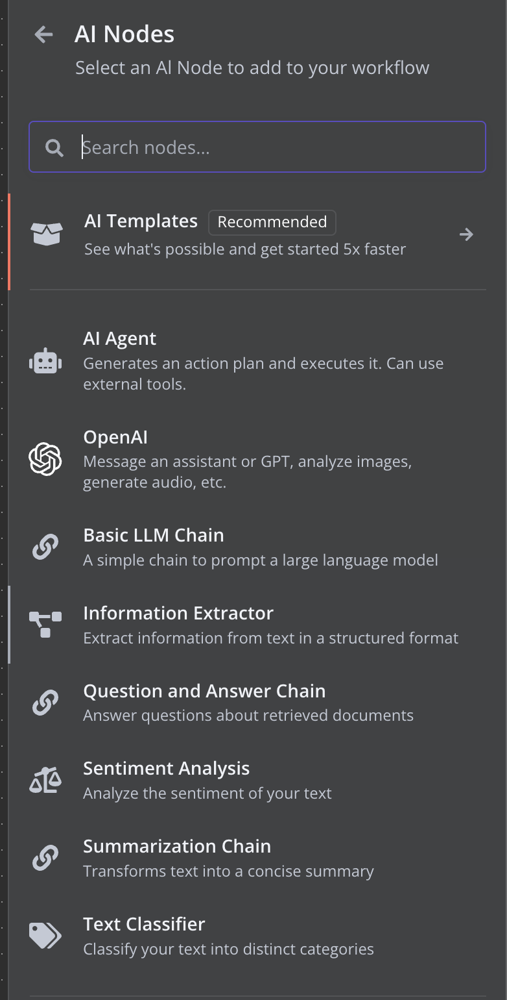

# n8n - 3 hello llm  

- [n8n - 3 hello llm](#n8n---3-hello-llm)
  - [eg, hello llm](#eg-hello-llm)
  - [eg, 커뮤니티 모듈 - 유튭스크립트](#eg-커뮤니티-모듈---유튭스크립트)
    - [참고) 도커 PUPPETEER 설치된 이미지 만들기](#참고-도커-puppeteer-설치된-이미지-만들기)
    - [Lang Chain Node](#lang-chain-node)

## eg, hello llm   

  

```json
{
  "nodes": [
    {
      "parameters": {},
      "type": "n8n-nodes-base.manualTrigger",
      "typeVersion": 1,
      "position": [
        220,
        -220
      ],
      "id": "a85cb58c-0636-4673-ba8e-17f0bc32b58f",
      "name": "When clicking ‘Test workflow’"
    },
    {
      "parameters": {
        "promptType": "define",
        "text": "Hello, how are you?"
      },
      "type": "@n8n/n8n-nodes-langchain.chainLlm",
      "typeVersion": 1.5,
      "position": [
        520,
        -220
      ],
      "id": "ac0b9d76-0c88-47df-8740-1dde53cec61b",
      "name": "Basic LLM Chain",
      "alwaysOutputData": false
    },
    {
      "parameters": {
        "model": "deepseek-r1:1.5b",
        "options": {}
      },
      "type": "@n8n/n8n-nodes-langchain.lmChatOllama",
      "typeVersion": 1,
      "position": [
        640,
        -20
      ],
      "id": "60de65e1-a10c-4c41-8a10-974b8829801f",
      "name": "Ollama Chat Model",
      "credentials": {
        "ollamaApi": {
          "id": "vSxtMOKcgUd95Qeq",
          "name": "Ollama account 4"
        }
      }
    }
  ],
  "connections": {
    "When clicking ‘Test workflow’": {
      "main": [
        [
          {
            "node": "Basic LLM Chain",
            "type": "main",
            "index": 0
          }
        ]
      ]
    },
    "Ollama Chat Model": {
      "ai_languageModel": [
        [
          {
            "node": "Basic LLM Chain",
            "type": "ai_languageModel",
            "index": 0
          }
        ]
      ]
    }
  },
  "pinData": {},
  "meta": {
    "templateCredsSetupCompleted": true,
    "instanceId": "54341b83f8ae5e91dd7738ce874975e3b6fef26153c9e5575674e5ca36e582ed"
  }
}
```

Ollama Chat Model에 대한 설정을 주의 해야 한다.  

  
- 주소는 외부 호스트를 가르킴 : http://host.docker.internal:11434  


## eg, 커뮤니티 모듈 - 유튭스크립트 

http://localhost:5678/settings/community-nodes 에서 설치 가능하다.  

youtube 스크립트 가져오는 모듈  
- https://www.npmjs.com/package/n8n-nodes-youtube-transcript  
  

```
- 실행중인 컨테이너에 설치 (실행중인 컨테이너에 설치하면 컨테이너 삭제 안하면 유지)  

docker exec -it -u root n8n /bin/sh -c "apk update && \
  apk add --no-cache nmap && \
  echo @edge http://nl.alpinelinux.org/alpine/edge/community >> /etc/apk/repositories && \
  echo @edge http://nl.alpinelinux.org/alpine/edge/main >> /etc/apk/repositories && \
  apk update && \
  apk upgrade && \
  apk add --no-cache udev chromium harfbuzz freetype ttf-freefont nss"
---
PUPPETEER_SKIP_CHROMIUM_DOWNLOAD=true
PUPPETEER_EXECUTABLE_PATH=/usr/bin/chromium-browser
```

  


### 참고) 도커 PUPPETEER 설치된 이미지 만들기  

```yml
services:
  n8n:
    build:
      context: .
      dockerfile: Dockerfile
    # ... 나머지 설정들
---
# Dockerfile
FROM n8nio/n8n

USER root

# 필요한 패키지 설치
RUN apk update && \
    apk add --no-cache nmap && \
    echo @edge http://nl.alpinelinux.org/alpine/edge/community >> /etc/apk/repositories && \
    echo @edge http://nl.alpinelinux.org/alpine/edge/main >> /etc/apk/repositories && \
    apk update && \
    apk upgrade && \
    apk add --no-cache udev chromium harfbuzz freetype ttf-freefont nss

# 환경변수 설정
ENV PUPPETEER_SKIP_CHROMIUM_DOWNLOAD=true \
    PUPPETEER_EXECUTABLE_PATH=/usr/bin/chromium-browser

# 다시 n8n 사용자로 전환
USER node
```


### Lang Chain Node  

  
1. **AI Templates** (추천됨)  - 5배 빠른 시작을 위한 템플릿 제공
2. **AI Agent**   - 액션 플랜 생성 및 실행, 외부 도구 사용 가능
3. **OpenAI**   - 어시스턴트/GPT 메시징, 이미지 분석, 오디오 생성 등
4. **Basic LLM Chain**   - 대규모 언어 모델을 위한 간단한 체인
5. **Information Extractor**   - 텍스트에서 구조화된 정보 추출
6. **Question and Answer Chain**   - 문서 기반 질의응답
7. **Sentiment Analysis**   - 텍스트 감정 분석
8. **Summarization Chain**   - 텍스트 요약
9. **Text Classifier**   - 텍스트를 카테고리로 분류


