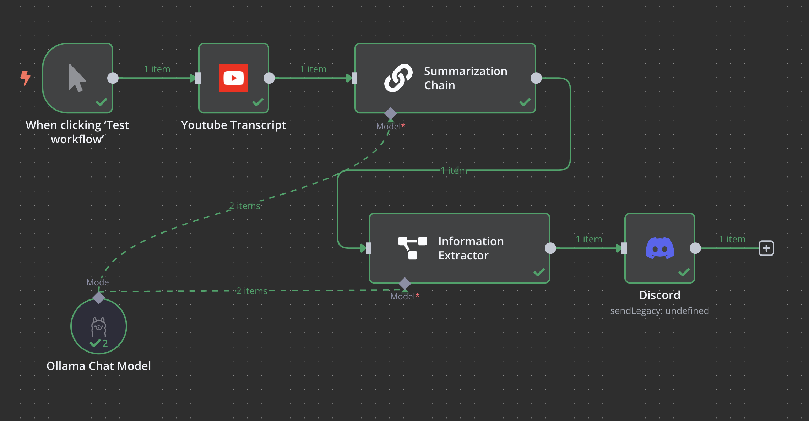
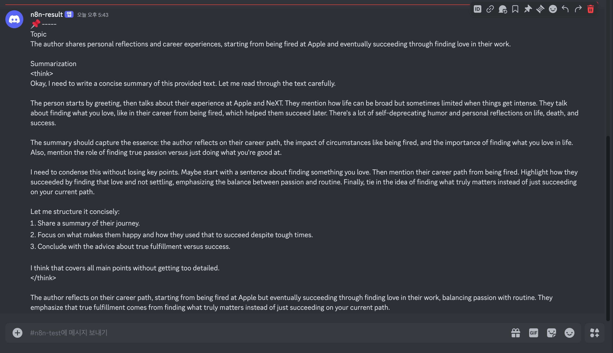

# n8n - 3 

- [n8n - 3](#n8n---3)
  - [eg, youtube 요약 bot](#eg-youtube-요약-bot)
    - [Lang Chain Node](#lang-chain-node)

## eg, youtube 요약 bot    

Workflow :     
결과 :     

### Lang Chain Node  

```json
{
  "nodes": [
    {
      "parameters": {},
      "type": "n8n-nodes-base.manualTrigger",
      "typeVersion": 1,
      "position": [
        0,
        0
      ],
      "id": "d359f555-55b7-4076-a3d6-fd05e309a31d",
      "name": "When clicking ‘Test workflow’"
    },
    {
      "parameters": {
        "youtubeId": "https://www.youtube.com/watch?v=Q6WdpSh8s80&t=385s"
      },
      "type": "n8n-nodes-youtube-transcript.youtubeTranscriptNode",
      "typeVersion": 1,
      "position": [
        220,
        0
      ],
      "id": "d6a79709-187c-43cb-8d62-ae5dc24442ce",
      "name": "Youtube Transcript"
    },
    {
      "parameters": {
        "options": {}
      },
      "type": "@n8n/n8n-nodes-langchain.chainSummarization",
      "typeVersion": 2,
      "position": [
        440,
        0
      ],
      "id": "abf633e6-c536-4586-b83c-ca42658232a8",
      "name": "Summarization Chain",
      "retryOnFail": false
    },
    {
      "parameters": {
        "model": "deepseek-r1:1.5b",
        "options": {}
      },
      "type": "@n8n/n8n-nodes-langchain.lmChatOllama",
      "typeVersion": 1,
      "position": [
        40,
        360
      ],
      "id": "f4c431d5-1dbb-4653-b077-7e5313297501",
      "name": "Ollama Chat Model",
      "credentials": {
        "ollamaApi": {
          "id": "vSxtMOKcgUd95Qeq",
          "name": "Ollama account 4"
        }
      }
    },
    {
      "parameters": {
        "text": "={{ $json.response.text }}",
        "schemaType": "fromJson",
        "jsonSchemaExample": "{\n\t\"topic\": \"summary of topic\"\n}",
        "options": {
          "systemPromptTemplate": "You are an expert extraction algorithm.\nOnly extract relevant information from the text.\nIf you do not know the value of an attribute asked to extract, you may omit the attribute's value.\n\noutput only json schema allow!!"
        }
      },
      "type": "@n8n/n8n-nodes-langchain.informationExtractor",
      "typeVersion": 1,
      "position": [
        460,
        240
      ],
      "id": "c46808c8-bb91-4b08-a531-3c6dd044d8df",
      "name": "Information Extractor",
      "retryOnFail": true
    },
    {
      "parameters": {
        "authentication": "webhook",
        "content": "=📌 -----\nTopic\n{{ $json.output.topic }}\n\nSummarization\n{{ $('Summarization Chain').item.json.response.text }}\n",
        "options": {}
      },
      "type": "n8n-nodes-base.discord",
      "typeVersion": 2,
      "position": [
        820,
        240
      ],
      "id": "364a3d6e-7950-4c6a-8a31-ffb7272eb601",
      "name": "Discord",
      "webhookId": "0ce9f7da-358f-4f78-9ce1-4b78d9eed966",
      "credentials": {
        "discordWebhookApi": {
          "id": "o0S0xPmHJAZ4ye2m",
          "name": "Discord Webhook account"
        }
      }
    }
  ],
  "connections": {
    "When clicking ‘Test workflow’": {
      "main": [
        [
          {
            "node": "Youtube Transcript",
            "type": "main",
            "index": 0
          }
        ]
      ]
    },
    "Youtube Transcript": {
      "main": [
        [
          {
            "node": "Summarization Chain",
            "type": "main",
            "index": 0
          }
        ]
      ]
    },
    "Summarization Chain": {
      "main": [
        [
          {
            "node": "Information Extractor",
            "type": "main",
            "index": 0
          }
        ]
      ]
    },
    "Ollama Chat Model": {
      "ai_languageModel": [
        [
          {
            "node": "Summarization Chain",
            "type": "ai_languageModel",
            "index": 0
          },
          {
            "node": "Information Extractor",
            "type": "ai_languageModel",
            "index": 0
          }
        ]
      ]
    },
    "Information Extractor": {
      "main": [
        [
          {
            "node": "Discord",
            "type": "main",
            "index": 0
          }
        ]
      ]
    }
  },
  "pinData": {},
  "meta": {
    "templateCredsSetupCompleted": true,
    "instanceId": "54341b83f8ae5e91dd7738ce874975e3b6fef26153c9e5575674e5ca36e582ed"
  }
}
```


참고  
- 노드를 병렬수행 후 '머지' 노드를 통해서 대기 후 데이터를 합칠 수 있다.    
- AI Agent를 이용해서 SerpAPI를 사용하면 구글 검색등이 가능하다.  
- Youtube Script는 커뮤니티 버전이며, 많은 호출이 발생하면 오류 발생 가능.  
- Information Extractor는 출력 형식에서 오류가 발생했었다. llm이 json으로 정확히 안줄때가 생각보다 많음 -> system prompt를 조작해야함.  


