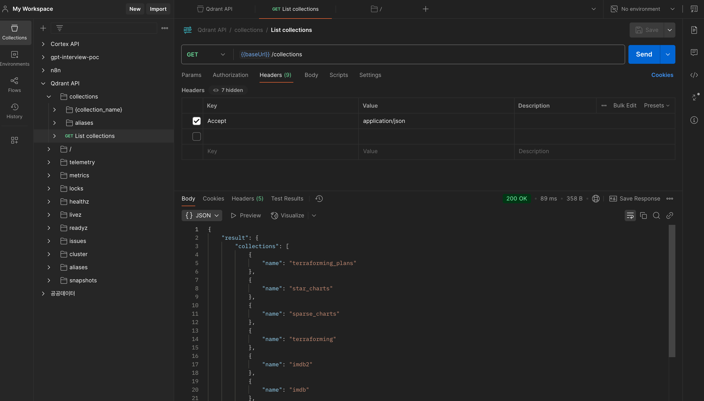

# 1.Qdrant Setup   


## Docker Compose Up  

- Ref : https://dosimpact.github.io/docs/g-devops/docker/docker-template/dt14-n8n#eg-n8n-qdrant-ollama    

```yml
# VOLUME_DIR
PREFIX_VOLUME_DIR=/Users/username/Volume

VOLUME_DIR_QDRANT=${PREFIX_VOLUME_DIR}/qdrant

QDRANT__SERVICE__API_KEY=K
QDRANT__SERVICE__READ_ONLY_API_KEY=K  
---
networks:
  n8n-workflow:

services:
  qdrant:
    image: qdrant/qdrant
    container_name: qdrant
    networks: ['n8n-workflow']
    restart: unless-stopped
    environment:
      - QDRANT__SERVICE__API_KEY=${QDRANT__SERVICE__API_KEY}  
      - QDRANT__SERVICE__READ_ONLY_API_KEY=${QDRANT__SERVICE__READ_ONLY_API_KEY}
    ports:
      - 6333:6333
    volumes:
      - ./qdrant_storage:/qdrant/storage

```

- QDRANT__SERVICE__API_KEY 는 admin key같은 존재이며, REST API의 인증헤더에 사용 가능  


## API Interafce 
- https://qdrant.tech/documentation/interfaces/#api-reference  
  - openapi.json - https://github.com/qdrant/qdrant/blob/master/docs/redoc/master/openapi.json 
  - 위 내용을 PostMan에 추가해서 사용하면 좋다.  

  
- Variables : 프로토콜 및 url 설정하기  
- Authorization : api-key 헤더에 추가하기 


