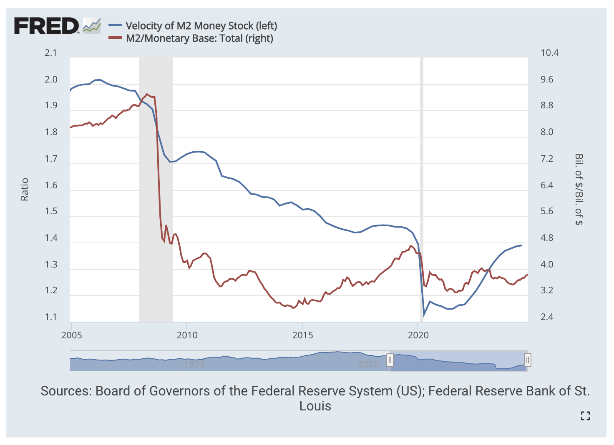
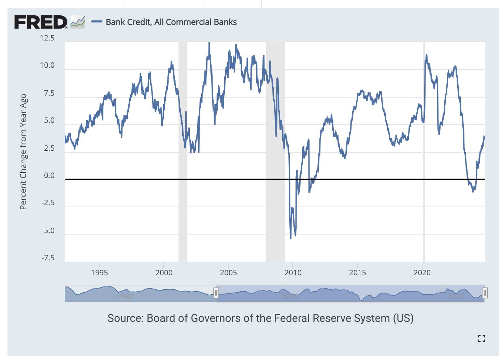

# Fred 지표 모음  

## 본원통화, 지급준비금

- https://fred.stlouisfed.org/graph/?g=1uMB9
- (파란선 본원통화, 초록선 지급준비금)  

- 현재는 BIS 규제로 본원통화 대비 지급준비금이 비례한다.  

## 화폐유통속도, M2(통화승수)  

- https://fred.stlouisfed.org/graph/?g=1vSmT
- (파란선 화폐유통속도, 빨간선 통화승수)     

- 시중의 돈의 양이 많은가? (= 높은 M2(통화승수))  
- 많은 돈이 빨리 유통되는가? (= 빠른 화폐유통속도)   

## Bank credit (YoY)

- https://fred.stlouisfed.org/graph/?g=1vyWL
- Bank Credit, All Commercial Banks (TOTBKCR)	
- 미국 내 모든 상업 은행이 기업, 개인, 정부 등에 제공한 총 신용액의 YoY %    

## GDP, 잠재성장

- https://fred.stlouisfed.org/graph/?g=1C0n7  
- 빨간선 : 실질 GDP
- 파란선 : 잠재 GDP
- 초록선 : 실질과 잠재의 GAP    