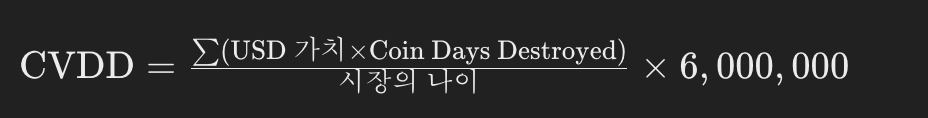

# Onchain Indicators  

- [Onchain Indicators](#onchain-indicators)
  - [1.Price Forecast Tools](#1price-forecast-tools)
    - [비트코인 가격 예측](#비트코인-가격-예측)
    - [비트코인 가격 예측 주요 사례](#비트코인-가격-예측-주요-사례)
    - [비트코인 가격 예측 차트](#비트코인-가격-예측-차트)
    - [비트코인 가격 예측 도구 설명](#비트코인-가격-예측-도구-설명)
  - [CVDD](#cvdd)
    - [지표 개요](#지표-개요)
    - [CDD(코인 데이즈 디스트로이드)](#cdd코인-데이즈-디스트로이드)
    - [CVDD 계산 방법](#cvdd-계산-방법)
    - [UTXO 개요](#utxo-개요)
    - [UTXO의 역할과 중요성](#utxo의-역할과-중요성)
    - [UTXO를 이용한 데이터 분석](#utxo를-이용한-데이터-분석)
    - [\*\*Coin Days Destroyed (CDD)\*\*의 공식은 다음과 같습니다:](#coin-days-destroyed-cdd의-공식은-다음과-같습니다)
  - [2.The Puell Multiple](#2the-puell-multiple)
    - [지표 개요](#지표-개요-1)
    - [활용 방법](#활용-방법)
    - [이 도구를 활용한 비트코인 가격 예측](#이-도구를-활용한-비트코인-가격-예측)
  - [3.MVRV Z-Score](#3mvrv-z-score)
    - [지표 개요](#지표-개요-2)
    - [활용 방법](#활용-방법-1)
    - [이 도구를 활용한 비트코인 가격 예측](#이-도구를-활용한-비트코인-가격-예측-1)
    - [MVRV (시장 가치 대 실현 가치 비율)](#mvrv-시장-가치-대-실현-가치-비율)
  - [4.RHODL Ratio](#4rhodl-ratio)
    - [지표 개요](#지표-개요-3)
    - [이 지표의 사용 방법](#이-지표의-사용-방법)
    - [이 도구를 활용한 비트코인 가격 예측](#이-도구를-활용한-비트코인-가격-예측-2)
    - [유사한 실시간 차트](#유사한-실시간-차트)
  - [5.Net Unrealized Profit/Loss (NUPL)](#5net-unrealized-profitloss-nupl)
    - [지표 개요](#지표-개요-4)
    - [차트 보기 방법](#차트-보기-방법)
    - [이 도구를 활용한 비트코인 가격 예측](#이-도구를-활용한-비트코인-가격-예측-3)
    - [제작자](#제작자)
    - [생성 날짜](#생성-날짜)
    - [추가 자료](#추가-자료)
    - [비디오 설명](#비디오-설명)
  - [6.Reserve Risk](#6reserve-risk)
  - [7.AASI (Active Address Sentiment Indicator)](#7aasi-active-address-sentiment-indicator)
  - [8.Advanced NVT Signal](#8advanced-nvt-signal)
    - [NVT 시그널 개요](#nvt-시그널-개요)
      - [NVT 시그널의 원리](#nvt-시그널의-원리)
      - [비트코인 가격 예측](#비트코인-가격-예측-1)
    - [유사한 라이브 차트](#유사한-라이브-차트)
    - [요약](#요약)
  - [9.Realized Price](#9realized-price)
  - [10.CVDD](#10cvdd)
  - [11.Top Cap](#11top-cap)
  - [12.Delta Top](#12delta-top)
  - [13.Balanced Price](#13balanced-price)
  - [14.Terminal Price](#14terminal-price)
  - [15.Long-Term Holder Realized Price](#15long-term-holder-realized-price)
  - [16.Short-Term Holder Realized Price](#16short-term-holder-realized-price)
  - [17.Percent Addresses in Profit](#17percent-addresses-in-profit)
  - [18.Percent Addresses in Loss](#18percent-addresses-in-loss)
  - [19.Spent Output Profit Ratio (SOPR)](#19spent-output-profit-ratio-sopr)

## 1.Price Forecast Tools  
>BTC Price을 1.CVDD, 2.Top Cap, 3.Delta Top, 4.Balanced Price, 5.Terminal Price 5가지 지표와 비교 

### 비트코인 가격 예측

미래의 비트코인 가격이 궁금하신가요? 디지털 통화 가격을 정확하게 예측하는 것은 매우 어렵고, 미디어에 인용된 사람들이 예측을 틀리는 경우가 많습니다. 
- 예를 들어, 존 맥아피는 비트코인 가격이 2020년까지 50만 달러에 이를 것이라고 예측했지만, 이는 실현되지 않았습니다.
- 이 페이지에서는 산업 전문가들의 가격 예측을 공유할 뿐만 아니라, 실제 블록체인 데이터를 사용하여 비트코인 가격을 예측할 수 있는 무료 도구도 제공합니다. 
- 이를 통해 비트코인의 가격이 얼마나 오르거나 내릴지 스스로 판단할 수 있습니다.
- 본격적인 $BTC 가격 예측 도구 설명에 앞서, 비트코인의 향후 몇 년 동안의 가격 예측을 소개합니다.

### 비트코인 가격 예측 주요 사례

**할 피니 예측: 1BTC = $1,000만**
- 비트코인의 초기 개발에 중요한 역할을 한 할 피니는 사토시 나카모토로부터 첫 번째 비트코인을 받은 인물입니다. 
- 그는 비트코인이 법정화폐가 되어 세계적인 결제 시스템이 된다면, 한 비트코인의 가치가 1,000만 달러에 이를 것이라고 예측했습니다.

**ARK 인베스트 예측: 2030년까지 1BTC = $100만**
- 캐시 우드의 투자 펀드인 ARK 인베스트는 테슬라와 같은 고성장 기업에 초기 투자한 것으로 유명합니다. 
- 이들은 매년 주요 신흥 트렌드에 대한 보고서를 발행하며, 2021년 보고서에서는 비트코인이 2030년까지 100만 달러를 초과할 것으로 예측했습니다.

**플랜 B 스톡 투 플로우 모델: 2025년까지 1BTC = $20만**  
- 스톡 투 플로우 모델의 저자는 비트코인 가격이 앞으로도 계속 상승할 것이라고 확신합니다.  
- 이 모델은 2024년에 비트코인 가격이 20만 달러를 초과할 것이라고 예측합니다.

### 비트코인 가격 예측 차트

- 비트코인 가격 예측에 대해 스스로 판단할 수 있도록, 블록체인 도구를 사용하여 비트코인의 최고가와 최저가를 예측하는 차트를 공유합니다.  
- 이 도구들은 이전 사이클에서 정확한 예측을 했으며, 최신 데이터를 사용해 비트코인 가격의 상승과 하락을 예측할 수 있습니다.
- 차트에서는 다양한 장기 비트코인 가격 예측 모델을 보여주며, 각 모델이 미래의 비트코인 가격을 어떻게 예측하는지 설명합니다. 차트의 선에 마우스를 올리면 $BTCUSD 목표 값을 확인할 수 있습니다.

### 비트코인 가격 예측 도구 설명

각 비트코인 가격 예측 도구의 계산 방법과 창시자를 설명합니다.

**Delta Top**
이 지표는 온체인 데이터와 기술적 입력값을 결합합니다. 먼저 델타 캡(Delta Cap)을 계산해야 합니다.

- 델타 캡 = 실현 시가총액 - 평균 시가총액
- 실현 시가총액은 모든 비트코인의 비용 기준을 의미합니다.
- 평균 시가총액은 시장 연령에 따른 시가총액의 누적합을 일수로 나눈 값입니다.

델타 캡 값을 7배하여 델타 톱(Delta Top)을 도출합니다.

**Top Cap**
이 지표는 시가총액과 가격 정보를 사용합니다. 
- 평균 시가총액을 계산한 후, 그 값을 35배하여 Top Cap을 계산합니다. 
- Top Cap은 주로 시장의 과열로 인해 비트코인 가격이 급등할 때의 최고가를 예측하는 데 사용됩니다.

**Terminal Price**
- 이 지표는 온체인 데이터를 사용하여 사용자 행동과 활동을 분석합니다.  
- 코인 데이즈 디스트로이드(Coin Days Destroyed)와 비트코인의 공급량, 유통 기간을 사용하여 계산합니다. 값은 21배 하여 '터미널' 가격을 산출합니다.

**Balanced Price**
- 이 지표는 베어 마켓의 최저가를 예측하는 데 사용됩니다. 실현 가격에서 전송 가격을 뺀 값으로 계산됩니다.

**CVDD (Cumulative Value Coin Days Destroyed)**  

- 이 지표는 UTXO(미사용 거래 출력)를 추적하여 시장 연령에 따른 비트코인의 주요 저점을 예측합니다. 
- 이는 비트코인이 이동하면서 파괴된 코인 데이즈(Coin Days)의 누적합을 사용합니다.

--- 

## CVDD  

ref:https://www.lookintobitcoin.com/charts/cvdd  

### 지표 개요

- **CVDD**는 Cumulative Value Coin Days Destroyed(누적 가치 코인 데이즈 디스트로이드)의 약자입니다.  
- **Coin Days Destroyed (CDD)**는 비트코인의 UTXO(미사용 거래 출력)에 가치를 부여하는 용어입니다.   
- UTXO는 지갑 간에 이동하는 코인으로 생각할 수 있습니다.  

### CDD(코인 데이즈 디스트로이드)

코인이 지갑 간에 전송될 때, 이 거래는 다음과 같은 특성을 가집니다:
- 1. **USD 가치**: 거래되는 코인의 미국 달러 가치
- 2. **시간 가치**: 원래 투자자가 코인을 얼마나 오래 보유했는지를 의미하는 시간 가치
- 이 두 가지 특성을 합친 값이 바로 **Coin Days Destroyed (CDD)**입니다.

### CVDD 계산 방법

**CVDD**는 이러한 가치-시간 파괴의 누적합을 시장의 연령에 비례하여 추적합니다. 
- 이 값은 600만으로 곱해지는데, 이 숫자는 비트코인 데이터와는 직접적인 연관이 없는 다소 임의적인 숫자입니다.  
- CVDD는 비트코인의 주요 저점을 정확히 예측하는 데 있어 높은 정확도를 보여왔습니다.

- **누적 합산**: 비트코인이 이전 소유자에서 새로운 소유자로 이동할 때 발생하는 가치-시간 파괴의 누적 합을 추적합니다.
- **시장 연령 비율**: 이러한 누적 합을 시장 연령에 따른 비율로 나누어 조정합니다.
- **곱셈 인자**: 이 값에 600만을 곱하여 최종 CVDD 값을 계산합니다.

- 이 지표는 비트코인의 가격이 주요 저점에 도달했을 때를 정확히 예측하는 데 사용되어 왔습니다.  
- CVDD는 과거 데이터를 기반으로 하여 비트코인의 미래 저점을 예측하는 데 도움을 줄 수 있습니다.

### UTXO 개요

**UTXO**는 **Unspent Transaction Output**의 약자입니다.  
- 이는 비트코인 블록체인에서 중요한 회계 방식입니다.
- UTXO는 특정 주소가 보유한 코인의 잔액을 나타냅니다.  
- 이는 지갑이 받은 거래의 출력 중 미래에 사용할 수 있는 미사용 부분을 의미합니다.

### UTXO의 역할과 중요성

UTXO는 지갑에 의해 수신된 거래 출력으로, 아직 소비되지 않은 것을 나타냅니다.
- 즉, 특정 주소가 보유한 비트코인의 잔액을 나타냅니다.
- UTXO는 온체인 지표를 구축할 때 자주 데이터 소스로 사용됩니다.  
- 이는 비트코인 블록체인의 UTXO의 나이, 크기, 양 등을 분석하여 다양한 지표를 만들 수 있기 때문입니다.  
- 이러한 집계된 데이터는 블록체인 참가자들의 행동에 대한 통찰력을 제공합니다.

### UTXO를 이용한 데이터 분석

UTXO 데이터를 분석하여 다음과 같은 지표를 만들 수 있습니다:

1. **나이**: UTXO가 생성된 이후 경과된 시간.
2. **크기**: UTXO의 크기나 양.
3. **금액**: 특정 UTXO에 포함된 비트코인의 양.

- 이러한 분석을 통해 비트코인 블록체인에서 참가자들이 어떻게 행동하고 있는지 파악할 수 있습니다. 
- 예를 들어, 오래된 UTXO가 많이 존재한다면, 이는 많은 비트코인이 오랫동안 이동되지 않았음을 의미할 수 있습니다. 
- 반대로, 새로운 UTXO가 많다면, 최근에 많은 거래가 발생했음을 나타낼 수 있습니다.

### **Coin Days Destroyed (CDD)**의 공식은 다음과 같습니다:

- 이 공식에서 각 거래에 대해 코인 수와 해당 코인이 사용되지 않은 일수를 곱하여 모든 거래에 대해 합산합니다.
- 예를 들어, 10개의 비트코인이 30일 동안 이동되지 않았다면, 이 거래의 CDD는 10(times)* (30) = 300이 됩니다.
- 이를 통해 전체 네트워크의 비트코인 거래가 얼마나 오랫동안 이동되지 않았는지를 측정할 수 있습니다. 

**Cumulative Value Days Destroyed (CVDD)**의 공식은 다음과 같습니다:

이 공식은 다음과 같은 요소들로 구성됩니다:
- 1. **USD 가치**: 거래된 비트코인의 미국 달러 가치.
- 2. **Coin Days Destroyed (CDD)**: 비트코인이 이전에 사용되지 않은 일수와 코인 수의 곱.
- 3. **시장의 나이**: 비트코인 시장이 존재한 일수.

CVDD는 각 거래의 USD 가치와 CDD를 곱한 값을 시장의 나이로 나누고, 이 값을 6,000,000으로 곱하여 계산됩니다. 
- 이 지표는 비트코인의 주요 저점을 예측하는 데 사용되며, 시장 참여자들의 장기적인 보유 패턴을 분석합니다.

## 2.The Puell Multiple

>채굴자들의 수익이 너무 높으면 그것 또한 고점 신호이다.  
https://www.lookintobitcoin.com/charts/puell-multiple/

### 지표 개요

이 지표는 비트코인 경제의 공급 측면, 즉 비트코인 채굴자와 그들의 수익을 분석합니다. 
- 채굴 수익 관점에서 시장 사이클을 탐구하며, 채굴자들은 채굴 하드웨어의 고정 비용을 충당해야 하기 때문에 '강제 판매자'로 종종 불립니다. 
- 따라서 그들이 발생시키는 수익은 시간이 지남에 따라 가격에 영향을 미칠 수 있습니다.

**Puell Multiple**은 비트코인의 일일 발행 가치(USD)를 365일 이동 평균 발행 가치로 나누어 계산됩니다.

### 활용 방법

비트코인이 채굴되어 생태계에 진입하는 가치가 역사적 기준에 비해 너무 크거나 작은 기간이 존재합니다. 
- 이러한 기간을 이해하는 것은 전략적 비트코인 투자자에게 유익할 수 있습니다.
- 차트는 비트코인의 일일 발행 가치가 매우 낮았던 시기(Puell Multiple이 녹색 상자에 들어간 시기)를 강조합니다. 
- 이러한 시기에 비트코인을 매수한 투자자들은 큰 수익을 얻었으며, 
- 반대로 일일 발행 가치가 매우 높았던 시기(Puell Multiple이 빨간 상자에 들어간 시기)에는 비트코인을 매도하여 이익을 취할 수 있었습니다.

### 이 도구를 활용한 비트코인 가격 예측

Puell Multiple은 차트 상단의 빨간 띠를 사용하여 채굴자 수익이 USD 기준으로 역사적 기준보다 크게 높은 시기를 보여줍니다(이 경우 365일 이동 평균).
- 비트코인의 대부분의 존재 기간 동안, 이러한 기간은 $BTC 가격이 주요 고점에 도달한 시기와 일치했습니다.  
- 따라서 Puell Multiple은 가격이 너무 높아 하락할 필요가 있는지(지표가 빨간 구역에 있을 때) 또는 너무 낮아 반등할 가능성이 있는지(지표가 녹색 구역에 있을 때)를 식별하는 유용한 비트코인 예측 도구가 될 수 있습니다.

## 3.MVRV Z-Score  

>온체인에서 활동하는 코인의 가치대비 거래소에서 활동하는 코인의 가치의 비율, 온체인에서 활동하는 코인이 클수록 진짜만 남는다.  

https://www.lookintobitcoin.com/charts/mvrv-zscore/

### 지표 개요

**MVRV Z-Score**는 블록체인 분석을 사용하여 비트코인의 '공정 가치'에 비해 극도로 과대평가되거나 과소평가된 시기를 식별하는 비트코인 차트입니다.

이 지표는 다음 세 가지 메트릭을 사용합니다:
- 1. **시장 가치 (검은 선)**: Market Value 
  - 현재 비트코인 가격에 유통 중인 코인의 수를 곱한 값입니다. 
  - 이는 전통적인 시장의 시가총액과 유사합니다.
- 2. **실현 가치 (파란 선)**: Realized Value  
  - 현재 비트코인 가격을 사용하지 않고, 각 비트코인이 마지막으로 이동된 가격을 사용합니다. 
  - 즉, 각 비트코인이 마지막으로 한 지갑에서 다른 지갑으로 전송된 시점의 가격을 사용합니다. 
  - 이 가격들을 모두 더한 후 평균을 내고, 그 평균 가격에 유통 중인 코인의 총 수를 곱합니다. 
  - 이를 통해 단기적인 시장 심리를 배제하고, 보다 '진정한' 비트코인 가치를 장기적으로 측정할 수 있습니다. 
  - 시장 가치는 시장 심리에 따라 실현 가치 위아래로 변동합니다.
- 3. **Z-점수 (주황색 선)**: 
  - 시장 가치와 실현 가치 사이의 극단적인 값을 표출하는 표준 편차 테스트입니다.

### 활용 방법

**MVRV Z-Score**는 시장 가치가 실현 가치보다 비정상적으로 높게 움직이는 시기를 식별하는 데 매우 효과적입니다. 
- 이러한 기간은 Z-점수가 분홍색 상자에 들어갈 때(시장 사이클의 정점) 강조됩니다.  
- 이는 각 사이클의 시장 최고점을 2주 이내로 예측할 수 있었습니다.
- 또한, 시장 가치가 실현 가치보다 훨씬 낮을 때를 보여주며, 이 기간은 Z-점수가 녹색 상자에 들어갈 때 강조됩니다. 
- 이러한 기간 동안 비트코인을 매수하면 큰 수익을 얻을 수 있었습니다.

### 이 도구를 활용한 비트코인 가격 예측

MVRV Z-Score 비트코인 차트는 시장 상황의 극단적인 조건에서 비트코인 가격을 예측하는 데 유용합니다. 
- Z-점수가 상단의 빨간 띠에 진입할 때 비트코인 가격이 조정될 필요가 있는지를 예측하고, 
- 하단의 녹색 띠에 진입할 때 가격이 반등할 가능성이 있는지를 예측할 수 있습니다.

### MVRV (시장 가치 대 실현 가치 비율)

MVRV 비율 비트코인 도구는 시장 가치와 실현 가치의 비율을 시간에 따라 플로팅합니다. MVRV는 시장 가치가 실현 가치보다 훨씬 높을 때 시장의 과열 기간을 보여주기 위해 만들어졌습니다. 
- MVRV는 가격이 과매수되거나 과매도되는 넓은 추세를 보여주지만, 
- 시장 사이클의 정점과 저점을 특정하는 데 MVRV Z-Score만큼 효과적이지 않습니다.

이 지표와 유사한 접근 방식을 사용하는 차트는 비트코인 가격이 지속 불가능하게 높거나 낮은 시기를 식별하는 데 유용합니다.

## 4.RHODL Ratio  

>1주일 홀드한 사람과 1-2년 홀드한 사람의 비율을 표현. 단기투자자의 과열은 고점 신호

### 지표 개요

- **RHODL Ratio**은 Realized Value HODL 웨이브의 비율을 사용합니다. 

- **Realized Value HODL 웨이브**는 UTXO(코인)의 나이대별로 각 밴드 내 코인의 실현 가치를 가중하여 나타낸 것입니다. 
  - 실현 가치는 UTXO(코인)가 마지막으로 한 지갑에서 다른 지갑으로 이동했을 때의 가격입니다.  

**RHODL Ratio**
- 1주일 간격의 RHODL 밴드와 1-2년 간격의 RHODL 밴드 간의 비율을 살펴봅니다. 
- 이는 시간이 지남에 따라 증가하는 HODL(보유) 경향과 분실된 코인을 보정하기 위해 시장의 나이(일수)를 곱하여 조정합니다. 
- 1주일 값이 1-2년 값보다 현저히 높을 때 시장이 과열되고 있음을 신호합니다.

### 이 지표의 사용 방법

RHODL 비율이 빨간 띠에 가까워지기 시작하면 시장이 과열되고 있음을 나타낼 수 있습니다. 
- 이는 역사적으로 각 사이클에서 투자자가 수익을 실현하기에 좋은 시기였습니다. 
- 다른 온체인 지표와 달리 RHODL 비율은 2013년 4월 사이클 고점의 잘못된 신호를 주지 않아 독특한 장점을 가지고 있습니다.

### 이 도구를 활용한 비트코인 가격 예측

RHODL 비율은 시장 조건의 극단에서 비트코인 가격을 식별하는 데 유용합니다. 
- RHODL 비율 선이 상단 빨간 띠에 접근할 때 비트코인 가격($BTC)이 조정될 필요가 있는지를 예측하고, 
- 하단 녹색 띠에 도달한 후 가격이 반등할 가능성이 있는지를 예측할 수 있습니다. 이는 장기 비트코인 투자자에게 유용한 도구입니다.
- RHODL 비율 지표는 이후 다른 온체인 도구에 영감을 주었습니다. 예를 들어, ARK 인베스트의 Short-to-Long-Term-Realized-Value Ratio(SLRV)는 RHODL 비율 방법을 사용하여 1일 / 6개월-1년의 비율을 비교합니다.

### 유사한 실시간 차트
- RHODL 비율은 MVRV Z-Score 실시간 차트 페이지 및 HODL Waves 실시간 차트에 설명된 Realized Value 개념을 사용합니다.

---

## 5.Net Unrealized Profit/Loss (NUPL)  

>

https://userguide.cryptoquant.com/v/ko/cryptoquant-metrics/utxo/net-unrealized-profit-and-loss-nupl

### 지표 개요

NUPL = (MV - RV) / Cap  

이 지표는 시장 가치(Market Value)와 실현 가치(Realized Value)를 기반으로 합니다.
**시장 가치 (Market Value)**: 현재 비트코인 가격에 유통 중인 코인의 수를 곱한 값입니다. 
  - 이는 전통적인 시장의 시가총액과 유사합니다 (주가에 주식 수를 곱한 것).  

**실현 가치 (Realized Value)**: 현재 비트코인 가격 대신, 각 비트코인이 마지막으로 이동된 시점의 가격을 사용합니다. 
  - 즉, 각 비트코인이 마지막으로 한 지갑에서 다른 지갑으로 전송된 시점의 가격을 사용하여 모든 개별 가격을 합산하고 평균을 냅니다. 
  - 그런 다음 평균 가격에 유통 중인 총 코인의 수를 곱합니다.
  - 실현 가치를 시장 가치에서 빼면 미실현 이익/손실(Unrealized Profit/Loss)을 계산할 수 있습니다.  

**미실현 이익/손실**은 투자자들이 보유한 비트코인의 총 예상 이익/손실을 추정합니다. 이 값의 변화는 시간에 따라 투자자 심리를 파악하는 데 유용합니다.
- 이를 위해 미실현 이익/손실을 시가총액으로 나누어 **순 미실현 이익/손실(Net Unrealized Profit/Loss, NUPL)**을 계산합니다. 
- 이는 시간에 따른 비트코인 투자자 심리를 추적하는 데 매우 유용합니다.

### 차트 보기 방법

이 도구의 핵심 원리는 시가총액과 비트코인 투자자들이 이익을 실현하는 것 사이의 비율입니다.

시가총액이 이익 실현보다 훨씬 빠르게 상승할 때 시장이 과열되고 있음을 보여줍니다. 
- 이는 투자자의 탐욕으로 인해 발생할 수 있으며,   
- 이러한 시기는 전략적 투자자에게 수익을 실현하기에 유리한 시기일 수 있습니다.

비트코인의 상대적 미실현 이익/손실의 다양한 퍼센티지를 분석하여 시장의 단계별 상태를 파악할 수 있습니다.
- 이는 장기 전략적 투자자에게 유리합니다.

### 이 도구를 활용한 비트코인 가격 예측

**순 미실현 이익/손실(NUPL)**은 시장 참가자 데이터를 사용하여 비트코인 가격이 주요 고점 또는 저점에 도달할 가능성을 예측할 수 있습니다. 온체인 데이터를 사용하여 특정 시점의 시장 참가자 감정을 보여줌으로써 비트코인 가격을 예측하고 향후 이동 방향을 파악하는 데 유용합니다.

### 제작자
- 타마스 블루머(Tamas Blummer), 투어 드미스터(Tuur Demeester), 미카엘 레스크라우에트(Michiel Lescrauwaet)

### 생성 날짜
- 2019년 2월

### 추가 자료
- 원본 출판물: Adamant Capital의 "A primer on bitcoin investor sentiment and changes in saving behaviour"
- 유사한 실시간 차트: Realized value 데이터를 사용하는 또 다른 차트는 MVRV Z-Score입니다.

### 비디오 설명
- 이 지표의 사용법에 대한 비디오 설명도 참조할 수 있습니다.

---

## 6.Reserve Risk

## 7.AASI (Active Address Sentiment Indicator)

## 8.Advanced NVT Signal  

### NVT 시그널 개요

NVT 시그널은 이전의 온체인 지표에서 발전된 형태입니다. 
- 이 지표는 비트코인 네트워크의 총 가치를(즉, 시가총액) 일일 거래량의 90일 이동 평균으로 나누어 계산합니다.  

#### NVT 시그널의 원리

NVT 시그널은 원래 시장 사이클의 정점을 파악하기 위해 사용되었습니다. 
- 그러나 시간이 지남에 따라 더 많은 코인이 오프체인에서 보관됨에 따라 NVT 시그널의 효율성이 감소했습니다. 
- 이를 개선한 형태로, NVT 시그널에 표준 편차 밴드를 추가하여 비트코인이 과매수(붉은 구역) 상태인지 과매도(녹색 구역) 상태인지를 식별할 수 있게 되었습니다.   
- 이는 비트코인 투자자에게 중간 사이클에서 수익 실현 지점을 제공할 수 있습니다.

#### 비트코인 가격 예측

NVT 시그널의 고급 버전은 비트코인 블록체인 상의 투자자 활동(거래량)을 사용하여, 
- 지표가 극단적인 데이터 포인트에 도달할 때 비트코인 가격이 상승할지 하락할지를 예측합니다. 이 지표는 비트코인 가격을 중간 시간 프레임에서 예측하려는 시도로, 상위 붉은 경계와 하위 녹색 경계 사이를 이동하는 동안 사용할 수 있습니다.

### 유사한 라이브 차트

더 짧은 시간 프레임 움직임에 초점을 맞춘 다른 라이브 차트로는 Active Address Sentiment Indicator가 있습니다. 이 차트는 비트코인 가격 예측에 도움이 되는 유사한 도구로 사용할 수 있습니다.

### 요약

- **NVT 시그널**: 비트코인 네트워크의 시가총액을 일일 거래량의 90일 이동 평균으로 나눈 값
- **표준 편차 밴드**: 과매수 및 과매도 상태를 식별하여 투자자에게 수익 실현 기회를 제공
- **고급 NVT 시그널**: 거래량 데이터를 활용하여 중간 시간 프레임에서 비트코인 가격 예측
- **유사 지표**: Active Address Sentiment Indicator, 더 짧은 시간 프레임 움직임에 초점

이러한 설명을 통해 NVT 시그널을 이해하고, 비트코인 투자 및 예측에 활용할 수 있습니다.

## 9.Realized Price

## 10.CVDD

## 11.Top Cap

## 12.Delta Top

## 13.Balanced Price

## 14.Terminal Price

## 15.Long-Term Holder Realized Price

## 16.Short-Term Holder Realized Price  

이 차트는 최소 10,000BTC를 보유한 고유 주소의 수를 실시간으로 보여줍니다. 
- 모든 실시간 차트와 마찬가지로, 이 차트의 데이터는 하루에 한 번 업데이트됩니다.

비트코인 지갑이란 무엇인가요?
- 비트코인 지갑은 비트코인을 주고받을 수 있게 해줍니다. 
- 실제 코인을 저장하는 것이 아니라, 해당 지갑으로의 거래 데이터를 보유합니다. 
- 지갑의 가장 중요한 부분은 프라이빗 키로, 이를 소유한 사람은 지갑의 코인을 접근하고 다른 주소로 보낼 수 있습니다.

한 지갑에 얼마나 많은 비트코인을 보유할 수 있나요?
- 이론적으로 한 지갑에 보유할 수 있는 비트코인의 양에는 제한이 없습니다. 
- 전체 비트코인은 2100만 개로 제한되며, 현재까지 약 1900만 개가 채굴되었습니다. 
- 그중 약 300만 개는 이미 잃어버린 것으로 추정됩니다.

## 17.Percent Addresses in Profit  
>시장 참여자들이 얼마나 이익을 보고 있는지 시각화,  

**이 차트는 무엇을 보여주나요?**
이 차트는 평균 구매 가격이 현재 시장 가치보다 낮은 비트코인을 보유한 개별 주소의 비율을 보여줍니다. 
- "구매 가격"은 비트코인이 주소로 이동한 시점의 가격을 의미합니다. 이 차트는 "손실 중인 주소 비율"의 반대입니다.

**이 차트의 유용성**
이 차트는 시장 참여자들이 비트코인을 이익 상태에서 보유하고 있는지, 손
- 실 상태에서 보유하고 있는지를 보여줌으로써 시장 심리를 추적하는 데 유용합니다. 이를 통해 일반 시장의 비트코인 보유 현황을 이해할 수 있습니다.

## 18.Percent Addresses in Loss
>시장 참여자들이 얼마나 손해를 보고 있는지 시각화, 

이 차트는 평균 구매 가격이 현재 시장 가치보다 높은 비트코인을 보유한 개별 주소의 비율을 보여줍니다. 
- "구매 가격"은 비트코인이 주소로 이동한 시점의 가격을 의미합니다. 
- 이 차트는 "이익 중인 주소 비율"의 반대입니다.

이 차트는 시장 참여자들이 비트코인을 이익 상태에서 보유하고 있는지, 
- 손실 상태에서 보유하고 있는지를 보여줌으로써 시장 심리를 추적하는 데 유용합니다. 
- 이를 통해 일반 시장의 비트코인 보유 현황을 이해할 수 있습니다.

- 역사상 50% 지점이 많은 저점을 만들어 냈다.  

## 19.Spent Output Profit Ratio (SOPR)  
>폭탄돌리기의를 시각화 했다. 초록색은 폭탄돌렸을때 이익, 빨간색은 손해이다. 누군가가 이득을 보면 누군가는 피를 봐야 한다. 피본 돈을 사는것이 이득볼 확률이 크다.  

**SOPR란 무엇인가?**
SOPR(Spent Output Profit Ratio)는 일정 기간 동안 이동된 모든 비트코인의 이익 수준을 추적합니다. 
- 거래가 블록체인에서 발생할 때 판매자가 이익을 보고 있는지 손실을 보고 있는지를 나타냅니다. 
- 코인이 이동할 때 그것이 판매된다고 가정하지만, 이는 항상 맞는 것은 아니며, 개인이 소유한 주소 간에 이동하는 경우도 있습니다.

**SOPR 계산 방법**
SOPR은 UTXO(사용되지 않은 거래 출력)가 생성될 때의 달러 가치와 사용될 때의 달러 가치를 비교하여 계산합니다. 
- 이를 통해 지갑에서 나가는 거래가 이익인지 손실인지 관찰할 수 있습니다. 특정 기간 동안의 데이터를 모아 SOPR 차트를 시각화합니다.

- **SOPR > 0:** 코인이 이익 상태에서 이동.
- **SOPR < 0:** 코인이 손실 상태에서 '판매'됨.
- **SOPR 상승:** 이익 증가.
- **SOPR 하락:** 이익 감소.

**SOPR의 유용성**
SOPR은 특정 기간 동안 실제 시장 참여자의 행동을 보여주기 때문에 시장 심리 도구로 유용합니다. 
- 큰 손실이 발생하고 시간이 지남에 따라 손실이 증가하면, 
- 시장 참여자들이 비트코인 가격이 더 떨어질 것으로 예상한다는 것을 알려줍니다. 
- 반대로, 강세 시장에서는 이는 투자 기회가 될 수 있습니다.
