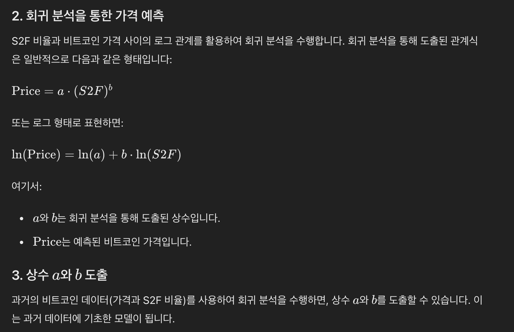

# Market Cycle

## 1 Bitcoin Investor Tool: 2-Year MA Multiplier

## 2 200 Week Moving Average Heatmap

## 3 Stock-to-Flow Model  

#### 주식-유동비율 (S2F)란 무엇인가요?

주식-유동비율(S2F)은 비트코인 가격을 예측하는 도구입니다.
- 이 도구는 시장에 있는 비트코인의 수와 매년 새로 생산되는(채굴되는) 비트코인의 수를 비교하여 가격을 예측합니다. 
- 차트에서 S2F 라인은 비트코인의 예상 가격을 보여줍니다. 
- 차트에서 마우스를 올려보면 특정 시점의 예상 가격을 볼 수 있습니다. 
- 지금까지 비트코인의 실제 가격은 대체로 이 라인을 따랐습니다.
- 시간이 지나면서 채굴되는 비트코인의 양이 줄어들기 때문에 S2F 비율은 증가합니다. 
- 즉, 시장에 나오는 공급량이 줄어들어 비트코인의 가격이 오를 것으로 예측됩니다.

S2F 모델은 비트코인을 금, 은, 백금 같은 귀금속과 비슷하게 봅니다. 
- 이런 귀금속은 희소성 때문에 오랜 시간 동안 가치를 유지합니다.
- 비트코인도 마찬가지로 희소합니다. 비트코인은 디지털 자산 중에서 처음으로 희소성을 가진 것입니다.  
- 제한된 수의 코인이 존재하며 남아있는 코인을 채굴하는 데 많은 전기와 컴퓨팅 자원이 필요합니다.
-  그래서 공급 속도는 꾸준히 낮습니다.

S2F는 비트코인의 미래 가격을 예측하는 데 유용한 도구입니다. 
- 다른 많은 지표들도 비트코인의 가격을 예측하지만, S2F는 특히 비트코인의 공급 일정에 집중합니다.  

S2F 공식   
- 현재 존재하는 비트코인의 총량 / 연간 새로 채굴되는 비트코인의 양    
- 예를 들어, 현재 존재하는 비트코인이 18,000,000 BTC이고 연간 새로 채굴되는 비트코인이 328,500 BTC라면, 주식-유동비율은 다음과 같이 계산됩니다:
- S2F=  328,500 / 18,000,000 ≈ 54.8  

위 설명대로, 이러한 공식과 가격 형태를 바탕으로 회귀분석 후 가격을 도출합니다.   

#### 차트를 보는 방법

1.next halving : 빨간색 = 반감기 많이 남음.   
2.Model price : 모델을 통해 나온 가격  
3.Model Variance ; 실제 가격과의 괴리감.  

차트에서 가격은 S2F 비율 라인 위에 표시됩니다.
- 가격이 시간에 따라 S2F 라인을 따르는 것을 볼 수 있습니다. 따라서 이 이론은 우리가 비트코인의 미래 가격을 예측할 수 있다고 제안합니다. 
- 차트의 색깔 있는 점들은 다음 비트코인 반감기까지 남은 일수를 나타냅니다. 
- 반감기는 채굴 보상이 절반으로 줄어드는 이벤트로, 
- 약 4년마다 발생합니다. 이로 인해 S2F 비율이 높아지고 이론적으로는 가격이 상승합니다.

### 차트를 생성하기 위한 데이터 소스

S2F 비트코인 차트의 주요 데이터 소스는 비트코인의 공급 일정입니다. 
- 비트코인 코드에 내장된 공급 일정 덕분에 미래의 공급 일정을 정확히 알 수 있습니다. 
- 이 데이터는 회귀 분석을 사용하여 S2F 값을 생성합니다.

### S2F 도구를 사용한 비트코인 가격 예측

- S2F 차트를 통해 많은 사람들이 비트코인의 미래 가격을 예측합니다. 
- 예를 들어, S2F 차트는 2022년 12월 31일 비트코인 가격이 $78,280, 
- 2023년 12월 31일에는 $81,956, 2024년 12월 31일에는 $306,984가 될 것이라고 예측합니다.

## 4 Fear And Greed Index  

>
https://www.lookintobitcoin.com/charts/bitcoin-fear-and-greed-index/

### 공포와 탐욕 지수(Fear and Greed Index)란 무엇인가?

공포와 탐욕 지수는 투자자와 트레이더들이 비트코인 및 암호화폐 시장의 심리를 분석하는 데 도움을 주는 도구입니다. 시장이 과도하게 공포스러워하거나 과도하게 탐욕스러워지는 정도를 파악합니다. 그래서 이 지수를 "공포와 탐욕 지수"라고 부릅니다.

- **공포**: 시장이 과도하게 공포에 휩싸일 때, 비트코인이 저평가되어 좋은 매수 기회일 수 있습니다.
- **탐욕**: 시장이 과도하게 탐욕스러울 때, 비트코인 가격이 본질가치보다 높아져 매도할 좋은 시점일 수 있습니다.

### 투자자와 트레이더에게 왜 유용한가?

이 지수의 점수를 이해하면 시장이 과도하게 공포스러울 때 매수하고, 과도하게 탐욕스러울 때 매도하는 기회를 포착할 수 있습니다. 이를 통해 더 나은 투자 결정을 내릴 수 있습니다.

- **극심한 공포**: 지표가 빨간색 숫자와 '극심한 공포'를 나타낼 때, 시장 심리가 매우 부정적입니다.
- **극심한 탐욕**: 지표가 녹색 숫자와 '극심한 탐욕'을 나타낼 때, 시장 심리가 매우 긍정적입니다.

이 지수는 투자자가 자신의 감정을 시장의 감정과 분리하고, 갑작스러운 가격 변동과 시장 변동성에 대한 비이성적 반응을 피하는 데 유용한 감정 관리 도구로 작용할 수 있습니다.

### 공포와 탐욕 지수를 사용하여 시장 심리 이해하기

공포와 탐욕 지수는 0에서 100까지의 단순한 척도로 표현되며, 사용하기 쉽게 색상으로 구분됩니다.

- **0-24**: 극심한 공포 (빨간색)
- **25-46**: 공포 (주황색)
- **47-49**: 중립 (노란색)
- **50-74**: 탐욕 (연녹색)
- **75-100**: 극심한 탐욕 (녹색)

### 공포와 탐욕 차트 해석하기

차트에서 비트코인 가격과 함께 공포와 탐욕 지수 점수를 표시합니다. 이를 통해 현재 점수뿐만 아니라 점수가 가격과 함께 시간에 따라 어떻게 변했는지 확인할 수 있습니다.

이 기능을 통해 투자자는 공포와 탐욕 지수가 가격과 역사적으로 어떻게 상호작용했는지 이해할 수 있습니다. 이 기능은 비트코인 가격이 크게 오르거나 내릴 때 시장에서 자신의 감정을 관리하는 데 유용할 수 있습니다.

### 공포와 탐욕 지수 차트를 생성하기 위한 데이터 소스

공포와 탐욕 지수의 입력 데이터는 매일 여러 소스에서 생성됩니다. 각각은 고유의 방식으로 공포와 탐욕의 정의에 기여합니다.

- **가격 변동성**: 최근 30일 및 90일 동안의 $BTC 가격 변동성
- **모멘텀 및 거래량**: 최근 30일 및 90일 동안의 거래량
- **소셜 미디어 심리 분석**: 특정 시간대의 감정 유형과 볼륨
- **비트코인의 시장 점유율**: 다른 암호화폐에 대한 비트코인의 점유율
- **구글 트렌드**: 관련 비트코인 검색어의 증가 또는 감소 시기

이 지수는 투자자들이 시장의 심리를 이해하고, 적절한 투자 결정을 내리는 데 도움을 줄 수 있습니다.

## 5 Pi Cycle Top Indicator

## 6 The Golden Ratio Multiplier

## 7 Bitcoin Profitable Days

## 8 Bitcoin Rainbow Price Chart Indicator

## 9 Bitcoin Cycle Master

## 10 :Global Liquidity (M2) vs Bitcoin Price

## 11 Long-Term Holder Realized Price

## 12 Short-Term Holder Realized Price

## x 13 Pi Cycle Top & Bottom Indicator
