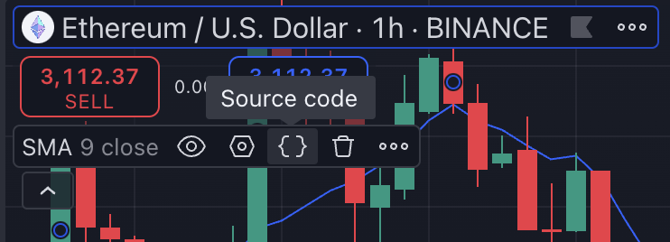
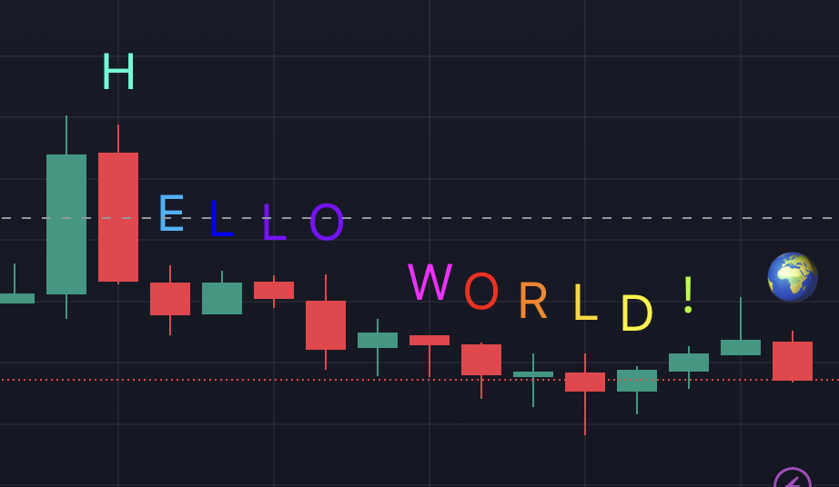

# PineScript  

- [PineScript](#pinescript)
  - [Template Code](#template-code)
  - [Hello World](#hello-world)
  - [Basic Concepts](#basic-concepts)
    - [Eg) Close \> Open의 경우 초록색 배경](#eg-close--open의-경우-초록색-배경)
    - [Eg) MACD indicator](#eg-macd-indicator)
    - [Eg) strategy](#eg-strategy)


저자는 온라인 프리랜서 / 파인스크립트 수업, 유료 컨설칭 / 실시간 트레이닝제공    


TradingView는 Pine Script 라는 자체 스크립팅 언어를 설계    
- Pine은 지표와 전략을 개발하는 특정 작업에 초점을 맞춘 가벼운 언어  
- 누구나 Pine을 배우고 사용할 수 있도록  
- 각 스크립트는 클라우드에서 계산 리소스를 사용  


## Template Code  

트레이딩 뷰에서 제공하는 기술적 지표를 바탕으로 소스코드를 확장시킬 수 있다.    
  


```js
//@version=5
indicator(title="Relative Strength Index", shorttitle="RSI", format=format.price, precision=2, timeframe="", timeframe_gaps=true)

rsiLengthInput = input.int(14, minval=1, title="RSI Length", group="RSI Settings")
rsiSourceInput = input.source(close, "Source", group="RSI Settings")
calculateDivergence = input.bool(false, title="Calculate Divergence", group="RSI Settings", display = display.data_window, tooltip = "Calculating divergences is needed in order for divergence alerts to fire.")

change = ta.change(rsiSourceInput)
up = ta.rma(math.max(change, 0), rsiLengthInput)
down = ta.rma(-math.min(change, 0), rsiLengthInput)
rsi = down == 0 ? 100 : up == 0 ? 0 : 100 - (100 / (1 + up / down))

rsiPlot = plot(rsi, "RSI", color=#7E57C2)
rsiUpperBand = hline(70, "RSI Upper Band", color=#787B86)
midline = hline(50, "RSI Middle Band", color=color.new(#787B86, 50))
rsiLowerBand = hline(30, "RSI Lower Band", color=#787B86)
fill(rsiUpperBand, rsiLowerBand, color=color.rgb(126, 87, 194, 90), title="RSI Background Fill")
midLinePlot = plot(50, color = na, editable = false, display = display.none)
fill(rsiPlot, midLinePlot, 100, 70, top_color = color.new(color.green, 0), bottom_color = color.new(color.green, 100),  title = "Overbought Gradient Fill")
fill(rsiPlot, midLinePlot, 30,  0,  top_color = color.new(color.red, 100), bottom_color = color.new(color.red, 0),      title = "Oversold Gradient Fill")

// Smoothing MA inputs
GRP = "Moving Average"
TT_BB = "Only applies when 'SMA + Bollinger Bands' is selected. Determines the distance between the SMA and the bands."
maTypeInput = input.string("SMA", "Type", options = ["None", "SMA", "SMA + Bollinger Bands", "EMA", "SMMA (RMA)", "WMA", "VWMA"], group = GRP, display = display.data_window)
maLengthInput = input.int(14, "Length", group = GRP, display = display.data_window)
bbMultInput = input.float(2.0, "BB StdDev", minval = 0.001, maxval = 50, step = 0.5, tooltip = TT_BB, group = GRP, display = display.data_window)
var enableMA = maTypeInput != "None"
var isBB = maTypeInput == "SMA + Bollinger Bands"

// Smoothing MA Calculation
ma(source, length, MAtype) =>
	switch MAtype
		"SMA"                   => ta.sma(source, length)
		"SMA + Bollinger Bands" => ta.sma(source, length)
		"EMA"                   => ta.ema(source, length)
		"SMMA (RMA)"            => ta.rma(source, length)
		"WMA"                   => ta.wma(source, length)
		"VWMA"                  => ta.vwma(source, length)

// Smoothing MA plots
smoothingMA = enableMA ? ma(rsi, maLengthInput, maTypeInput) : na
smoothingStDev = isBB ? ta.stdev(rsi, maLengthInput) * bbMultInput : na
plot(smoothingMA, "RSI-based MA", color=color.yellow, display = enableMA ? display.all : display.none)
bbUpperBand = plot(smoothingMA + smoothingStDev, title = "Upper Bollinger Band", color=color.green, display = isBB ? display.all : display.none)
bbLowerBand = plot(smoothingMA - smoothingStDev, title = "Lower Bollinger Band", color=color.green, display = isBB ? display.all : display.none)
fill(bbUpperBand, bbLowerBand, color= isBB ? color.new(color.green, 90) : na, title="Bollinger Bands Background Fill", display = isBB ? display.all : display.none)

// Divergence
lookbackRight = 5
lookbackLeft = 5
rangeUpper = 60
rangeLower = 5
bearColor = color.red
bullColor = color.green
textColor = color.white
noneColor = color.new(color.white, 100)

_inRange(bool cond) =>
    bars = ta.barssince(cond)
    rangeLower <= bars and bars <= rangeUpper

plFound = false
phFound = false

bullCond = false
bearCond = false

rsiLBR = rsi[lookbackRight]

if calculateDivergence
    //------------------------------------------------------------------------------
    // Regular Bullish
    // rsi: Higher Low
    plFound := not na(ta.pivotlow(rsi, lookbackLeft, lookbackRight))    
    rsiHL = rsiLBR > ta.valuewhen(plFound, rsiLBR, 1) and _inRange(plFound[1])
    // Price: Lower Low
    lowLBR = low[lookbackRight]
    priceLL = lowLBR < ta.valuewhen(plFound, lowLBR, 1)
    bullCond := priceLL and rsiHL and plFound

    //------------------------------------------------------------------------------
    // Regular Bearish
    // rsi: Lower High
    phFound := not na(ta.pivothigh(rsi, lookbackLeft, lookbackRight))
    rsiLH = rsiLBR < ta.valuewhen(phFound, rsiLBR, 1) and _inRange(phFound[1])
    // Price: Higher High
    highLBR = high[lookbackRight]
    priceHH = highLBR > ta.valuewhen(phFound, highLBR, 1)
    bearCond := priceHH and rsiLH and phFound


plot(
     plFound ? rsiLBR : na,
     offset=-lookbackRight,
     title="Regular Bullish",
     linewidth=2,
     color=(bullCond ? bullColor : noneColor),
     display = display.pane
     )

plotshape(
     bullCond ? rsiLBR : na,
     offset=-lookbackRight,
     title="Regular Bullish Label",
     text=" Bull ",
     style=shape.labelup,
     location=location.absolute,
     color=bullColor,
     textcolor=textColor
     )

plot(
     phFound ? rsiLBR : na,
     offset=-lookbackRight,
     title="Regular Bearish",
     linewidth=2,
     color=(bearCond ? bearColor : noneColor),
     display = display.pane
     )

plotshape(
     bearCond ? rsiLBR : na,
     offset=-lookbackRight,
     title="Regular Bearish Label",
     text=" Bear ",
     style=shape.labeldown,
     location=location.absolute,
     color=bearColor,
     textcolor=textColor
     )

alertcondition(bullCond, title='Regular Bullish Divergence', message="Found a new Regular Bullish Divergence, `Pivot Lookback Right` number of bars to the left of the current bar.")
alertcondition(bearCond, title='Regular Bearish Divergence', message='Found a new Regular Bearish Divergence, `Pivot Lookback Right` number of bars to the left of the current bar.')

```


## Hello World  

  

```js
//@version=4
study("Hello World", overlay=true)

offset          = input(defval=-13, type=input.integer, title="offset")
locationString  = input(defval="above bar", title="Location", options=['top', 'bottom', 'below bar', 'above bar', 'absolute'])
location        = locationString == 'top' ? location.top : 
                  locationString == 'bottom' ? location.bottom :
                  locationString == 'below bar' ? location.belowbar :
                  locationString == 'above bar' ? location.abovebar : location.absolute 

// Color Palette Control
colorString     = input(defval="spectrum", options=['spectrum', 'red', 'orange', 'yellow', 'blue'], title="Color Palette", type=input.string)
getPalette() => 
    if colorString == "spectrum"
        mod = bar_index % 10
        if mod == 0
            [#FF0000, #FF8000, #FFD500, #FFF000, #AAFF00, #00FFD5, #19B2FF, #0000FF, #8000FF, #FF00FF]
        else if mod == 1
            [#FF00FF, #FF0000, #FF8000, #FFD500, #FFF000, #AAFF00, #00FFD5, #19B2FF, #0000FF, #8000FF]
        else if mod == 2
            [#8000FF, #FF00FF, #FF0000, #FF8000, #FFD500, #FFF000, #AAFF00, #00FFD5, #19B2FF, #0000FF]
        else if mod == 3
            [#0000FF, #8000FF, #FF00FF, #FF0000, #FF8000, #FFD500, #FFF000, #AAFF00, #00FFD5, #19B2FF]
        else if mod == 4
            [#19B2FF, #0000FF, #8000FF, #FF00FF, #FF0000, #FF8000, #FFD500, #FFF000, #AAFF00, #00FFD5]
        else if mod == 5
            [#00FFD5, #19B2FF, #0000FF, #8000FF, #FF00FF, #FF0000, #FF8000, #FFD500, #FFF000, #AAFF00]
        else if mod == 6
            [#AAFF00, #00FFD5, #19B2FF, #0000FF, #8000FF, #FF00FF, #FF0000, #FF8000, #FFD500, #FFF000]
        else if mod == 7
            [#FFF000, #AAFF00, #00FFD5, #19B2FF, #0000FF, #8000FF, #FF00FF, #FF0000, #FF8000, #FFD500]
        else if mod == 8
            [#FFD500, #FFF000, #AAFF00, #00FFD5, #19B2FF, #0000FF, #8000FF, #FF00FF, #FF0000, #FF8000]
        else
            [#FF8000, #FFD500, #FFF000, #AAFF00, #00FFD5, #19B2FF, #0000FF, #8000FF, #FF00FF, #FF0000]

    else if colorString == 'red'
        [#FF0000, #FF0000, #FF0000, #FF0000, #FF0000, #FF0000, #FF0000, #FF0000, #FF0000, #FF0000]
    else if colorString == 'orange'
        [#FF8000, #FF8000, #FF8000, #FF8000, #FF8000, #FF8000, #FF8000, #FF8000, #FF8000, #FF8000]
    else if colorString == 'yellow'
        [#FFF000, #FFF000, #FFF000, #FFF000, #FFF000, #FFF000, #FFF000, #FFF000, #FFF000, #FFF000]
    else if colorString == 'blue'
        [#0000FF, #0000FF, #0000FF, #0000FF, #0000FF, #0000FF, #0000FF, #0000FF, #0000FF, #0000FF]
    else
        [#FFFFFF, #FFFFFF, #FFFFFF, #FFFFFF, #FFFFFF, #FFFFFF, #FFFFFF, #FFFFFF, #FFFFFF, #FFFFFF]


[c1, c2, c3, c4, c5, c6, c7, c8, c9, c10] = getPalette()

plotchar(high, char='H', show_last=1, offset=offset, location=location, color=c1)
plotchar(high, char='E', show_last=1, offset=offset+1, location=location, color=c2)
plotchar(high, char='L', show_last=1, offset=offset+2,  location=location, color=c3)
plotchar(high, char='L', show_last=1, offset=offset+3,  location=location, color=c4)
plotchar(high, char='O', show_last=1, offset=offset+4, location=location, color=c4)
plotchar(high, char='W', show_last=1, offset=offset+6, location=location, color=c5)
plotchar(high, char='O', show_last=1, offset=offset+7, location=location, color=c6)
plotchar(high, char='R', show_last=1, offset=offset+8, location=location, color=c7)
plotchar(high, char='L', show_last=1, offset=offset+9, location=location, color=c8)
plotchar(high, char='D', show_last=1, offset=offset+10, location=location, color=c9)
plotchar(high, char='!', show_last=1, offset=offset+11, location=location, color=c10)
plotchar(bar_index % 3 == 0 ? high : na, char='🌎', show_last=1, offset=offset+13, location=location)
plotchar(bar_index % 3 == 1 ? high : na, char='🌍', show_last=1, offset=offset+13, location=location)
plotchar(bar_index % 3 == 2 ? high : na, char='🌎', show_last=1, offset=offset+13, location=location)


```

## Basic Concepts  
- [ ] version  
- [ ] study, strategy

```js
//@version=4
// Trading view Backend 컴파일러 버전 지시어

study("Hello World", overlay=true)
// study, strategy annotation call 이 존재.  
// strategy - 

```

📌 study vs strategy   

study : 연구를 하기 위한 용도의 스크립트  
- 가능 : Plot / Calculation, alert  
- 불가능 : 백테스팅, strategy call   
  - *적어도 1개 이상의 function/annotation call 스크립트에 포함   
  - strategy 와 다르게 broker emulator가 없어서 리소스를 덜 사용.  


strategy : 매매 하기 위한 용도의 스크립트  
- 가능 : Plot / Calculation, 백테스팅, strategy call  
- 불가능 : alert 
  - 적어도 1개 이상의 strategy.entry call (포지션 진입 등의 함수) 스크립트에 포함  


📌 Execution model of Pine scripts  

일반 프로그램과 다르게 스크립트는 내부적으로 모든 캔들에 대해서 루프를 돈다.  
- 마지막 캔들은 실시간으로 업데이트 되며, 업데이트 될때마다 스크립트가 수행된다.  
- 마지막 캔들이 historical bar가 될때 또 스크립트가 수행된다.  

📌 Series  
- 주된 데이터 타입은 시리즈이다.  
- 일반적인 배열 보다는, 파이썬 Pandas의 시리즈를 생각하는것이 좋다.  


### Eg) Close > Open의 경우 초록색 배경   

```js
//@version=4
study("Variables Eg1", overlay = true)

var color variable = na // 변수 선언, 초기값 설정

variable := if close > open // 조건에 따라 변수 값을 할당
    color.green
else
    na

bgcolor(variable, title="Plot na variable")

```

### Eg) MACD indicator  

```js
//@version=4
study("MACD")
fast = 12, slow = 26

fastMA = ema(close, fast)
slowMA = ema(close, slow)

macd = fastMA - slowMA
signal = sma(macd, 9)

plot(macd, color=color.blue)
plot(signal, color=color.orange)
```

### Eg) strategy

```js
//@version=4
strategy("test")
if bar_index < 100
    strategy.entry("buy", strategy.long, 10, when=strategy.position_size <= 0)
    strategy.entry("sell", strategy.short, 10, when=strategy.position_size > 0)
plot(strategy.equity)
```