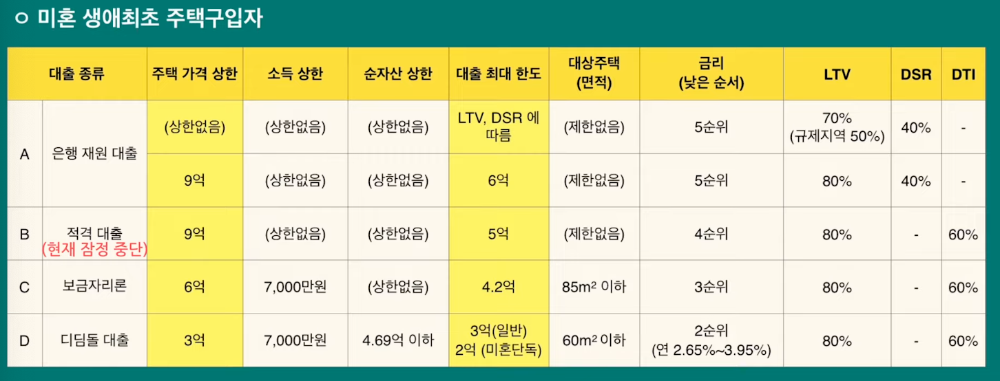
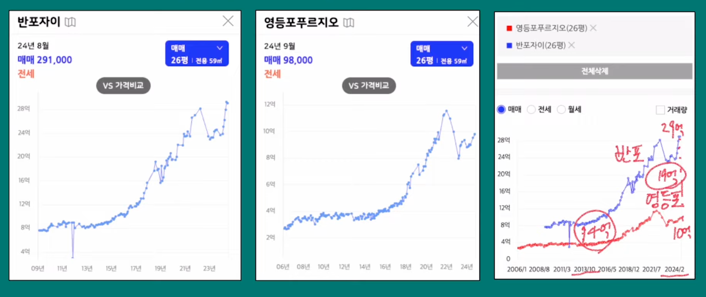
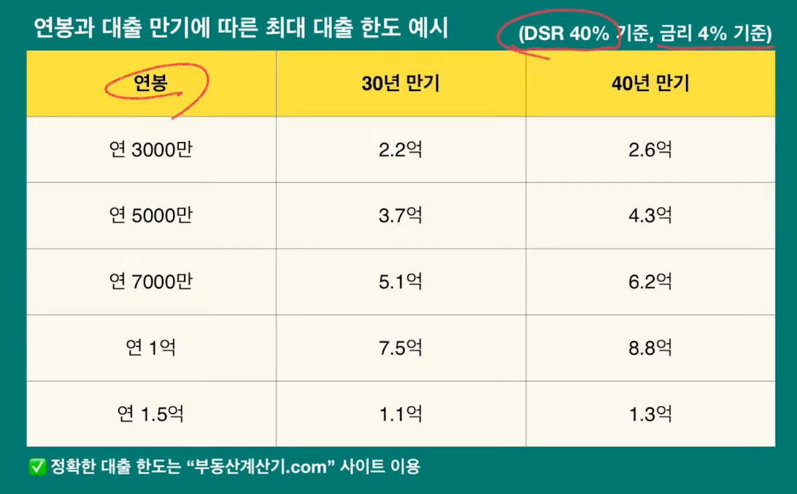
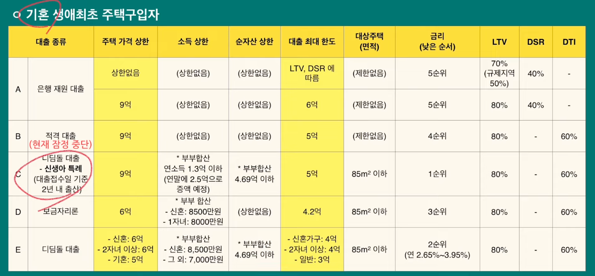

# 매수 가능한 주택 고르는 방법, 대출 방법론  

## 생애최초대출 & 상승장에서 부채 인플레로 녹이기  

생애최초대출   
- 1.은행 재원 대출
- 2.적격 대출
- 3.디딤돌 대출
- 4.보금자리론  
- *미혼/기혼 여부에 따라서 크게 다르다.  
-   

금리가 낮은 순서로 선택하면 안된다?    
- 4년만에 대출받은 2억을 다 갚아버렸다.  
- 전세주려고 했는데, 전세가가 이미 매매가를 넘었다.  
- 전세금으로 주담대를 갚고, 매매 차익을 전세금을 주었다.    
- 4년만에 - 4억 집이 8억이 되어서 큰 금융성공을 했다.  

1.더 많이 받을 것  
- 집을 매수할때는 인플레이션과 기대 수익률을 잘 계산해야 한다.  
- 인플레이션은 집의 가치를 올리는 한편, 대출금의 가치로 떨어뜨리게 된다.  
- 4억짜리 집 = 2억 대출, 2억 자본 => 
  - 6억 = 2억 대출은, 4억 자본이 된다. 
  - 1.원리금 상환을 할 수 있는 능력이 커지면서 ( 노동소득 인상 )
  - 2.집값상승으로 부채를 탕감할 수 있다. ( 자본 상승 )  

    
- 인플레이션 따라서 집값은 올라가는데, 양극화도 더 심해진다.  

2.더 좋은 매물을 살걸  
- 주변 시세에 대해서 상대적으로 저평가 된 매물을 찾는 눈이 필요하다.  
- 투자적으로 좋은 아파트와, 실거주 목적으로 좋은 아파트, 모두 가격이 다르다.  

3.갚지 말걸  
- LTV 80%, 좋은 금리 조건이면  
- 반전세나, 월세로 셋팅하는것도 고려해보기.  

    
- 연봉과 대출 만기에 따른 최대 대출 한도 예시 (DSR 40% / 금리 4% )  

  
- 디딤돌 대출, 신생아 특례 등 기혼자는 대출 종류가 다양하다.  

## 1억 모으기에 대한 방법론   

일의 효율화 생각하기  
- 1.납기 영역 : 1달에 끝내는 사람 -> 1주일에 끝내는 사람   
- 2.품질 영역 : 같은 시간안에 완성도 높은 일을 하는 것  
- *투잡으로 수익을 당장 늘리기 보다는 본업의 퀄리티에 신경쓰기.  

계속해서 돈 쓰기  
- 1.교육, 훈련, 공부, 실습 : 3~5년 시간당 실력  

3년에서 7년차에 가장 시장에서 수요가 많은 구간이다.  
- 이때 야근, 실력 향상을 위한 공부들을 많이해서 펌핑하기.  

연봉 정보 예)
- https://www.levels.fyi/companies/coupang/salaries/software-engineer/locations/korea-south?country=133    

## 아파트 매매 계약 전 반드시 체크해야할 아파트 체크리스트 10가지

영상 요약:
이 영상은 아파트 초보자가 좋은 아파트를 고를 때 꼭 확인해야 할 항목들과, 그 과정에서 빠지기 쉬운 함정들을 피하는 방법을 알려주는 콘텐츠예요.

✅ 영상의 핵심 요점:

1.	좋은 아파트 고르는 두 가지 방법
 - 인터넷 검색: 실거래가, 용적률, 세대수 등 객관적 데이터 활용
 - 현장 방문(임장): 주변 소음, 경사, 채광 등 체감 정보 확인
→ 이 두 가지를 병행해야 완벽한 판단이 가능해요.

2.	체크리스트가 중요한 이유
 - 조건을 모두 만족시키기 어렵기 때문에 가장 중요하게 여기는 1~2가지 항목을 정해 우선순위를 정하고, 나머지는 절충해야 해요.

3.	체크리스트 주요 항목 요약
 - 역세권 여부: 도보 15분, 도어투도어 1시간 이내
 - 용적률/건폐율: 용적률 250~300% 이하 추천 (높으면 불편 + 재건축 어려움)
 - 평형: 예산 적을 경우 20평대 추천 (좁지만 입지 좋은 선택 가능)
 - 세대수: 300세대 이상 권장, 500세대 이상 이상적 (1천세대 이상이면 단지 조경, 커뮤니티 우수)
 - 연식: 신축이 가장 좋지만, 예산 부족하면 2010년 이후 준신축도 좋은 선택

4.	주의사항 (함정)
 - 재건축 기대 X: 용적률이 높으면 재건축 가능성 희박
 - 비싼 신축에 집착 X: 좋은 입지와 실속 있는 선택을 우선 고려
 - 데이터만 맹신 X: 오감으로 직접 느껴봐야 할 것도 많아요