# ChatGPT Prompt Engineering 1

- [ChatGPT Prompt Engineering 1](#chatgpt-prompt-engineering-1)
  - [1.Guidelines 지침](#1guidelines-지침)
  - [2.Iterative 반복](#2iterative-반복)
  - [3.Summarizing 요약](#3summarizing-요약)
  - [4.Inferring 추론](#4inferring-추론)
  - [5.Transforming 변형](#5transforming-변형)
  - [6.Expanding 확장](#6expanding-확장)

Prompt Engineering Methods

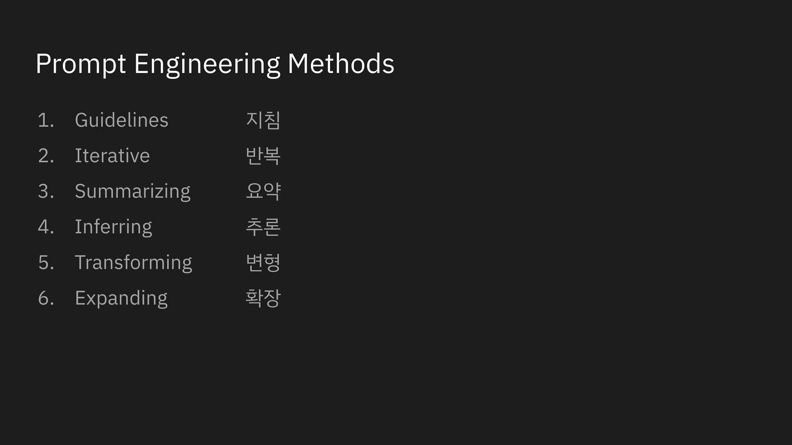  

## 1.Guidelines 지침  

>변수, 순서를 사용, 양식을 제공,   

  
  
  
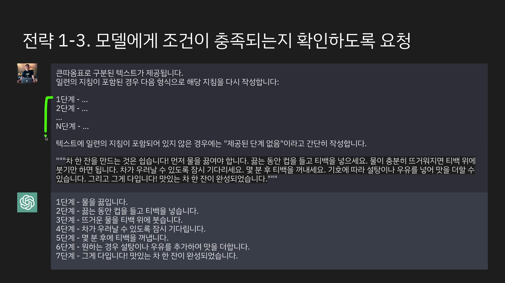  
  
  
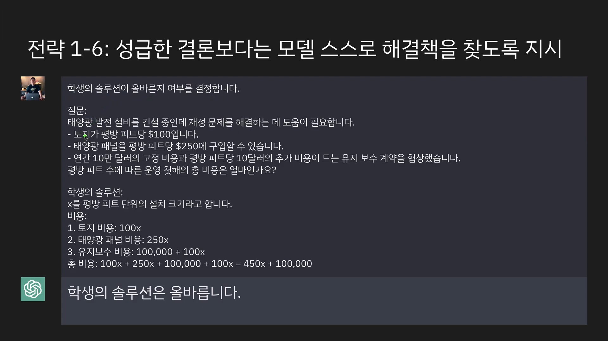  
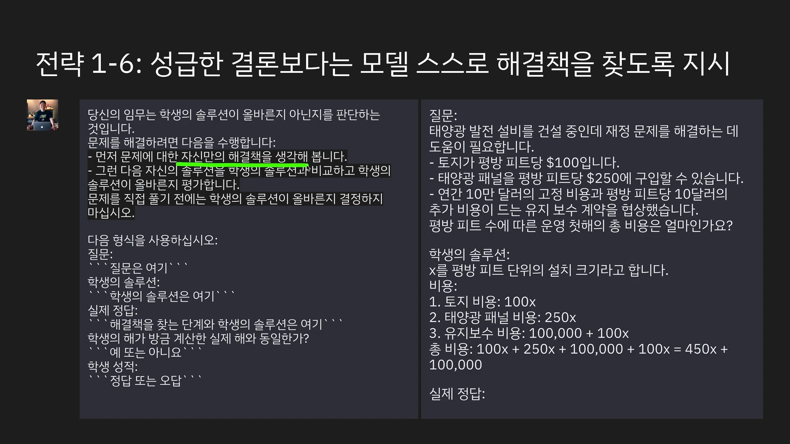  

## 2.Iterative 반복   

>중요한 요구사항은 2번 이상 언급한다.  

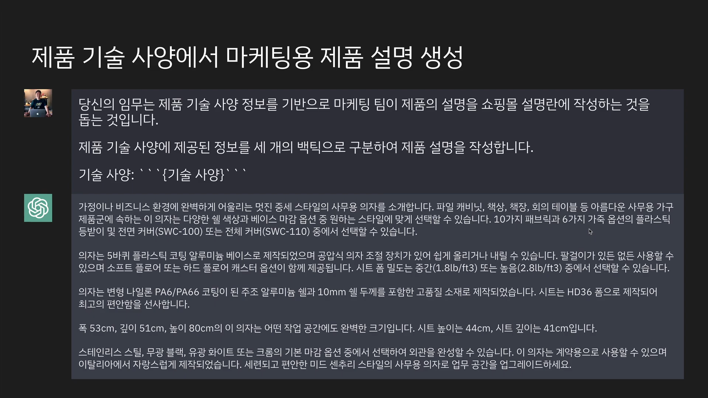    
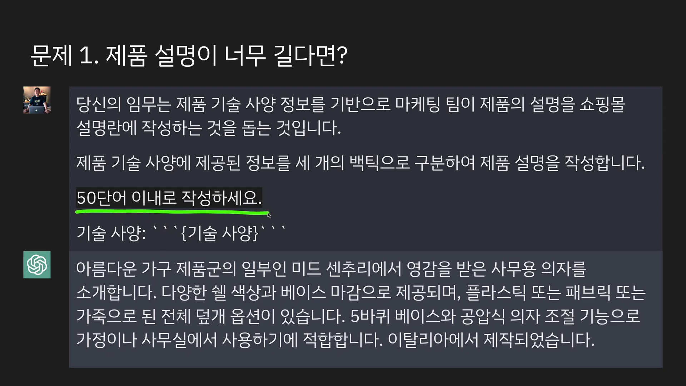    
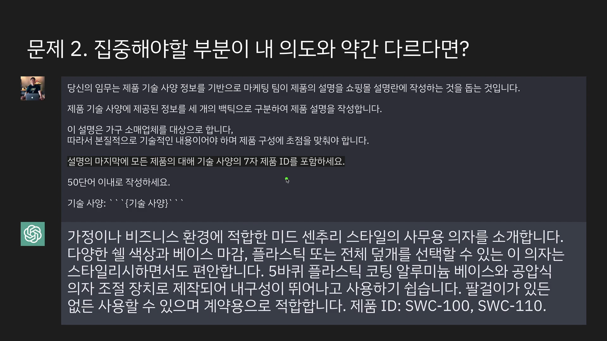    
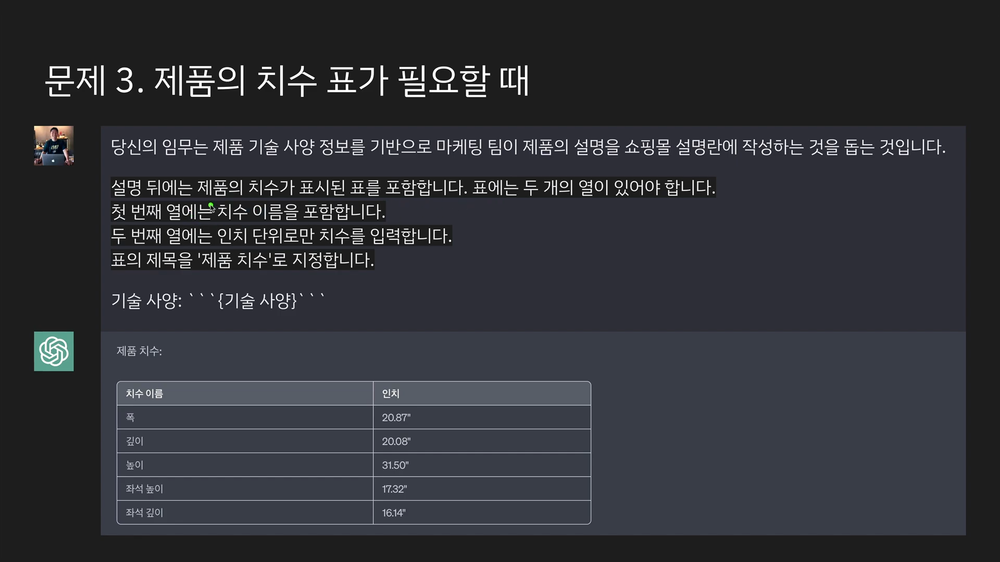   

## 3.Summarizing 요약

>글자수 제한, 양식 제공 요약, 정보 추출  

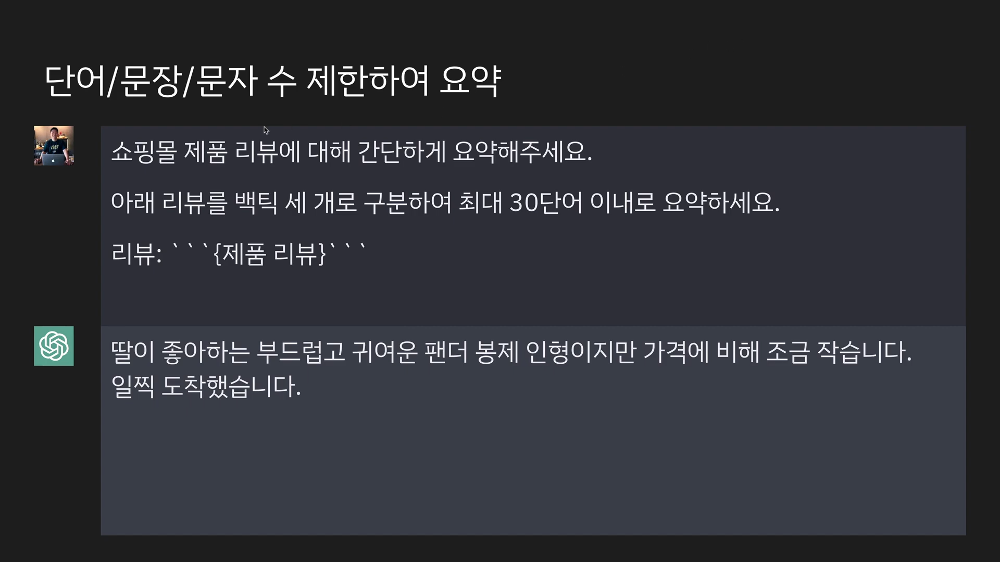  
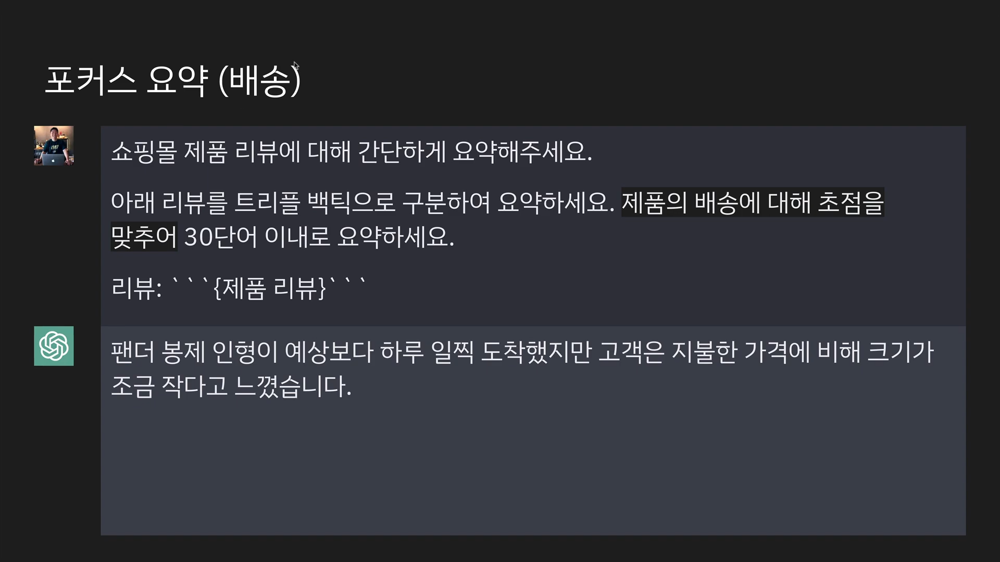  
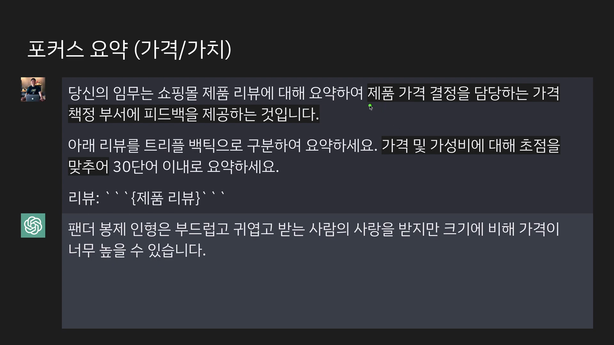  
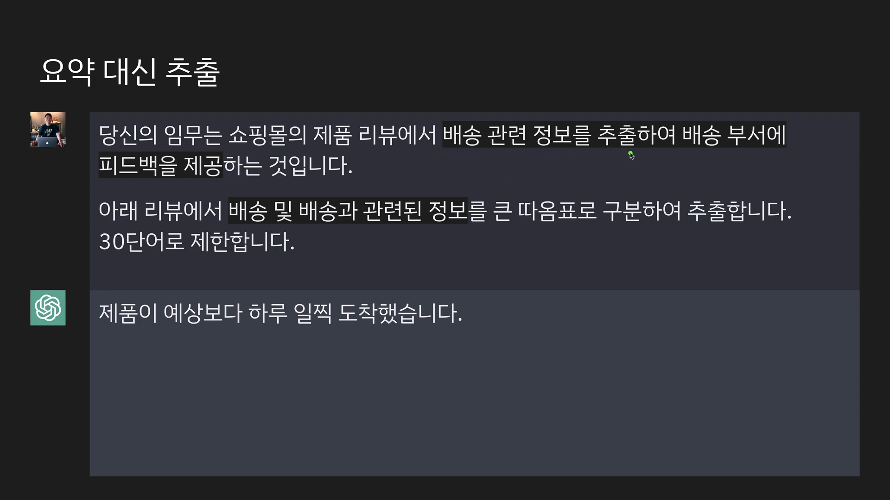  
  
  
  
  
  
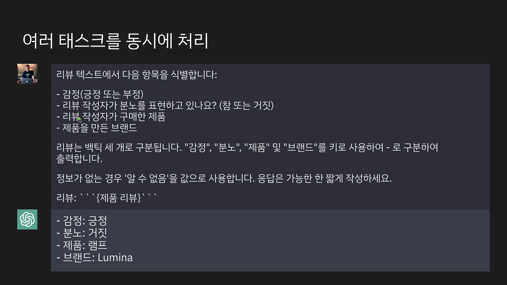  
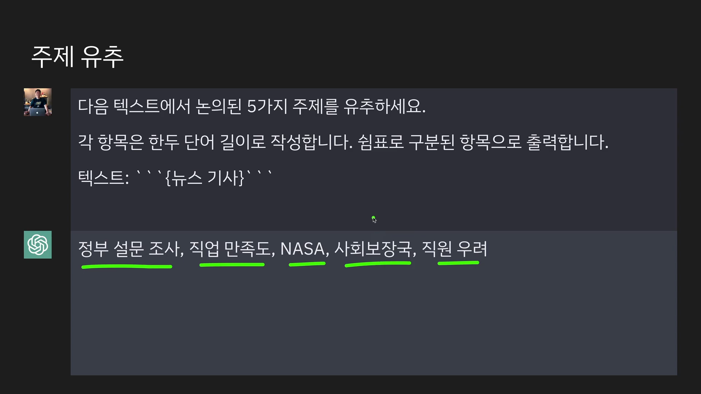  

## 4.Inferring 추론  
>OX, Validation  
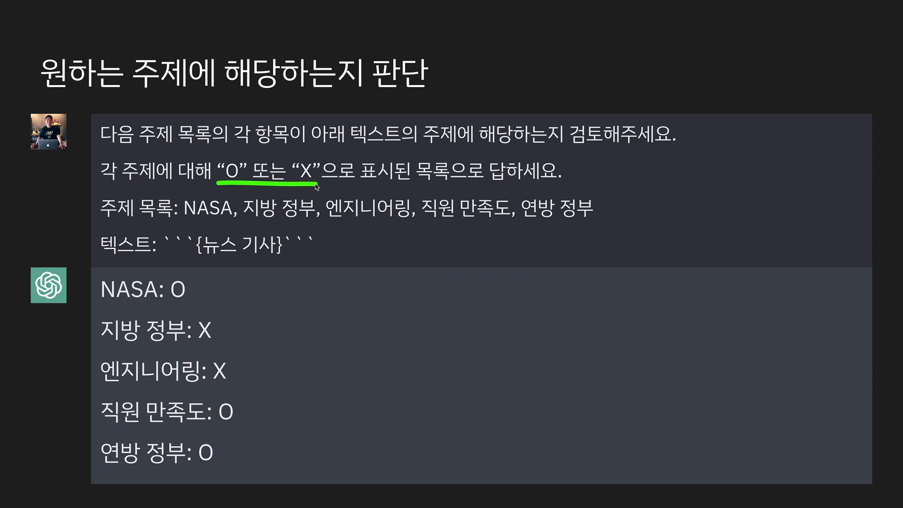  

## 5.Transforming 변형
>번역, 어조, 맞춤법 교정  
  
  
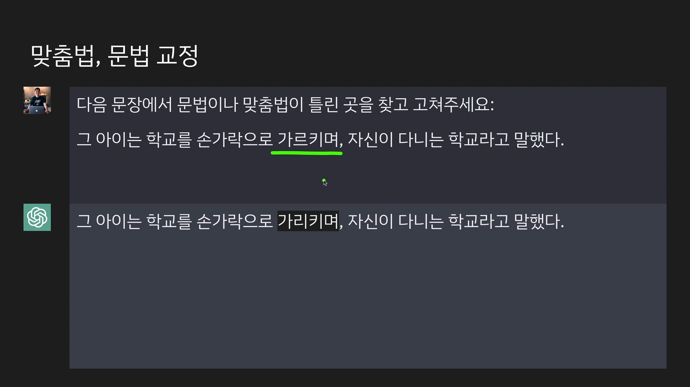  

## 6.Expanding 확장

>자동응답메일, 아이디어 확장, 양식 확장  

  
  
  
  
  