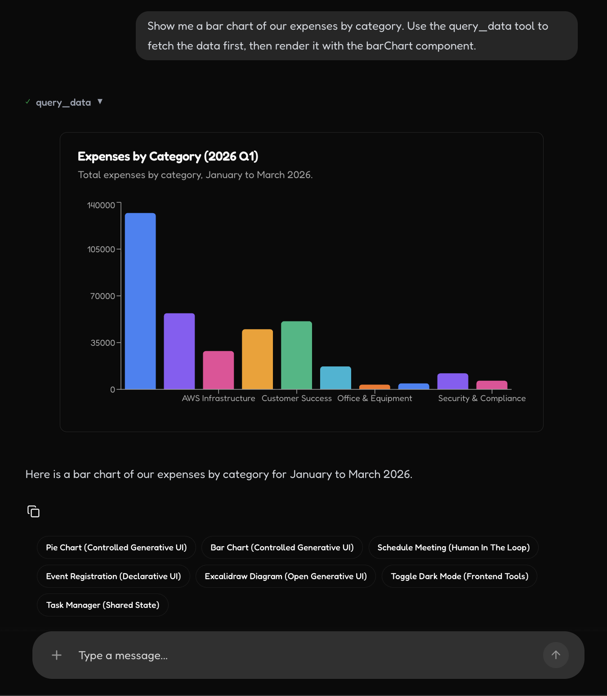
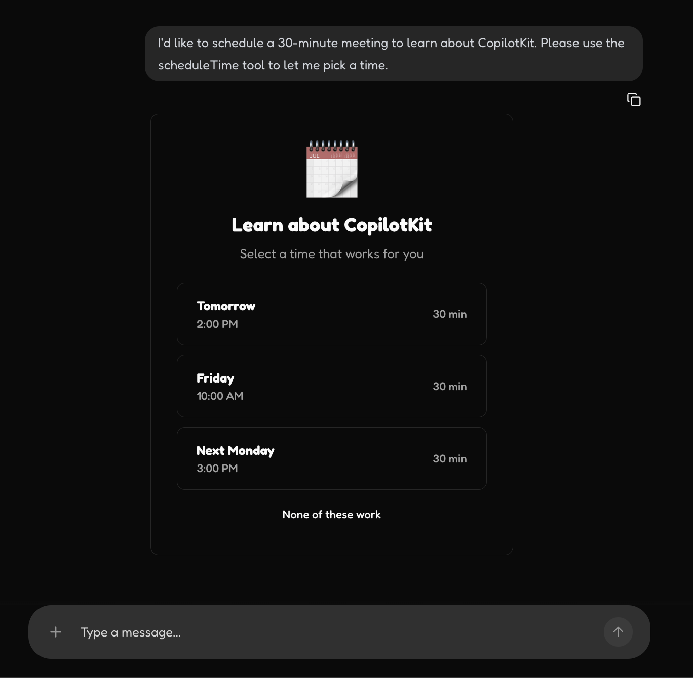
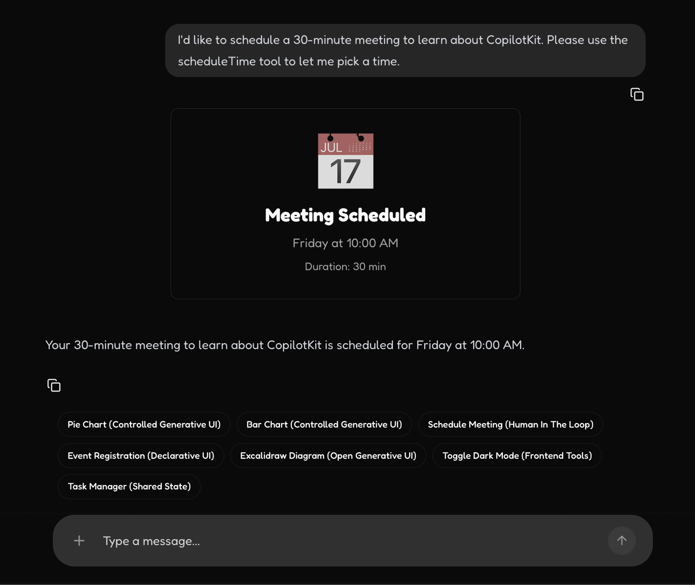
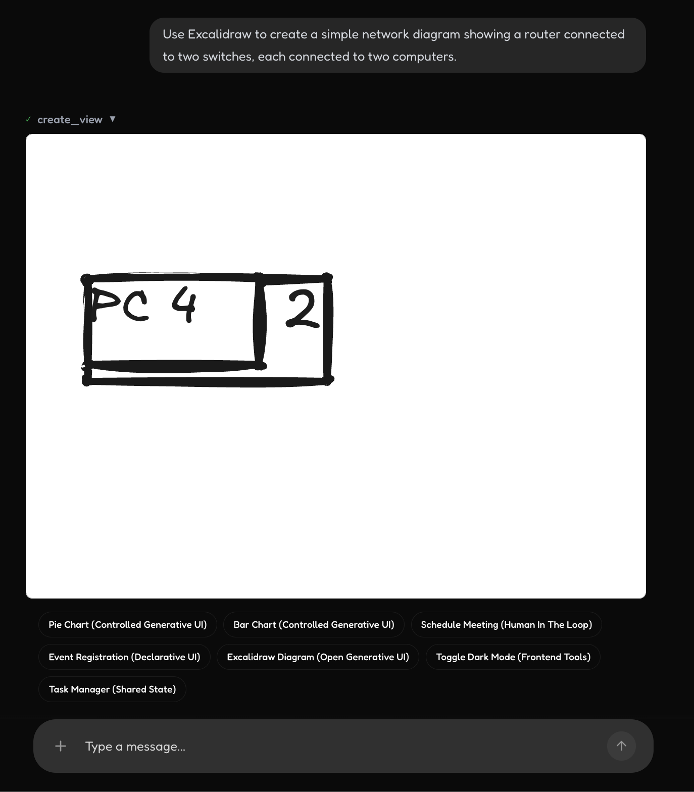
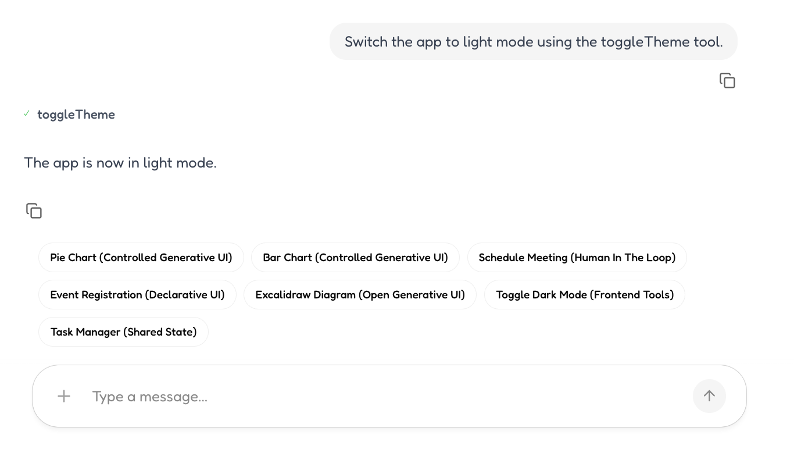
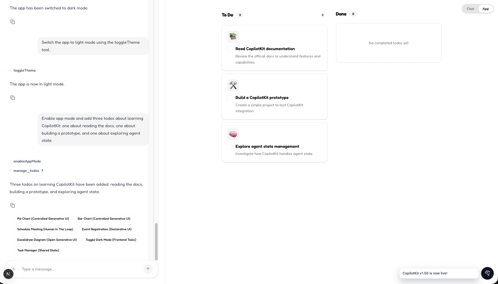

# copilotkit.ai - 1 Intro

## Goal  

A PoC is needed to determine which open-source tools to use for AI UI generation
- Trade Off
  - 1, Building from scratch offers a great growth opportunity
    - but it carries risks such as high resource consumption, project delays, and potential implementation failure.
  - Using a library requires onboarding time and may make customization difficult
    - But it shortened the time to market.  

Requirements  
- [ ] 기술적 이해 선행하기  
- [ ] 디자인 시스템에 맞는 UI Generation이 되어야 한다.  
- [ ] 랭그래프 LLM Backend 랑 연동이 되어야 한다.  
- [ ] Next.js, React 모두 PoC을 완성해야 한다.  
- [ ] 내부 동작에 대한 이해가 되며 커스터마이징이 필요.  

Demo Ananlysis 
- [ ] 데모 분석 : https://www.copilotkit.ai/use-cases/co-creation-copilot
- [ ] 데모 분석 : https://www.copilotkit.ai/use-cases/saas-copilot

Demo Page  
- [ ] (Idea) 광고 센터 진단 리포트 생성  

## CopilotKit Preview  

Key Features  
- Generative UI  
- Human in the Loop  
- Shared State  
- Support A2UI
  - AG-UI는 CopilotKit의 이벤트/프로토콜 레이어
  - A2UI는 그 위에서 쓰는 declarative generative UI 스펙 중 하나

  
UI Generation - Graph/Chart

  
UI Generation - Chart  

  
UI Generation - Form and Submit

  
  
UI Generation with Human In the Loop  

  
UI Control - Excalidraw

  
UI Control - In app - Toggle Theme

  
UI Control - In app - Todo List  

---

## 프로토콜 정리 및 UI 생성 프로토콜 

A2A: 에이전트/백엔드 쪽 통신 또는 실행 구조  
AG-UI: 에이전트와 프론트엔드 사이의 이벤트 전달 프로토콜  
A2UI: 그 이벤트 안에 실려 갈 수 있는 UI 명세 포맷  
- A2UI는 그 위에서 쓰는 declarative generative UI 스펙 중 하나 (A2UI is Google's declarative… spec)  
- *AG-UI는 lang graph -> React 까지 전달해주는 프로토콜, A2UI는 Declarative UI Generation 프로토콜  

AI UI Approach 비교  
1. Static
- Examples: AG-UI, CopilotChat, useAgent
- Strengths: Fidelity, reliability, brand control
- Weaknesses: Engineering intensive, linear growth

2. Open-Ended
- Examples: MCP-UI, ChatGPT Apps
- Strengths: Unlimited creativity
- Weaknesses: Hard to style / secure / port

3. Declarative
- Examples: Open-JSON-UI, A2UI
- Strengths: Balanced, scalable, multi-renderer
- Weaknesses: Limited full customization

## Tech Stack Overview 

Tech Stack  
- LangChain = 에이전트 내부 부품
- LangGraph = 에이전트 실행 엔진 + 서버 API
- LangSmith = 그 실행을 관찰하고 디버깅하는 외부 도구
- Copilot Kit = Agent의 생성 프로토콜에 따라서 UI에 렌더링 해주는 SDK (Streaming 처리 + 렌더러)  

🌿 LangGraph Agent 최소지식

크게 4가지로 구성된다.  
- State: The state is the data that the agent is using to make and communicate its decisions. 
  - You can see all of the state variables in the bottom left of the screen. 
  - State will only update between node transitions.  

- Nodes: Nodes are the building blocks of a LangGraph agent. 
  - They are the steps that the agent will take to complete a task. 
  - In this case, we have nodes for the agent, tools and human input and processing feedback.

- Edges: Edges are the arrows that connect nodes together. 
  - They define the logic for how the agent will move from one node to the next. 
  - They are defined in code and conditional logic is handled with a route function.

- Interrupts: Interrupts are a way to allow for a user to work along side the agent and review its decisions. 
  - In this case, we have an interrupt after the human node which blocks the agent from proceeding until the user provides feedback.

🌿 LangSmith의 대표 기능  

1. 트레이싱
  - LLM 호출, 프롬프트, 응답, 툴 호출, 에이전트 단계, 상태 변화를 실행 단위로 기록합니다.
  - "이 답이 왜 나왔는지"를 추적할 때 핵심입니다.

2. 디버깅
  - 한 번의 실행을 단계별로 펼쳐서 볼 수 있습니다.
  - 어느 노드에서 실패했는지, 어떤 입력이 들어갔는지, 어떤 툴 결과가 모델에 전달됐는지 확
    인합니다.

3. 평가
  - 데이터셋을 만들어 여러 프롬프트, 모델, 에이전트 버전을 비교할 수 있습니다.
  - 정답 기반 평가, LLM-as-a-judge 평가, 휴먼 리뷰 워크플로우에 모두 쓸 수 있습니다.

4. 모니터링
  - 운영 환경에서 지연 시간, 에러율, 토큰 사용량, 품질 저하 같은 신호를 봅니다.
  - 배포 후 이상 동작을 빨리 찾는 용도입니다.

5. 실험 관리
  - 프롬프트 변경, 모델 변경, 체인 구조 변경 전후를 실험처럼 관리합니다.
  - "어느 조합이 더 좋은가"를 팀 단위로 비교하기 좋습니다.

대표적인 사용 사례  
  - RAG 품질 개선
      - 검색된 문서가 적절했는지, 최종 답변이 근거를 잘 썼는지 분석
      - 검색기, 리랭커, 프롬프트를 바꿔가며 비교 평가
  - 에이전트 디버깅
      - 툴을 왜 잘못 골랐는지
      - 불필요한 반복 호출이 있었는지
      - 특정 노드에서 상태가 깨졌는지 확인
  - 프롬프트 A/B 테스트
      - 같은 입력셋으로 프롬프트 버전별 결과 비교
      - 응답 정확도, 형식 준수, 비용, 속도까지 같이 판단
  - 운영 관측
      - 실제 사용자 요청 중 실패한 케이스 수집
      - 특정 유형 질문에서만 성능이 떨어지는지 추적
  - 회귀 테스트
      - 예전엔 되던 요청이 새 변경 후 망가졌는지 확인
      - 배포 전에 데이터셋으로 자동 검증
  - 사람 검토 워크플로우
      - 사람이 결과를 보고 점수나 피드백을 남김
      - 이후 그 데이터를 평가셋으로 재사용

## LangGraph의 “Subgraph”  

LangGraph 서브그래프 데모: 여행 계획 도우미 ✈️  

LangGraph 서브그래프란 무엇인가요? 🤖
- 서브그래프는 기본적으로 "다른 그래프의 노드로 사용되는 그래프"로, 강력한 캡슐화 및 재사용성을 가능하게 합니다. 
- LangGraph에서 모듈식의 확장 가능한 AI 시스템을 구축하는 데 있어 서브그래프 는 핵심적인 요소입니다. 

핵심 개념
- 캡슐화 : 각 서브그래프는 고유한 전문성을 바탕으로 특정 영역을 처리합니다.
- 모듈성 : 서브그래프는 독립적으로 개발, 테스트 및 유지 관리할 수 있습니다.
- 재사용성 : 동일한 하위 그래프를 여러 상위 그래프에서 사용할 수 있습니다.
- 상태 통신 : 서브그래프는 상태를 공유하거나 변환을 통해 서로 다른 스키마를 사용할 수 있습니다.

데모 아키텍처 🗺️
- 이 여행 계획 도구는 관리자가 조정하는 하위 그래프 와 사람이 직접 참여하는 의사 결정 과정을 보여줍니다.

상위 그래프: 여행 감독관
- 역할 : 전문 여행사와 협력하여 여행 계획 수립 및 경로 설정을 조정합니다.
- 상태 관리 : 모든 하위 그래프에서 공유되는 여정 객체를 유지합니다.
- 지능 : 무엇이 필요한지, 그리고 각 요원을 언제 투입해야 하는지를 결정합니다.

하위 그래프 1: ✈️ 항공편 예약 대행사
- 전문 분야 : 항공편 검색 및 예약
- 과정 : 암스테르담에서 샌프란시스코까지의 항공편 옵션과 추천 항공편을 제시합니다.
- 상호 작용 : 인터럽트를 사용하여 사용자가 원하는 항공편을 선택할 수 있도록 합니다.
- 데이터 : 가격 및 비행시간을 포함한 고정 항공편 옵션(KLM, 유나이티드 항공)

하위 그래프 2: 🏨 호텔 에이전트
- 전문 분야 : 숙소 찾기 및 예약
- 과정 : 다양한 가격대의 샌프란시스코 호텔 옵션을 보여줍니다.
- 상호 작용 : 인터럽트를 사용하여 사용자가 선호하는 호텔을 선택할 수 있도록 합니다.
- 데이터 : 고정 호텔 옵션(호텔 제퍼, 리츠칼튼, 호텔 조이)

하위 그래프 3: 🎯 경험 에이전트
- 전문 분야 : 레스토랑 및 액티비티 큐레이팅
- 프로세스 : 선택한 항공편과 호텔을 기반으로 한 AI 기반 추천
특징 : 위치 정보를 기반으로 레스토랑 2곳과 액티비티 2곳을 조합하여 추천해 줍니다.
- 데이터 : 정적 경험 (피어 39, 골든 게이트 브리지, 스완 오이스터 데포, 타르틴 베이커리)

작동 방식 🔄
1. 사용자 요청 : "샌프란시스코 여행 계획을 세우는 데 도움을 주세요."
2. 관리자 분석 : 필요한 출장 구성 요소를 결정합니다.
3. 순차 라우팅 : 각 에이전트로 가는 경로를 논리적 순서로 지정합니다.
- 첫째: 항공편 예약 대행사 이용 (교통편을 미리 준비하세요)
- 그 후: 호텔 예약 대행사 (숙박 예약)
- 마지막으로: 경험 에이전트(활동 계획)
4. 인간의 의사 결정 : 각 에이전트는 옵션을 제시하고 인터럽트를 통해 사용자의 선택을 기다립니다.
5. 상태 구축 : 선택된 항목은 공유 여정 객체에 저장됩니다.
6. 완료 : 모든 요원은 최종 조정을 위해 감독관에게 보고합니다.

국가 간 소통 패턴 📊

Shared State Schema
- 모든 서브그래프 에이전트는 공통 상태 객체를 공유하고 해당 객체에 기여합니다.
- 어떤 에이전트든 공유 상태를 업데이트하면 이러한 변경 사항이 실시간 동기화를 통해 프런트엔드에 즉시 반영됩니다. 이는 다음과 같은 이점을 제공합니다.

- 항공편 예약 사이트에서 선택한 항공편 정보 는 이후 상담원에게도 표시됩니다.
- 호텔 선택은 체험 담당자의 추천에 영향을 미칩니다.
- 모든 업데이트는 프런트엔드 UI와 실시간으로 동기화됩니다.
- 상태 지속성은 워크플로 전반에 걸쳐 여행 일정을 유지합니다.

Human-in-the-Loop Pattern
- 두 개의 전문 에이전트는 인터럽트를 사용하여 실행을 일시 중지하고 사용자 기본 설정을 수집합니다.
  - 항공편 상담원 : 옵션 제시 → 중단 → 선택 대기 → 계속 진행
  - 호텔 상담원 : 호텔 목록 표시 → 일시 중단 → 선택 대기 → 계속

프런트엔드 기능 👁️
- 사용자 의사 결정을 위한 서브그래프의 인터럽트를 활용한 인간 참여형 시스템
- 현재 활성화된 에이전트를 보여주는 서브그래프 감지 및 스트리밍 기능
- 에이전트 간에 공유 여정이 구축됨에 따라 실시간 상태 업데이트가 제공됩니다.

## Refs
- AG UI : https://docs.ag-ui.com/introduction