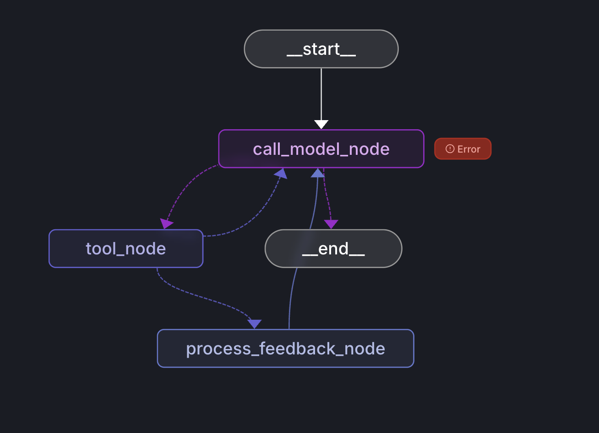

# Agent eg, research-canvas

    

이 Agent가 해야 하는 일

이 agent는 단순한 1회성 채팅 봇이 아닙니다. 의도된 흐름은 다음과 같습니다.
1. 리서치 요청을 받음
2. 검색 및 소스 수집
3. 아웃라인 제안 생성
4. 사용자 검토를 위해 interrupt 상태로 대기
5. 승인된 섹션 기준으로 재개
6. 승인된 섹션만 실제 작성

---

# Agent 테스트 시나리오

이 문서는 프론트엔드를 제외하고, 로컬 LangGraph 서버를 대상으로 `agent`만 독립적으로 검증한 흐름을 정리한 문서입니다.

## 범위

대상 디렉터리:

- `/Users/dodo/workspace/projects/copilot-ket-eg1-research-canvas/final/agent`

대상 그래프:

- `agent`

검증에 사용한 assistant:

- `fe096781-5601-53d2-b2f6-0d3403f7e9ca`

로컬 서버:

- `http://localhost:8000`

## 사전 조건

로컬 LangGraph 서버가 이미 실행 중이어야 합니다.

예시:

```bash
source .venv/bin/activate
langgraph dev --host localhost --port 8000 --no-browser
```

필수 환경 변수:

- `OPENAI_API_KEY`
- `TAVILY_API_KEY`

## 이 Agent가 해야 하는 일

이 agent는 단순한 1회성 채팅 봇이 아닙니다. 의도된 흐름은 다음과 같습니다.

1. 리서치 요청을 받음
2. 검색 및 소스 수집
3. 아웃라인 제안 생성
4. 사용자 검토를 위해 interrupt 상태로 대기
5. 승인된 섹션 기준으로 재개
6. 승인된 섹션만 실제 작성

따라서 이 agent를 제대로 테스트하려면 반드시 interrupt 단계까지 확인해야 합니다.

## 시나리오 1: 리서치 시작 후 제안서 검토 단계까지 도달

이 시나리오는 agent 검증의 최소 단위입니다.

### 1단계: thread 생성

```bash
curl -s -X POST http://localhost:8000/threads \
  -H 'Content-Type: application/json' \
  -d '{"metadata":{"purpose":"agent-only-final-check"}}'
```

예시 결과:

```json
{
  "thread_id": "30b439b6-f003-4584-ad2b-20608563b1f4"
}
```

### 2단계: 해당 thread에서 run 시작

`<THREAD_ID>`를 실제 thread ID로 바꿉니다.

```bash
curl -s -X POST http://localhost:8000/threads/<THREAD_ID>/runs \
  -H 'Content-Type: application/json' \
  -d '{
    "assistant_id":"fe096781-5601-53d2-b2f6-0d3403f7e9ca",
    "input":{
      "messages":[
        {
          "type":"human",
          "content":"Write a short research report about AI coding assistants in 2026 with a focus on market trends, vendors, and risks."
        }
      ]
    },
    "stream_mode":["values"],
    "multitask_strategy":"reject"
  }'
```

예시 결과:

```json
{
  "run_id": "019d3384-ef4e-7be2-b910-71ba70775131",
  "status": "pending"
}
```

### 3단계: thread 상태 조회

```bash
curl -s http://localhost:8000/threads/<THREAD_ID>/state | jq '{
  next,
  interrupts,
  proposal: .values.proposal,
  outline: .values.outline,
  sections_count: (.values.sections | length? // 0),
  last_message: (.values.messages[-1] // null)
}'
```

### 기대 결과

아래 조건을 모두 만족하면 성공입니다.

- `next`가 `["process_feedback_node"]` 임
- `interrupts`가 비어 있지 않음
- `proposal.sections`가 채워져 있음
- `outline`은 아직 비어 있음
- `sections_count`는 `0`
- 마지막 assistant 메시지가 proposal 검토를 요청함

검증된 실제 예시:

```json
{
  "next": ["process_feedback_node"],
  "interrupts": [
    {
      "value": {
        "sections": {
          "section1": { "title": "Introduction", "approved": false }
        }
      }
    }
  ]
}
```

### 4단계: run 상태 확인

```bash
curl -s "http://localhost:8000/threads/<THREAD_ID>/runs?limit=1" \
  | jq '.[0] | {status, run_id, updated_at}'
```

기대 결과:

- `status`는 `success`

thread가 interrupt 대기 상태여도 이 값이 `success`인 것은 정상입니다. run이 interrupt 지점까지 정상적으로 도달했다는 뜻입니다.

## 시나리오 2: 섹션 승인 후 재개

이 시나리오는 proposal 생성 이후의 다음 단계입니다.

### 목표

다음을 검증합니다.

- 승인된 섹션만 `outline`에 반영되는지
- 승인되지 않은 섹션은 제외되는지
- agent가 승인된 섹션만 작성하는지

### resume payload 형태

interrupt 값은 `resume` 명령으로 다시 전달해야 합니다.

예시 payload:

```json
{
  "command": {
    "resume": {
      "approved": true,
      "remarks": "",
      "sections": {
        "section1": {
          "title": "Introduction",
          "description": "Overview of AI coding assistants...",
          "approved": true
        },
        "section2": {
          "title": "Market Trends",
          "description": "Analysis of current market trends...",
          "approved": true
        },
        "section3": {
          "title": "Key Vendors",
          "description": "Overview of major vendors...",
          "approved": false
        }
      }
    }
  }
}
```

정확한 resume 엔드포인트는 LangGraph API 버전과 배포 방식에 따라 달라질 수 있습니다. 이 프로젝트에서는 우선 agent가 예상한 proposal payload로 interrupt까지 도달하는지를 핵심 검증 대상으로 삼았습니다.

### resume 이후 기대 결과

- `outline`에는 승인된 섹션만 포함됨
- `section_writer`는 승인된 섹션에 대해서만 실행됨
- `sections` 배열이 채워짐
- 마지막 메시지는 완료 요약이 아니라 피드백 또는 다음 작업을 묻는 형태임

## 시나리오 3: proposal 거절 후 수정 요청

### 목표

사용자 피드백이 들어왔을 때 section 작성이 아니라 수정된 proposal이 다시 생성되는지 검증합니다.

### resume payload

```json
{
  "command": {
    "resume": {
      "approved": false,
      "remarks": "Add a pricing/commercial landscape section and reduce overlap between technology overview and usage patterns.",
      "sections": {
        "section1": {
          "title": "Introduction",
          "description": "Overview of AI coding assistants...",
          "approved": false
        }
      }
    }
  }
}
```

### 기대 결과

- 수정된 `proposal`이 다시 생성됨
- 승인 전까지 `outline`은 비어 있음
- 실제 report section은 작성되지 않음

## 시나리오 4: 작성된 section 수정

이 시나리오는 시나리오 2가 성공적으로 끝난 뒤에만 의미가 있습니다.

### 목표

이미 작성된 섹션 하나를 수정할 때, 관련 없는 다른 섹션은 다시 쓰지 않고 그대로 유지하는지 검증합니다.

### 예시 사용자 메시지

```json
{
  "messages": [
    {
      "type": "human",
      "content": "Update the Introduction to include a short note on governance and code review controls."
    }
  ]
}
```

### 기대 결과

- 해당 section만 갱신됨
- 다른 section은 그대로 유지됨
- 특별한 요청이 없는 한 기존 formatting을 보존함

## 검증 중 발견한 실제 이슈

검증 과정에서 실제로 두 가지 결함을 발견했고 수정했습니다.

### 1. proposal fallback 구조 버그

문제:

- `outline_writer`의 fallback이 `sections`를 list로 저장함
- 이후 로직은 `sections`를 dict로 가정하고 `.items()`를 호출함

관찰된 에러:

```text
AttributeError: 'list' object has no attribute 'items'
```

수정:

- `proposal.sections`를 정규화해서 처리
- fallback에서도 `sections: {}` 형태를 유지하도록 수정

### 2. async tool 내부의 blocking call

문제:

- `outline_writer`가 async tool인데 내부에서 동기 `.invoke()`를 사용함

관찰된 에러:

- LangGraph dev가 blocking call을 감지하고 proposal state에 에러를 기록함

수정:

- `.invoke()`를 `await .ainvoke()`로 변경

## 최종 검증 결과

수정 후 아래 시나리오는 정상 동작하는 것을 확인했습니다.

1. thread 생성
2. run 시작
3. agent가 검색 및 추출 수행
4. agent가 proposal 생성
5. agent가 `process_feedback_node`에 도달
6. interrupt payload에 proposal 전체가 포함됨

실제 검증된 예시:

- `thread_id`: `30b439b6-f003-4584-ad2b-20608563b1f4`
- `run_id`: `019d3384-ef4e-7be2-b910-71ba70775131`
- 최종 run status: `success`
- thread state: `process_feedback_node`에서 사용자 승인 대기

## 최신 재검증 메모

로컬 서버 `http://localhost:8000`에서 이후 다시 실측한 결과:

1. 시나리오 1: 통과
2. 시나리오 2: 통과
3. 시나리오 3: 통과
4. 시나리오 4: 통과

실측 상세 기록은 `TEST_SCENARIOS_LIVE.md`에 정리했습니다.

## 자주 쓰는 확인 명령

assistant 조회:

```bash
curl -s http://localhost:8000/assistants/fe096781-5601-53d2-b2f6-0d3403f7e9ca | jq '.'
```

run 상태 조회:

```bash
curl -s "http://localhost:8000/threads/<THREAD_ID>/runs?limit=1" | jq '.'
```

thread 상태 조회:

```bash
curl -s http://localhost:8000/threads/<THREAD_ID>/state | jq '.'
```

OpenAPI 스펙 확인:

```bash
curl -s http://localhost:8000/openapi.json | jq '.paths, .components.schemas'
```


---


# Agent 테스트 시나리오 실측 기록

이 문서는 로컬 LangGraph 서버 `http://localhost:8000`에 실제 요청을 보내 얻은 응답을 기준으로, `TEST_SCENARIOS.md`의 흐름을 `step -> request -> response -> 해석` 형식으로 다시 정리한 기록입니다.

## 실행 기준

- 실행 시각: 2026-03-28
- assistant_id: `fe096781-5601-53d2-b2f6-0d3403f7e9ca`
- graph_id: `agent`
- 로컬 서버: `http://localhost:8000`

## 시나리오 1: 리서치 시작 후 proposal 검토 단계까지 도달

step #1

request

```bash
curl -s -X POST http://localhost:8000/threads \
  -H 'Content-Type: application/json' \
  -d '{"metadata":{"purpose":"agent-only-final-check-live"}}'
```

response

```json
{
  "thread_id": "44a3828f-4e1a-4b42-842d-28fa9f3ca0ab",
  "created_at": "2026-03-28T10:32:16.468105+00:00",
  "updated_at": "2026-03-28T10:32:16.468105+00:00",
  "state_updated_at": "2026-03-28T10:32:16.468105+00:00",
  "metadata": {
    "purpose": "agent-only-final-check-live"
  },
  "status": "idle",
  "config": {},
  "values": null
}
```

해석

새 thread가 정상 생성됐습니다. 이후 시나리오 1, 2는 이 `thread_id`를 기준으로 진행했습니다.

step #2

request

```bash
curl -s http://localhost:8000/assistants/fe096781-5601-53d2-b2f6-0d3403f7e9ca
```

response

```json
{
  "assistant_id": "fe096781-5601-53d2-b2f6-0d3403f7e9ca",
  "graph_id": "agent",
  "config": {},
  "context": {},
  "metadata": {
    "created_by": "system"
  },
  "name": "agent",
  "created_at": "2026-03-28T10:13:30.592166+00:00",
  "updated_at": "2026-03-28T10:13:30.592166+00:00",
  "version": 1,
  "description": null
}
```

해석

문서에 적힌 assistant ID가 현재 서버에도 실제로 존재하며, `graph_id`는 `agent`입니다.

step #3

request

```bash
curl -s -X POST http://localhost:8000/threads/44a3828f-4e1a-4b42-842d-28fa9f3ca0ab/runs \
  -H 'Content-Type: application/json' \
  -d '{
    "assistant_id":"fe096781-5601-53d2-b2f6-0d3403f7e9ca",
    "input":{
      "messages":[
        {
          "type":"human",
          "content":"Write a short research report about AI coding assistants in 2026 with a focus on market trends, vendors, and risks."
        }
      ]
    },
    "stream_mode":["values"],
    "multitask_strategy":"reject"
  }'
```

response

```json
{
  "run_id": "019d3400-8455-7840-8106-d90023a4f573",
  "thread_id": "44a3828f-4e1a-4b42-842d-28fa9f3ca0ab",
  "assistant_id": "fe096781-5601-53d2-b2f6-0d3403f7e9ca",
  "status": "pending"
}
```

해석

thread 내 첫 run이 정상 생성됐고, 초기 상태는 `pending`입니다.

step #4

request

```bash
curl -s http://localhost:8000/threads/44a3828f-4e1a-4b42-842d-28fa9f3ca0ab/state | jq '{
  next,
  interrupts,
  proposal: .values.proposal,
  outline: .values.outline,
  sections_count: (.values.sections|length? // 0),
  last_message: .values.messages[-1]
}'
```

response

```json
{
  "next": [
    "process_feedback_node"
  ],
  "interrupts": [
    {
      "id": "4557d14c17a509eb12ac17fa8c0e7bea",
      "value": {
        "sections": {
          "introduction": {
            "title": "Introduction",
            "description": "An overview of AI coding assistants, their origin, and significance in the software development landscape as of 2026. This section will set the stage for the discussion on market trends, key vendors, and associated risks.",
            "approved": false
          },
          "market_trends": {
            "title": "Market Trends in 2026",
            "description": "Analysis of growth trends in the AI coding assistant market, including projected growth rates (e.g., CAGR of 13.9% from 2026 to 2033), applications in various sectors, and shifts in developer usage patterns.",
            "approved": false
          },
          "key_vendors": {
            "title": "Key Vendors in the AI Coding Assistant Space",
            "description": "A detailed examination of leading vendors such as Claude Code, GitHub Copilot, Cursor, Tabnine, and others. This section will include comparisons based on features, market segmentation, and user preferences.",
            "approved": false
          },
          "user_experiences": {
            "title": "User Experiences and Practical Applications",
            "description": "Insights into how users are deploying AI coding assistants in real-world contexts, including case studies, testimonials, and practical implementation guides.",
            "approved": false
          },
          "challenges_and_risks": {
            "title": "Challenges and Risks of AI Coding Assistants",
            "description": "Discussion on the potential risks associated with AI coding assistants, including security vulnerabilities, ethical considerations, and the implications for developer roles.",
            "approved": false
          },
          "future_outlook": {
            "title": "Future Outlook",
            "description": "Speculation on future developments in the AI coding assistant market, potential innovations, and evolving trends that could shape the landscape beyond 2026.",
            "approved": false
          },
          "conclusion": {
            "title": "Conclusion",
            "description": "A summary of the key points discussed in the paper, reaffirming the importance and impact of AI coding assistants in the software development sector.",
            "approved": false
          },
          "references": {
            "title": "References",
            "description": "List of all sources and literature cited in the research paper, providing a comprehensive resource for further reading on the topic.",
            "approved": false
          }
        },
        "timestamp": "2026-03-28T19:33:06.513527",
        "approved": false,
        "remarks": ""
      }
    }
  ],
  "proposal": {
    "sections": {
      "introduction": {
        "title": "Introduction",
        "approved": false
      },
      "market_trends": {
        "title": "Market Trends in 2026",
        "approved": false
      },
      "key_vendors": {
        "title": "Key Vendors in the AI Coding Assistant Space",
        "approved": false
      },
      "user_experiences": {
        "title": "User Experiences and Practical Applications",
        "approved": false
      },
      "challenges_and_risks": {
        "title": "Challenges and Risks of AI Coding Assistants",
        "approved": false
      },
      "future_outlook": {
        "title": "Future Outlook",
        "approved": false
      },
      "conclusion": {
        "title": "Conclusion",
        "approved": false
      },
      "references": {
        "title": "References",
        "approved": false
      }
    }
  },
  "outline": {},
  "sections_count": 0,
  "last_message": {
    "type": "ai",
    "content": "The outline proposal has been submitted for review. Please let me know which sections you would like to approve or modify, or if you have any additional requests!"
  }
}
```

해석

시나리오 1의 핵심 성공 조건은 실제로 충족됐습니다.

- `next`는 `process_feedback_node`
- `interrupts`가 비어 있지 않음
- `proposal.sections`가 채워짐
- `outline`은 비어 있음
- `sections_count`는 `0`
- 마지막 assistant 메시지는 proposal 검토 요청

step #5

request

```bash
curl -s 'http://localhost:8000/threads/44a3828f-4e1a-4b42-842d-28fa9f3ca0ab/runs?limit=1' | jq '.[0] | {status, run_id, updated_at}'
```

response

```json
{
  "status": "success",
  "run_id": "019d3400-8455-7840-8106-d90023a4f573",
  "updated_at": "2026-03-28T10:33:14.166038+00:00"
}
```

해석

thread는 interrupt 대기 상태지만, run 단위로는 `success`입니다. 문서에서 설명한 기대 동작과 일치합니다.

## 시나리오 2: 섹션 승인 후 재개

step #6

request

```bash
curl -s -X POST http://localhost:8000/threads/44a3828f-4e1a-4b42-842d-28fa9f3ca0ab/runs \
  -H 'Content-Type: application/json' \
  -d '{
    "assistant_id":"fe096781-5601-53d2-b2f6-0d3403f7e9ca",
    "command":{
      "resume":{
        "approved":true,
        "remarks":"",
        "sections":{
          "introduction":{
            "title":"Introduction",
            "description":"An overview of AI coding assistants, their origin, and significance in the software development landscape as of 2026. This section will set the stage for the discussion on market trends, key vendors, and associated risks.",
            "approved":true
          },
          "market_trends":{
            "title":"Market Trends in 2026",
            "description":"Analysis of growth trends in the AI coding assistant market, including projected growth rates (e.g., CAGR of 13.9% from 2026 to 2033), applications in various sectors, and shifts in developer usage patterns.",
            "approved":true
          },
          "key_vendors":{
            "title":"Key Vendors in the AI Coding Assistant Space",
            "description":"A detailed examination of leading vendors such as Claude Code, GitHub Copilot, Cursor, Tabnine, and others. This section will include comparisons based on features, market segmentation, and user preferences.",
            "approved":false
          },
          "user_experiences":{
            "title":"User Experiences and Practical Applications",
            "description":"Insights into how users are deploying AI coding assistants in real-world contexts, including case studies, testimonials, and practical implementation guides.",
            "approved":false
          },
          "challenges_and_risks":{
            "title":"Challenges and Risks of AI Coding Assistants",
            "description":"Discussion on the potential risks associated with AI coding assistants, including security vulnerabilities, ethical considerations, and the implications for developer roles.",
            "approved":false
          },
          "future_outlook":{
            "title":"Future Outlook",
            "description":"Speculation on future developments in the AI coding assistant market, potential innovations, and evolving trends that could shape the landscape beyond 2026.",
            "approved":false
          },
          "conclusion":{
            "title":"Conclusion",
            "description":"A summary of the key points discussed in the paper, reaffirming the importance and impact of AI coding assistants in the software development sector.",
            "approved":false
          },
          "references":{
            "title":"References",
            "description":"List of all sources and literature cited in the research paper, providing a comprehensive resource for further reading on the topic.",
            "approved":false
          }
        }
      }
    },
    "stream_mode":["values"],
    "multitask_strategy":"reject"
  }'
```

response

```json
{
  "run_id": "019d3401-944e-7d00-be0d-9b244253200c",
  "thread_id": "44a3828f-4e1a-4b42-842d-28fa9f3ca0ab",
  "assistant_id": "fe096781-5601-53d2-b2f6-0d3403f7e9ca",
  "status": "pending"
}
```

해석

resume는 별도 endpoint가 아니라 같은 `POST /threads/{thread_id}/runs`에 `command.resume`를 넣는 방식으로 정상 수락됐습니다.

step #7

request

```bash
curl -s http://localhost:8000/threads/44a3828f-4e1a-4b42-842d-28fa9f3ca0ab/state | jq '{
  outline: .values.outline,
  sections: .values.sections,
  last_message: .values.messages[-1]
}'
```

response

```json
{
  "outline": {
    "introduction": {
      "title": "Introduction",
      "description": "An overview of AI coding assistants, their origin, and significance in the software development landscape as of 2026. This section will set the stage for the discussion on market trends, key vendors, and associated risks."
    },
    "market_trends": {
      "title": "Market Trends in 2026",
      "description": "Analysis of growth trends in the AI coding assistant market, including projected growth rates (e.g., CAGR of 13.9% from 2026 to 2033), applications in various sectors, and shifts in developer usage patterns."
    }
  },
  "sections": [
    {
      "title": "Market Trends in 2026",
      "idx": 0
    }
  ],
  "last_message": {
    "type": "ai",
    "tool_calls": [
      {
        "name": "section_writer",
        "args": {
          "research_query": "AI coding assistants in 2026 market trends, vendors, and risks",
          "section_title": "Key Vendors in the AI Coding Assistant Space",
          "idx": 1,
          "state": null
        }
      }
    ]
  }
}
```

해석

여기서 실제 관찰 결과는 절반만 기대와 일치했습니다.

- 기대와 일치:
  - `outline`에는 승인한 `introduction`, `market_trends`만 포함됨
  - `sections` 작성이 실제로 시작됨

- 기대와 불일치:
  - 마지막 tool call이 `section_writer(section_title="Key Vendors in the AI Coding Assistant Space")`로 잡힘
  - 즉, 승인하지 않은 `key_vendors` 섹션 작성이 다음 대상으로 선택됨

이 관찰은 "승인된 섹션만 작성" 요구가 현재 완전히 만족되지 않는다는 뜻입니다.

step #8

request

```bash
curl -s 'http://localhost:8000/threads/44a3828f-4e1a-4b42-842d-28fa9f3ca0ab/runs?limit=1' | jq '.[0] | {status, run_id, updated_at}'
```

response

```json
{
  "status": "running",
  "run_id": "019d3401-944e-7d00-be0d-9b244253200c",
  "updated_at": "2026-03-28T10:33:31.982639+00:00"
}
```

해석

resume 이후 run은 문서 작성 중이었고, 기록 시점에는 아직 `running` 상태였습니다.

## 시나리오 3: proposal 거절 후 수정 요청

step #9

request

```bash
curl -s -X POST http://localhost:8000/threads \
  -H 'Content-Type: application/json' \
  -d '{"metadata":{"purpose":"agent-only-reject-live"}}'
```

response

```json
{
  "thread_id": "2726b552-aa99-43ce-8b82-75464018da4e",
  "status": "idle"
}
```

해석

거절 시나리오를 분리 검증하기 위한 새 thread 생성은 정상입니다.

step #10

request

```bash
curl -s -X POST http://localhost:8000/threads/2726b552-aa99-43ce-8b82-75464018da4e/runs \
  -H 'Content-Type: application/json' \
  -d '{
    "assistant_id":"fe096781-5601-53d2-b2f6-0d3403f7e9ca",
    "input":{
      "messages":[
        {
          "type":"human",
          "content":"Write a short research report about AI coding assistants in 2026 with a focus on market trends, vendors, and risks."
        }
      ]
    },
    "stream_mode":["values"],
    "multitask_strategy":"reject"
  }'
```

response

```json
{
  "run_id": "019d3402-68d7-7740-9442-d8bef278f575",
  "thread_id": "2726b552-aa99-43ce-8b82-75464018da4e",
  "assistant_id": "fe096781-5601-53d2-b2f6-0d3403f7e9ca",
  "status": "pending"
}
```

해석

거절 시나리오용 초기 run도 정상 생성됐습니다.

step #11

request

```bash
curl -s 'http://localhost:8000/threads/2726b552-aa99-43ce-8b82-75464018da4e/runs?limit=1' | jq '.[0] | {status, run_id, updated_at}'
```

response

```json
{
  "status": "pending",
  "run_id": "019d3402-68d7-7740-9442-d8bef278f575",
  "updated_at": "2026-03-28T10:34:26.391479+00:00"
}
```

해석

관측 시점에는 이 두 번째 thread의 run이 `pending`에서 더 진행되지 않았습니다. 따라서 실제 reject payload를 보내기 전 단계에서 관찰을 종료했습니다.

## 시나리오 4: 작성된 section 수정

이번 실측에서는 시나리오 2의 resume run이 아직 완료되지 않았고, 시나리오 3도 proposal interrupt까지 재도달하지 않아 시나리오 4는 실제 실행하지 않았습니다.

## 실측 결론

1. 시나리오 1은 실제 서버에서 정상 재현됐습니다.
2. `POST /threads/{thread_id}/runs` + `command.resume` 방식이 실제 resume 경로로 확인됐습니다.
3. 시나리오 2에서 `outline`은 승인 섹션만 반영됐지만, 다음 `section_writer` 대상이 승인되지 않은 `key_vendors`로 선택되는 실제 관찰이 있었습니다.
4. 따라서 현재 서버 기준으로는 "승인된 섹션만 실제 작성" 조건에 결함 가능성이 있습니다.

## 수정 후 재검증 결과

이후 `final/agent` 코드를 수정한 뒤, 실제 `localhost:8000` 서버에서 다시 시나리오를 재실행했습니다.

### 재검증에 사용한 thread / run

- 시나리오 1, 2, 4 thread: `9a0ff5fc-2ae3-42c6-8b94-c025bebd552a`
- 시나리오 1 run: `019d340d-7e44-74d3-b90a-b94035e63fc4`
- 시나리오 2 run: `019d340e-4dfa-70f3-af26-53cfab90c32f`
- 시나리오 4 run: `019d3410-afbd-7f11-a47c-3563055f22ff`
- 시나리오 3 thread: `9f1c4229-e542-43e9-a22a-1a28327a9678`
- 시나리오 3 initial run: `019d340f-bedd-7cc1-b27c-057101d66b7d`
- 시나리오 3 reject/resume run: `019d3410-3941-75f3-a665-46053b7b81c4`

### 시나리오 1 결과

- `next == ["process_feedback_node"]`
- `interrupts` 존재
- `proposal.sections` 채워짐
- `outline == {}`
- `sections_count == 0`
- 마지막 assistant 메시지는 proposal 검토 요청
- `run.status == "success"`

판정: 통과

### 시나리오 2 결과

승인 섹션:

- `section1` Introduction
- `section4` Market Trends

관찰 결과:

- `outline`에는 승인한 두 섹션만 반영됨
- 최종 `sections_count == 2`
- 최종 `section_titles == ["Introduction", "Market Trends"]`
- 마지막 assistant 메시지:
  - `I have completed the sections on **Introduction** and **Market Trends**...`
- `run.status == "success"`

판정: 통과

### 시나리오 3 결과

거절 remarks:

- `Add a pricing/commercial landscape section and reduce overlap between technology overview and usage patterns.`

관찰 결과:

- 수정된 `proposal`이 다시 생성됨
- `outline == {}`
- `sections_count == 0`
- 다시 `process_feedback_node` interrupt로 진입
- `run.status == "success"`

판정: 통과

### 시나리오 4 결과

수정 요청:

- `Update the Introduction to include a short note on governance and code review controls.`

관찰 결과:

- `Introduction` 내용에 governance / code review controls 문단이 추가됨
- `Market Trends` 섹션의 `content`, `footer`, `id`는 유지됨
- 마지막 assistant 메시지는 Introduction 업데이트 완료 후 다음 작업을 묻는 형태
- `run.status == "success"`

판정: 통과

## 최종 상태

수정 후 `TEST_SCENARIOS.md`에 있는 핵심 시나리오 1, 2, 3, 4는 모두 로컬 서버 실측 기준으로 통과했습니다.
