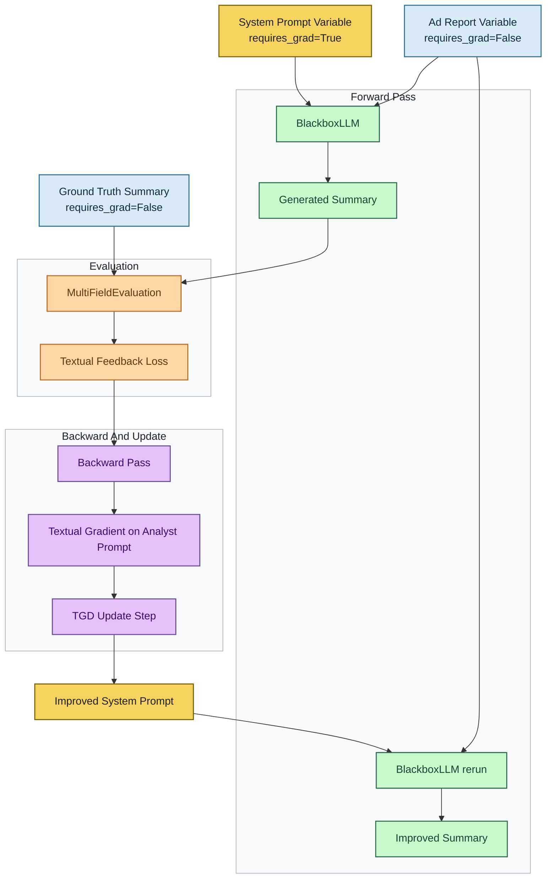
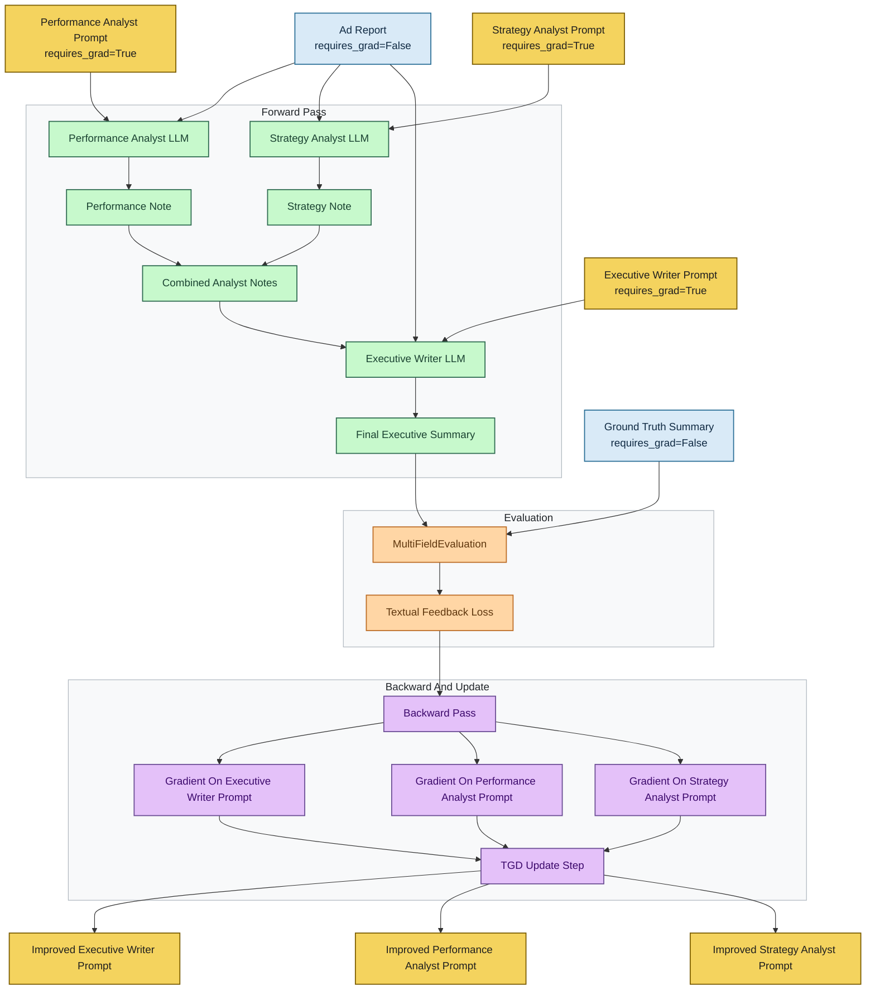

# TextGrad Quickstart Notes

Github: https://github.com/zou-group/textgrad  
Examples Code PoC : https://github.com/dosimpact/text-grad-quickstart

이 저장소는 `textgrad-examples/main-1.py`와 `textgrad-examples/main-2.py` 기준으로 TextGrad의 광고 성과 프롬프트 최적화 흐름을 이해하기 위한 메모다.

핵심 아이디어는 다음과 같다.

- PyTorch는 숫자 gradient로 파라미터를 업데이트한다.
- TextGrad는 자연어 피드백을 textual gradient처럼 사용해 텍스트를 업데이트한다.
- 또한 `ground truth` 요약을 명시적으로 두고, 현재 광고 성과 요약이 정답 요약과 얼마나 차이 나는지 비교 평가한 뒤 프롬프트를 개선한다.

## PyTorch와 대응 관계

- `torch.Tensor` <-> `tg.Variable`
- `forward` <-> LLM이 현재 프롬프트로 광고 성과 요약 생성
- `loss` <-> LLM이 prediction 요약과 ground truth 요약을 비교 평가
- `backward` <-> 어떤 프롬프트가 더 좋은 요약을 만들지 textual gradient 생성
- `step` <-> optimizer가 프롬프트 문구를 다시 작성

## Sample Flow

아래 흐름은 현재 [main-1.py](https://github.com/dosimpact/text-grad-quickstart/blob/main/textgrad-examples/main-1.py) 기준이다.  
단일 analyst 프롬프트를 광고 성과 요약용으로 개선한다.

## Multi-Agent Flow

아래 흐름은 [main-2.py](https://github.com/dosimpact/text-grad-quickstart/blob/main/textgrad-examples/main-2.py) 기준이다.  
`requires_grad=True`인 프롬프트가 3개이고, `performance analyst`와 `strategy analyst`의 출력이 합쳐진 뒤 `executive writer`가 최종 광고 성과 요약을 만든다.

## Step By Step

1. `system_prompt`를 `tg.Variable(..., requires_grad=True)`로 만든다. 이 변수가 실제 최적화 대상이다.
2. `ad_report`와 `ground_truth`는 고정값이므로 `requires_grad=False`로 둔다.
3. `BlackboxLLM("gpt-4o-mini", system_prompt=system_prompt)`를 만든다.
4. 현재 `system_prompt`와 `ad_report`로 첫 번째 광고 성과 요약 `answer`를 생성한다.
5. `MultiFieldEvaluation`으로 `prediction`과 `ground truth` 요약을 함께 비교한다.
6. evaluator는 “중요한 인사이트를 놓쳤는지, 채널 우열이 맞는지, 추천 액션이 충분히 구체적인지”를 자연어 피드백으로 만든다.
7. `loss.backward()`가 이 피드백을 계산 그래프를 따라 거꾸로 전파한다.
8. 이 과정에서 `system_prompt` 변수에 대한 textual gradient가 쌓인다.
9. `TGD(parameters=[system_prompt])`가 그 textual gradient를 읽는다.
10. `optimizer.step()`이 더 나은 analyst 프롬프트 문구를 생성하고, `system_prompt.value`를 교체한다.
11. 개선된 프롬프트로 모델을 다시 호출해 `improved_answer`를 만든다.
12. 초기 요약과 개선된 요약을 비교해 프롬프트 수정 효과를 확인한다.

## What Gets Updated

`main-1.py`에서 실제로 수정되는 것은 아래 하나뿐이다.

- `system_prompt`

수정되지 않는 값은 아래와 같다.

- `ad_report`
- `ground_truth`
- evaluator instruction

`main-2.py`에서는 아래 3개가 수정된다.

- `performance_analyst_prompt`
- `strategy_analyst_prompt`
- `executive_writer_prompt`

즉 이 예제들은 “정답에 더 가까운 광고 성과 요약을 내도록 시스템 프롬프트를 자동 수정하는 과정”이다.

## Why Ground Truth Matters Here

이 예제는 TextGrad를 조금 더 supervised-learning에 가깝게 사용한다.

- 먼저 정답 요약 텍스트를 `ground_truth`로 둔다.
- 모델의 현재 요약 `prediction`을 만든다.
- evaluator가 `prediction`과 `ground_truth`의 차이를 설명한다.
- 그 차이 설명이 textual loss 역할을 한다.
- 그 loss를 바탕으로 프롬프트를 개선한다.

즉 숫자 loss 대신 자연어 비교 평가를 쓰지만, 구조는 아래처럼 읽으면 된다.

1. 정답 준비
2. 현재 프롬프트로 광고 성과 요약 생성
3. 요약과 정답 요약 비교
4. 프롬프트 수정

## Numeric Score About The Gap

TextGrad 기본 출력은 점수보다 자연어 피드백 중심이다.  
하지만 아래 두 방식은 추가 가능하다.

- evaluator가 `0~100` 점수를 함께 출력하도록 프롬프트를 바꾼다.
- 예제 문제처럼 정답이 명확하면 규칙 기반으로 숫자 오차를 직접 계산한다.

실전에서는 이 조합이 가장 낫다.

- 수치 score: 모니터링용
- 자연어 피드백: 실제 최적화 신호

## Current Example Files

- 예제 코드: [main-1.py](https://github.com/dosimpact/text-grad-quickstart/blob/main/textgrad-examples/main-1.py)
- 다중 프롬프트 예제: [main-2.py](https://github.com/dosimpact/text-grad-quickstart/blob/main/textgrad-examples/main-2.py)
- 원본 라이브러리: [textgrad/README.md](https://github.com/zou-group/textgrad/blob/main/README.md)
