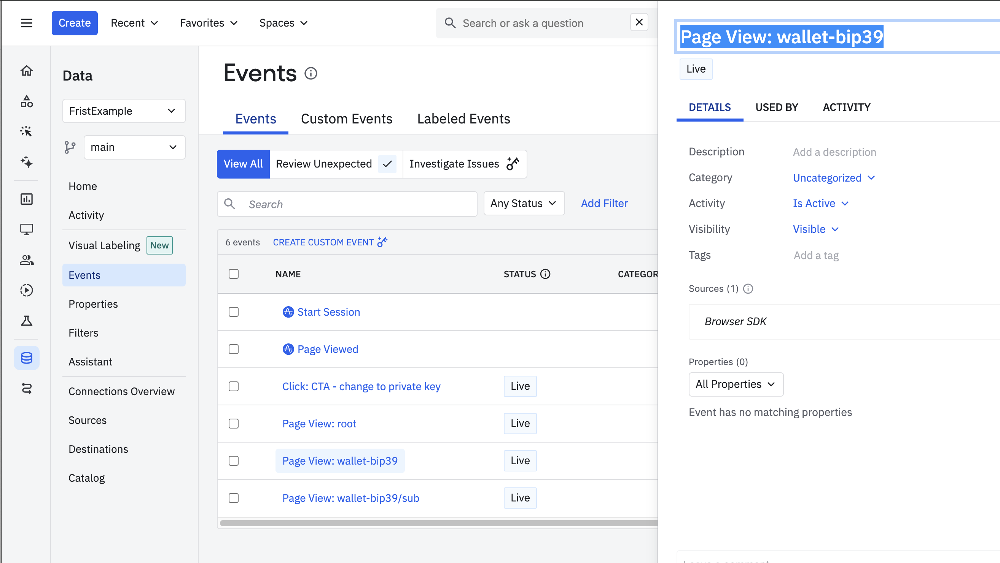
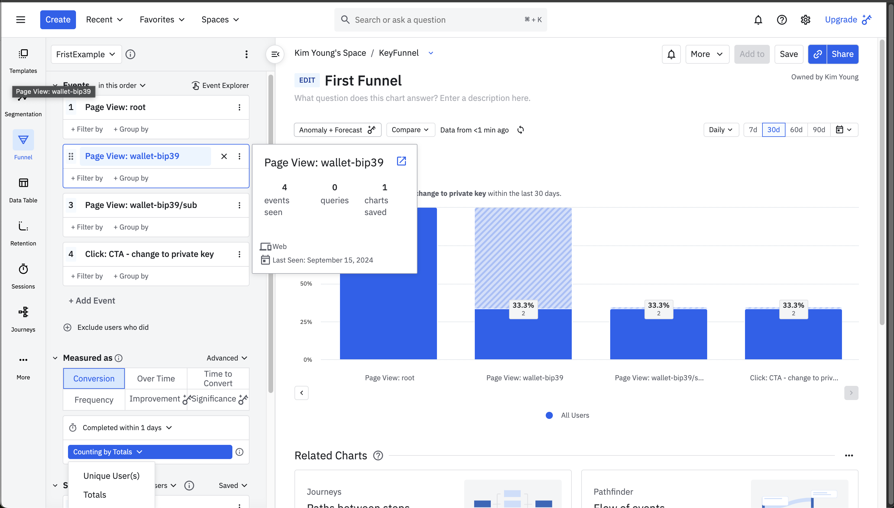
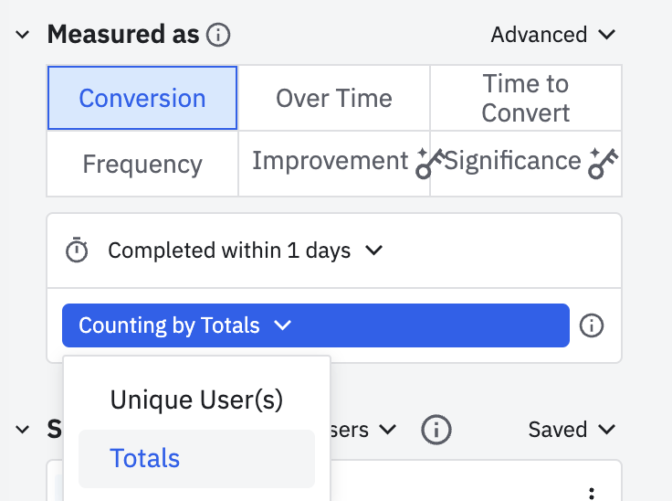

# Amplitude 사용법   

사용 목적 : 퍼널추적을 하기 위해서 Amplitude 사용한다.  
- 무료 플랜은 매달 최대 천만개의 이벤트를 처리   
- 고급 기능이 필요하면 유료 플랜으로 전환  

## React with Amplitude (JS Web SDK)   

Goal  
- API 키 발급합니다.  
- Impression Event 남깁니다.   
- Click Event 남깁니다.  
- 퍼널 대시보드를 만들어봅니다.  

### install

```js
yarn add @amplitude/analytics-browser
---?
yarn add amplitude-js 
yarn add @types/amplitude-js -D  
```


### GET API Key  
   

API 키는 설정 > Projects > API Key에 있습니다.  
- Project Level 로 관리  

### Logger

```js
import * as amplitude from '@amplitude/analytics-browser';

const AMPLITUDE_API_KEY = 'API_KEY';

class AmplitudeLogger {
  init() {
    amplitude.init(AMPLITUDE_API_KEY);
  }
  // user id기반 로깅, 중복로그 제거에 사용  
  setLoginUser(userId: number) {
    const padded = userId.toString().padStart(6, '0');
    console.log(`Set Login User: ${padded}`);
    amplitude.setUserId(padded);
  }

  unsetLoginUser() {
    amplitude.reset();
  }
  // 페이지 뷰 로깅  
  logPageView(page: string, options:any) {
    console.log(`PageView:${page}`);
    amplitude.track(`PageView:${page}`, options);
  }
  // 클릭 로깅  
  logClick(name: string, options:any) {
    console.log(`Click:${name}`);
    amplitude.track(`Click:${name}`, options);
  }
}

export const amplitudeLogger = new AmplitudeLogger();
```

### Logger Usage  

```js
---
// root 컴포넌트에서 초기화 할 것  
  useEffect(() => {
    amplitudeLogger.init();
  }, []);
---
// page level의 logger HOC  
export const AmplitudePage = ({ pageName, children }: Props) => {
  useEffect(() => {
    amplitudeLogger.logPageView(pageName);
  }, [pageName]);

  return <>{children}</>;
};
---
// login page level의 logger HOC  
  useEffect(() => {
    if (user?.id) {
      amplitudeLogger.setLoginUser(user.id);
    } else {
      amplitudeLogger.unsetLoginUser();
    }
  }, [user?.id]);
---

```

## 퍼널 만들기  

    
Data > Events  
- 이벤트가 잘 쌓이는지 확인한다.  
- 이벤트 이름을 확인한다.  

  
퍼널 만들기 : Create > Funnel  
- 이벤트 이름을 입력해서 첫번째 퍼널을 등록한다.  
- 이어서 다음 퍼널을 등록한다.  


- 유저 기반으로 중복제거가 되므로, Totals 로 측정한다. (테스트 환경)  


## Amplitude Event + URL Shorter Server   

문제 : 특정 URL를 클릭했을때 Amplitude Event 남기면서 리다이렉트도 되어야 함.  

시나리오 : 사용자가 특정 URL을 클릭하면 amplitude에 남고 다른 페이지로 진입한다.  