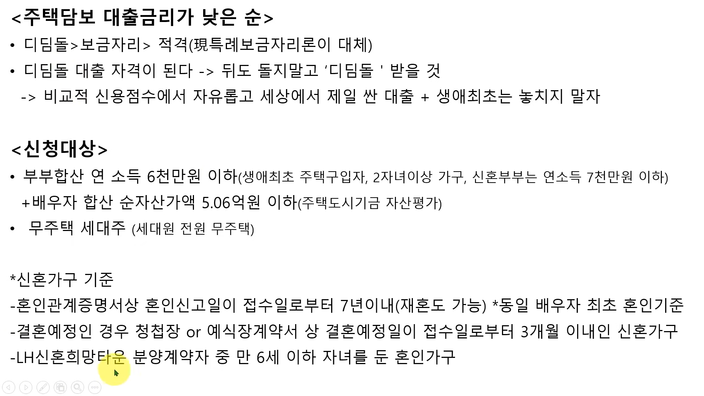
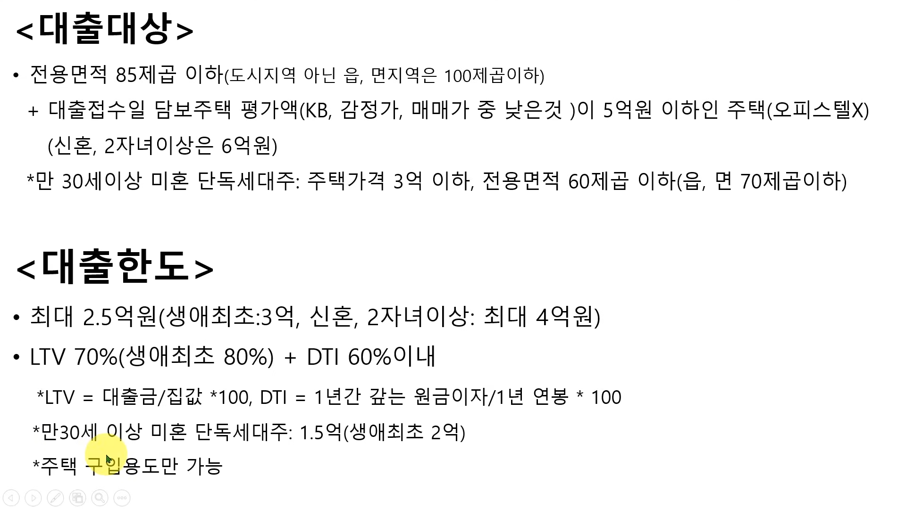
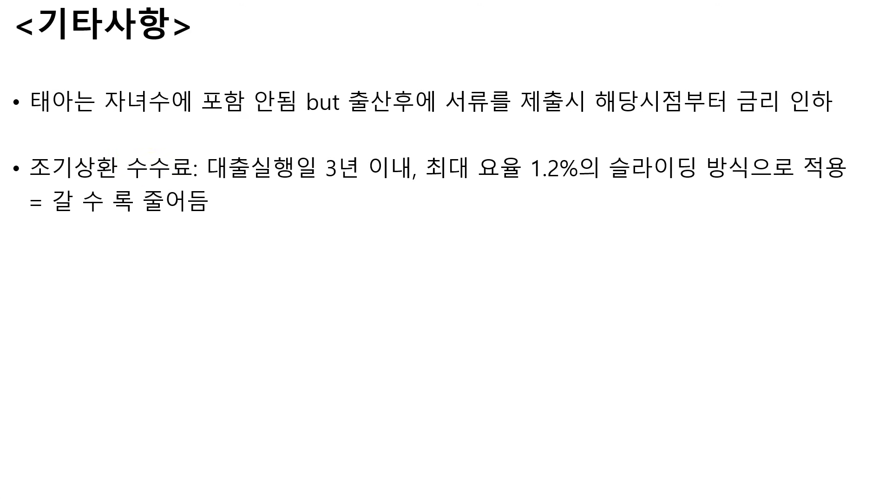
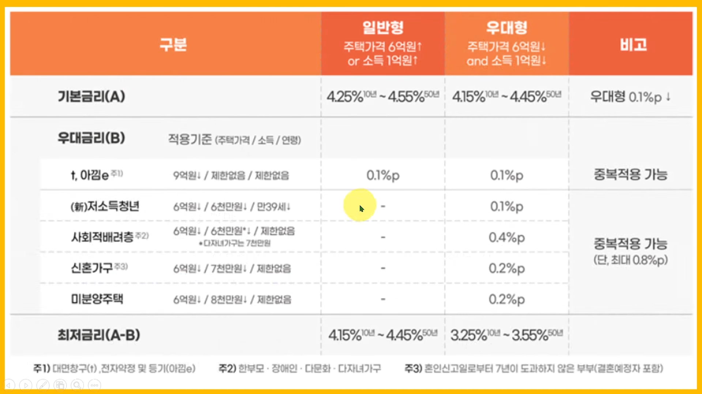

# 주택담보대출

- [주택담보대출](#주택담보대출)
  - [개요](#개요)
  - [디딤돌 대출](#디딤돌-대출)
    - [상환방식별 원리금 차이](#상환방식별-원리금-차이)
    - [대출이자별 원리금 차이](#대출이자별-원리금-차이)
  - [특례보금자리론](#특례보금자리론)

## 개요  

주택담보 대출금리가 낮은 순  
1.디딤돌 대출   
- 합산 연봉 7천, 금리 2.7% + a, 25평 5억 이하  

2.보금자리론   

3.특례보금자리론    

## 디딤돌 대출  

  
*최대 1.5% 이다. 보통 2% 후반  

*신혼부부 연소득 7천만원 이하  
*순자산가액 5.06억  

- 조건 전용면적 85㎡ > 25.7평 이하
- 서울에 25평 소형아파트 + 5억 미만 찾기 힘듦, 외각으로 가야함  
- LTV 70% 의미 : 1억짜리 집은 최대 7천만원 대출  
- DTI 60% 이내 의미 : 연봉 1억이면, 대출갚는데 최대 6천만원까지 가능  

- 원리금균등 vs 원금균등  

- 금리 : 10년 만기 < 30년 만기  
- 생애최초는 금리 down  

  
- 아이 수 및 청약저축 -> 금리 down  

  

### 상환방식별 원리금 차이  

### 대출이자별 원리금 차이  

## 특례보금자리론  

  

  

- *디딤돌 대출과 혼용이 가능하여, 사회초년생이 서울 아파트는 거의 불가능함   
- *특례로 최대한 많이 대출 받고 싶다면 > 7억짜리 집 알아볼것  
- *이자 계산기 > [대출금리이자 Link](https://docs.google.com/spreadsheets/d/1hVQoB78i6JY-W53hkEm6m5NInu4Fya71E9VLkdHTbJw/edit?usp=sharing)

 

  

  

  

