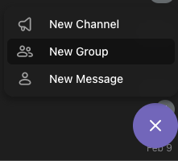

# telegram 알림 API 연동

## Telegram bot 생성

### 1 봇 생성  
접속 : https://web.telegram.org/a/  

- BotFather 검색

- 위 내용 입력, 1번쨰 질문은 봇의 이름, 2번째 질문은 봇의 아이디 값,유니크값이어야 한다. 검색할때 쓰인다.    
- 최종 결과값은 토큰값이다. ( eg - 7021912362:AAET_sNfiUfUPpIsWiS2xyfCPgJZWH-0WKc )
- 7021924962:AAET_sNfiUfUPpIsWiS2xyfCPgJZWH-0WKc

https://api.telegram.org/bot7021912362:AAET_sNfiUfUPpIsWiS2xyfCPgJZWH-0WKc/getupdates  
결과값 : {"ok":true,"result":[]} 라면 성공!  

### 2 봇포함 방 만들기  

- quant_stream_dev_bot 봇이름 검색  
- 봇을 맴버로해서 방하나 만들기  

### 3 chat_id 알아내기  

다시 아래 주소로 요청하면  
- https://api.telegram.org/bot7021912362:AAET_sNfiUfUPpIsWiS2xyfCPgJZWH-0WKc/getupdates   

- chat.id 가 나온다.  

### 4 테스트 메시지 보내기 
https://api.telegram.org/bot7021924962:AAET_sNfiUfUPpIsWiS2xyfCPgJZWH-0WKc/sendmessage?chat_id=-4112350884&text=test-message

----

https://api.telegram.org/bot7021924962:AAET_sNfiUfUPpIsWiS2xyfCPgJZWH-0WKc/getupdates
-4112350884
