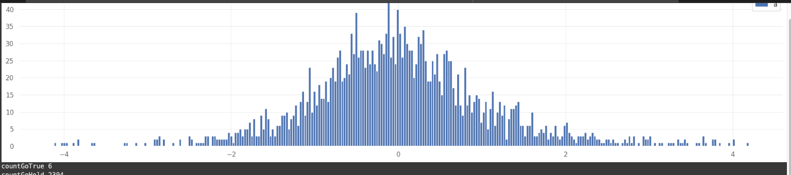

# vectorbt - 분할매수 + MA Gap ZScore 2

## 1Pager

### Hypothesis

1.현재 가격과 이동평균선 사이의 Gap이 존재한다.  
- 그 Gap에 대한 데이터를 샘플링 한다.    
- Gap데이터를 모아서 평균 및 표준정규분포 곡선을 그린다.  

- 그 정규분포곡선에서 하위 1%일때가 매수하기 좋은 시점이다.    
- 의미 : 지금까지의 Period 중 가장 저가에 매수하는 것  

주의  
- 상승장 only  
- 충분히 학습기간이 필요하기에 10일 이상 매매를 금지한다. (초기 데이터의 이상치 제거 필요)  
- 미래 데이터를 미리 가져와서 평균치를 내면 안되므로 expanding 함수를 이용한다.  

2.분할 매수를 한다.  
- 시그널 이후 진입시 size값을 이용해서 진입한다.  

3.가중 분할 매수를 한다.  
- MA12 가중치 2
- MA24 가중치 8

4.분할매수 Level1적용한다.  
- 최소 10번에 나누어서 매수  
- 각 시행마다 가중치 매수를 진행한다.  

5.

### Long Position  

- MA12 ZScore 하위 1% 
- MA12 ZScore 하위 1% 

### Short Position

long only  
- stoploss 30%
