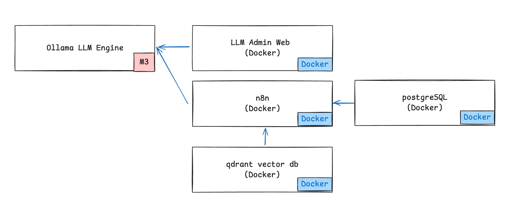
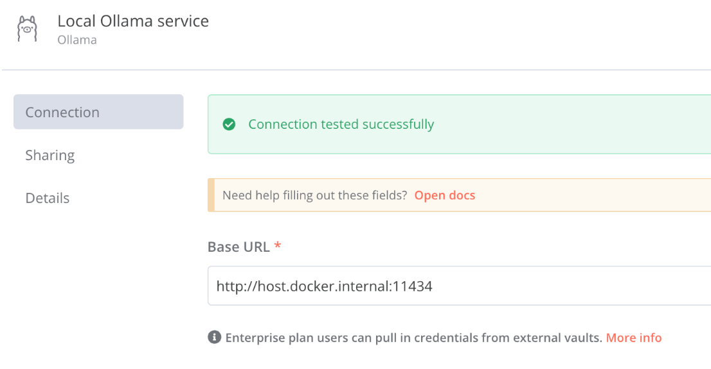

# n8n  

## Background  

### 아키텍처  
    

- Ollama LLM Engine: AI 모델 실행 엔진 (M3 Pro 칩 사용)  
- LLM Admin Web: Ollama 관리용 웹 인터페이스  
- n8n: 워크플로우 자동화 도구 
- PostgreSQL: n8n용 메인 데이터베이스  
- Qdrant: 벡터 데이터베이스 (AI 데이터 저장) 

### extra_hosts

```yml
  n8n:
    container_name: n8n
    extra_hosts:
      - "host.docker.internal:host-gateway"
```
extra_hosts:"host.docker.internal:host-gateway" 설정이란?   
- Docker 컨테이너 내부에서 호스트 머신에 접근하려면 extra_hosts 설징이 필요하다.  
- 로컬에서 도커를 설치하고 도커 데몬을 돌리는 상황이다.  
- n8n은 격리된 도커 컨테이너 환경에서 실행된다.  
- ollama engine은 로컬 프로세스에서 실행되고 있다.  
- 여기서 격리된 도커 컨테이너는 내 로컬 ollama 프로세스 에 접근이 불가능하다.  
  - n8n 컨테이너 입장에서 localhost는 본인의 컨테이너를 가르킨다.  
  - Docker 컨테이너 내부에서 호스트 머신에 접근하려면 extra_hosts 설징이 필요하다.  
- 예) 컨테이너에서 호스트 머신에 접근
  - http://localhost:11434 - X  
  - http://127.0.0.1:11434 - X 
  - http://0.0.0.0:11434 - X
  - http://host.docker.internal:11434  - O
  

## Eg) n8n, qdrant, Ollama

```yml
volumes:
  n8n_storage:
  ollama_storage:
  qdrant_storage:

networks:
  n8n-workflow:

x-n8n: &service-n8n
  image: n8nio/n8n:latest
  networks: ['n8n-workflow']
  environment:
    - DB_TYPE=postgresdb
    - DB_POSTGRESDB_HOST=${DB_POSTGRESDB_HOST}
    - DB_POSTGRESDB_PORT=5432
    - DB_POSTGRESDB_USER=postgres
    - DB_POSTGRESDB_DATABASE=n8n
    - DB_POSTGRESDB_PASSWORD=${DB_POSTGRESDB_PASSWORD}
    - N8N_DIAGNOSTICS_ENABLED=false
    - N8N_PERSONALIZATION_ENABLED=false
    - N8N_ENCRYPTION_KEY=c8d1b1b58ac8292e6f6bda9398b9454b8f18b93e8a1186d35c10cbe1214 # change 
    - N8N_USER_MANAGEMENT_JWT_SECRET=23894678956234567893456789345678934567856789345678 # change

services:
  n8n-import:
    <<: *service-n8n
    container_name: n8n-import
    entrypoint: /bin/sh
    command:
      - "-c"
      - "n8n import:credentials --separate --input=/backup/credentials && n8n import:workflow --separate --input=/backup/workflows"
    volumes:
      - ./n8n/backup:/backup

  n8n:
    <<: *service-n8n
    container_name: n8n
    extra_hosts:
      - "host.docker.internal:host-gateway"
    restart: unless-stopped
    ports:
      - 5678:5678
    volumes:
      - n8n_storage:/home/node/.n8n
      - ./n8n/backup:/backup
      - ./shared:/data/shared
    depends_on:
      n8n-import:
        condition: service_completed_successfully

  qdrant:
    image: qdrant/qdrant
    container_name: qdrant
    networks: ['n8n-workflow']
    restart: unless-stopped
    ports:
      - 6333:6333
    volumes:
      - qdrant_storage:/qdrant/storage
```

## Ref 

https://velog.io/@martin-han/n8n-ollama-chatGPT-%EC%82%AC%EC%9A%A9%ED%95%B4%EB%B3%B4%EA%B8%B0#webhook-%ED%8A%B8%EB%A6%AC%EA%B1%B0  