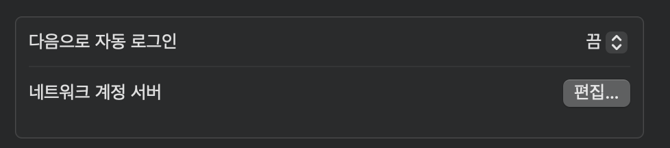
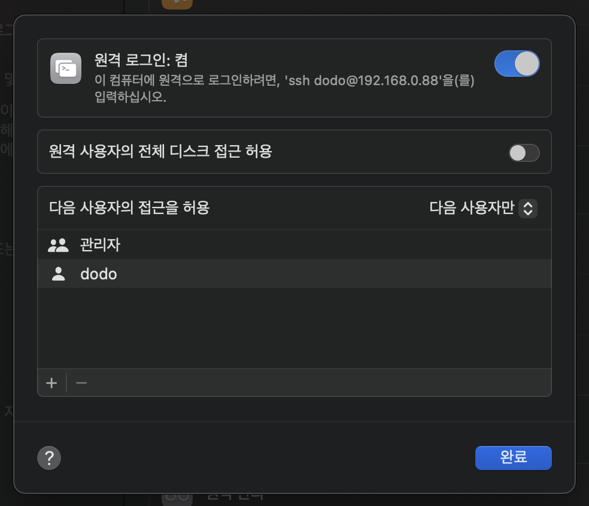

# 홈서버 (MacMini) 운용 방법 2

<head>
  <meta name="keywords" content="Mac Server, 맥미니 서버, 운용"/>
</head>

## 맥미니 기본 셋업 방법

---

<br/>

### 1. brew 설치

공식 홈페이지를 참고해서 설치하자 - https://brew.sh/ 

```
/bin/bash -c "$(curl -fsSL https://raw.githubusercontent.com/Homebrew/install/HEAD/install.sh)"

# 애러 해결 - zsh: command not found: brew
vi ~/.zshrc

# .zshrc 파일에서 다음을 추가해준다.
export PATH=/opt/homebrew/bin:$PATH

source ~/.zshrc
```

<br/>

### 2. OS Update

맥OS의 업데이트를 체크하자.  
- 먼저 업데이트 후 진행 권장  


<br/>

### 3. 맥미니 비번없이 바로 부팅 셋업

맥미니를 종종 껐다가 켜야하는 상황이 발생한다. 그러나 맥미니 서버에 모니터를 계속 달아줄수는 없다. 
- 그러기에 비밀번호 없이 부팅이 가능하도록 초기 셋팅이 필요하다.    
- 설정에서 자동으로 user(계정) 로그인 켜기  
- [how-to-turn-off-password-on-mac](https://www.fonedog.com/ko/powermymac/how-to-turn-off-password-on-mac.html)

```
# 1.자동로그인 시도 설정
설정 > 사용자 및 그룹 > 다음으로 자동 로그인 > (계정선택)  

# 2전원 강제 on/off 시 자동 부팅
설정 > 에너지 절약 > 정전 후 자동으로 시작하기
ref : https://extrememanual.net/33485
```

  
- 처음에는 다음으로 자동 로그인이 없다.  


<br/>

### 3.1 맥미니 ssh 접속 허용  

애플에서는 리모트 데스크탑 기능을 11만원에 판매하고 있다.  원격의 맥미니를 GUI까지 보려면 비싸다...  
- SSH접속만으로 괜찮으니 그렇게 셋팅하는것은 옵션이다.!  

  

설정 > 원격로그인 검색  
- 1.사용자 추가   
- 2.원격 로그인 on  


### 4. [필수셋팅] OS X Server: 잠자기 모드를 차단하는 방법

```
명령어를 입력하면 커버를 닫아도 잠자기 모드가 활성화 되지 않는다.
sudo pmset -c disablesleep 1  

다시 잠자기 모드를 활성화 하려면 아래 명령어를 입력하면 된다.
sudo pmset -c disablesleep 0
```

[잠자기 모드를 차단하는 방법](https://support.apple.com/ko-kr/HT200106)

<br/>

### 5. CodeServer install

brew install 및 brew services로 설치하자.

```
# 1.Install
brew install code-server

# 2.서비스 백그라운드로 실행
brew services start code-server

# 3.
# 8080포트 (기본) 접속 후 수정 할 config 파일 나옴 수정 
- host, port, password 3개 항목 수정하기  
  - host = 0.0.0.0
  - port, password = 원하는 것  

# 4.
brew services restart code-server
```
<br/>

### 6. Docker install 

```
brew update
brew upgrade
brew search docker
brew install --cask docker
brew install docker-compose
```
<br/>

### 6.1 Docker의 대안 Colima  

- 사실 맥미니 서버로 쓴다면 Docker 데스크탑은 많이 못본다. 
- 그 대안으로 Colima을 사용하면 좋다.    
  - macOS에서 직접 컨테이너를 실행할 수 없기 때문에, Colima는 경량 VM(Lima) 위에 Docker 엔진을 올립니다.
  - Lima는 Apple 공식 기술은 아니지만, macOS에 최적화된 경량 Linux VM 솔루션입니다.

```
# 1. Colima 설치
brew install colima
brew install kubectl

# 2. Docker CLI만 설치 (Docker Engine 없이)
brew install docker

# 3. Docker Compose 설치 (선택)
brew install docker-compose

# 4. Colima 시작 (확인용)
colima start

# 5. Docker 연결 확인
docker info
docker run hello-world

# 6. 자동 재시작 등록  
# - 참고로 초기 부팅시 docker 데몬이 올라가는데 시간이 좀 걸린다.   
brew services start colima 
```

```
# 1.리소스 제약 확인
colima ls
PROFILE    STATUS     ARCH       CPUS    MEMORY    DISK      RUNTIME    ADDRESS
default    Running    aarch64    2       2GiB      100GiB    docker


# 2.리소스 늘리기  
brew services stop colima
colima start --cpu 12 --memory 28 --disk 400 --mount-type virtiofs
colima stop
brew services start colima 

```

### 7. Nginx install 

```
brew search nginx
brew install nginx
```

[ref](https://codewagon.tistory.com/2)
