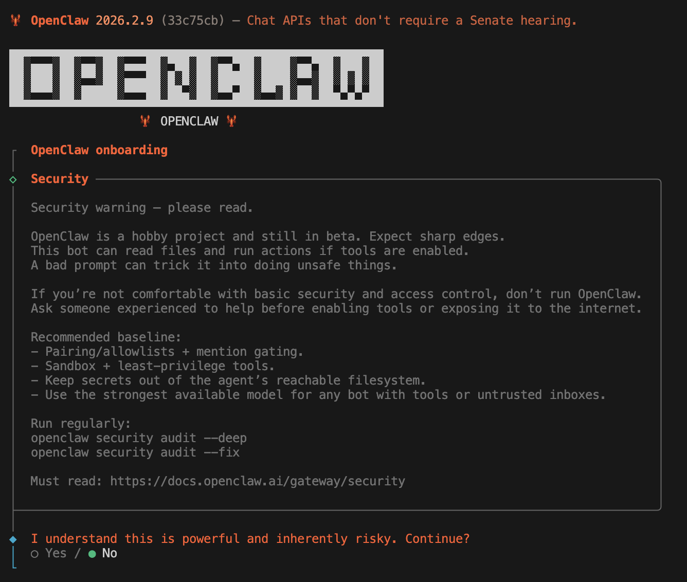
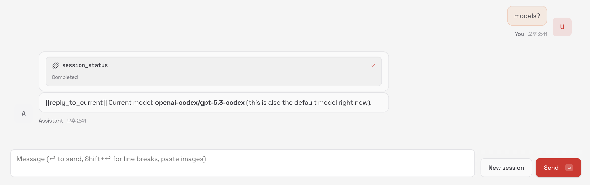
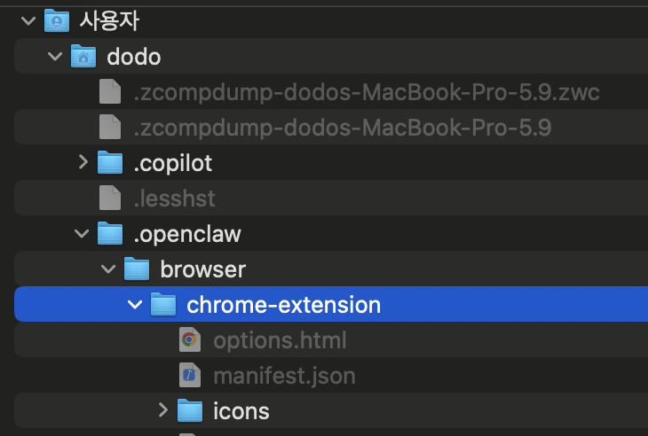
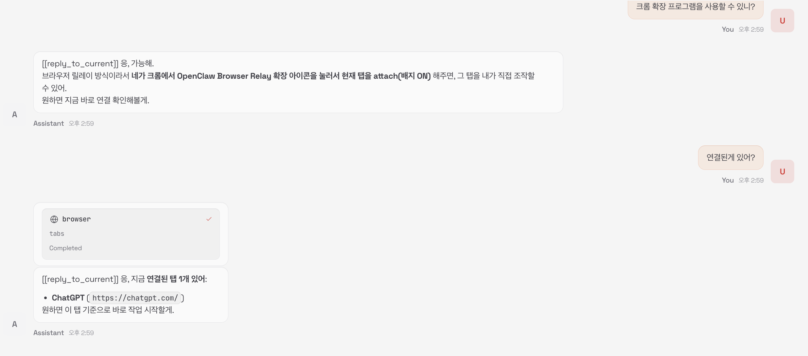

# OpenClaw(몰트봇)구축하기 1  
- [OpenClaw(몰트봇)구축하기 1](#openclaw몰트봇구축하기-1)
  - [1, OpenClaw(몰트봇) 설치하기](#1-openclaw몰트봇-설치하기)
  - [2, OpenClaw에 GPT Codex 붙이기](#2-openclaw에-gpt-codex-붙이기)
  - [3, 크롬 브라우저 권한 넘기기](#3-크롬-브라우저-권한-넘기기)
  - [99, 스킬](#99-스킬)
  - [99, OpenClaw에 ollama 붙이기](#99-openclaw에-ollama-붙이기)
  - [참고자료](#참고자료)


26년 초 OpenClaw(몰트봇)이 굉장히 핫 하다.. 그럴듯한 개인용 AI 비서 + 오픈소스라니 굉장히 인기가 많을 수 밖에 없다.  
- 결국 사람이 원하는 것은 내 귀찮은 일을 잘 해줄 비서같은 AI에 대한 수요가 확실히 검증되었다고 생각된다.  
- 정말 필요하다면 이제 1인 AI PC 시대가 올 것이다. 집에 인터넷 공유기는 하나씩 있는데 그 옆에 맥미니 같은 컴퓨터가 있을듯 하다.   

특히나 요즘 운동 루틴, 개발 트랜드 파악 루틴, 경제 시황 파악 등 귀찮은 일들이 많아지는데 이를 하나씩 자동화해볼 수 있지 않을까 한다.  
- 여기서는 설치먼저 진행하자.  

## 1, OpenClaw(몰트봇) 설치하기  

공식 문서 : https://github.com/openclaw/openclaw  

1.1, OpenClaw(몰트봇) 설치는 여러 방법으로 가능하다.  
- 나는 그 중 npm 으로 진행 했다. - https://docs.openclaw.ai/install#npm-pnpm  

```js
# openclaw 설치는 아래 한줄이면 된다.  
npm install -g openclaw@latest

# 설치 후 아래 명령어로 세팅 시작이 가능함    
openclaw onboard --install-daemon
```

설정 중 주요 내용은 아래와 같다.  
- 기존 설정 확인: ~/.openclaw/openclaw.json이 이미 존재하면 유지/수정/리셋 중 선택한다.
- Workspace 설정: 에이전트가 사용할 워크스페이스 위치를 설정한다. 기본값은 ~/.openclaw/workspace이다.
- Gateway 설정: 포트, 바인드 주소, 인증 모드, Tailscale 노출 여부를 설정한다. Local 모드에서는 기본값(포트 18789, loopback)을 사용하는 것이 좋다.
- 채널 설정: 텔레그램, WhatsApp, Discord 등 사용할 채널을 선택하고 설정한다. 처음에는 하나만 설정해도 된다.
- Daemon 설치: 백그라운드에서 실행되도록 데몬을 설치한다. macOS는 LaunchAgent, Linux는 systemd user unit을 사용한다.


1.2, 채널설정  
- 채널이란? 텔레그램 같은 메신저를 이용해 OpenClaw와 상호작용 할 수 있다. 
- 가장 간단한 텔레그램 봇으로 연동을 하자. https://docs.openclaw.ai/channels  
- 참고: https://leejams.github.io/openclaw/

설치과정 
```
1, 텔레그램 접속하기 
2, 텔레그램에서 BotFather를 검색 > /newbot 입력 후 생성하기  > 봇 토큰이 나옴  > OpenClaw 설정에 넣기  
3, 텔레그램에서 봇 사용 가능한 유저 화이트 리스팅 설정 > @userinfobot 봇 검색 > 시작하면 본인의 user id가 나온다. ( 프로필의 @으로 시작하는 이름이 아닌 값을 ) > OpenClaw 설정에 넣기  
```

## 2, OpenClaw에 GPT Codex 붙이기   

마침 카카오에서 GPT pro를 30만원 -> 2.9만원으로 할인행사를 하더라.  
- openClaw랑 gpt codex cli와 연동이 가능해서 붙여보았다.  
- https://docs.openclaw.ai/providers/openai#cli-setup-codex-oauth  

```
# 아래 명령어로 자동 설정이 된다. 
openclaw onboard --auth-choice openai-codex
```

   
- 에이전트 섹션에서 설정된 값을 볼 수 있다.  
  
- 모델을 확인하자. 


## 3, 크롬 브라우저 권한 넘기기  

OpenClaw 에서는 브라우저를 2가지 방식으로 제어할 수 있다. - https://docs.openclaw.ai/tools/browser
- OpenClaw가 직접 브라우저를 열고 탐색할 수 있도록 브라우저 전체를 주는 방식과 내가 보고 있는 특정 탭을 연동하는 방식  
- 여기서는 후자 방법으로 에이전트가 직접 브라우저를 서핑할 수 있도록 설정을 해보자. https://docs.openclaw.ai/tools/chrome-extension    
- 기존 나의 크롬 프로파일에는 카드 정보, 비빌번호 등 여러가지 크리덴션 설정이 되어 있기 때문에 잘못하면 모든 나의 개인정보을 이용한 액션 (결제 등)이 가능한 위험에 노출되어 있다.  


```js
# 익스텐션 설치하기  
openclaw browser extension install

# 아래 경로에 크롬 익스텐션 파일이 생성된다.  클립보드에 복사한다.  
~/.openclaw/browser/chrome-extension

# 'chrome://extensions' 접속 후 개발자 모드를 활성화   
- Chrome → chrome://extensions → enable “Developer mode”

# 압축해제된 확장 프로그램을 로드 -> 'Command + Shift + .' 명령어 입력하면 숨김 파일 보인다. -> 익스텐션 파일 넣기  
- “Load unpacked” → select: ~/.openclaw/browser/chrome-extension
- Pin “OpenClaw Browser Relay”, then click it on the tab (badge shows ON)

```

    

참고 - Extension Relay    
- OpenClaw 서버가 내 컴퓨터 안에서 18792번 포트로 실행되고 있고 Chrome extension이 거기로 메시지를 보내는 구조  
- 즉, 브라우저 ↔ OpenClaw 연결용 통신 채널이야.  
- 구조 : Chrome Extension  →  localhost:18792  →  OpenClaw  

중요! 보안 고려사항 - https://docs.openclaw.ai/tools/chrome-extension#security-implications-read-this  
- Extension이 Chrome의 디버거 API(chrome.debugger)를 사용
- 👉 평소 쓰는 크롬 프로필에 붙이면 그 계정 전체 접근 권한을 주는 것과 같음
- ✅ 권장 사항
  - 1️⃣ 개인 브라우저와 분리된 **전용 Chrome 프로필 사용**
  - 2️⃣ Gateway / Node는 **tailnet 내부에서만 사용** (외부 공개 금지)
  - 3️⃣ relay 포트: * ❌ 0.0.0.0 (LAN 공개) 하지 말 것 ❌ Funnel (공개 인터넷 노출) 하지 말 것
  - 4️⃣ 내부 인증 토큰 + 확장 origin 차단으로 보호됨  


  
결과 : 크롬 확장 프로그램으로 모니터링 중인 브라우저를 확인할 수 있었다.  


## 99, 스킬 

https://clawhub.ai/skills?sort=downloads&dir=desc  
- 유용한 스킬들을 살펴보자. pdf to word, gmail 탐색, IoT기기 제어 등  


## 99, OpenClaw에 ollama 붙이기    


1, ollama 설치
- https://ollama.com -> `curl -fsSL https://ollama.com/install.sh | sh` 명령어로 설치    


2, ollama 명령어  

```
✅ 모델 관리 (저장소)
* `ollama list`: 내 컴퓨터에 설치된 모든 모델 목록 확인
* `ollama pull [모델명]`: 모델 다운로드 (실행은 하지 않음)
* `ollama rm [모델명]`: 모델 삭제 (SSD 용량 확보)

✅ 실행 및 모니터링 (메모리)
* `ollama run [모델명]`: 모델 실행 및 대화 시작 (메모리 로드)
* `ollama ps`: **현재 RAM에 올라가 작동 중인 모델 확인** (가장 중요)
* `ollama stop [모델명]`: 실행 중인 모델을 메모리에서 즉시 해제


```

3, 로컬 LLM 모델 설치하기  

모델 선택 가이드
- 1, 가용 메모리가 적은 개인 컴퓨터 환경에서는 양자화된 모델 선택하기
- 2, 코더 모델을 선택, 왜 "Qwen3" 일반 모델보다 "Coder" 모델인가? - Tool Calling(함수 호출) 능력은 코더 모델들이 압도적으로 훈련되었다.  
- *MoE(Mixture of Experts) 모델이란? 질문을 받으면 라우터가 관련 있는 '전문가(Expert) 뇌' 몇 개만 깨워서 답변  
  - 장점: 전체 뇌 용량(파라미터)은 크지만, 한 번에 쓰는 에너지는 적고 똑똑하면서도 속도가 매우 빠릅니다.  


M3 Pro 18GB 맥북 프로에서 적절한 로컬 LLM  
- Qwen 2.5 Coder 7B : 가장 추천. 코딩과 도구 사용 능력이 매우 뛰어나며 M3 Pro에서 매우 빠름. 
  - ollama run qwen2.5-coder:7b  
- Qwen3-Coder-Next (3B/8B active MoE)  
- Llama 3.1 8B : 범용성이 가장 좋고 안정적임. 한국어 대응도 무난함.  

M2 Max 32GB 맥스튜디오에서 적절한 로컬 LLM    
- 가장 똑똑한 걸 원하신다면 Qwen3-30B-A3B, 추천 파일: qwen3-30b-a3b-instruct-q4_k_m.gguf
- 아주 빠르고 똑똑한 걸 원하신다면 DeepSeek-R1-14B를 선택  - https://ollama.com/cyberuser42/DeepSeek-R1-Distill-Qwen-14B  


```js
# 기존 openclaw 종료
openclaw gateway stop

# ollama에서 게이트웨이를 열면서 openclaw도 실행하기  
ollama launch openclaw

Select models for OpenClaw: Type to filter...
  >  [ ] qwen2.5-coder:7b

```

참고 자료  
- ollama integrations openclaw : https://docs.ollama.com/integrations/openclaw

## 참고자료  
- openclaw 소개 : https://www.daleseo.com/openclaw
- https://brunch.co.kr/@sungdairi/19  
- openclaw + ollama https://leejams.github.io/openclaw-ollama/  
- Ollama로 OpenClaw 로컬 AI 모델 연동하기 https://leejams.github.io/openclaw-ollama/    