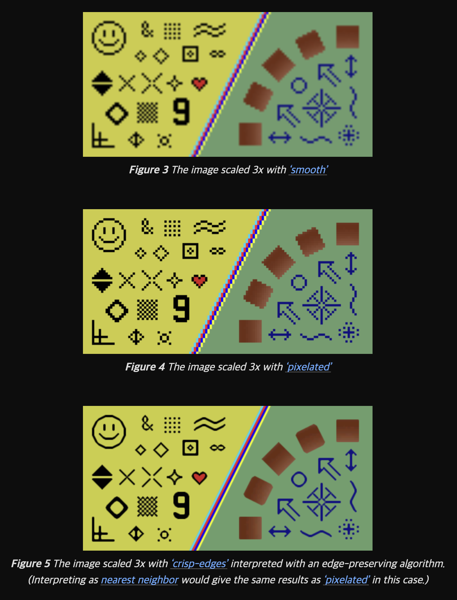

# CS Interview Web    

- [CS Interview Web](#cs-interview-web)
  - [프런트엔드 빌드 시스템에 대해서 설명해보세요.](#프런트엔드-빌드-시스템에-대해서-설명해보세요)
    - [(추가) Task Runners vs Module Bundler](#추가-task-runners-vs-module-bundler)
    - [ref](#ref)
  - [바벨이란?](#바벨이란)
  - [폴리필이란?](#폴리필이란)
  - [Node.js란?](#nodejs란)
  - [NPM이란?](#npm이란)
  - [ESLint, Prettier란?](#eslint-prettier란)
  - [🌕 웹 태스크 매니저란?](#-웹-태스크-매니저란)
    - [🌕 크롬은 멀티프로세스 아키텍처 사용](#-크롬은-멀티프로세스-아키텍처-사용)
  - [웹팩이란? 모듈 번들러가 무엇인가요?](#웹팩이란-모듈-번들러가-무엇인가요)
  - [🌕 웹 접근성과 시맨틱 마크업이란? 이 2가지를 지키기 위해 보통 어떤식으로 마크업을 작성하는지?](#-웹-접근성과-시맨틱-마크업이란-이-2가지를-지키기-위해-보통-어떤식으로-마크업을-작성하는지)
    - [(추가) 일반적인 접근성 테스트 목록](#추가-일반적인-접근성-테스트-목록)
    - [(추가) ARIA(Accessible Rich Internet Applications) 속성](#추가-ariaaccessible-rich-internet-applications-속성)
    - [1. 역할 (Roles)](#1-역할-roles)
    - [2. 상태 (States)](#2-상태-states)
    - [3. 속성 (Properties)](#3-속성-properties)
    - [예시](#예시)
- [토이프로젝트](#토이프로젝트)
  - [웹 서비스를 기획부터 배포까지 모두 스스로 해본 경험이 있는가? 토이 프로젝트나 회사 서비스 등](#웹-서비스를-기획부터-배포까지-모두-스스로-해본-경험이-있는가-토이-프로젝트나-회사-서비스-등)
    - [(꼬리 질문) 구체적으로 어떤 역할을 수행했는지 설명](#꼬리-질문-구체적으로-어떤-역할을-수행했는지-설명)
- [Web](#web)
  - [SEO(검색 엔진 최적화)란? 적용 사례가 있으면 구체적인 적용 방법도 같이 설명](#seo검색-엔진-최적화란-적용-사례가-있으면-구체적인-적용-방법도-같이-설명)
  - [REST API로 받은 객체와 배열은 보통 어떤 자바스크립트 API나 로직을 이용해서 화면에 맞게 가공을 하는지?](#rest-api로-받은-객체와-배열은-보통-어떤-자바스크립트-api나-로직을-이용해서-화면에-맞게-가공을-하는지)
  - [🌕함수형 프로그래밍이란?](#함수형-프로그래밍이란)
    - [🌕(꼬리 질문) 자바스크립트 클로저란?](#꼬리-질문-자바스크립트-클로저란)
    - [🌕(꼬리 질문) 자바스크립트 프로토타입이란?](#꼬리-질문-자바스크립트-프로토타입이란)
  - [서버 사이드 렌더링과 싱글 페이지 애플리케이션의 차이점?](#서버-사이드-렌더링과-싱글-페이지-애플리케이션의-차이점)
    - [GPT)](#gpt)
    - [(꼬리 질문) 서버 사이드 렌더링이나 SPA로 각각 구현해 본 경험이 있는지?](#꼬리-질문-서버-사이드-렌더링이나-spa로-각각-구현해-본-경험이-있는지)
  - [타입 시스템에 대해서 알고 있는지? 타입스크립트를 써봤는지?](#타입-시스템에-대해서-알고-있는지-타입스크립트를-써봤는지)
    - [(꼬리 질문) 자바스크립트와 타입스크립트의 차이점?](#꼬리-질문-자바스크립트와-타입스크립트의-차이점)
    - [(꼬리 질문) 타입스크립트의 장점과 단점?](#꼬리-질문-타입스크립트의-장점과-단점)
  - [Q. Nodejs 스케일업 방법?](#q-nodejs-스케일업-방법)
  - [Q. 사파리 브라우저의 랜더링 엔진은?](#q-사파리-브라우저의-랜더링-엔진은)
  - [Q.브라우저의 캐시 전략](#q브라우저의-캐시-전략)
    - [주요 캐싱 헤더](#주요-캐싱-헤더)
    - [캐싱 제어 예시](#캐싱-제어-예시)
    - [실전 예시](#실전-예시)
  - [CSS - image-rendering](#css---image-rendering)
- [TS](#ts)
  - [react 에서 children을 타이핑 할때 ReactNode 가 맞아 ReactElemet가 맞아요?](#react-에서-children을-타이핑-할때-reactnode-가-맞아-reactelemet가-맞아요)


## 프런트엔드 빌드 시스템에 대해서 설명해보세요.  

빌드 시스템은 개발+배포 과정에 필요한 도구들 모아둔 시스템이다.  
- 크게 Task Runners + Module Bundler + Package Manager로 구성된다.    


### (추가) Task Runners vs Module Bundler  
- 태스크 러너는 반복적인 작업을 자동화한 도구이다.   
- 현재의 개발시스템에서는 일부 태스크 러너는 모듈 번들러로 포함되어 따로 셋업하지 않아도 된다.   
- lint, formatter, unit test, husky 등의 test runner IDE의 플러그인 혹은 따로 셋업하여 사용하고 있다.    

### ref  
https://jeonghwan-kim.github.io/series/2019/12/10/frontend-dev-env-webpack-basic.html#11-iife-%EB%B0%A9%EC%8B%9D%EC%9D%98-%EB%AA%A8%EB%93%88  
프론트엔드 개발 환경의 이해 : https://github.com/jeonghwan-kim/lecture-frontend-dev-env    


## 바벨이란?

바벨 : JS트랜스파일러이다.  
- 하위 브라우저 혹은 크로스 브라우징을 위해 최신문법의 JS를 낮은 버전의 JS로 변환시켜 준다.  
- 내부적으로는 추상구문트리 AST를 사용하여 파싱-변환-출력 단계를 거친다.  
    - 파싱 Parsing : 문자열 코드를 토큰단위로 분해 -> AST를 생성 ( 문법적인 구조를 파악했다. )
    - 변환 Transforming : AST를 변형하는데 프리셋 및 플러그인을 통해 작업 수행 ( let, const > var로 변환 )  
    - 출력 Printing : AST를 다시 문자열 코드로 변환, 파일 저장 혹은 스크립트 태크로 삽입  

ref : https://jeonghwan-kim.github.io/series/2019/12/22/frontend-dev-env-babel.html#2-%EB%B0%94%EB%B2%A8%EC%9D%98-%EA%B8%B0%EB%B3%B8-%EB%8F%99%EC%9E%91  

## 폴리필이란?  

폴리필 : 구형 브라우저에서 지원이 안되는 문법을 지원하기 위한 구현체  
- IE에서는 Promise나 Array.from()과 같은 메서드가 정의되어 있지 않다.  
- 기본적으로 바벨은 변환 할수 있는것만 변환하게 된다.
- 바벨의 설정을 폴리필을 넣을 수 있다.

## Node.js란?

node.js 는 JS 런타임 환경.  
- 싱글스레드 기반의 논블록킹 I/O가 특징이다.  

## NPM이란?  

- NPM은 Node.js의 노드 패키지 매니저 
- 패키지 관리 및 설치
- 의존성 관리: package.json 파일을 사용하여 프로젝트의 모든 의존성을 관리합니다. 
- 스크립트 실행: 
- 패키지 퍼블리싱: NPM을 통해 자신이 만든 패키지를 NPM 레지스트리에 퍼블리싱하여 다른 개발자들과 공유할 수 있습니다.

## ESLint, Prettier란?  

ESLint는 자바스크립트 코드의 품질과 일관성을 유지하기 위해 사용되는 린팅(linting) 도구.
- 코드 스타일 검사: ESLint는 코드의 스타일을 검사하고 일관성을 유지  
- 커스터마이징 가능: 필요에 따라 규칙을 추가하거나 변경 가능  
- 플러그인 지원: 특정 프레임워크(예: React, Vue)나 스타일 가이드(예: Airbnb, Google)  
- 자동 수정 : 일부 규칙만


Prettier는 코드 포맷터로, 코드의 스타일을 일관성 있게 자동으로 포맷팅해주는 도구입니다. 
- 일관된 코드 스타일: Prettier는 설정한 규칙에 따라 코드를 자동으로 포맷팅하여 모든 파일이 일관된 스타일을 유지하게 합니다. 이를 통해 코드 리뷰와 협업이 더 쉬워집니다.
- 지원 언어: Prettier는 자바스크립트뿐만 아니라, 타입스크립트, CSS, HTML, Markdown 등 다양한 언어를 지원합니다.
- 간편한 통합: Prettier는 다양한 IDE(예: VS Code, Sublime Text)와 통합되어 저장할 때 자동으로 코드를 포맷팅할 수 있습니다.
- 설정 간소화: Prettier는 최소한의 설정으로 동작하며, 대부분의 포맷팅 규칙을 내장하고 있어 별도의 설정 없이도 바로 사용할 수 있습니다.


## 🌕 웹 태스크 매니저란?  

웹 브라우저에서 실행되는 다양항 태스크 및 리소스를 관리하는 도구이다. (작업 관리자)  
- 프로세스 모니터링: 웹 페이지나 탭, 확장 프로그램, 서비스 워커 등 각각의 프로세스에 대한 메모리 사용량, CPU 사용량, 네트워크 활동 등을 실시간으로 모니터링
- 태스크 관리: 불필요하거나 응답하지 않는 태스크를 종료할 수 있는 기능을 제공
- 디버깅 도구: 개발자가 웹 애플리케이션의 성능 문제를 해결하는 데 유용합니다. 어떤 스크립트가 많은 자원을 사용하고 있는지, 어떤 요청이 느리게 처리되고 있는지 등을 파악
- 리소스 사용 분석: 웹 페이지의 각 요소(스크립트, 이미지, 스타일시트 등)가 얼마나 많은 리소스를 사용하는지 분석 가능

### 🌕 크롬은 멀티프로세스 아키텍처 사용  

**각 탭의 독립성**: 
- 크롬은 각 탭을 별도의 프로세스로 실행합니다. 이렇게 하면 한 탭에서 문제가 발생해도 다른 탭에 영향을 미치지 않습니다.

**안전한 플러그인 실행**: 
- 플러그인(예: Flash, PDF 뷰어 등)도 별도의 프로세스로 실행됩니다.  
- 이를 통해 플러그인이 충돌하거나 보안 문제를 일으킬 때 브라우저의 다른 부분에 영향을 주지 않도록 합니다.   

**렌더링 프로세스**
- 각 탭의 콘텐츠(HTML, CSS, 자바스크립트 등)를 렌더링하는 작업도 독립된 프로세스로 처리됩니다.  
- 이로 인해 렌더링 과정에서 발생할 수 있는 메모리 누수나 성능 저하가 다른 탭에 영향을 미치지 않습니다.

**브라우저 프로세스**  
- 브라우저의 사용자 인터페이스(UI)를 담당하는 주 프로세스도 별도로 존재합니다.   
- 이 프로세스는 탭 간의 통신을 관리하고, 사용자 입력을 처리하며, 네트워크 요청을 관리합니다.

크롬의 멀티프로세스 아키텍처는 다음과 같은 장점을 제공합니다:
- **안정성**: 한 프로세스의 문제가 전체 브라우저에 영향을 주지 않기 때문에 안정성이 높아집니다.
- **보안**: 프로세스 간의 격리를 통해 악성 코드가 브라우저 전체에 영향을 미치는 것을 방지할 수 있습니다.
- **성능**: 여러 CPU 코어를 효율적으로 활용하여 병렬로 작업을 처리함으로써 성능을 향상시킵니다.


## 웹팩이란? 모듈 번들러가 무엇인가요?

빌드 시스템 : 배포를 위해 JS모듈을 하나의 번들파일로 만드는 시스템.  
- 크게 4단계이다. 입력 정의, 로더, 플러그인, 출력  
- 입력단계에서는 번들링에 포함할 스코프를 정의한다.  
- 로더에서는 작은 단위의 JS모듈을 하나의 번들로 만드는 과정이다. 
  - 이 과정에서 최신문법의 JS, TS, SCSS, 리액트 JSX 등의 문법은 브라우저가 이해할 수 있는 Javascript로 트랜스파일링 해야 한다.  
- 플러그인은 번들링된 파일들에 추가 작업을 진행한다.  
  - 대표적으로 JS번들파일을 최적화 하여 파일 크기를 줄인다.  
- 마지막 출력단계에서는 최종 빌드된 결과물을 볼 수 있다.  


## 🌕 웹 접근성과 시맨틱 마크업이란? 이 2가지를 지키기 위해 보통 어떤식으로 마크업을 작성하는지?  

웹 접근성 : 장애를 가진 사람도 웹에 접근하고 이용할 수 있도록 하는 것  
- 시각 - img에 alt text, 색 대비    
- 신체 - 키보드 네비게이션  
- 청각 - 캡션과 대본  


### (추가) 일반적인 접근성 테스트 목록  

1. **이미지 대체 텍스트 (Image alt text)**
   - 모든 이미지에 적절한 대체 텍스트가 제공되는지 확인합니다.
2. **색 대비 (Color contrast)**
   - 텍스트와 배경 사이의 색 대비가 충분한지 검사합니다.
3. **ARIA 속성 (ARIA attributes)**
   - ARIA 속성이 올바르게 사용되고 있는지 확인합니다.
4. **키보드 접근성 (Keyboard accessibility)**
   - 모든 인터랙티브 요소가 키보드로 접근 가능하고 사용할 수 있는지 검사합니다.
5. **폼 요소 라벨 (Form element labels)**
   - 폼 요소에 적절한 라벨이 제공되는지 확인합니다.
6. **링크 목적 (Link purpose)**
   - 링크의 목적이 명확하게 설명되어 있는지 검사합니다.
7. **역할(Role) 속성 (Role attributes)**
   - 요소에 적절한 역할 속성이 지정되어 있는지 확인합니다.
8. **HTML 구조 (HTML structure)**
   - HTML 문서의 구조가 올바른지 검사합니다.
9. **프레임 제목 (Frame titles)**
   - `<iframe>` 요소에 적절한 제목이 제공되는지 확인합니다.
10. **언어 속성 (Language attributes)**
    - 페이지나 요소에 올바른 언어 속성이 지정되어 있는지 확인합니다.
11. **키보드 트랩 (Keyboard traps)**
    - 사용자가 키보드로 페이지를 탐색할 때 키보드 트랩이 발생하지 않는지 검사합니다.
12. **페이지 제목 (Page titles)**
    - 각 페이지에 적절한 제목이 제공되는지 확인합니다.
13. **비디오 자막 (Video captions)**
    - 비디오에 자막이 제공되는지 확인합니다.
14. **오디오 설명 (Audio descriptions)**
    - 비디오에 오디오 설명이 제공되는지 확인합니다.


### (추가) ARIA(Accessible Rich Internet Applications) 속성


웹 애플리케이션이 접근성을 개선하기 WAI-ARIA(W3C의 웹 접근성 이니셔티브의 일부) 표준을 따르는 속성입니다. 
- ARIA 속성은 보조 기술이 동적 콘텐츠와 고급 사용자 인터페이스 제어를 더 잘 이해하고 상호작용할 수 있도록 돕습니다.
- ARIA 속성은 주로 다음 세 가지 카테고리로 나뉩니다: **역할(Role)**, **상태(State)** 및 **속성(Properties)**.

### 1. 역할 (Roles)

ARIA 역할은 HTML 요소의 의미와 기능을 정의합니다. 이는 보조 기술이 요소의 목적을 이해하는 데 도움을 줍니다. 주요 역할은 다음과 같습니다:

- **banner**: 페이지의 상단에 위치한 주요 영역.
- **navigation**: 내비게이션 링크 그룹.
- **main**: 문서의 주요 콘텐츠.
- **complementary**: 주요 콘텐츠를 보완하는 추가 섹션.
- **contentinfo**: 페이지나 섹션의 정보, 저작권 등.
- **form**: 폼을 나타냄.
- **search**: 검색 기능을 나타냄.
- **alert**: 사용자에게 중요한 메시지를 나타냄.
- **dialog**: 사용자와 상호작용하는 대화 상자.

### 2. 상태 (States)

ARIA 상태는 요소의 현재 상태를 나타내며, 동적으로 변경될 수 있습니다. 주요 상태는 다음과 같습니다:

- **aria-checked**: 체크박스, 라디오 버튼 등의 체크 상태 (`true`, `false`, `mixed`).
- **aria-disabled**: 요소가 현재 비활성화되어 있는지 (`true`, `false`).
- **aria-expanded**: 요소가 확장되어 있는지 (`true`, `false`).
- **aria-hidden**: 요소가 사용자에게 숨겨져 있는지 (`true`, `false`).
- **aria-selected**: 선택 가능한 항목의 선택 상태 (`true`, `false`).

### 3. 속성 (Properties)

ARIA 속성은 요소의 특성을 설명하며, 이는 동적이거나 정적일 수 있습니다. 주요 속성은 다음과 같습니다:

- **aria-label**: 요소의 라벨을 지정.
- **aria-labelledby**: 다른 요소의 ID를 참조하여 라벨을 지정.
- **aria-describedby**: 요소를 설명하는 다른 요소의 ID를 참조.
- **aria-controls**: 요소가 제어하는 다른 요소의 ID를 참조.
- **aria-live**: 보조 기술이 동적 콘텐츠 업데이트를 처리하는 방법을 지정 (`polite`, `assertive`).
- **aria-relevant**: 콘텐츠 변경 시 알림이 필요한 영역을 지정 (`additions`, `removals`, `text`).

### 예시

ARIA 속성을 사용하여 접근성을 개선하는 예시는 다음과 같습니다:

```html
<!-- ARIA 역할을 사용하여 내비게이션을 정의 -->
<nav role="navigation">
  <ul>
    <li><a href="#home">Home</a></li>
    <li><a href="#about">About</a></li>
    <li><a href="#contact">Contact</a></li>
  </ul>
</nav>

<!-- ARIA 속성을 사용하여 버튼의 상태를 정의 -->
<button aria-pressed="false">Toggle</button>

<!-- ARIA 라벨을 사용하여 폼 필드 라벨을 정의 -->
<input type="text" aria-label="Search" />

<!-- ARIA 속성을 사용하여 다이얼로그를 정의 -->
<div role="dialog" aria-labelledby="dialogTitle" aria-describedby="dialogDesc">
  <h2 id="dialogTitle">Dialog Title</h2>
  <p id="dialogDesc">This is a description of the dialog.</p>
</div>
```

이와 같이 ARIA 속성을 활용하면 웹 콘텐츠의 접근성을 향상시킬 수 있으며, 특히 시각 장애인이나 기타 장애를 가진 사용자들에게 더 나은 사용자 경험을 제공할 수 있습니다.


# 토이프로젝트  

## 웹 서비스를 기획부터 배포까지 모두 스스로 해본 경험이 있는가? 토이 프로젝트나 회사 서비스 등  

### (꼬리 질문) 구체적으로 어떤 역할을 수행했는지 설명

# Web  

## SEO(검색 엔진 최적화)란? 적용 사례가 있으면 구체적인 적용 방법도 같이 설명   

SEO : 검색 결과 상단에 오를 수 있도록 작업하는 것  
- Search Engine Optimization : 오가닉 서치, 검색 엔진 결과 페이지(SERP) Rank 1이 목표  

1.기술적 관점 
- CSR 대신 SSR(SSG) 제공  
- 사이트맵 제공, 개인 도메인 사용, robots.txt 설정  
- 적절한 태그의 갯수 채우기 h1, h2, h3, img 등    
- 백링크 점수, 메타 테그, 오픈그래프, 적절한 길이의 제목  
- 이미지 최적화 등 라이트 하우스 SEO 점수   

2.마켓팅 관점  
- 숏테일, 롱테일 키워드를 적절하게 섞어 콘텐츠를 작성해야 한다.   
  - 구글 애드의 키워드 플래너를 통해서 월간 사용자 검색수를 분석하여 콘텐츠를 작성한다.  
- 콘텐츠의 첫 내용에서 사용자를 끝까지 읽도록 후킹해야 한다.  
- 다른 페이지로 이동할 수 있도록 관련 콘텐츠 및 글 중간중간 링크를 건다.  
- 소셜 미디어 채널을 통해 유입 늘리기  

3.사용자 경험 관점의 점수  
- CTR 점수  
- 웹 페이지 체류 시간  
- Domain Age 점수 : 오래 관리한 페이지라면 더 높은 점수  

## REST API로 받은 객체와 배열은 보통 어떤 자바스크립트 API나 로직을 이용해서 화면에 맞게 가공을 하는지?

구조 분해 할당 Destructuring assignment, 및 spread operator 를 사용한다.    
- 추가로 디폴트 값 설정  
- null expection 대응을 위해 ?. Optional Chaining ?? Nullish coalescing  

(꼬리 질문) map, filter, reduce API 사용 경험과 각각 설명  
- map : 객체로 구성된 배열 순회하여 특정 값을 선택하거나, 파싱할때  
- filter : 배열 중 조건을 만족하는 특정 요소만 발라낼때  
- reduce : 배열에 대한 누적 합, 누적 연산을 수행할때  

## 🌕함수형 프로그래밍이란?    

불변성 + 순수 함수를 이용해서 사이드 이팩트를 최대한 피하는 프로그래밍  
- 사이드 이팩트 :  
- 불변성 : 기존의 데이터는 변경하지 않는것, 데이터를 바꾸러면 새로운 객체를 만들어야 한다.  
- 순수 함수 : 함수 밖의 상태는 변경하지 않는다. 동일한 입력에는 동일한 출력을 보장  
  - 아닌 예시 : 날씨 API, 시간 함수, 외부의 값을 바꾸고 함수가 끝나는 경우  

- **고차 함수(Higher-order Functions)**: 함수를 인자로 받거나 함수를 반환하는 함수입니다. 자바스크립트에서는 `map`, `filter`, `reduce` 등이 대표적인 고차 함수입니다.
- **일급 함수(First-class Functions)**: 함수를 변수에 할당하거나, 함수의 인자로 전달하거나, 함수에서 반환할 수 있는 특성입니다.

```javascript
// 순수 함수 예제
const add = (a, b) => a + b;

// 고차 함수 예제
const map = (arr, fn) => arr.map(fn);

const numbers = [1, 2, 3];
const doubled = map(numbers, x => x * 2);
console.log(doubled); // [2, 4, 6]
```

출처: https://mangkyu.tistory.com/111 

### 🌕(꼬리 질문) 자바스크립트 클로저란?   

- **클로저는 함수가 외부 변수에 접근할 수 있는 특성**  
- Outter 함수, inner 함수가 중첩되어 있을때 outter함수의 변수를 inner함수가 사용할 수 있다.  
- Outter함수가 끝나도 inner 함수는 여전히 밖의 변수를 사용할 수 있다.     
- 렉시컬 환경(Lexical Environment) = 코드가 실행되는 곳, 

### 🌕(꼬리 질문) 자바스크립트 프로토타입이란?   

- 모든 객체가 상속을 받는 일종의 '원본'입니다.  
- 모든 객체는 다른 객체를 가리키는 내부 링크인 프로토타입을 가지고 있다.  
- 목적은 객체간의 상속을 구현하는데 사용된다.   
- 프로토타입 체인 : 자식 객체는 부모 객체의 프로퍼티와 메서드를 상속  


## 서버 사이드 렌더링과 싱글 페이지 애플리케이션의 차이점?  

single page application을 구현하기 위해 CSR을 사용한다.  
- 대표적으로 리액트를 사용하며, React CSR를 위한 JS 번들을 초기에 받아와야 한다.  
- SSR은 CSR 단점 중 하나인 초기로딩속도 및 처음에 빈 HTML을 응답받아서 SEO에 불리하게 작동할 수 있다는 점 때문에 나온 랜더링 방식    
- CSR과 다르게 내용이 있는 HTML 파일이 내려온다.  

### GPT)  

```
### 서버 사이드 렌더링(SSR)과 싱글 페이지 애플리케이션(SPA)의 차이점

서버 사이드 렌더링(SSR)과 싱글 페이지 애플리케이션(SPA)은 웹 애플리케이션의 렌더링 방식과 사용자 경험에 큰 차이를 만드는 두 가지 접근 방식입니다. 각 방식은 고유의 장단점과 사용 사례를 가지고 있습니다.

### 서버 사이드 렌더링(SSR)

#### 정의:
서버 사이드 렌더링은 웹 페이지의 콘텐츠를 서버에서 완전히 렌더링한 후 클라이언트(브라우저)로 전달하는 방식입니다. 클라이언트는 서버에서 받은 HTML을 그대로 표시합니다.

#### 특징:
- **초기 로딩 속도**: 서버에서 완전한 HTML 페이지를 전송하므로 초기 로딩 속도가 빠릅니다.
- **SEO 친화적**: 검색 엔진 크롤러가 완전한 HTML 콘텐츠를 쉽게 읽고 인덱싱할 수 있어 SEO에 유리합니다.
- **초기 페이지 로딩**: 서버가 모든 초기 데이터를 처리하고 페이지를 완성한 후 클라이언트에 전송합니다.

#### 장점:
- **빠른 초기 렌더링**: 사용자에게 완전한 페이지를 즉시 제공하여 첫 화면 로딩 속도가 빠릅니다.
- **SEO 최적화**: 검색 엔진이 페이지 콘텐츠를 쉽게 인덱싱할 수 있습니다.
- **저사양 디바이스**: 클라이언트 측에서 많은 작업을 수행하지 않으므로 저사양 디바이스에서도 성능이 좋습니다.

#### 단점:
- **서버 부하**: 서버에서 모든 렌더링 작업을 처리하므로 서버 부하가 증가합니다.
- **인터랙티브 업데이트**: 클라이언트 측에서 추가 인터랙션을 처리하기 위해 자바스크립트가 필요합니다.

#### 예시:
- **Next.js**: React 기반의 프레임워크로, SSR을 지원하여 SEO와 초기 로딩 속도를 개선합니다.

### 싱글 페이지 애플리케이션(SPA)

#### 정의:
싱글 페이지 애플리케이션은 초기 로딩 시 하나의 HTML 페이지를 불러오고, 이후 사용자 상호작용에 따라 필요한 부분만 동적으로 업데이트하는 방식입니다. 주로 클라이언트 측에서 렌더링 작업이 이루어집니다.

#### 특징:
- **동적 콘텐츠 업데이트**: 전체 페이지를 다시 로드하지 않고도 콘텐츠를 동적으로 업데이트합니다.
- **클라이언트 사이드 라우팅**: 페이지 전환 시 전체 페이지를 새로 로드하지 않고, URL 변화에 따라 필요한 데이터만 불러옵니다.
- **리치 인터랙션**: 사용자가 빠르고 부드럽게 상호작용할 수 있습니다.

#### 장점:
- **빠른 사용자 경험**: 페이지 전환 시 전체 페이지를 다시 로드하지 않으므로 빠른 사용자 경험을 제공합니다.
- **리치 클라이언트**: 복잡한 UI와 동적인 사용자 상호작용을 쉽게 구현할 수 있습니다.
- **오프라인 기능**: Service Worker를 통해 오프라인에서도 일부 기능을 사용할 수 있습니다.

#### 단점:
- **초기 로딩 시간**: 초기 로딩 시 필요한 모든 자바스크립트 파일을 불러와야 하므로 초기 로딩 시간이 길어질 수 있습니다.
- **SEO 문제**: 검색 엔진이 자바스크립트 렌더링을 제대로 처리하지 못하면 SEO에 불리할 수 있습니다.
- **브라우저 호환성**: 모든 기능이 자바스크립트에 의존하므로 브라우저 호환성에 문제가 발생할 수 있습니다.

#### 예시:
- **React**: 페이스북에서 개발한 자바스크립트 라이브러리로, SPA를 구축하는 데 많이 사용됩니다.
- **Vue.js**: 점진적으로 채택할 수 있는 자바스크립트 프레임워크로, SPA를 쉽게 만들 수 있습니다.
- **Angular**: 구글에서 개발한 자바스크립트 프레임워크로, 복잡한 SPA를 구축하는 데 사용됩니다.

### 요약

| 특징                       | 서버 사이드 렌더링(SSR)                                  | 싱글 페이지 애플리케이션(SPA)                          |
|--------------------------|--------------------------------------------------------|----------------------------------------------------|
| 초기 로딩 속도              | 빠름                                                       | 비교적 느림                                              |
| SEO                      | 유리함                                                      | 추가 작업 필요                                            |
| 페이지 전환               | 전체 페이지 다시 로드                                       | 부분적으로 업데이트                                      |
| 서버 부하                 | 높음                                                       | 낮음                                                     |
| 사용자 경험                | 초기 로딩 후 빠름                                             | 초기 로딩 느림, 이후 빠름                                   |
| 클라이언트 요구 사항         | 낮음                                                       | 높음                                                     |

서버 사이드 렌더링은 초기 로딩 속도와 SEO에 유리하지만 서버 부하가 큰 반면, 싱글 페이지 애플리케이션은 동적 상호작용과 빠른 사용자 경험을 제공하지만 초기 로딩 속도가 느리고 SEO 문제를 해결해야 합니다. 각 접근 방식은 프로젝트의 요구 사항과 목표에 따라 선택할 수 있습니다.
```

### (꼬리 질문) 서버 사이드 렌더링이나 SPA로 각각 구현해 본 경험이 있는지?   

SPA는 리액트를 주로 사용한다. SSR은 Next.js 프레임워크를 주로 사용한다.  


## 타입 시스템에 대해서 알고 있는지? 타입스크립트를 써봤는지?  

일부 기능들을 사용해본 경험이 있다.  

### (꼬리 질문) 자바스크립트와 타입스크립트의 차이점?

- 1.typed 언어
  - 자바스크립트는 런타임에 데이터 타입을 결정한다.   
  - 반면 타입스크립트는 컴파일 타임에 데이터 타입 결정되는 차이점이 있다.  

- 2.오류 발생 시점  
  - 자바스크립트는 런타임때 오류를 발생시킨다.   
  - 타입스크립트는 컴파일 타임때 오류를 발생 시킨다. ( 트랜스 파일링 이후에는 JS런타임 오류를 따라감 )  

- 3.더 많은 문법  
  - JS의 최신 문법을 사용하는 것 보다 OOP를 위해 풍부한 문법들을 제공해준다.    
  - 타입 관련 : interface, generic, type alias, enums, union   
  - OOP 관련 : 접근 제한자 access modifiers, 

### (꼬리 질문) 타입스크립트의 장점과 단점?

장점  
- 컴파일 타임에 오류를 잡아줄 수 있는 점 (안정성)  
- IDE에서 자동완성 기능을 바탕으로 타입을 미리 알 수 있는 점 (생산성)    

단점  
- 타이핑 관리에 리소스가 많이 드는 점   
- 코드 가독성이 많이 떨어지는 점  


--- 

모듈
모듈 소개
모듈 내보내고 가져오기
동적으로 모듈 가져오기


## Q. Nodejs 스케일업 방법?  

1.클러스터링   
- 하나의 CPU코어 마다 하나의 node.js 인스턴스를 실행하여 병렬처리  
2.스케일 아웃(로드밸런서 + 컨테이너화)  
- Nginx + Docker Compose
- K8S도구 사용  
3.서버리스 아키텍처  


## Q. 사파리 브라우저의 랜더링 엔진은?  

1.사파리는 Webkit이라는 렌더링 엔진을 사용 한다.    
2.JS엔진 : JavaScriptCore라는 엔진을 사용  


## Q.브라우저의 캐시 전략  


캐싱은 웹 성능 최적화를 위한 중요한 전략 중 하나입니다. 그러나 캐싱된 데이터 때문에 사용자가 최신 정보를 보지 못하는 경우가 발생할 수 있습니다. 이를 방지하기 위해 HTTP 헤더를 사용하여 캐시를 제어할 수 있습니다. 캐싱 전략과 관련된 주요 HTTP 헤더 및 그 사용법은 다음과 같습니다.

### 주요 캐싱 헤더

1. **Cache-Control**
   - 캐시 동작을 제어하는 데 가장 많이 사용되는 헤더입니다.
   - `no-cache`: 캐시된 버전을 사용하기 전에 항상 서버에 검증 요청을 보냅니다.
   - `no-store`: 요청과 응답 데이터를 전혀 캐시하지 않습니다.
   - `max-age`: 캐시가 유효한 최대 시간(초)을 설정합니다.
   - `public`: 응답을 모든 캐시에서 저장할 수 있음을 나타냅니다.
   - `private`: 응답을 사용자 전용 캐시에서만 저장할 수 있음을 나타냅니다.

   ```http
   Cache-Control: no-cache
   ```

2. **ETag**
   - 리소스의 고유 식별자를 나타내며, 리소스가 변경되었는지 여부를 판단하는 데 사용됩니다.
   - 클라이언트가 리소스를 요청할 때 ETag를 함께 보내면, 서버는 해당 리소스가 변경되었는지 확인하고, 변경되지 않았으면 304 Not Modified 응답을 보냅니다.

   ```http
   ETag: "33a64df551425fcc55e4d42a148795d9f25f89d4"
   ```

3. **Last-Modified**
   - 리소스가 마지막으로 수정된 날짜와 시간을 나타냅니다.
   - 클라이언트가 If-Modified-Since 헤더를 사용하여 서버에 요청하면, 서버는 리소스가 그 이후로 변경되었는지 확인하고, 변경되지 않았으면 304 Not Modified 응답을 보냅니다.

   ```http
   Last-Modified: Wed, 21 Oct 2015 07:28:00 GMT
   ```

4. **Expires**
   - 리소스의 만료 날짜와 시간을 설정합니다. 이후로는 캐시가 유효하지 않음을 나타냅니다.
   - Cache-Control의 max-age가 더 선호되며, Expires는 주로 하위 호환성을 위해 사용됩니다.

   ```http
   Expires: Wed, 21 Oct 2015 07:28:00 GMT
   ```

### 캐싱 제어 예시

1. **항상 최신 정보를 제공하기 위한 설정:**
   - `Cache-Control`을 `no-cache`로 설정하여 매번 서버에 검증 요청을 보내도록 합니다.
   ```http
   Cache-Control: no-cache
   ```

2. **캐시를 사용하지 않도록 설정:**
   - `Cache-Control`을 `no-store`로 설정하여 캐시를 전혀 사용하지 않도록 합니다.
   ```http
   Cache-Control: no-store
   ```

3. **ETag를 사용한 조건부 요청:**
   - 서버는 리소스와 함께 ETag를 전송하고, 클라이언트는 이후 요청 시 ETag를 포함하여 서버에 요청합니다.
   - 서버는 ETag를 비교하여 리소스가 변경되지 않았다면 304 응답을 보냅니다.
   ```http
   ETag: "33a64df551425fcc55e4d42a148795d9f25f89d4"
   ```

4. **Last-Modified를 사용한 조건부 요청:**
   - 서버는 리소스와 함께 Last-Modified를 전송하고, 클라이언트는 If-Modified-Since 헤더를 사용하여 서버에 요청합니다.
   - 서버는 날짜를 비교하여 리소스가 변경되지 않았다면 304 응답을 보냅니다.
   ```http
   Last-Modified: Wed, 21 Oct 2015 07:28:00 GMT
   ```

### 실전 예시

다음은 최신 정보를 항상 제공하기 위해 Cache-Control과 ETag를 사용하는 예시입니다.

```http
HTTP/1.1 200 OK
Content-Type: application/json
Cache-Control: no-cache
ETag: "33a64df551425fcc55e4d42a148795d9f25f89d4"

{
  "data": "최신 정보"
}
```

클라이언트는 다음과 같이 조건부 요청을 보낼 수 있습니다.

```http
GET /resource HTTP/1.1
If-None-Match: "33a64df551425fcc55e4d42a148795d9f25f89d4"
```

서버는 리소스가 변경되지 않았다면 304 응답을 보냅니다.

```http
HTTP/1.1 304 Not Modified
```

이렇게 하면 클라이언트는 항상 최신 정보를 받을 수 있습니다.


## CSS - image-rendering
https://drafts.csswg.org/css-images-3/#the-image-rendering




# TS  

## react 에서 children을 타이핑 할때 ReactNode 가 맞아 ReactElemet가 맞아요?

React에서 `children` 프로퍼티를 타이핑할 때, `ReactNode`와 `ReactElement` 중 어느 것을 사용하는지가 중요한데, 이 둘은 약간의 차이가 있습니다.

- **`ReactNode`**: `ReactNode`는 React가 렌더링할 수 있는 모든 것을 포함합니다. 이는 문자열, 숫자, `ReactElement`, 배열 또는 null과 undefined를 포함할 수 있습니다. 즉, `children`으로 전달될 수 있는 모든 종류의 값을 표현할 수 있습니다.

- **`ReactElement`**: `ReactElement`는 React 컴포넌트의 인스턴스를 의미합니다. 이는 JSX로 작성된 단일 컴포넌트나 요소를 나타냅니다.

일반적으로 `children` 프로퍼티를 정의할 때는 `ReactNode`를 사용하는 것이 맞습니다. 이렇게 하면 React가 렌더링할 수 있는 모든 타입의 자식을 허용할 수 있습니다.

TypeScript로 작성된 React 컴포넌트에서 `children` 프로퍼티를 타이핑할 때 `ReactNode`를 사용하는 예제입니다.

```tsx
import React, { ReactNode } from 'react';

interface MyComponentProps {
  children: ReactNode;
}

const MyComponent: React.FC<MyComponentProps> = ({ children }) => {
  return <div>{children}</div>;
};

export default MyComponent;
```

이 예제에서는 `children` 프로퍼티가 `ReactNode`로 정의되어 있습니다. 이는 이 컴포넌트가 문자열, 숫자, `ReactElement` 등 모든 종류의 자식을 받을 수 있게 합니다.

`ReactNode`와 `ReactElement`의 차이점

```tsx
import React, { ReactElement, ReactNode } from 'react';

const element: ReactElement = <div>Hello World</div>; // Valid ReactElement
const node: ReactNode = <div>Hello World</div>;       // Valid ReactNode

const stringNode: ReactNode = "Hello World";          // Valid ReactNode
const numberNode: ReactNode = 123;                    // Valid ReactNode
const nullNode: ReactNode = null;                     // Valid ReactNode
const undefinedNode: ReactNode = undefined;           // Valid ReactNode
const arrayNode: ReactNode = [<div key="1">1</div>, <div key="2">2</div>]; // Valid ReactNode
```

위 코드에서 볼 수 있듯이, `ReactNode`는 `ReactElement`를 포함한 다양한 타입을 수용할 수 있지만, `ReactElement`는 JSX로 작성된 단일 요소나 컴포넌트만을 나타냅니다.

따라서, `children` 프로퍼티를 타이핑할 때는 `ReactNode`를 사용하는 것이 맞습니다. 이는 더 다양한 종류의 자식을 허용하며, React 컴포넌트가 보다 유연하게 사용할 수 있게 합니다.


