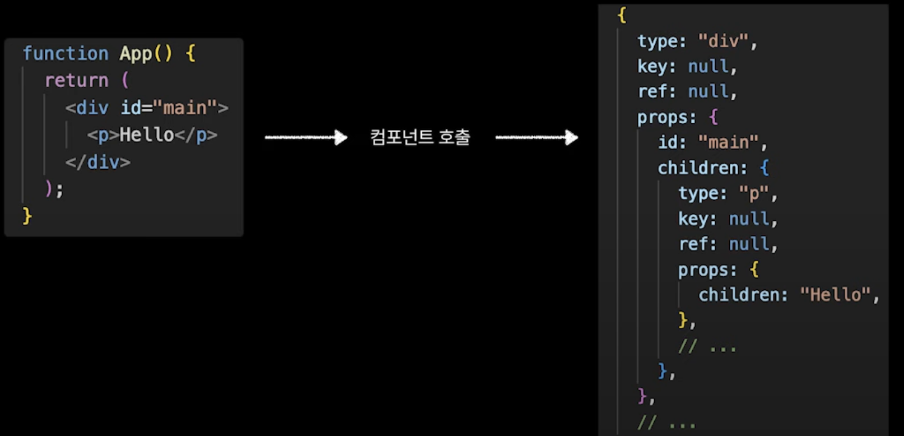
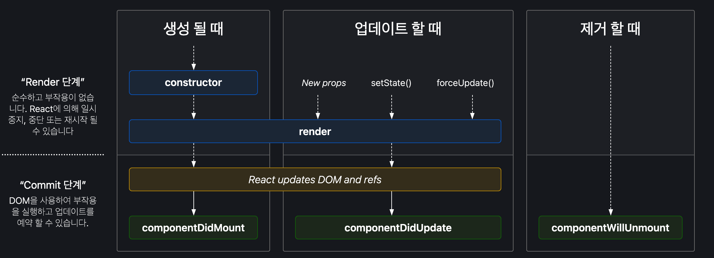
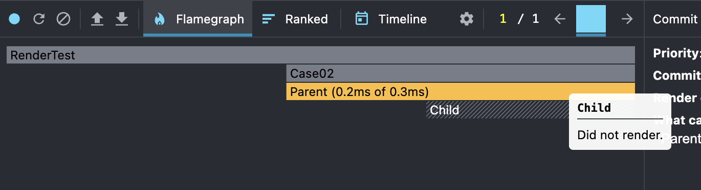

# DeepDive 브라우저, 리액트, 서버 렌더링

## 목차  

1.브라우저 렌더링    
2.리액트 렌더링    
3.Next.js 렌더링  
4.Revisit = NextJS 에서 서버 컴포넌트를 렌더링하는 과정  

---

## 브라우저 렌더링


### 브라우저의 렌더링 과정은 다음과 같이 요약

1.DOM 트리 생성
- HTML이 DOM 트리로 변환되는 단계. 
- Bytes > HTML Characters > Tokens > Nodes > DOM  

2.CSSOM 트리 생성
- CSS가 CSSOM(CSS Object Model)로 변환되는 단계  
- Bytes > HTML Characters > Tokens > Nodes > DOM  

3.렌더링 트리 생성
- DOM 트리 + CSSOM 트리 => Rendering Tree  


4.레이아웃 단계
- 뷰포트 내에서 각 요소의 정확한 위치와 크기를 정확하게 캡처하는 Box 모델이 출력 

5.페인팅 단계
- 실제 픽셀로 변환하여 화면에 그리는 단계입

- 크롬은 블링크(Blink), 사파리는 웹킷(Webkit) 그리고 파이어폭스는 게코(Gecko)라는 렌더링 엔진을 사용


### 리플로우(Reflow), 리페인트(Repaint)  

언제? 
- HTML 요소 추가  
- CSS 변경  

리플로우(Reflow) : 레이아웃에 영향이 있는 변경사항이 있을때. 
- position, width, height, margin, padding, border, border-width  
- font-size, font-weight, line-height, text-align, overflow  

리페인트(Repaint)만 일어나는 대표적인 속성들입니다.  
- background, color, text-decoration, border-style, border-radius  


ref : https://medium.com/%EA%B0%9C%EB%B0%9C%EC%9E%90%EC%9D%98%ED%92%88%EA%B2%A9/%EB%B8%8C%EB%9D%BC%EC%9A%B0%EC%A0%80%EC%9D%98-%EB%A0%8C%EB%8D%94%EB%A7%81-%EA%B3%BC%EC%A0%95-5c01c4158ce

#### 최소화  

transform VS position, top, left 
- 레이아웃에 영향을 주지 않는 속성(예: opacity, transform)으로 작성. 
- position, top, left 등의 속성은 레이아웃에 영향을 주기 때문에 리플로우를 유발.   


## 리액트 렌더링  

### 용어

1.리액트 컴포넌트 
- JSX를 반환하는 함수.  
- ReactElement를 반환하는 함수.  
- JSX는 createReactElement 함수로 변환된다.    

```js
function SecondChild(){
  const handleClick = useCallback(()=>{},[])
  return <div>SecondChild</div> // JSX
}
---
function SecondChild() {
  const handleClick = useCallback(() => {}, []);
  // JSX > createReactElement
  return /*#__PURE__*/ React.createElement("div", null, "SecondChild");
}
```
>https://babeljs.io/repl



2.Virtual DOM    

VDOM은 일종의 프로그래밍 컨섭이다. 
- 인메모리 상의 가상의 둠 (ReactDOM)을 하나 띄운다.  
- 그리고 실제 DOM과 Sync를 맞춘다. (이를 재조정 Reconciliation)    
- (매번 DOM을 RePaint보다 훨씬 비용이 싸다.)  

Double Buffering 구조
    

1.Current tree
- 실제DOM에 반영된(mount) fiber Node Tree 이다.    
- *fiber node = React Element에 추가 기능이 붙어 확장.    

2.WorkInProgress tree
- Render Phase에서 작업중인 fiber Node Tree이다.  
- current node 와 alternate key를 이용해서 서로 참조를 하고 있다.  
- Commit Phase가 끝나면 current Tree가 된다. 


### 리액트의 렌더링 과정

- 리액트의 렌더링 과정 1.Render Phase와 2. Commit Phase  
- Reconciliation은 React의 Virtual DOM에서 발생한 변경사항을 Real DOM에 반영하는 과정을 의미.  

1.Render Phase
- 1.Current Tree 기반으로 WIP Tree 생성
- 2.컴포넌트의 변경 사항(예: 새로운 요소 추가, 수정, 삭제)을 기반하여 React Element 반환
- 3.React Element는 Fiber Node 로 확장되어 WIP Tree가 업데이트
- 4.diffing 알고리즘을 통해 변경된 노드를 마킹
    - *React는 이 과정에서 비동기적으로 작업을 처리할 수 있으며, 이는 Concurrent Mode에서 성능 최적화를 위해 활용돼요.  
    - *Scheduler(스케줄러)를 통해 렌더링 순서를 조작할 수 있어요. useTransition 훅을 사용하면 저우선순위 작업을 지연시킬 수 있어요.  

2.Commit Phase

- Commit Phase에서는 Render Phase에서 변경된 Virtual DOM을 실제로 Real DOM에 반영하는 단계예요.
- 이 단계는 동기적으로 실행되며, 실제 DOM 조작, 브라우저에 UI를 업데이트하는 작업이 이루어져요.   
- 1.useLayoutEffect 동기적 실행
    - useLayoutEffect 훅이 동기적으로 실행돼요. 이 훅은 DOM이 업데이트된 직후, 화면에 그리기 전에 실행되므로, DOM 조작이 필요할 때 유용해요.
- 2.DOM 업데이트 및 Paint
    - 변경된 Virtual DOM의 내용을 Real DOM에 반영해요.
    - 브라우저는 이때 DOM을 Paint(화면에 그리기) 하며, UI에 변경 사항이 반영돼요.
- 3.useEffect 비동기적 실행
    - useEffect 훅은 비동기적으로 실행돼요. 이 훅은 DOM이 업데이트되고, 화면에 그려진 후에 실행되며, 주로 비동기 작업이나 서버 통신에 사용돼요.



https://projects.wojtekmaj.pl/react-lifecycle-methods-diagram/

### diffing 알고리즘 시간복잡도  

React는 대신, 두 가지 가정을 기반하여 O(n) 복잡도의 휴리스틱 알고리즘을 구현했습니다.  
- 1.서로 다른 타입의 두 엘리먼트는 서로 다른 트리를 만들어낸다. 
- 2.개발자가 key prop을 통해, 여러 렌더링 사이에서 어떤 자식 엘리먼트가 변경되지 않아야 할지 표시해 줄 수 있다.   
  - *type, key 의 변경 => 컴포넌트 파괴 후 재생성  


### 리렌더링이란?  
- 리액트 컴포넌트가 다시 호출되는 것   

리렌더링이 되는 조건  
- 1.state 가 변경  
- 2.props 가 변경  

컴포넌트 재생성의 조건
- 1.Component type 변경
- 2.key props 변경
- 3.조건부 랜더링 (if, && 사용) 
  - *기존 상태가 유지된다면 리렌더링 이다.
  - *재생성은 훨씬 더 비싼 비용이다. 리렌더링을 이용하자.    

### RenderPhase, CommitPhase Counter

```js
import React, { useRef, useEffect } from 'react';

function RenderCounterComponent() {
  const renderCount = useRef(0);
  const commitCount = useRef(0);

  renderCount.current += 1;
  console.log(`랜더 횟수: ${renderCount.current}`);

  useLayoutEffect(() => {
    commitCount.current += 1;
    console.log(`커밋 횟수: ${commitCount.current}`);
  });

  return (
    <div>
      <p>이 컴포넌트는 {renderCount.current}번 렌더링되었습니다.</p>
    </div>
  );
}

export default RenderCounterComponent;

```

## 리액트 재생성 최적화

### 1.조건부 렌더링에서 숨김처리로

- &&, if 대신 display:none

### 2.컴포넌트 키 관리

- 컴포넌트의 상태와 연관있는 key 사용
- *배열의 idx로 key를 사용하는것은 지양.  


## 리액트 렌더링 최적화  

불필요한 리렌더링 줄이기  

### 1.React.memo
- Render Phase 막는것이 목적  
- React.memo : 얕은 비교를 사용해서 props 비교 
- *위 얕은비교에서 객체의 경우 useMemo, 함수의 경우 useCallback 으로 동일 참조값 처리 필요.  


### 2.useCallback  

```js
const Case01 = () => {
  const handler = () => {};

  return (
    <div>
      <Second handler={handler} />
    </div>
  );
};
```
- 부모컴포넌트가 리렌더링되면 핸들러함수도 다시 만들어진다.      
- handler 함수를 useCallback 으로 감싸 동일한 참조값을 만들어 준다.    
- 여전히 리렌더링이 된다. 
- Commit Phase에서 재조정이 필요하지 않다. (확인가능?)  

### 3.useMemo
- 객체 참조는 useMemo 을 이용해서 참조값을 유지할 수 있다.  
- React.memo에서 얕은비교로 Render Phase 최소화 할 수 있다.    


### 무작정 사용하는것이 좋을까? 

  
React.memo 없이 리렌더링 방지하기  
- Component는 children를 합성하고 있다. 
  - babel 결과물을 보면 children에 createElement 함수가 없다.
  - Component 리랜더링에 의해 의존하지 않아서 리렌더링 개선 가능  




--- 

## 1.NextJS 에서 서버 컴포넌트를 렌더링하는 과정  


### 용어

1.Component 컴포넌트란?  
- 컴포넌트라고 하면 일반적으로 클라이언트 컴포넌트 이다.  
- 원래는 클라이언트 컴포넌트(RCC) 개념도 없었지만, 서버 컴포넌트 개념이 나오면서 구분짓기 위해 나왔다.   
- 리액트 컴포넌트 : JSX를 리턴하는 함수이다.  
  - 이는 props를 인자로 받고, 내부에는 state가 존재한다.    

*이하
- RCS: 리액트 서버 컴포넌트  
- CCS: 리액트 클라이언트 컴포넌트   


2.컴포넌트 렌더링 이란?  

컴포넌트 렌더링은 V-DOM을 그리는 과정 이다.  
- 2.1 JSX는 트랜스 파일링을 통해 (babel) createReactElement 함수로 변경된다.  
- 2.2 리액트 컴포넌트는 리액트 엘리먼트가 된다.  
- 2.3 리액트 엘리먼트는 객체이며 DOM을 그리기 위한 정보를 가지고 있다.  
  - 2.4 리액트 엘리먼트는 Fiber로 확장되며 이것은 V-Dom을 구성한다. 
  - 이것이 컴포넌트 렌더링이다.  
  - 2.5 V-Dom은 diffing 알고리즘을 통해서 R-DOM에 반영된다.   

>https://nextjs.org/docs/app/building-your-application/rendering/server-components#how-are-server-components-rendered  

### Rendering Chunk  

Next.js는 렌더링을 청크단위로 분리하여 처리한다.  
- Next.js는 React의 API를 사용해서 렌더링을 오케스트레이션 하는 것  

1.Route Segment Boundaries   
- chunk단위로 split 되어 렌더링. (individual route segments)  

- app Router의 loading, error 컴포넌트가 관여.  
  - 렌더링 전 : loading component
  - 렌더링 완료 : page component
  - 렌더링 오류 : error


2.Suspense Boundaries   
- Suspense 경계 > chunk단위로 split 되어 렌더링. 


```js
import { Suspense } from 'react'
import { PostFeed, Weather } from './Components'
 
export default function Posts() {
  return (
    <section>
      <Suspense fallback={<p>Loading feed...</p>}>
        <PostFeed />
      </Suspense>
      <Suspense fallback={<p>Loading weather...</p>}>
        <Weather />
      </Suspense>
    </section>
  )
}
```   

### Next.js의 렌더링 5단계    

### 1~2 : 서버에서 일어나는 과정  

1.RSC > RSC Payload
- React는 서버 컴포넌트를 React 서버 컴포넌트 페이로드(RSC Payload)라는 특별한 데이터 형식으로 렌더링해요.

React 서버 컴포넌트 페이로드(RSC)
- 렌더링된 React 서버 컴포넌트 트리의 압축된 바이너리 표현이에요. 
- 이 페이로드는 클라이언트에서 React가 브라우저의 DOM을 업데이트하는 데 사용돼요. 
- RSC 페이로드에는 다음이 포함돼요:
  - 1.RCS 렌더링 결과
  - 2.Placeholders : CCS를 렌더링해야 하는 위치 + 해당 JavaScript 파일에 대한 references    
  - 3.서버 컴포넌트에서 클라이언트 컴포넌트로 전달된 모든 props

2.HTML 렌더링 결과물 출력  
- Next.js는 : RSC Payload + Client Component JavaScript instructions > 서버에서 HTML을 렌더링합니다.

### 3~5 : 브라우저에서 일어나는 과정   

3.HTML Preview  
- 브라우저에서는 SSR과정에서 생성된 HTML을 받아서 즉시 보여준다.  
- 이는 fast but non-interactive preview ( 초기 페이지 로드에만 해당, SEO 유리 )     

4.Reconcile  
- RCS Payload 를 통해 Client and Server Component trees의 Reconcile 이 일어난다.  
- Server Component trees 에는 Placeholders 가 존재한다.  
- 이 자리를 Client Component가 들어가도록 Reconcile(조정)이 일어난다.  
- 최종적으로 리액트 컴포넌트 트리=V-DOM이 만들어진다.    

5.Hydrate  
- Hydration은 interactive 만들기 위함이다.   
- Client Component JavaScript instructions 이 사용된다.  
  - 그 안에는 useState, Event Handler 함수 등이 있다.    
