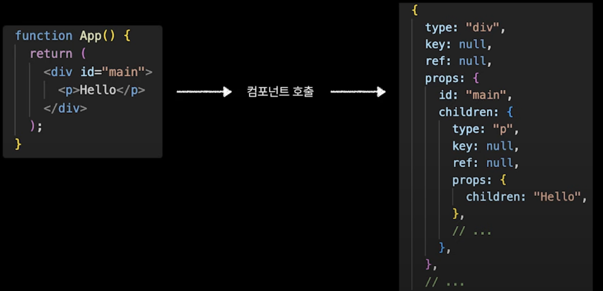
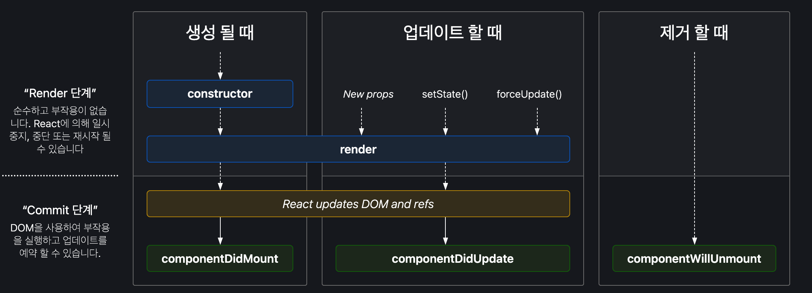
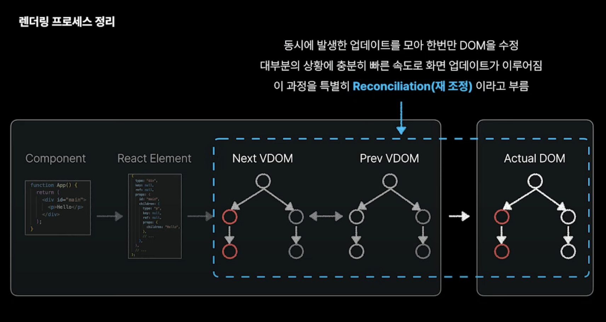
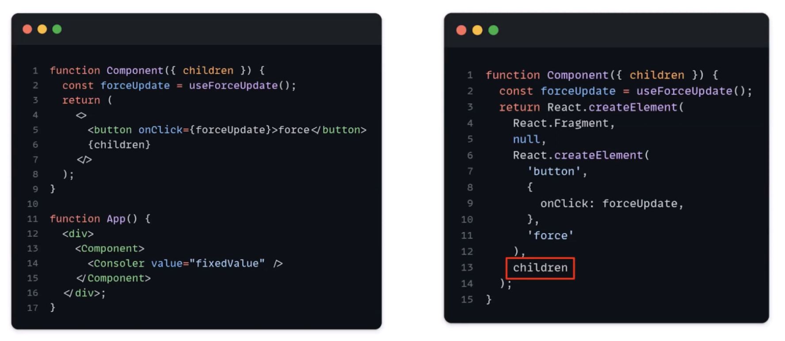
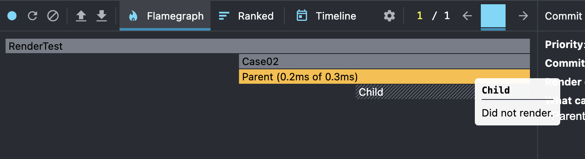

# DeepDive 브라우저, 리액트, Next 렌더링 과정 - 2

## 목차  

1.브라우저 렌더링    
2.리액트 렌더링, Next.js에서 서버 컴포넌트를 렌더링하는 과정  
3.Deep Dive - Next.js에서 서버 컴포넌트를 렌더링하는 과정  

---

## 2.리액트 렌더링  

### 용어

1.React Component  
- JSX를 반환하는 함수.  
- JSX는 React.createElement 함수로 변환된다.    
- 따라서 리액트 컴포넌트는 React Element를 반환하는 함수.  

```js
function SecondChild(){
  const handleClick = useCallback(()=>{},[])
  return <div>SecondChild</div> // JSX
}
---
function SecondChild() {
  const handleClick = useCallback(() => {}, []);
  // JSX > createReactElement
  return /*#__PURE__*/ React.createElement("div", null, "SecondChild"); 
}
```
>https://babeljs.io/repl



2.Virtual DOM    

V-DOM은 일종의 프로그래밍 컨셉이다.  
- 인메모리 상의 가상의 둠 (React DOM)을 하나 띄운다.   
  - 가상의 둠은 Double Buffering 구조 이다. (prev tree, next tree 2개가 공존)   
  - next tree는 다음 렌더링의 모양을 그리며 next tree과 비교하여 최소한의 변경사항만 체크한다.   
- 그리고 실제 DOM과 Sync를 맞춘다. (이를 재조정 Reconciliation 이라고 한다.)   
- (매번 DOM을 리페인팅 하는 것 보다 훨씬 비용이 싸다.)  


#### 📌 Double Buffering 구조   

    

1.Current Tree
- 실제 DOM에 반영된(mount) fiber Node Tree 이다.    
- *fiber node = React Element에 추가 기능이 붙어 확장된 객체    

2.Work In Progress Tree (WIP Tree)
- Render Phase에서 작업중인 fiber Node Tree이다.  
- Current node 와 alternate key를 이용해 서로 참조를 하고 있다.  
- Commit Phase가 끝나면 Current Tree가 된다. 


### 리액트의 렌더링 과정

- 리액트의 렌더링 과정 1.Render Phase와 2. Commit Phase  
- Reconciliation은 React의 Virtual DOM에서 발생한 변경사항을 Real DOM에 반영하는 과정을 의미.  

1.Render Phase
- 1.Current Tree 기반으로 WIP Tree 생성
- 2.컴포넌트의 변경 사항( 리렌더링, 새로운 라이프싸이클 )을 기반하여 React Element 반환
- 3.React Element는 Fiber Node 로 확장되어 WIP Tree가 업데이트
- 4.diffing 알고리즘을 통해 변경된 노드를 마킹
    - *React는 이 과정에서 비동기적으로 작업을 처리할 수 있으며, 이는 Concurrent Mode에서 성능 최적화를 위함.    
    - *Scheduler(스케줄러)를 통해 렌더링 순서를 조작 가능.
    - *useTransition 훅을 사용하면 작업을 지연 가능.    

2.Commit Phase

- Commit Phase에서는 Render Phase에서 변경된 Virtual DOM을 실제로 Real DOM에 반영하는 단계예요.
- 이 단계는 동기적으로 실행되며, 실제 DOM 조작, 브라우저에 UI를 업데이트하는 작업이 이루어져요.   
- 1.useLayoutEffect 동기적 실행
    - useLayoutEffect 훅이 동기적으로 실행돼요. 이 훅은 DOM이 업데이트된 직후, 화면에 그리기 전에 실행되므로, DOM 조작이 필요할 때 유용해요.
- 2.DOM 업데이트 및 Paint
    - 변경된 Virtual DOM의 내용을 Real DOM에 반영해요.
    - 브라우저는 이때 DOM을 Paint(화면에 그리기) 하며, UI에 변경 사항이 반영돼요.
- 3.useEffect 비동기적 실행
    - useEffect 훅은 비동기적으로 실행돼요. 이 훅은 DOM이 업데이트되고, 화면에 그려진 후에 실행되며, 주로 비동기 작업이나 서버 통신에 사용돼요.



https://projects.wojtekmaj.pl/react-lifecycle-methods-diagram/

### diffing 알고리즘 시간복잡도  

React는 두 가지 가정을 기반하여 O(n) 복잡도의 휴리스틱 알고리즘을 구현했습니다.  
- 1.서로 다른 타입의 두 엘리먼트는 서로 다른 트리를 만들어낸다. 
- 2.개발자가 key prop을 통해, 여러 렌더링 사이에서 어떤 자식 엘리먼트가 변경되지 않아야 할지 표시해 줄 수 있다.   
  - *type, key 의 변경 => 컴포넌트 파괴 후 재생성  




### 리렌더링이란?  
- 리액트 컴포넌트가 다시 호출되는 것   
- **컴포넌트 재생성과 리렌더링을 헷갈리면 안된다.**  

리렌더링이 되는 조건  
- 1.state 가 변경  
- 2.props 가 변경  

컴포넌트 재생성의 조건
- 1.Component type 변경
- 2.key props 변경
- 3.조건부 렌더링 (if, && 사용) 
  - *기존 상태가 유지된다면 리렌더링 이다.
  - *재생성은 훨씬 더 비싼 비용이다. 리렌더링을 이용하자.    

### RenderPhase, CommitPhase Counter

```js
import React, { useRef, useEffect } from 'react';

function RenderCounterComponent() {
  const renderCount = useRef(0);
  const commitCount = useRef(0);

  renderCount.current += 1;
  console.log(`렌더 횟수: ${renderCount.current}`);

  useLayoutEffect(() => {
    commitCount.current += 1;
    console.log(`커밋 횟수: ${commitCount.current}`);
  });

  return (
    <div>
      <p>이 컴포넌트는 {renderCount.current}번 렌더링되었습니다.</p>
    </div>
  );
}

export default RenderCounterComponent;

```

## 리액트 재생성 최적화

### 1.조건부 렌더링에서 숨김처리로

- &&, if 대신 display:none

### 2.컴포넌트 키 관리

- 컴포넌트의 상태와 연관있는 key 사용
- *배열의 idx로 key를 사용하는 것은 지양.  


## 리액트 렌더링 최적화  

불필요한 리렌더링 줄이기  

### 1.React.memo
- Render Phase 막는것이 목적  
- React.memo : 얕은 비교를 사용해서 props 비교 
- *위 얕은비교에서 객체의 경우 useMemo, 함수의 경우 useCallback 으로 동일 참조값 처리 필요.  


### 2.useCallback  

```js
const Case01 = () => {
  const handler = () => {};

  return (
    <div>
      <Second handler={handler} />
    </div>
  );
};
```
- 부모컴포넌트가 리렌더링되면 핸들러함수도 다시 만들어진다.      
- handler 함수를 useCallback 으로 감싸 동일한 참조값을 만들어 준다.    
- 여전히 리렌더링이 된다. 
- 그러나 Commit Phase에서 재조정이 필요하지 않다.
  - ( 확인 가능한 방법은 있는지 모르겠다. )   

### 3.useMemo
- 객체 참조는 useMemo 을 이용해 참조값을 유지할 수 있다.  
- React.memo에서 얕은비교로 Render Phase를 Skip 할 수 있다.    


### 무작정 사용하는 것이 좋을까? 

  
1.React.memo 없이 리렌더링 방지하기  
- Component는 children를 합성하고 있다. 
  - babel 결과물을 보면 children에 createElement 함수가 없다.
  - Component 리렌더링에 의해 의존하지 않아서 리렌더링 개선 가능  
- 이 방법을 Component Lifting-Up 이라고 부르자.  



2.리액트 관리에서 벗어나기  
- uncontrolled form을 사용하면 리렌더링이 필요없어진다.  

--- 


---

## 3.Next.js에서 서버 컴포넌트를 렌더링하는 과정  

### 용어

1.컴포넌트(Component)란?  
- 리액트를 사용한 사람에게 컴포넌트라고 하면 일반적으로 클라이언트 컴포넌트 이다.  
- 리액트에서는 원래 클라이언트 컴포넌트(RCC) 개념도 없었지만, 서버 컴포넌트(RSC) 개념이 나오면서 구분짓기 위해 나왔다.   
- 하지만 Next.js 에서는 기본적으로 컴포넌트는 서버 컴포넌트이다.
  - 클라이언트 컴포넌트 전환은 `use client` 디렉티브를 사용한다.     
- 리액트 컴포넌트 : JSX를 리턴하는 함수이다.  
  - 이는 props를 인자로 받고, 내부에는 state가 존재한다.    

*이하
- RCS: 리액트 서버 컴포넌트  
- CCS: 리액트 클라이언트 컴포넌트   


2.컴포넌트 렌더링 이란?  

컴포넌트 렌더링은 V-DOM을 그리는 과정 이다.  
- 2.1 JSX는 트랜스 파일링을 통해 (babel) React.createElement 함수로 변경된다.  
- 2.2 리액트 컴포넌트는 리액트 엘리먼트가 된다.  
- 2.3 리액트 엘리먼트는 객체이며 DOM을 그리기 위한 정보를 가지고 있다.  
  - 2.4 리액트 엘리먼트는 Fiber로 확장되며 이것은 V-DOM을 구성한다. 
  - 이것이 컴포넌트 렌더링이다.  
  - 2.5 V-Dom은 diffing 알고리즘을 통해서 R-DOM에 반영된다.   

>https://nextjs.org/docs/app/building-your-application/rendering/server-components#how-are-server-components-rendered  

### Rendering Chunk  

Next.js는 렌더링을 청크단위로 분리하여 처리한다.  
- Next.js는 React의 API를 사용해서 렌더링을 오케스트레이션 하는 메타 프레임워크  

1.Route Segment Boundaries   
- Chunk 단위로 split 되어 렌더링. (individual route segments)  

- app Router의 loading, error 컴포넌트가 관여.  
  - 렌더링 전 : loading component
  - 렌더링 완료 : page component
  - 렌더링 오류 : error


2.Suspense Boundaries   
- Suspense 경계 > chunk단위로 split 되어 렌더링. 


```js
import { Suspense } from 'react'
import { PostFeed, Weather } from './Components'
 
export default function Posts() {
  return (
    <section>
      <Suspense fallback={<p>Loading feed...</p>}>
        <PostFeed />
      </Suspense>
      <Suspense fallback={<p>Loading weather...</p>}>
        <Weather />
      </Suspense>
    </section>
  )
}
```   

### Next.js의 렌더링 5단계    

### 1~2 : 서버에서 일어나는 과정  

1.RSC > RSC Payload
- React는 서버 컴포넌트를 React 서버 컴포넌트 페이로드(RSC Payload)라는 특별한 데이터 형식으로 렌더링해요.

React 서버 컴포넌트 페이로드(RSC)
- 렌더링된 React 서버 컴포넌트 트리의 압축된 바이너리 표현이에요. 
- 이 페이로드는 클라이언트에서 React가 브라우저의 DOM을 업데이트하는 데 사용돼요. 
- RSC 페이로드에는 다음이 포함돼요:
  - 1.RCS 렌더링 결과
  - 2.Placeholders : CCS를 렌더링해야 하는 위치 + 해당 JavaScript 파일에 대한 references    
  - 3.서버 컴포넌트에서 클라이언트 컴포넌트로 전달된 모든 props

2.HTML 렌더링 결과물 출력  
- Next.js는 : RSC Payload + Client Component JavaScript instructions > 서버에서 HTML을 렌더링합니다.

### 3~5 : 브라우저에서 일어나는 과정   

3.HTML Preview  
- 브라우저에서는 SSR과정에서 생성된 HTML을 받아서 즉시 보여준다.  
- 이는 fast but non-interactive preview ( 초기 페이지 로드에만 해당, SEO 유리 )     

4.RSC Payload -> Render Tree로 변환되는 과정 

RSC Payload 파일  
- 1, 서버 컴포넌트의 렌더링 결과
- 2, 클라이언트 컴포넌트의 '참조(Reference)' 및 위치
- 3, 데이터 (Props)  
```js
1:I{"id":"./src/Button.js","chunks":["client0"],"name":"default"}
2:"User Data"
0:["$","div",null,{"children":[["$","h1",null,{"children":"Hello"}],["$","$L1",null,{"text":"Click Me"}]]}]
---
1:I...: "ID 1번은 ./src/Button.js라는 클라이언트 컴포넌트야." (참조 정의)
0:[...]: "루트 트리는 div이고, 그 안에 h1('Hello')이 있고, 그 뒤에 ID 1번 컴포넌트(버튼)를 렌더링해."
```

RSC Payload가 트리로 변환되는 과정  
- 1,Deserialization : 텍스트를 다시 React Element 객체로 변환
- 2,Client Component Resolution : Placeholder에 클라이언트 컴포넌트를 맞춘다.  
- 3,Reconciliation : 최종 React Render Tree 만들고 후속으로 실제 DOM에 반영(hydration)한다.  
  - RCS Payload 를 통해 Client and Server Component trees의 Reconcile 이 일어난다.  
  - Server Component trees 에는 Placeholders 가 존재한다.  
  - 이 자리를 Client Component가 들어가도록 Reconcile(조정)이 일어난다.  
  - 최종적으로 리액트 컴포넌트 트리=V-DOM이 만들어진다.    

5.Hydrate  
- Hydration은 Real DOM(HTML Preview으로부터 만든)과 브라우저에서 다시 만든 Reconciled Render Tree를 매핑하는 과정이다.  
- Hydration은 interactive 만들기 위함이다.   
- Client Component JavaScript instructions 이 사용된다.  
  - 그 안에는 useState, Event Handler 함수 등이 있다.    
