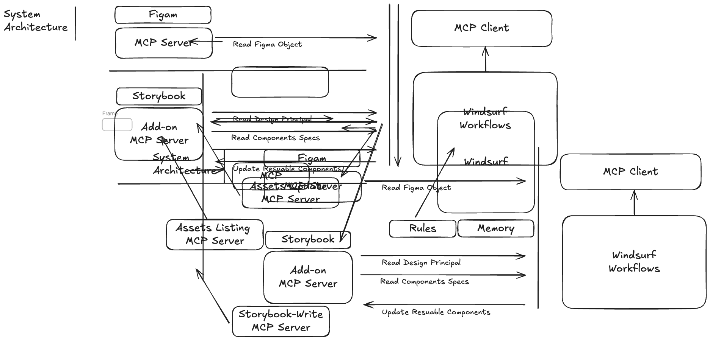

# FE System Design - MCP With Design System  

- [FE System Design - MCP With Design System](#fe-system-design---mcp-with-design-system)
  - [Windsurf 및 MCP 기반 Front-End 개발 생산성 향상 솔루션 기획서](#windsurf-및-mcp-기반-front-end-개발-생산성-향상-솔루션-기획서)
  - [Details of Storybook MCP](#details-of-storybook-mcp)

    

## Windsurf 및 MCP 기반 Front-End 개발 생산성 향상 솔루션 기획서

1. 개요  

1.1. Problem

현재 Front-End(FE) 개발 프로세스는 Figma 디자인을 코드로 변환하고, 이를 기존 디자인 시스템(Storybook)의 컴포넌트와 조합하는 과정에서 많은 수작업과 반복 작업을 필요
- 이로 인해 생산성 저하 및 휴먼 에러가 발생할 가능성이 있습니다.

1.2. Goal

- Windsurf 워크플로우와 'MCP(Model Component Prompt)' 을 수단으로 디자인(Figma)으로부터 실제 코드(React/Vue 등)를 생성하고 기존 자산(Storybook)과 연계하는 과정을 자동화함으로써, FE 개발 생산성을 n% 향상  

1.3. Solution  

주요 범위:
- Figma 디자인 분석용 MCP 개발
- Storybook 디자인 시스템 연동용 MCP 개발
- Figma-MCP와 Storybook-MCP를 통합하는 프롬프트 워크플로우 설계 (Windsurf 기반)

생산성 향상 측정 지표 정의 및 모니터링

2. 핵심 지표 및 측정

2.1. Metrics  

본 솔루션의 생산성 향상 효과는 '코드 자동 생성'과 '생성 코드의 자산화'라는 두 가지 축으로 측정하며, 지속적인 이터레이션을 통해 개선합니다. 측정할 핵심 지표는 다음과 같습니다.

지표 KR-1: MCP를 통한 코드 생성
- 목표: n줄
- 측정 방법: 디자인 컴포넌트 UI 코드 베이스 MCP를 사용하여 생산한 순수 코드 라인 (LOC)

지표 KR-2: 초기 생산성 증가 (자동화)
- 목표: n%
- 측정 방법: KR-1의 코드를 수동으로 작성할 때 드는 시간 대비 MCP 활용으로 단축된 시간 비율.

지표 KR-3: 생성 코드의 자산화 비율
- 목표: m%
- 측정 방법: KR-1의 코드 중, 검토 후 Storybook 등 디자인 시스템에 신규/업데이트 컴포넌트로 자산화 한 코드의 비율.

지표 KR-4: 자산화로 인한 누적 생산성 증가
- 목표: k%
- 측정 방법: KR-3을 통해 자산화된 컴포넌트가 재사용됨으로써 발생하는 추가적인 생산성 증가분. (재사용 횟수 * 컴포넌트 복잡도)

지표 KR-5: 총 누적 생산성 (10회 이터레이션)
- 목표: X%
- 측정 방법: (KR-2 + KR-4)의 사이클을 10회 반복한 총 누적 생산성 증가율.

3. 솔루션 요구사항

3.1. 기능 요구사항 (Functional Requirements)

3.1.1. Figma MCP (디자인 분석)
- FR-1.1: 사용자가 Figma 디자인 파일 참조(URL 또는 ID)를 입력할 수 있어야 한다.
- FR-1.2: MCP는 Figma API를 통해 디자인 파일을 분석하여, 페이지/프레임 내의 레이아웃, 컴포넌트(인스턴스), 스타일(컬러, 폰트, 간격)을 식별해야 한다.
- FR-1.3: 분석된 디자인 요소를 기반으로 구현에 필요한 'UI 요구사항 목록' (예: "Header 영역, 'primary-button' 2개 필요")을 텍스트로 도출해야 한다.

3.1.2. Storybook MCP (디자인 시스템 연동)
- FR-2.1: MCP는 연동된 Storybook의 컴포넌트 목록 메타데이터(e.g., stories.json)를 참조할 수 있어야 한다.
- FR-2.2: (설계 2 반영) Storybook의 컴포넌트 argTypes 또는 controls 정의를 바탕으로, 각 컴포넌트의 인터페이스(Props) 리스트와 타입을 명확히 정의하고 제공해야 한다. (예: Button 컴포넌트 - variant: 'primary' | 'secondary', size: 'sm' | 'md')

3.1.3. 통합 워크플로우 (Windsurf 기반)
- FR-3.1: FR-1(Figma 분석)과 FR-2(Storybook 매칭)의 결과를 조합하는 단일 프롬프트 명령(또는 워크플로우)을 제공해야 한다.
- FR-3.2:

워크플로우 예시:

개발자가 Windsurf에 "Figma '[디자인명]' 페이지 구현해줘"라고 입력.

(내부 실행 1) Figma-MCP가 Figma 분석 -> "로그인 폼, 'submit-button' 1개 필요".

(내부 실행 2) Storybook-MCP가 자산 조회 -> "'submit-button'은 'Button' 컴포넌트 (variant='primary')로 대체 가능".

(내부 실행 3) MCP가 두 정보를 조합하여 최종 코드를 생성. (기존 컴포넌트는 import하고, 없는 컴포넌트는 스켈레톤 코드를 생성).

FR-3.3: 최종 결과물로 (1)생성된 코드, (2)활용된 기존 컴포넌트 목록, (3)신규 생성이 필요한 컴포넌트 목록을 개발자에게 리포트해야 한다.

3.2. 비기능 요구사항

NFR-1 (확장성): 신규 Storybook 컴포넌트가 추가되거나 Figma 라이브러리가 업데이트될 때, MCP가 이를 자동으로 인지하고 반영할 수 있어야 한다. (e.g., stories.json 자동 리프레시)

1. 확인 및 제약 사항

4.1. 제약 및 확인 사항

C-1: (필수 확인) Windsurf 플랫폼에서 Storybook의 메타데이터(stories.json 등) 또는 Storybook-MCP API를 기술적으로 호출하고 데이터를 연동할 수 있는지 PoC(기술 검증)가 필요하다.  

## Details of Storybook MCP

Storybook MCP 서버에서 사용 가능한 도구(tools) 목록을 조회하는 JSON-RPC 요청 
- Storybook MCP 서버가 제공하는 모든 도구들의 목록과 각 도구의 설명을 받을 수 있다.  

curl -X POST http://localhost:6006/mcp \
  -H "Content-Type: application/json" \
  -d '{"jsonrpc":"2.0","id":1,"method":"tools/list","params":{}}'

---
커서에 local mcp 추가  

.cursor/mcp.json
{
  "mcpServers": {
    "storybook": {
      "type": "streamable-http",
      "url": "http://localhost:6006/mcp"
    }
  }
}

---
Tools 목록

1. list-all-components (모든 컴포넌트 목록 조회)
- 컴포넌트 라이브러리에서 사용 가능한 모든 UI 컴포넌트 목록을 반환

2. get-component-documentation (컴포넌트 문서 조회)
- 특정 UI 컴포넌트의 상세 문서를 가져옴
- 파라미터: `componentIds` (배열) - 조회할 컴포넌트 ID 목록

3. get-story-urls (스토리 URL 가져오기)
- 하나 이상의 스토리에 대한 URL을 조회
- 파라미터:
  - `stories` (배열) - 각 스토리는 다음을 포함:
    - `exportName` (필수): export된 이름
    - `absoluteStoryPath` (필수): 스토리 파일의 절대 경로
    - `explicitStoryName` (선택): 명시적 스토리 이름

4. get-ui-building-instructions (UI 개발 지침)
- UI 컴포넌트 개발 방법에 대한 지침 제공
- 중요: UI/프론트엔드/React/컴포넌트 개발 전에 항상 호출해야 함
- 파라미터 없음

---
[권장 워크플로우]

1단계: UI 개발 지침 확인 (4번 - get-ui-building-instructions)
2단계: 컴포넌트 목록 탐색 (1번 - list-all-components)
3단계: 상세 문서 확인 (2번 - get-component-documentation)
4단계: 스토리 URL 확인 (3번 - get-story-urls) (선택사항)

eg) 시나리오: 새로운 프로필 페이지 만들기
1. get-ui-building-instructions 호출
   → "shadcn/ui 사용, Tailwind CSS 스타일링" 확인

2. list-all-components 호출
   → Button, Card, Header, Page 컴포넌트 발견

3. get-component-documentation(['other-ui-card', 'example-button'])
   → Card와 Button의 Props 및 사용법 확인
   → Card는 title, image, content, action 지원
   → Button은 size, variant 옵션 지원

4. (필요시) get-story-urls로 브라우저에서 직접 확인

5. 코드 작성 시작

