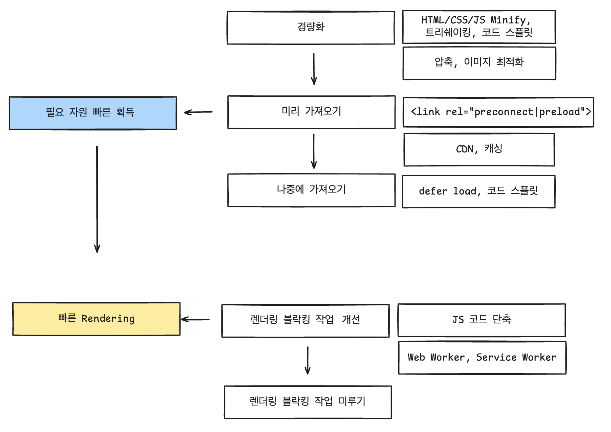

# Web 성능 지표  

## 주요 지표  
      

📌 LCP (Largest Contentful Paint)

>사용자 입장에서 유의미한 정보가 화면에 그려지는 시간  
가장 용량이 큰 컨텐츠가 렌더링 되는 시기인 LCP를 주요 컨텐츠가 로드되는 시기로 판단하는 것을 권장하고 있다.  

📌 CLS (Cumulative Layout Shift)
>비동기적으로 로드되는 환경에서, Layout Shift의 정도  

- 페이지가 로드되기 시작하는 시점으로 부터 모든 예기치 않은 레이아웃 이동의 누적 점수를 측정한다. 
- 일반적으로 리소스가 비동기적으로 로드되거나, DOM 요소가 기존 컨텐츠가 있는 페이지에 동적으로 추가될 때 발생.  

📌 FID (First Input Delay)
>인터렉티브 가능한 시점  

사용자가 페이지와 처음 상호작용한(클릭 또는 키 입력 등) 시간부터 브라우저가 실제로 이벤트 핸들러 처리를 시작할 수 있는 시간까지의 시간을 측정한다.

- 일반적으로 입력 지연은 브라우저의 기본 스레드가 다른 작업 (예: 대용량 js 파일 파싱)을 실행 중일때 발생한다. 
- 위와 같이 메인 스레드에서 작업중인데 user input이 발생하면 브라우저가 이에 대응하는데 FID만큼의 시간이 소요된다.  

## 최적화 방법  
  

## ref  

https://velog.io/@yrnana/%EC%9B%B9%EC%82%AC%EC%9D%B4%ED%8A%B8-%EC%84%B1%EB%8A%A5-%EB%A9%94%ED%8A%B8%EB%A6%AD#ssr%EA%B3%BC-csr%EC%97%90%EC%84%9C%EC%9D%98-%EC%84%B1%EB%8A%A5-%EB%A9%94%ED%8A%B8%EB%A6%AD  