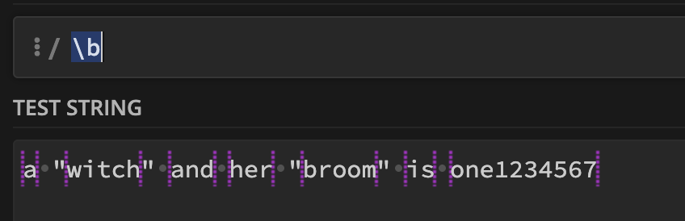

# 정규 표현식 예제  

## 숫자를 콤마가 포함된 문자열로 치환  

```js
x.toString().replace(/\B(?=(\d{3})+(?!\d))/g, ",");
console.log(numberWithCommas(1234567)); // "1,234,567"  
```
논리  
- 단어 경계를 제외해서 선택한다.  
- 조건:LookForward를 통해서 적어도 1개 이상의 숫자 3개 셋트가 반복되어야 한다.  
  - 위 조건에 조건을 하나 더 붙인다.   
  - (Neg)LookForward를 통해서 3개 숫자 셋트 뒤에는 숫자 1~2개가 나오면 안된다.  

- \B: 단어 경계 반대 클래스  
- (\d{3})+: 세 자리 숫자 그룹을 하나 이상 찾습니다.
- (?!\d): 바로 뒤에 숫자가 없는 위치를 찾습니다.

0.단어 경계도 선택할 수 있다. (조건자가 아니었네.??!)  
    
- 위 경계표시된것을 보면 선택된 부분을 볼 수 있다.  
- 단어경계를 선택하면 문자열의 시작,끝 부분이 선택  
- 단어경계 반대 클래스를 선택하면 문자열 시작,끝을 제외한부분이 선택 된다.  


1.긍정형 전방 탐색은 (?=...) 구문을 사용하여 표현     
- 정규식중에는 문자열을 소비하는 경우와 아닌경우가 있다.  
- 문자열을 소비하는 경우는 패턴과 일치하면 해당 문자열을 grab한다.    
- 그렇지 않은 경우라면, 조건에 맞는지만 체크한다.  
- 긍정형 전방 탐색은 조건같은것이다.  

```js
const str = "abc123xyz";
const regex = /\d(?=\D)/;
const result = str.match(regex); // 결과: ["3"]
```

2.부정형 전방 탐색(Negative Lookahead)    
- (?!) 구문을 사용하여 표현    
- 특정 패턴이 뒤따르지 않는 경우를 조건으로 내세울 수 있다.    

## 숫자 Validator  

### 양의 정수 Validator  

```js
function validateInput(input) {
    // 빈 문자열인지 확인
    if (input === "") {
        return true;
    }
    
    // 양의 정수인지 확인
    const positiveIntegerPattern = /^[1-9]\d*$/;
    return positiveIntegerPattern.test(input);
}


// 테스트 예제
console.log(validateInput(""));        // true (빈 문자열)
console.log(validateInput("123"));     // true (양의 정수)
console.log(validateInput("0"));       // false (0은 양의 정수가 아님)
console.log(validateInput("-123"));    // false (음의 정수)
console.log(validateInput("abc"));     // false (문자열)

---
const pattern = /^(?:|\d*[1-9]\d*)$/;

function validateInput(input) {
    return pattern.test(input);
}

```

### 정수 Validator    

```js
function validateInput(input) {
    // 빈 문자열인지 확인
    if (input === "") {
        return true;
    }
    
    // 0과 양의 정수, 음의 정수인지 확인
    const integerPattern = /^-?\d+$/;
    return integerPattern.test(input);
}

// 테스트 예제
console.log(validateInput(""));        // true (빈 문자열)
console.log(validateInput("123"));     // true (양의 정수)
console.log(validateInput("0"));       // true (0)
console.log(validateInput("-123"));    // true (음의 정수)
console.log(validateInput("abc"));     // false (문자열)
console.log(validateInput("12.34"));   // false (소수)

```


### 실수 Validator  

```js
function validateInput(input) {
    // 빈 문자열인지 확인
    if (input === "") {
        return true;
    }
    
    // 0, 양의 정수, 음의 정수, 소수점을 포함한 실수 확인
    const numberPattern = /^-?\d*\.?\d+$/;
    return numberPattern.test(input);
}

// 테스트 예제
console.log(validateInput(""));        // true (빈 문자열)
console.log(validateInput("123"));     // true (양의 정수)
console.log(validateInput("0"));       // true (0)
console.log(validateInput("-123"));    // true (음의 정수)
console.log(validateInput("123.45"));  // true (양의 실수)
console.log(validateInput("-123.45"))  // true (음의 실수)
console.log(validateInput("abc"));     // false (문자열)
console.log(validateInput("12.34.56")) // false (잘못된 형식)

```