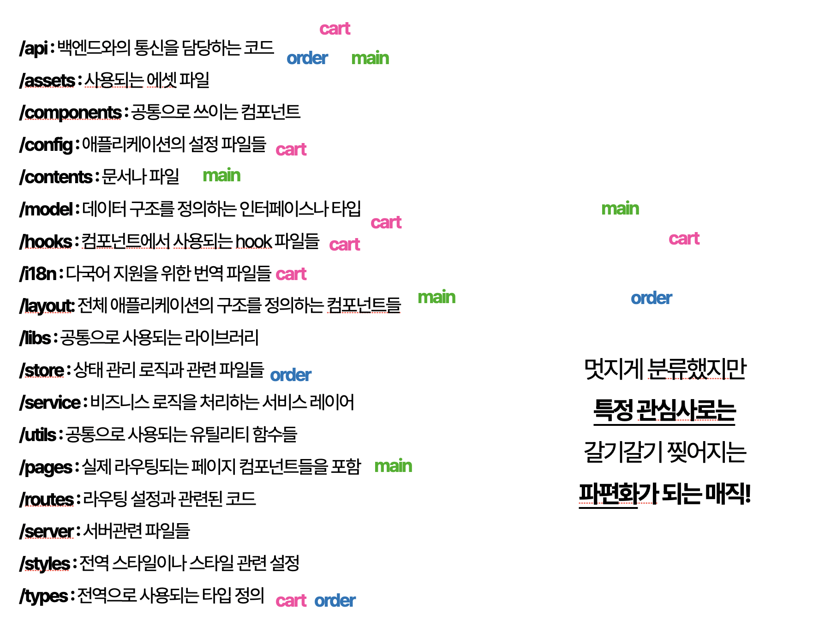

# FSD - 2 실전  

## 1

## FSD 실전  

  

🗂️ 기존, 보통의 폴더별 역할 요약

```
폴더	설명
/api	백엔드와의 통신을 담당하는 코드
/assets	이미지, 폰트 등 에셋 파일
/components	공통으로 사용하는 UI 컴포넌트
/config	앱의 설정 파일들
/contents	문서나 콘텐츠 파일들
/model	데이터 구조를 정의하는 타입 또는 인터페이스
/hooks	재사용 가능한 커스텀 훅들
/i18n	다국어 지원을 위한 번역 관련 파일
/layout	전체 레이아웃 구조를 정의하는 컴포넌트
/libs	공통으로 사용되는 라이브러리 코드
/store	상태 관리 로직 관련 (예: Redux, Zustand 등)
/service	비즈니스 로직 처리 계층 (API 호출 등)
/utils	유틸리티 함수 모음
/pages	라우트와 매핑되는 실제 페이지 컴포넌트
/routes	라우팅 설정 코드
/server	서버사이드 관련 파일 (예: Next.js API routes)
/styles	전역 스타일 정의
/types	전역에서 사용하는 타입 정의
```

### 📌 FSD에서 제시하는 방법론.   


  

#### 1.Layers  
- 레이어(Layer): 프로젝트 기능적 역할에 따른 수직적 관심사 분리
- 뭔소린고 하니 7계층 레이어에서 위 방향으로 추상화를 하는 것.  
- 중요한 원칙: 상위 레이어는 하위 레이어를 사용할 수 있지만, 그 반대는 불가능합니다. 이 원칙은 각 레이어의 독립성과 안정성을 보장합니다.  

예   
📌 shared : 잡다구리한것 다 넣기 ?   

- 목적: 여러 프로젝트에서도 재사용 가능한 공통 컴포넌트, 유틸리티, 설정을 포함.
- 사용 예: Button, Modal, useFetch 같은 재사용 가능한 요소나 debounce 같은 유틸리티 함수.
- 핵심 특징: 프로젝트 안팎으로 재사용 가능, 범용성이 높음.
  - shared + ui: 프로젝트 전반에 걸쳐 사용되는 재사용 가능한 UI 컴포넌트 (예: FormField, Card).
  - shared + api: 공통 API 설정 또는 유틸리티 (예: Axios 인스턴스 설정).
  - shared + model: 공통 기능을 제공하는 훅 (예: useAuth).
  - shared + lib: 반복적인 작업을 위한 유틸리티 함수 (예: formatDate, deepClone).
  - shared + config: 전역 상수 (예: 반응형 브레이크포인트, 색상).


📌 entities : 데이터 다체를 다루는 부분  
- 목적: 도메인 데이터 중심의 독립적인 요소를 표현.
- 사용 예: 순수 함수, 데이터 모델, 타입 정의, 기본 CRUD 연산.
- 핵심 특징: *순수성* 간단하고 독립적이며 데이터 중심적임. - *상태를 관리하지 않으며* 부작용이 없음.
  - entity + ui: 읽기 전용 프레젠테이셔널 컴포넌트 (예: - ProductDisplay).
  - entity + api: 기본 데이터 페칭 함수.
  - entity + lib: 엔터티 전용 유틸리티 함수.
  - entity + model: 비즈니스 로직과 타입 정의.
  - entity + config: 엔터티별 상수나 설정 값.

📌 Feature 레이어
- 목적: 특정 행동과 사용자 상호작용에 관련된 기능을 포함.
- 사용 예: 상태를 포함한 컴포넌트, 비즈니스 로직을 담은 커스텀 훅, 기능별 API 호출.
- 핵심 특징: 행동 중심적; 특정 기능이나 사용자 상호작용과 관련된 비즈니스 로직과 상태 관리.
  - features + ui: 주요 행동을 구현하는 컴포넌트 (예: AddToCartButton).
  - features + api: TanStack Query 같은 도구를 이용한 기능별 API 호출.
  - features + model: 로직을 다루는 커스텀 훅 (useAddToCart).
  - features + lib: 기능에 관련된 유틸리티 함수.
  - features + config: 기능별 상수나 설정 값.


📌  Widget 레이어
- 목적: 여러 기능이나 UI 요소를 독립적인 단위로 조합한 컴포넌트.
- 사용 예: Header, Footer, DashboardWidget처럼 여러 기능을 묶지만 자체 로직을 다루지 않음.
- 핵심 특징: 독립적인 단위로 다양한 작은 구성 요소를 집합함.
  - widgets + ui: UI 요소들의 조합.
  - widgets + api: 위젯 전용 데이터 페칭 (예: fetchWidgetData).
  - widgets + model: 데이터 집계 로직 (자주 사용되지 않음).
  - widgets + lib: 위젯 전용 유틸리티 함수.
  - widgets + config: 위젯의 동작에 관련된 설정.

📌  Page 레이어  
- 목적: 개별 페이지의 레이아웃과 로직을 구성하며, 위젯과 기능, 엔터티를 통합함.  
- 사용 예: HomePage, ProfilePage처럼 전체 페이지를 구성.   
- 핵심 특징: 전체 페이지; 경로 단위의 구조를 표현.  
  - pages + ui: 페이지의 레이아웃과 콘텐츠 구조.   
  - pages + api: 페이지 전용 API 호출 (예: useFetchHomePageData).  
  - pages + model: 경로 처리 및 페이지별 데이터 타입. 
  - pages + lib: 페이지 동작에 필요한 유틸리티.  
  - pages + config: 페이지 관련 설정 값.  


#### 2.Slices  
- 슬라이스(Slice): 비즈니스 도메인별 관심사 분리  
  - user: 사용자와 관련된 모든 코드(프로필 관리, 인증 등).
  - product: 상품과 관련된 코드(상품 리스트, 상세 페이지 등).
  - cart: 장바구니 기능.
  - order: 주문 관리 기능.

- 설명: 슬라이스는 각 도메인별로 코드를 나누어 유지보수를 쉽게 하고, 관련된 코드를 함께 둘 수 있도록 합니다.


#### 3.세그먼트(Segment): 기술적 관심사 분리
- 각 슬라이스는 다시 기술적 관심사로 분리됩니다. 이를 통해 도메인의 코드가 명확하게 구조화되고 관리됩니다.
  - api: 외부 서비스와의 통신을 담당하며 API  엔드포인트와 데이터 변환 로직을 포함합니다.
  - config: 프로젝트 전반에 걸친 설정 값과 상수.
  - lib: 순수 함수와 도메인 특화 헬퍼 함수 모음.
  - model: 데이터 구조, 상태 관리, 비즈니스 로직.
  - ui: 순수 표현 컴포넌트. 데이터와 이벤트 핸들러를 받아 화면을 렌더링합니다.

### 📌 도입하는데 팁  

1.처음부터 다 하지 말것. 점진적 도입 
- 규모가 커지면서 자연스럽게 필요한 레이어가 정해지더라구요.
- 어느정도 패턴이 보이면 분리를 entitiy나 feature등으로 분리  
- 그러다가 코드가 커지면 widgets으로 분리  

2.widget모다는 modules용어로 바꾸었던데, 나도 그게 더 직관적이다.  


3.리액트의 데이터의 흐름 관점에서 살펴봐라  
- 데이터의 흐름이 자연스러워야 한다.  
-   


## examples 살펴보기  

https://github.com/feature-sliced/examples

- 예제를 보니 위에서 받은 설명이랑 더 헷갈린다..  

Ref
- https://velog.io/@teo/fsd#2-%EB%8F%84%EB%A9%94%EC%9D%B8%EB%B3%84-%EA%B5%AC%EC%A1%B0-slice