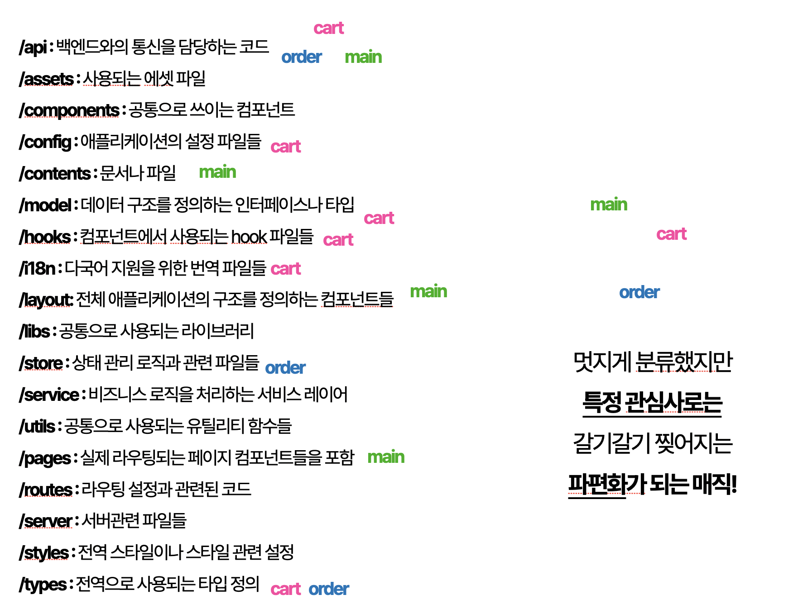

# FSD - 1 디렉터리 패턴  

📕 중요한 이유 
- 리액트 개발을 하다보면 컴포넌트가 너무 많아서 File Chagens, 관리가 어렵다.  
- FSD라는 개념도 이를 구조화 하기 위한 목적이며, MVC, MVVM도 큰 틀에서는 역할 분리를 하기 위함.  

📕 모듈과 레이어의 개념  
- 개발을 진행하다보면 도메인 로직과 도메인과 무관한 로직이 있다.  
  - 도메인 로직 : 최소 주문 금액 2만원  
  - 서비스 로직 : 이벤트 핸들러에 붙는 Error Catch, Logger 등  

용어 정립 
- 기능 (Functionality) : 비즈니스 목적의 서비스를 수행하는 독립적 단위  
  - 로그인 기능, 장바구니 기능, 프로필 편집 기능  
- 역할 (Responsibility) : 기술적 관심사 중심의 목적 달성을 수행하는 단위  
  - UI, Model, API, Validation, Lib    
- 관심사 분리(SOC, Seperation of Concerns)   
  - 관심사 분리는 크게는 기능과 역할로 분리한다.  
  - 관심사 분리는 기능 내에서도 분리한다.  
  - 관심사 분리는 역할 내에서도 분리한다.  


모듈과 레이어의 분리.   
- 모듈 : 무엇을 한다에 초점, 도메인/기능 단위 분리 ( user, product ) 
- 레이어 : 어떻게 한다에 초점, 역할/관심사 분리 ( UI, data, validation )
  

📕 모듈과 레이어의 2가지 구분 + 데이터의 흐름관점도 고려.  
- 특히나 리액트는 데이터가 단방향으로 흐르면서, 이벤트에 의해서 상위 데이터가 변경되는 흐름이다.  
- 모듈과 레이어를 구분지었는데, 모듈내에서만 데이터의 흐름이 이어질까?   


📕 FSD 아키텍처  
- 패턴의 본질 : 대규모 코드에서 팀원들간에 멘탈 모델을 공유하여 빠르게 그 구조를 파악할 수 있도록 한다.   
- FSD의 접근  
- 1.Feature Level로 큰 분류를 한다.  
  - 전제1. : Feature 단위 (장바구니, 결제 등)에서 장바구니 데이터의 스킴은 잘 변하지 않는다.  
  - 전제2. : Feature(모듈) 안에서 데이터의 흐름이 대부분 이어진다.  
  - 그렇기 때문에 Feature Level로 구분지

📕 원칙

1.단일 책임 원칙 (Single Responsibility Principle, SRP)  
- 하나의 역할만 수행  
2.의존성과 단방향 데이터 흐름  
- 
3.OCP 원칙 (Open/Closed Principle)  
- 수정으로 인한 사이드 이펙트가 발생했다면? OCP가 지켜진 것인가?!  
- namespace 패턴으로 그때그때 결함하는 컴포넌트로 가야 한다.  
4.응집도는 높게, 결합도는 낮게  
  - 모듈 내 기능들은 결합도가 올라가야  
  - 모듈 내 응집도가 올라가니, 
  - 모듈 간 결합도는 낮아진다.  
-   

## FSD 실전


---


## 응집도/결합도 관점에서 본 디렉터리 추상화    

>“개발자가 어떤 기능을 쓸 때 모든 내부 코드를 보지 않고, 
>핵심 인터페이스나 함수만 보면 사용할 수 있도록 한다.”  


```js

1. 배럴 파일(index.ts)을 최상위 인터페이스로 삼기  
- index.ts만 보면 전체 기능의 진입점과 핵심 기능이 보이도록 구성  
// src/features/user/index.ts
export * from './api';      // userApi
export * from './types';    // User, UserId
export * from './hooks';    // useUser, useUserList

2. 기능별 디렉토리 구조로 명확하게 분리  
src/features/user/
├── api.ts            // API 호출
├── hooks.ts          // React hook들
├── types.ts          // 타입 정의
├── utils.ts          // 내부 유틸
├── constants.ts      // 상수
└── index.ts          // 배럴 파일

3. 의도적으로 export 범위 제한  
// ❌ 좋지 않은 방식
// src/features/user/api.ts
export const fetchUser = ...

// ✅ 좋은 방식
// src/features/user/api.ts
const fetchUser = ...
export { fetchUser };

// 그리고 index.ts에서
export { fetchUser } from './api';  

3.1 명명 규칙으로 일관성 유지  
	•	useUser, fetchUser, User, UserId → 기능 중심으로 통일
	•	사용자가 추론하기 쉽게 네이밍  

3.2 export 의 Level를 생각하기.  
src/
└── features/
    └── user/
        ├── api               # 내부용
        ├── hooks             # 내부 + 외부
        ├── types             # 외부 (정의용)
        ├── constants         # 내부
        ├── utils             # 내부
        ├── components/       # 내부 전용 UI 컴포넌트들
        └── index.ts          # ✨ 외부에 노출할 public API만 export


Case 1. Internal exports : feature `내` 구성요소 간 공유 *.ts
- features/api/auth.ts, features/api/auth.ts

Case 2. Public exports : feature `간` 사용할 API만 노출 
- features/api/index.ts

Case 3. Feature-level re-export  : feature `외부`, 앱 전체에서 사용 가능하도록 공개 (app-level barrel) 
- features/index.ts


```

