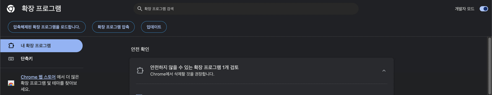

# Chrome extension - 1

- [Chrome extension - 1](#chrome-extension---1)
  - [참고 자료](#참고-자료)
  - [개발환경 구축](#개발환경-구축)
    - [파일 디렉터리 구조](#파일-디렉터리-구조)
    - [확장프로그램 개발버전 테스트 하기](#확장프로그램-개발버전-테스트-하기)
  - [Esstentials](#esstentials)
  - [Chrome action](#chrome-action)
  - [Chrome Alarm API](#chrome-alarm-api)
  - [Chrome Storage API](#chrome-storage-api)
  - [ServiceWorker Notification API](#serviceworker-notification-api)


## 참고 자료 

Chrome developer documentation: https://developer.chrome.com/docs/extensions/
Manifest file reference: https://developer.chrome.com/docs/extensions/mv3/manifest/
Chrome extension APIs reference: https://developer.chrome.com/docs/extensions/reference/
Service worker primer: https://developers.google.com/web/fundamentals/primers/service-workers
MDN service worker registration notifications reference: https://developer.mozilla.org/en-US/docs/Web/API/ServiceWorkerRegistration/showNotification

1. 간단하고 저렴한 개발
- 비용: Chrome Web 스토어에 여러 확장 프로그램을 게시할 수 있는 계정 등록비는 단 $5입니다.
- 기술적 단순성: 기본적인 기술로 간단한 프로젝트를 만들 수 있어 이력서에 추가하거나 개인용으로 사용할 수 있는 맞춤형 확장을 만들기에 좋습니다.

2. 현대 웹 프레임워크 활용
- 이 과정에서는 React와 같은 현대적인 프레임워크를 사용하여 확장 프로그램을 개발하므로 다른 소프트웨어 개발 분야에서도 활용 가능한 기술을 배울 수 있습니다.
- Chrome 확장 프로그램 개발 방식은 정적 웹 앱 디자인 방식과 유사하여, 기존의 웹 앱을 쉽게 확장 프로그램으로 변환할 수 있습니다.

3. 호스팅 및 트래픽
- 웹 스토어에 호스팅되기 때문에 SEO 작업 없이도 더 많은 트래픽을 유도할 수 있습니다.
- 정적 웹 앱을 Chrome 확장 프로그램으로 변환하면 배포 비용이 들지 않습니다.

4. 복잡성의 유연성
- 확장 프로그램은 간단한 유틸리티부터 백엔드 서버와 연결된 고급 확장 프로그램까지 다양하게 구성할 수 있습니다.
- 이 과정에서는 주로 간단하고 자급자족하는 확장 프로그램에 중점을 두지만, HTTP 요청을 통해 백엔드 서버에서 데이터를 가져오는 방법도 다룹니다.

## 개발환경 구축

### 파일 디렉터리 구조
```js

```

### 확장프로그램 개발버전 테스트 하기  

chrome://extensions/ 접속 후 
-   
- 압축해제된 확장프로그램을 로드합니다. > manifest파일이 포함된 로컬의 파일을 그대로 올리면 확장프로그램이 된다.     
- 파일 변경사항이 있으면 업데이트(혹은 새로고침) 버튼을 클릭하여 리로드 해야 한다. ( 핫리로드 지원 x )  


## Esstentials  

## Chrome action

```js
    chrome.action.setBadgeText({
      text: `${time + 1}`,
    });
```

## Chrome Alarm API    


[docs](https://developer.chrome.com/docs/extensions/reference/api/alarms?hl=ko)
- chrome.alarms API를 사용하여 주기적으로 또는 향후 지정된 시간에 코드가 실행되도록 예약합니다.


알람 생성 
- 알람은 일반적으로 확장 프로그램이 업데이트될 때까지 유지됩니다. 
- 하지만 이는 보장되지 않으며 브라우저가 다시 시작되면 알람이 삭제될 수 있습니다. 
- 따라서 알람이 생성될 때 저장소에 값을 설정한 다음 서비스 워커가 시작될 때마다 값이 있는지 확인하는 것이 좋습니다. 


```js
const STORAGE_KEY = "user-preference-alarm-enabled";

async function checkAlarmState() {
  const { alarmEnabled } = await chrome.storage.get(STORAGE_KEY);

  if (alarmEnabled) {
    const alarm = await chrome.alarms.get("my-alarm");

    if (!alarm) {
      await chrome.alarms.create({ periodInMinutes: 1 });
    }
  }
}

checkAlarmState();
```

알림에 응답  
```js
chrome.alarms.onAlarm.addListener((alarm) => {
  chrome.action.setIcon({
    path: getIconPath(alarm.name),
  });
});
```

## Chrome Storage API  


chrome.storage.sync  
- 사용자의 google 계정에 연결되어 데이터가 동기화 된다.  
- 제한 : 100kb (예, 테마, 설정, 북마크에 사용)  

```js
// setter
chrome.storage.sync.set({
  notificationTime: 1000,
});

// getter
chrome.storage.sync.get(['notificationTime'], (res) => {
  const notificationTime = res.notificationTime ?? 1000;
});
```

chrome.storage.local  
- 확장 프로그램 내에서 데이터를 저장하고 관리한다.  
- 제한 : 5MB (예, 테마, 설정, 북마크에 사용)  

```js
// setter
chrome.storage.local.set({
  timer: 0,
  isRunning: true,
});

// getter
chrome.storage.local.get(['timer', 'isRunning'], (res) => {
  const time = res.timer ?? 0;
  const isRunning = res.isRunning ?? true;
}); 
```

## ServiceWorker Notification API  

[ServiceWorkerRegistration](https://developer.mozilla.org/en-US/docs/Web/API/ServiceWorkerRegistration)

```js
// service-worker.js
this.registration.showNotification('Chrome Timer Extension', {
  body: `${notificationTime} seconds has passed!`,
  icon: 'icon.png',
});
```