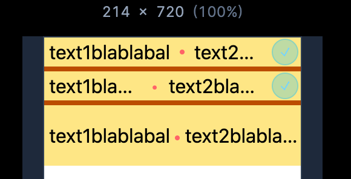

# Text CSS    

- [Text CSS](#text-css)
    - [Badge](#badge)
    - [Ellipsis Basic](#ellipsis-basic)
    - [Ellipsis 2행](#ellipsis-2행)
    - [Responsive Ellipsis](#responsive-ellipsis)
  - [Note](#note)
    - [-webkit 속성이 붙는 경우](#-webkit-속성이-붙는-경우)
  - [Icon](#icon)
    - [색상 상속받는 아이콘 설정](#색상-상속받는-아이콘-설정)


### Badge 
https://play.tailwindcss.com/LAirkC1RrN?size=514x720

```jsx
<!--  -->

<!-- 1. 문제의 코드 -->
<!-- 문제 : 배지가 안줄어든다. -->
<span class="inline-flex flex-nowrap items-center gap-1 rounded-4xl bg-amber-200 px-4 py-2">
  <svg class="h-[1lh] w-4 shrink-0" viewBox="0 0 22 22" fill="none" stroke-linecap="square">
    <circle cx="11" cy="11" r="11" class="fill-sky-400/25" />
    <circle cx="11" cy="11" r="10.5" class="stroke-sky-400/25" />
    <path d="M8 11.5L10.5 14L14 8" class="stroke-sky-800 dark:stroke-sky-300" />
  </svg>
  <span class="min-w-0 shrink-1 truncate">badge contentadge conadge conadge con</span>
</span>
<!-- flex를 쓰면 블록이니, w-fit으로 줄여도 동일하게 문제. -->
<span class="flex w-fit flex-nowrap items-center gap-1 rounded-4xl bg-amber-200 px-4 py-2">
  <svg class="h-[1lh] w-4 shrink-0" viewBox="0 0 22 22" fill="none" stroke-linecap="square">
    <circle cx="11" cy="11" r="11" class="fill-sky-400/25" />
    <circle cx="11" cy="11" r="10.5" class="stroke-sky-400/25" />
    <path d="M8 11.5L10.5 14L14 8" class="stroke-sky-800 dark:stroke-sky-300" />
  </svg>
  <span class="min-w-0 shrink-1 truncate">badge contentadge conadge conadge con</span>
</span>

<!-- 해결 : max-w-full -->
<span class="inline-flex max-w-full items-center gap-1 rounded-4xl bg-amber-200 px-4 py-2 align-middle">
  <svg class="h-[1lh] w-4 shrink-0" viewBox="0 0 22 22" fill="none" stroke-linecap="square">
    <circle cx="11" cy="11" r="11" class="fill-sky-400/25" />
    <circle cx="11" cy="11" r="10.5" class="stroke-sky-400/25" />
    <path d="M8 11.5L10.5 14L14 8" class="stroke-sky-800 dark:stroke-sky-300" />
  </svg>
  <!-- 핵심: 텍스트를 flex 아이템으로 만들고, 수축을 허용(min-w-0) + 말줄임(truncate) -->
  <span class="min-w-0 truncate">badge contentadge conadge conadge con</span>
</span>

<!-- 2. 문제의 코드 -->
<!-- box2는 줄어드는데 배지는 안줄어든다. -->
<div class="flex flex-row">
  <div class="min-w-[100px] flex-0 bg-pink-100">box - 1</div>
  <div class="inline-flex min-w-0 flex-1 flex-nowrap overflow-hidden">
    <span class="inline-block min-w-[60px]">box - 2</span>
    <span class="inline-flex max-w-full shrink-1 items-center gap-1 rounded-4xl bg-amber-200 px-4 py-2">
      <svg class="h-[1lh] w-4 shrink-0" viewBox="0 0 22 22" fill="none" stroke-linecap="square">
        <circle cx="11" cy="11" r="11" class="fill-sky-400/25" />
        <circle cx="11" cy="11" r="10.5" class="stroke-sky-400/25" />
        <path d="M8 11.5L10.5 14L14 8" class="stroke-sky-800 dark:stroke-sky-300" />
      </svg>
      <!-- 핵심: 텍스트를 flex 아이템으로 만들고, 수축을 허용(min-w-0) + 말줄임(truncate) -->
      <span class="min-w-0 flex-1 truncate">badgebadgebadge </span>
    </span>
  </div>
  <div class="min-w-[100px] flex-0 bg-pink-100">box - 3</div>
</div>

<!-- 줄긴 주는데 이번에는 뱃지가 늘어난다. -->
<div class="flex flex-row">
  <div class="w-[100px] flex-none bg-pink-100">box - 1</div>
  <!-- 중간 래퍼: 부모 flex 아이템이라 min-w-0 이미 잘 줌 -->
  <div class="inline-flex min-w-0 flex-1 flex-nowrap gap-2">
    <span class="inline-block min-w-[60px]">box - 2</span>

    <span class="inline-flex min-w-0 flex-1 basis-0 items-center gap-1 rounded-4xl bg-amber-200 px-4 py-2 align-middle">
      <svg class="h-[1lh] w-4 shrink-0" viewBox="0 0 22 22" fill="none" stroke-linecap="square">
        <circle cx="11" cy="11" r="11" class="fill-sky-400/25" />
        <circle cx="11" cy="11" r="10.5" class="stroke-sky-400/25" />
        <path d="M8 11.5L10.5 14L14 8" class="stroke-sky-800 dark:stroke-sky-300" />
      </svg>
      <!-- 텍스트: flex-1 + min-w-0 + truncate (불변) -->
      <span class="min-w-0 truncate">badgebadgebadge</span>
    </span>
  </div>

  <div class="w-[100px] flex-none bg-pink-100">box - 3</div>
</div>

<!-- 해결  -->
<div class="flex flex-row">
  <div class="w-[100px] flex-none bg-pink-100">box - 1</div>
  <!-- 가운데 래퍼: 폭을 먹고 줄어들 수 있게 -->
  <div class="inline-flex min-w-0 flex-1 flex-nowrap gap-2">
    <span class="inline-block min-w-[60px] flex-none">box - 2</span>
    <!-- 배지: grow 없이 shrink만, 수축 허용(min-w-0), 상한(max-w-full) -->
    <!-- flex-initial == grow-0 shrink basis-auto 와 동일 -->
    <span class="inline-flex max-w-full min-w-8 flex-initial items-center gap-1 rounded-4xl bg-amber-200 px-4 py-2 align-middle">
      <svg class="h-[1lh] w-4 shrink-0" viewBox="0 0 22 22" fill="none" stroke-linecap="square">
        <circle cx="11" cy="11" r="11" class="fill-sky-400/25" />
        <circle cx="11" cy="11" r="10.5" class="stroke-sky-400/25" />
        <path d="M8 11.5L10.5 14L14 8" class="stroke-sky-800 dark:stroke-sky-300" />
      </svg>
      <!-- 텍스트: 내부에서 남은 공간을 차지하며, 부족하면 ... 로 잘림 -->
      <span class="min-w-0 truncate">3badgebadgebadge</span>
    </span>
  </div>
  <div class="w-[100px] flex-none bg-pink-100">box - 3</div>
</div>

<span class="inline-flex max-w-full min-w-0 flex-initial items-center gap-1 rounded-4xl bg-amber-200 px-4 py-2">
  <svg class="h-[1lh] w-4 shrink-0" viewBox="0 0 22 22" fill="none" stroke-linecap="square">
    <circle cx="11" cy="11" r="11" class="fill-sky-400/25" />
    <circle cx="11" cy="11" r="10.5" class="stroke-sky-400/25" />
    <path d="M8 11.5L10.5 14L14 8" class="stroke-sky-800 dark:stroke-sky-300" />
  </svg>
  <span class="min-w-0 truncate">badge contentadge conadge conadge con</span>
</span>

```

### Ellipsis Basic  

```js
export const Ellipsis = styled.div`
  overflow: hidden;
  text-overflow: ellipsis;
  white-space: nowrap;
`;

<div style={{width:"100px"}}> # container width 지정 필수
  <Ellipsis>...</Ellipsis>
</div>
```

### Ellipsis 2행  

- overflow hidden 및 text-overflow ellipsis는 기본 설정이지만,    
- display:-webkit-box 및 line-clamp 속성을 이용해야 합니다.  


```js
export const EllipsisLine2 = styled.div`
  overflow: hidden;
  text-overflow: ellipsis;
  white-space: normal;
  display: -webkit-box;
  -webkit-line-clamp: 2;
  -webkit-box-orient: vertical;
`;

<div style={{width:"100px"}}> # container width 지정 필수
  <EllipsisLine2>...</EllipsisLine2>
</div>

```

### Responsive Ellipsis  

example - https://play.tailwindcss.com/xCM4Qh2XZ4?size=202x720  
    


📕 inline-flex의 기본 동작을 정리해야 한다.  
- flex의 기본 속성값은 0 1 auto 이다. 
- 순서대로 grow, shrink, basis 이며 0 1 auto의 의미는 
  - 기본적으로 요소는 늘어나진 않음
  - 하지만 다 같이 줄어듦 
  - auto는 자식 요소 만큼 기본 너비를 가져서 다른 요소보다 더 커질 수 있음.  
    - 이때 max-width, min-width를 사용하면 더 세부적인 조정이 가능하다.  
- flex:1 은 flex: 1 1 0 의미이다. ( 중요 : basis가 기본값인 auto에서 0으로 바뀐다. )  
  - 그래서 기본 요소들의 너비가 모두 공평하게 나누어 가진다.  
- flex:none = flex: 0 0 auto ( 주위 영향없이 본인의 너비만 딱 가져감. 이것의 shrink-0 써도 동일한 효과이다. )  

📕 span 태그의 텍스트 요소는 기본적으로 너비가 좁아지면 개행하여 표시된다.  
- truncate의 해석   
  -  white-space: nowrap; -> 이 속성으로 너비가 좁아져도 *개행하지 않도록* 설정 가능하다.    
  -  overflow: hidden; -> 컨테이너 너비가 작아지면 내부 요소는 안보이게 막는 동시에  
  -  text-overflow: ellipsis; -> ... 표시를 해준다.  
-  

📌 vertical-align 개념 개념.  
- vertical-align : baseline - 텍스트 기준선 / middle 부모요소의 높이의 중앙 기준

```jsx
<!-- text1 - dot - text2 - icon 의 형태로. 각 케이스별로 구현해보자. -->

<div class="mx-auto w-full max-w-[500px] bg-amber-200">
  <!-- 
    Case1. 
    - 부모 너비가 줄어드는 상황에서, text2가 먼저 말줄임표로 줄어들고 나머지 항목은 그대로 유지 한다.     
    - 중요 : truncate은 flex의 자리 차지 싸움에 영향 ( whilt )
  -->
  <div class="flex flex-row items-center gap-2 px-1">
    <span>text1blablabal</span>
    <span class="inline-block h-1 w-1 shrink-0 rounded-full bg-red-400"></span>
    <span class="truncate">text2blablabal</span>
    <span>
      <svg class="h-[1lh] w-5.5 shrink-0" viewBox="0 0 22 22" fill="none" stroke-linecap="square">
        <circle cx="11" cy="11" r="11" class="fill-sky-400/25" />
        <circle cx="11" cy="11" r="10.5" class="stroke-sky-400/25" />
        <path d="M8 11.5L10.5 14L14 8" class="stroke-sky-800 dark:stroke-sky-300" />
      </svg>
    </span>
  </div>
  <!-- 
    Case2.
    - 부모 너비가 줄어드는 상황에서, text2 , text1 같이 말줄임표로 줄어들고 나머지 항목은 유지.   

    flex의 기본 속성값은 0 1 auto 이다. ( 늘어나진 않음, 다 같이 줄어듦, 자식 요소만큼 이득봄 )
    flex:1  = flex: 1 1 0 ( basis가 0으로 바뀐다. ) 
    flex:none = flex: 0 0 auto ( 주위영향없이 본인너비만 딱 가져감. shrink-0만 써도 동일 )
   -->
  <div class="h-1 bg-amber-700"></div>
  <div class="flex flex-row items-center gap-2 px-1">
    <span class="truncate">text1blablabal</span>
    <span class="text-red-400">•</span>
    <span class="truncate">text2blablabal</span>
    <span class="shrink-0">
      <svg class="h-[1lh] w-5.5 shrink-0" viewBox="0 0 22 22" fill="none" stroke-linecap="square">
        <circle cx="11" cy="11" r="11" class="fill-sky-400/25" />
        <circle cx="11" cy="11" r="10.5" class="stroke-sky-400/25" />
        <path d="M8 11.5L10.5 14L14 8" class="stroke-sky-800 dark:stroke-sky-300" />
      </svg>
    </span>
  </div>

  <!-- 
    Case3. 오른쪽 부터 ...으로 줄어드는 방식 
    vertical-align : baseline - 텍스트 기준선 / middle 부모요소의 높이의 중앙 기준
   -->
  <div class="h-1 bg-amber-700"></div>
  <div class="truncate px-1 align-top leading-[50px]">
    <span class="">text1blablabal</span>
    <span class="inline-block h-1 w-1 rounded-full bg-red-400 align-middle"></span>
    <span class="">text2blablabal</span>
    <svg class="inline-block w-5.5 align-sub" viewBox="0 0 22 22" fill="none" stroke-linecap="square">
      <circle cx="11" cy="11" r="11" class="fill-sky-400/25" />
      <circle cx="11" cy="11" r="10.5" class="stroke-sky-400/25" />
      <path d="M8 11.5L10.5 14L14 8" class="stroke-sky-800 dark:stroke-sky-300" />
    </svg>
  </div>
</div>

```


## Note  


### -webkit 속성이 붙는 경우

- 브라우저의 호환성 때문이다. 특정 브라우저에서만 해당 기능을 켤 수 있다.  
- -webkit(사파리, 크롬), -moz (Firebox), -o(Opera), 없는것은 표준  
- 브라우저 마다 서로 다른 랜더링 엔진을 사용하고 있다.  


## Icon

### 색상 상속받는 아이콘 설정  


```js
<div>  // 1.text-color 속성을 준다.
  <svg> // 2.svg에서 color를 받는다. (안받아도 괜찮)
    <path> // 3.path에 fill='currentColor'를 주면 상위 text-color를 상속받는다.  
    </path>
  </svg>
</div>
```
