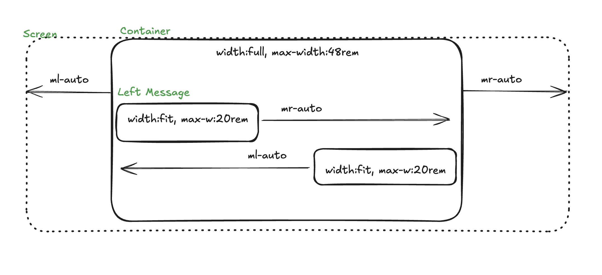
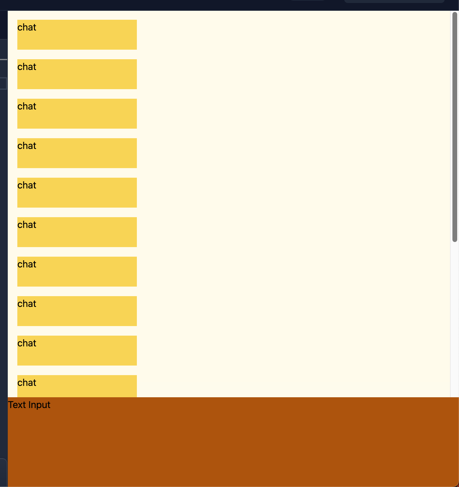
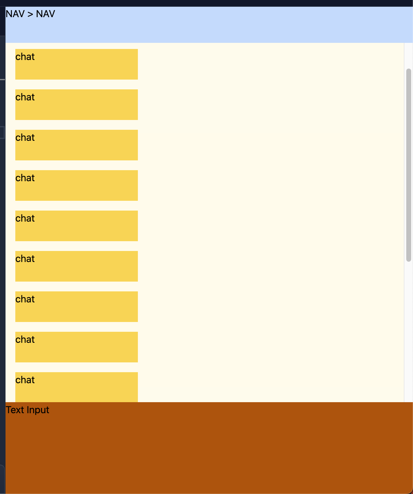

# Responsive Layout  

- [Responsive Layout](#responsive-layout)
  - [길어지는 텍스트 관리하기](#길어지는-텍스트-관리하기)
  - [버그 케이스 관리하기](#버그-케이스-관리하기)
  - [eg) Chat Layout](#eg-chat-layout)
    - [width 반응형](#width-반응형)
    - [Height 반응형](#height-반응형)
    - [Height 반응형 Ver2 ( with top nav )](#height-반응형-ver2--with-top-nav-)
  - [eg) Flexbox/Grid에서 min-width 기본값 1](#eg-flexboxgrid에서-min-width-기본값-1)
  - [eg) 자식 너비 기준 팝오버 구현](#eg-자식-너비-기준-팝오버-구현)
  - [참고](#참고)


디자인 파악하기   

1.UI안에서는 가변하는 부분이 있다.  
- 다국어 지원에 의해서 변하는 부분  
- DB에서 불러온 데이터의 경우 ( 금액, 포스팅 이름 등 MIN, MAX 값 )  
- >이러한 가변적인 경우에 UI가 어떻게 대응해야할지 고민 해야함. 
- *UI Stress Testing 진행*  

2.길어지는 경우 고려하기  
- 대부분의 경우 너비는 고정되어 있다.  
- 웹사이트는 아래로 스크롤 하여 보는데 이것은 사실 높이에 대해서는 비교적 유연하다는 말이다.  
- 그래서 보통 텍스트가 길어지는 경우에는 개행이 되어 내려가거나  
- 반응형 UI에서 공간이 부족한 경우 wrap (요소자체를 개행) 해버린다.  


## 길어지는 텍스트 관리하기   

시나리오 : 벳지 + 텍스트가 한줄로 있는데, 텍스트가 길어지는 경우 요소를 개행하기  

시나리오 : 높이가 고정된 쉘의 경우 말줄임표가 필요하다.   

시나리오 : 2줄까지는 개행을 하되, 3줄부터는 말줄임표로 넣는다.  

사니라오 : 반드시 모든 텍스트가 보여야 하는 경우  
- 텍스트를 클렌징하여 다른 워딩으로 변경  
- 폰트 사이즈 줄이기   
- 레이아웃 변경하기  


## 버그 케이스 관리하기
- span 태그에서 - line height 조정  


## eg) Chat Layout

### width 반응형  

https://excalidraw.com/#json=6zXxBddXK6_eedBqqUUvz,LA-iKY6rc0HDBusJZmNjSA  

1.가변 너비 적용 : min-width + fit-content + max-width  
- 최소 너비 보장 + 콘텐츠에 맞게 가변하는 너비 + 최대 너비 보장  
- height도 마찬가지 논리가 적용된다.  

2.가운데 정렬 적용 : margin-left:auto, margin-rigth:auto  
- auto : 빈공간을 자동으로 계산해서 채워준다.


### Height 반응형  


https://play.tailwindcss.com/KouIC0NGnM

1.최상위 부모 너비 100dvh  
2.부모 높이 승계 height 100%   
3.Input 영역은 150px 높이고정
4.Chat 영역은 나머지 차지하도록 flex-1로 최대한 공간 사용
  - Chat+Input Container : h-full flex, flex-col
  - Chat Outter Wrapper : flex-1 *overflow-hidden*
  - Chat Inner Wrapper : h-full *overflow-y-auto*
  - Chat Elements : h-4
  - * flex:1과 overflow-hidden이 만나면 flex1이 무한정 늘어나는것을 방지할 수 있다.
    - flex-1 = flex-grow: 1, flex-shrink: 1, flex-basis: 0%로 설정돼요  
    - flex-grow 1 (남는공간 다 채운다. 무한정 늘어날 수 있다.) / 
    - flex-shrink 1 (1로 줄어들 수 있다. 위에서 overflow-hidden이 있어 자식이 부모를 넘칠때 숨긴다.)  
  - * 부모 높이 승계 h-full, overflow-y-auto => 하위 요소에서 안보이는 영역들을 스크롤링 할 수 있다.    

### Height 반응형 Ver2 ( with top nav )  


https://play.tailwindcss.com/6sv9K7HGLz

- 위 원리와 동일하게 Nav , Chat Container 에도 flex-1 + overflow-hidden으로 가변 높이를 만들어야 한다.   


## eg) Flexbox/Grid에서 min-width 기본값 1

https://play.tailwindcss.com/1X3DAFxLuy  

min-width: auto는 콘텐츠 크기에 의해 결정, 

min-width 우선순위가 높다.   
- flex-shrink : 아무리 줄어도 min-width 보다 줄지는 않는다.  
- width: 0 : 너비 0인데, min-width가 있다면 너비 0 이 안된다.  
- max-width: 부모 너비 보다 min-width가 더 커지면 넘칠 수 있다.    
- overflow: hidden : min-width 보다 넘치는것을 가린다.  

```html
<!-- 문제 -->
<!-- min-width가 기본값 auto이므로, 최소 너비가 긴 텍스트의 너비만큼으로 설정됩니다. 이로 인해 부모 컨테이너(w-64)보다 더 넓어지려고 하면서 레이아웃을 밀어내고 텍스트가 밖으로 삐져나가게 됩니다. -->

<div class="flex w-64 rounded-lg border bg-gray-100 p-4">
  <div class="flex-shrink-0 pr-4">📌</div>
  <div class="flex-1">
    <p class="truncate font-semibold">file-name-that-is-very-very-long-and-should-wrap.pdf</p>
  </div>
</div>

<!-- 해결 -->
<div class="flex w-64 rounded-lg border bg-gray-100 p-4">
  <div class="flex-shrink-0 pr-4">📌</div>
  <div class="min-w-0 flex-1">
    <p class="truncate font-semibold">file-name-that-is-very-very-long-and-should-wrap.pdf</p>
  </div>
</div>

<!-- space-x의 용도 : 블록요소의 나열 간격(마지막 요소 제외) -->
<div class="flex space-x-[10px]">
  <div>요소 1</div>
  <div>요소 2</div>
  <div>요소 3</div>
</div>

```

## eg) 자식 너비 기준 팝오버 구현    

https://play.tailwindcss.com/43b2hxS6o9?size=390x720

```html
<!-- 자식 너비 기준 팝오버 구현 -->
<div class="m-2 w-fit max-w-[300px] min-w-[100px] overflow-hidden bg-amber-100 shadow">
  <div>Popover Title</div>
  <!-- 개행되는 콘텐츠 -->
  <div class="w-[100px] bg-green-300">Lorem</div>
  <!-- 개행안되고 줄어드는 콘텐츠 -->
  <div class="truncate bg-blue-100">Lorem ipsum</div>
</div>

<div class="m-2 w-fit max-w-[300px] min-w-[100px] overflow-hidden bg-amber-100 shadow">
  <div>Popover Title</div>
  <div class="w-[200px] bg-green-300">Lorem ipsum dolor sit amet consectetur adipisicing el</div>

  <div class="truncate bg-blue-100">Lorem ipsum dolor sit amet consectetur adipisicing elit.</div>
</div>

<div class="m-2 w-fit max-w-[300px] min-w-[100px] overflow-hidden bg-amber-100 shadow">
  <div>Popover Title</div>
  <div class="bg-green-300">Lorem ipsum dolor sit amet consectetur adipisicing elit. Distinctio impedit nesciunt delectus iure rerum suscipit officia beatae accusamus id nulla quas, illum assumenda doloribus neque expedita error cupiditate recusandae dolores?</div>

  <div class="bg-blue-100 not-visited:truncate">Lorem ipsum dolor sit amet consectetur adipisicing elit. Distinctio impedit nesciunt delectus iure rerum suscipit officia beatae accusamus id nulla quas, illum assumenda doloribus neque expedita error cupiditate recusandae dolores?</div>
</div>

```

## 참고
- https://www.daleseo.com/css-screen-height/
- https://www.daleseo.com/css-width/