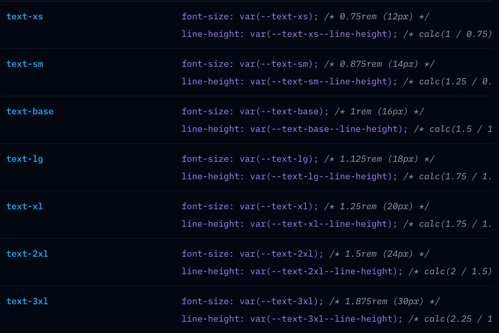

# TailwindCSS 1 Basic

- [TailwindCSS 1 Basic](#tailwindcss-1-basic)
  - [playground](#playground)
    - [📌 CSS 작성 규칙](#-css-작성-규칙)
  - [단위체계](#단위체계)
  - [1.외부 레이아웃](#1외부-레이아웃)
    - [1.1 flex, flex-col, justify, items, gap](#11-flex-flex-col-justify-items-gap)
    - [1.2 w, h, p, m](#12-w-h-p-m)
    - [position, absolute](#position-absolute)
  - [2.내부 레이아웃](#2내부-레이아웃)
    - [2.2 bg, border, border-color, rounded](#22-bg-border-border-color-rounded)
    - [overflow](#overflow)
    - [bg-gradient-to-t from-black](#bg-gradient-to-t-from-black)
    - [backdrop-filter](#backdrop-filter)
  - [콘텐츠 스타일링](#콘텐츠-스타일링)
    - [3.1 text-color, text-size, font-bold, cursor](#31-text-color-text-size-font-bold-cursor)
    - [3.2 hover, transition, :disabled](#32-hover-transition-disabled)
    - [transform, translate](#transform-translate)
    - [group](#group)
    - [text underline](#text-underline)
    - [text truncate](#text-truncate)
  - [etc](#etc)
    - [twMerge](#twmerge)

## playground

아래 사이트에서 연습이 가능하다.  
- https://play.tailwindcss.com/  


### 📌 CSS 작성 규칙    

작성 순서  
- 외부 레이아웃에서 내부 박스로 스타일을 결정해나간다.  

1.외부 레이아웃
- 1.레이아웃 : grid, flex, relative, absolute   
- 2.박스모델 만들기 : w,h,p,m  

2.내부 레이아웃
- 1.내부 레이아웃 : flex  
- 2.박스 모델 스타일 : bg, border, rounded

3.콘텐츠 스타일링  
- 1.콘텐츠 스타일 : text-color, text-size, font-bold, cursor  
- 2.가상 클래스, 트랜지션, 애니메이션 : hover, transition, :disabled


## 단위체계

tailwind css 에서는 rem 단위를 사용한다.  
- 1은 0.25 rem, 4는 1rem 이다. 
- 디폴트 값으로 1rem은 16px이다. 
- 고정된 px단위도 사용 가능하다.  

```js
# gap-1 은 0.25rem 만큼 떨어진다. 
# px단위는 []을 이용해서 사용한다.  
<div class="flex flex-row gap-1 gap-[5px]">
  <div>1</div>
  <div>2</div>
  <div>3</div>
</div>
```

## 1.외부 레이아웃

### 1.1 flex, flex-col, justify, items, gap

```js
# display:flex
className="flex"

# justify-content(main-axis)
className="flex justify-between"

# align-items(cross-axis)
className="flex items-center"

# direction
className="flex flex-row"
className="flex flex-col"

# gap
className="flex flex-col gap-y-4"

# flex:1 1 0%
className="flex flex-1"

# eg)
<div class="flex flex-row items-center justify-between gap-[5px]">
  <div>1</div>
  <div>2</div>
  <div>3</div>
</div>
```

### 1.2 w, h, p, m 

```js
# extrinsic 
className="h-auto h-5 h-[40px]"
# intrinsic - 내부 요소에 의해 크기 결정
className="h-fit h-min h-max"
className="w-auto w-full w-5 w-[40px]"
className="p-8 p-[40px] px-8 py-8"
className="m-8 m-[40px] mx-8 my-8"
```


### position, absolute

```js
// 중앙 정렬을 수행 한다.  
<div
  className="absolute
  right-[0px] top-[50%] transform -translate-x-1/2 -translate-y-1/2"
>
  <PiWarningCircleLight color="#EE4700" size={16} />
</div>
```


## 2.내부 레이아웃

### 2.2 bg, border, border-color, rounded

```js
className="bg-red-200"
className="bg-red-200 bg-opacity-50"
className="border border-solid border-red-300"
className="border-2 border-red-300"
className="rounded-full"
className="border border-transparent rounded-full"
className="cursor-pointer rounded-full hover:opacity-75 transition"

eg)
<div class="h-40 w-40 cursor-pointer rounded-full border border-transparent bg-red-200 transition-colors hover:bg-red-300"></div>

```

### overflow

```js
# 평소에는 스크롤이 없다가, 오버플로 발생시 스크롤이 나온다.
className="overflow-y-auto"
```

### bg-gradient-to-t from-black

```js
className="w-full h-full absolute top-0 bg-gradient-to-t from-black"
```

### backdrop-filter

```js
# backdrop-filter: blur(10px);
# position: absolute; inset: 10px 20px 30px 40px;
className="bg-neutral-900/90 backdrop-blur-sm fixed inset-0"
```

## 콘텐츠 스타일링  

### 3.1 text-color, text-size, font-bold, cursor

https://tailwindcss.com/docs/font-size
```js
# color
className="text-green-500"

# font-size (text-sm, text-md, text-lg..)
className="text-sm text-md text-2xl text-[50px]"

# weight, font-bold(700)
className="font-medium font-[500] font-bold font-[700]"

className="cursor-pointer"
```
  
- xs(12), sm(14), base(16), lg(18), xl(20), 2xl(24), 3xl(30), 4xl(36)

### 3.2 hover, transition, :disabled

```js
className="transition"
className="hover:text-white"
className="disabled:cursor-not-allowed disabled:opacity-50"
```


### transform, translate

```js
// 중앙 정렬을 수행 한다.  
<div
  className="absolute
  right-[0px] top-[50%] transform -translate-x-1/2 -translate-y-1/2"
>
  <PiWarningCircleLight color="#EE4700" size={16} />
</div>
```

### group

- group 이라는 classname
- 부모 선택자 (group), 부모 요소에 hover할 떄 자식요소들이 반응할 수 있다.  

https://tailwindcss.com/docs/hover-focus-and-other-states#styling-based-on-parent-state

### text underline

```js
<Link
  className="underline underline-offset-4"
  href="https://github.com/vercel/ai-chatbot"
  target="_blank">
open source</Link>
```

### text truncate

```js
    <Link
      href={href}
      className={twMerge(
        `flex flex-row items-center gap-x-4 
      h-auto w-full py-1 
      text-md text-neutral-400 font-medium cursor-pointer
      hover:text-white transition`,
        active && "text-white"
      )}
    >
      <Icon size={26} />
      <p className="w-100 truncate">{label}</p>
    </Link>
```

## etc

### twMerge

React, NextJS에서 사용한다.  
- 조건에 따라 선택적으로 className을 넣을 수 있다.  

```js
import { twMerge } from "tailwind-merge";
className={twMerge(``,active && "text-white")}
```
