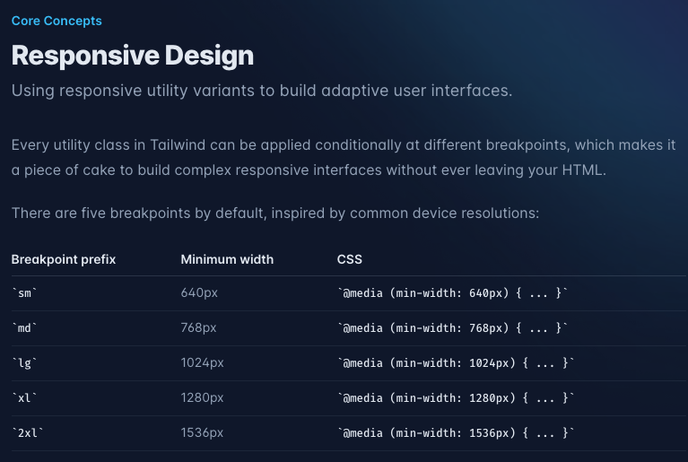

# TailwindCSS Responsive

- [TailwindCSS Responsive](#tailwindcss-responsive)
  - [📌 반응형 UI만드는 방법](#-반응형-ui만드는-방법)
  - [Breakpoint](#breakpoint)

## 📌 반응형 UI만드는 방법  

https://tailwindcss.com/docs/responsive-design
- UI는 Mobile우선 작업을 한다. 그리고 PC로 확장을 한다.   
- Mobile에서 구동 가능한 화면은 PC에서 볼 수 있지만 반대의 경우는 그렇지 않다.  

```js
# md:hidden : @media (min-width: 768px) { ... }
- 최소 768px 이상의 너비를 가진 화면이라면,(예 PC) 작동하는 로직
- 모바일을 기준으로 작업을한다. 모바일에서 보이는건 PC에서 보이지만 반대의 경우에는 그렇진 않기 떄문.  

# type1 - mobile 보여주다가, PC 숨긴다.
className="flex md:hidden gap-x-2 items-center"


# type2 - PC에서 보여주다가, mobile의 경우 숨긴다.
className="hidden md:flex gap-x-2 items-center"

```

## Breakpoint  

>> https://tailwindcss.com/docs/responsive-design
>> https://tailwindcss.com/docs/screens

```
Breakpoint prefix	Minimum width	CSS

sm	640px	@media (min-width: 640px) { ... } -- ~ 640px 모바일로 잡기 (breakpoint1)  
md	768px	@media (min-width: 768px) { ... } 
lg	1024px	@media (min-width: 1024px) { ... } -- 테블릿 (breakpoint2)
xl	1280px	@media (min-width: 1280px) { ... }
2xl	1536px	@media (min-width: 1536px) { ... }

참고: youtube music
- 0 - 615px : mobile 대응 
- 615px - 935px : mobile 대응, 일부 UI는 더 보임(예 - sidebar)
– 935px ~ max :  PC 대응

```

