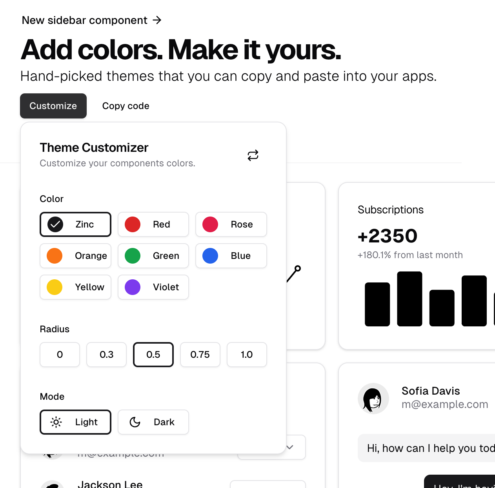

# TailwindCSS Theme


## 📌 Theme

>https://ui.shadcn.com/themes   

1.shadcn의 장점중 하나는 테마를 설정할 수 있다.  
- global.css 에서 css variable로 테마 색상을 변경가능.    

2.tailwind는 레이어 디렉티브 개념을 사용한다. `예, @layer base `    
- CSS 파일 어디든 작성해도 `적용 우선 순위` 보장.  

2.1 Tailwind의 레이어 우선순위  
	1.	Base: 기본 스타일 (HTML 태그 초기화 및 전역 스타일)
	2.	Components: 재사용 가능한 컴포넌트 스타일
	3.	Utilities: 유틸리티 클래스 스타일 (가장 강력하며, 다른 스타일을 덮어씀)

2.2 `@layer` 라는 디렉티브로 css파일에 적용한다.  

```css
@tailwind base;
@tailwind components;
@tailwind utilities;

@layer utilities {
  .text-balance {
    text-wrap: balance;
  }
}
/* hsl로 정의된다. 	
  •	Hue (색상): 0~360도 사이의 값 (색상의 각도를 나타냄, 예: 빨강은 0, 초록은 120, 파랑은 240)
	•	Saturation (채도): 0~100% (색의 강도)
	•	Lightness (명도): 0~100% (밝기) */
@layer base {
  :root {
    --background: 0 0% 100%;
    --foreground: 0 0% 3.9%;
    ...
```

3.기본 테마 적용하기
  
>https://ui.shadcn.com/themes  

- 위 테마 선택 후 global.css에서 변경한ㄷ.ㅏ  

```
@layer base {
  :root {
    --background: 0 0% 100%;
    ...
  }

  .dark {
    --background: 240 10% 3.9%;
    -...
}

```

4.테마 색상 변경하기
>https://ui.shadcn.com/docs/theming

4.1 CSS Variables 방식을 사용한다.  
- global.css에 변수를 정의한다.  
- tailwind.config.js에 정의한 변수를 추가한다. ( className 사용 가능 )


### color-scheme

```
html,body,:root{
  height: 100%;
  background-color: black;
  color-scheme: dark;
}
```
