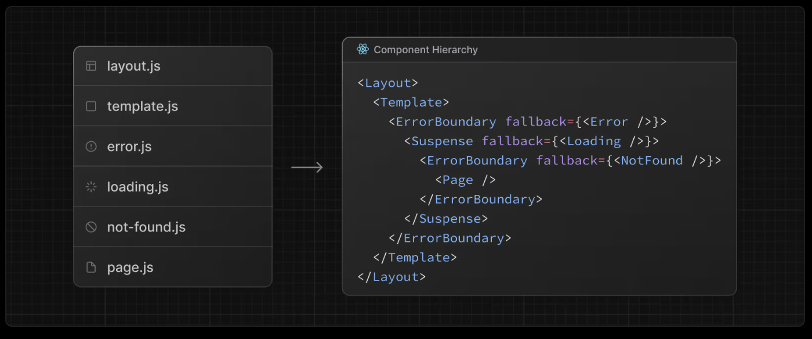

# 리액트 인사이트 Part5

- [리액트 인사이트 Part5](#리액트-인사이트-part5)
  - [19장 Next.js 앱 라우터와 서버 액션, 그리고 새로운 리액트 훅 돌아보기](#19장-nextjs-앱-라우터와-서버-액션-그리고-새로운-리액트-훅-돌아보기)


## 19장 Next.js 앱 라우터와 서버 액션, 그리고 새로운 리액트 훅 돌아보기

19.5 액션과 함께 사용하는 리액트 19버전 훅  
____19.5.1 액션과 서버 액션의 관계  
____19.5.2 useActionState( )과 트랜지션 사용하기  
____19.5.3 useOptimistic( )으로 낙관적 업데이트 구현하기  
____19.5.4 useFormStatus( )로 폼 상태 확인하기  
학습 마무리 | 핵심 키워드 리마인드  

📌 App Router의 File Convention  
- page router는 파일명 기반으로 라우터가 되는 반면 app router는 디렉터리 구조가 라우터 구조가 된다.  
- 디렉터리 구조에 따라서 Component hierarchy가 만들어진다.  
- https://nextjs.org/docs/app/getting-started/project-structure#component-hierarchy  

  
```js
순서
1, layout.js
2, template.js
3, error.js
4, loading.js
5, not-found.js
6, page.js
```

  

- App Router의 장점  
  - 라우터의 구조를 선언적으로 관리한다.  
  - 라우팅과 관련된 컴포넌트로 응집도를 높인다. 

- 언제 Template을 사용해야 할까?
  - 페이지 전환 애니메이션: Framer Motion 등을 사용하여 페이지가 바뀔 때마다 등장 애니메이션을 보여줘야 할 때   
  - useEffect 재실행: 페이지 방문 시마다 로깅, API를 다시 호출
  - 상태 초기화: 사용자가 페이지를 바꿀 때마다 폼(Form) 입력 상태를 완전히 깨끗하게 비워야 하는 경우.    

사실상 template가 존재하는 기준, 하위 경로가 바뀌면 리셋  
- app/post/template.tsx  
  - /post/1 → /post/2: 리셋  
  - /post/list → /post/write: 리셋  
  - /post/detail/1 → /post/detail/2: 리셋    
- app/post/detail/template.tsx (자식 템플릿)
  - /post/1 → /post/2: No Render ❌  
  - /post/list → /post/write: No Render ❌  
  - /post/detail/1 → /post/detail/2: 리셋  

--- 

📌 Static, SSG/ISR, Dynamic Rendering  

Next.js의 빌드 결과 아래 표현을 볼 수 있다.  
- ○  (Static)    prerendered as static content  
- ●  (SSG/ISR)   정적이지만 데이터에 따라 변함  
- ƒ  (Dynamic)   server-rendered on demand  


1,정적렌더링 (Static, SSG/ISR) : 빌드 타임에 미리 HTML등 정적리소스를 만들어둠    
- FCP가 가장 좋은 형태이며 Next는 가능한 정적 렌더링으로 분류하려고 노력한다.  
  - generateStaticParams로 정적세그먼트 id 목록을 만들 수 있다.  
- ISR 패턴: 정기적으로 다시 HTML을 빌드한다. ( Stale 데이터를 보여주는것이 문제가 안되는 경우)    
- On demand static generation : 빌드타임때 생성하지 못한 정적페이지를 요청이 들어올때 만드는 기능  
  - *동적렌더링과 다르다. 쿠키,헤더, serachParams을 여전히 사용 못함. ( 강제할 수 있으나 렌더링에 반영못함. )  

1-2, 정적페이지 결과물 
- 1,html : 순수 HTML, 이는 FCP 향상  
- 2,meta : 프레임워크 내부에서 관리하는 파일
- 3,rsc : RSC Payload 파일 -> 클라이언트 사이드 네비게이션 및 상태 관리  

1-3, RSC Payload 파일  
- 1, 서버 컴포넌트의 렌더링 결과
- 2, 클라이언트 컴포넌트의 '참조(Reference)' 및 위치
- 3, 데이터 (Props)  
```js
1:I{"id":"./src/Button.js","chunks":["client0"],"name":"default"}
2:"User Data"
0:["$","div",null,{"children":[["$","h1",null,{"children":"Hello"}],["$","$L1",null,{"text":"Click Me"}]]}]

1:I...: "ID 1번은 ./src/Button.js라는 클라이언트 컴포넌트야." (참조 정의)

0:[...]: "루트 트리는 div이고, 그 안에 h1('Hello')이 있고, 그 뒤에 ID 1번 컴포넌트(버튼)를 렌더링해."
```
RSC Payload가 트리로 변환되는 과정  
- 1,Deserialization : 텍스트를 다시 React Element 객체로 변환
- 2,Client Component Resolution : Placeholder에 클라이언트 컴포넌트를 맞춘다.  
- 3,Reconciliation : 최종 React Render Tree 만들고 후속으로 실제 DOM에 반영(hydration)한다.  

2, 동적렌더링 : 사용자의 요청이 들어오면 서버사이드 렌더링을 하는 것  
- 매 요청마다 SSR을 진행하므로, Full Route Cache는 어렵지만 Fetch 수준(데이터 패칭)에서 최적화 가능.  
  - 자동 판단, 동적 API (header, cookie), searchParams 사용하는 경우 -> 동적 라우트 판단  
  - 수동 설정, dynamic 옵션값이 'force-dynamic'   

```js
// On demand static generation 비활성화, 생성되지 않은 페이지는 404페이지 반환  
export const dynamicParams = false; 
// ISR 적용, 60초 
export const revalidate = 60; 
export const dynamic = 'auto' |'force-dynamic' // 기본값 auto, 정적/동적 next가 선택한다. 
```


📌 다계층 케시 전략 Full Router Cache, Router Cache     

1,다계층 케시 전략을 사용한다.    
- 1,서버사이드 캐시 전략 : Full Router Cache   
  - 저장 위치 : Server ( HTML + RSC Paylaod 저장 -> 모든 사용자 사용 )  
- 2,클라이언트 사이드 캐시 전략 : Router Cache (후속 탐색 subsequent navigations)  
  - 저장 위치 : Browser ( RSC Paylaod 단위 저장 -> 개별 사용자가 끌어와 사용 )  
- 풀라우트 캐시에는 3가지로 방법으로 캐시된다.  
  - 1, Static : 빌드시점에 미리 캐시
  - 2, SSG/ISR : 요청이 들어오는 경우 생성 후 캐싱된다.  
  - 3, fetch : 렌더링 과정 중 데이터 가져오는 부분만 캐시한다.  
- *클라이언트 측에서 fetch 함수의 옵션(no-store)으로 최신의 데이터를 받아 올 수 있다.  

2,Router Cache(후속 탐색 subsequent navigations에서 사용) 과정  
- 1, 풀라우트 캐시로 최초의 페이지를 받는다. (HTML + RSC Payload)  
- 2, 현재 페이지의 모든 Link 태그의 RSC Payload를 프리패칭 한다.  
- 3, 하드 네이비게이션(a 태그 등, 브라우저가 리프레쉬 되는) 없이 소프트 네비게이션으로 화면전환이 된다.  


3, Full Router Cache 정리  
- 1, [Static Render] Static Build
- 2, [Static Render] Static Build + ISR/On demand static generation  
- 3, [Static Render] Static Build Off + ISR/On demand static generation  
- 4, [Dynamic Render]only dynamic SSR - 특정 상황(헤더, 쿠키 사용 등)  
- *헤더, 쿠키 사용시 조치: 즉시 Static 분류에서 탈락하고 Dynamic(ƒ) 렌더링으로 강제 전환(Bail out)  

```js
// app/posts/[id]/page.js

// --- 1, 빌드타임때 정적 세그먼트id 목록으로 SSG + 목록 외 페이지는 404 리턴
export async function generateStaticParams() {
  return [{ id: '1' }, { id: '2' }];
}
export const dynamicParams = false;  // 2. 정의되지 않은 ID 요청 시 404 리턴 (핵심 옵션)

export default async function Page({ params }) {
  const { id } = params;
  // ...
}

// ---  2, 빌드타임때 정적 세그먼트id 목록으로 ssg 만드는 경우, 그 이후 요청된 id는 SSR 이후 다시 캐싱
export async function generateStaticParams() {
  return [{ id: '1' }, { id: '2' }];
}
export const dynamicParams = true;  // 정의되지 않은 ID 요청 시 서버에서 생성 후 저장 (기본값)
export const revalidate = 60;  // 60초 마다 ISR  

export default async function Page({ params }) {
  // 처음 요청된 ID라면 여기서 SSR이 일어나고, 이후엔 캐싱된 결과를 보여줌
  const res = await fetch(`.../${params.id}`, { next: { revalidate: 30 } });
}
// --- 3, 빌드타임때 정적 세그먼트id 목록으로 SSG 만들지는 않는다. 하지만  그 이후 요청된 id는 SSR 이후 다시 캐싱

export async function generateStaticParams() {
  return []; // 1. 목록을 아예 정의하지 않음 (빌드 시 아무것도 안 만듦)
}
export const dynamicParams = true; // 2. 요청이 올 때마다 생성하도록 허용

export default async function Page({ params }) {
  // 첫 방문자만 SSR을 겪고, 그 뒤로는 캐시된 HTML을 받음
  const data = await fetchData(params.id);
}
// --- 4, [Dynamic Render]only dynamic SSR - 특정 상황(헤더, 쿠키 사용 등)  
import { cookies, headers } from 'next/headers';
export const dynamicParams = true; 
export const dynamic =  'force-dynamic'

export default async function Page({ params }) {
  const cookieStore = await cookies();
  const theme = cookieStore.get('theme');
}

```

📌 Partial Prerendering (PPR) 전략  

Dynamic, Static 2가지로 분류되면서 일부 컴포넌트 때문에 전체가 Dynamic으로 전환되는것이 문제점.  
- 쿠키, 헤더 등 사용하는 Dynamic 컴포넌트 부분을 Suspense로 감싸면 서버에서 스트리밍 방식으로 처리 가능하다.  


📌 서버 사이드 요청 캐시 (fetch)    

1,요청 메모이제이션
- next.js에서는 fetch를 이용해서 Server to Server 데이터 패칭을 해야한다.   
- 문제점 : SSR 과정에서 데이터 패칭은 여러 컴포넌트에서 요청한다.   
  - 1,라우터 내 로컬 컴포넌트들에서 중복된 요청을 하는 경우.  
  - 2,서로 다른 유저의 request에서 요청이 발생하는 경우. (위 1번이 여러번 발생)     
  - (리액트에서 water fall fetching을 한번에 처리한다고 생각하면 부하가 상당할 것.)  
  - 1번을 해결하기 위해, 캐시기능이 wrapping된 fetch 라이브러리를 사용해아 한다.   
- axios등 외부라이브러리를 사용해도 무관하지만 React.cache로 감싸서 직접 캐시를 구현해야 한다.   

2,캐시 옵션 
- 서버 수준에서 공용 캐시를 설정할 수 있다. 이는 요청 마다의 모든 렌더링과정에서 공유하는 캐시이다.      
- 🔥 렌더링 수준에서 캐싱(Full Route Cache)과 fetch 수준에서 캐시는 분리해서 생각해야 한다.   
  - Full Route Cache 가 고수준, fetch가 저수준의 모듈이다.  
  - 두 설정(Route Segment Cache <-> Data Cache )이 충돌하면 저수준 캐시가 고수준의 캐시를 무효화.   
  - 즉, 데이터 패칭이 만료되면 다시 리렌더링 해야하고, Route 캐시만 만료되면 데이터 패칭 캐시는 유지.   
- 캐시 무효화는 2가지 방법  
  - 1,Time-based Revalidation
  - 2,On-demand Revalidation
    - 2.1, revalidateTag  
    - 2.2, revalidatePath  
- *fetch는 클라이언트에서는 다르게 동작함, 캐시 기능이 없으니 react-query 등을 사용 할 것.  
- *revalidatePath를 요청한 브라우저는 업데이트된 정보로 리렌더링이 되지만, 다른 유저의 브라우저까지 영향이 가지는 않는다.  

```js
fetch(.., { cache:"force-cache" });
fetch(.., { cache:"no-store" });
fetch(.., { revalidate:60 });


// 1. 기본값 (Static Data Fetching) - SSG
// 별도 설정이 없으면 'force-cache'로 동작하여 빌드 시점에 딱 한 번 데이터를 가져오고 영구 캐싱합니다.
// ISR, 동적 렌더링이 다시 시작되어도 여전히 캐시를 가져와서 사용한다.  
fetch('https://...'); 

// 2. 강제 캐시 (Static Data Fetching) - SSG, 1번과 동일하게 동작합니다.
fetch('https://...', { cache: 'force-cache' });

// 3. 캐시 안 함 (Dynamic Data Fetching) - SSR
fetch('https://...', { cache: 'no-store' });

// 4. 시간 기반 재검증 (Revalidation) - ISR
// 데이터를 캐싱하되, 60초가 지나면 낡은 데이터로 간주하고 백그라운드에서 새로 업데이트합니다.
// *주의: revalidate는 'next' 객체 안에 감싸야 합니다.
fetch('https://...', { next: { revalidate: 60 } });
```

---

📌 Router Handler   
- 클라이언트에게 API Endpoint를 노출 가능. 
- 'force-static' 옵션은 GET매서드 한에 정적 API 제공 가능. (영구적 캐시)  

📌 서버 액션  
- 서버 액션은 Router Handler를 완전히 대체하는 기술은 아니다.  
- mutation 동작에 대해서 서버의 리모트 함수를 콜 해주는 기능이다.  
- 장점 1, data mutation + rerendering 기능을 같이 수행 2, 별도의 end point없이 가능하다.  
- 내부적인 동작 원리
  - 1,header에 Accpet=text/x-component와 action id로 호출한다.  
  - 2,서버 액션들의 매핑된 manifest 파일이 있다. action id -> module id로 어떤 함수를 호출해야 할지 안다.  
  - 3,서버 액션 후 RSC Payload를 리턴하여 브라우저는 부분적 UI 업데이트 진행.  


📌 리액트 액션  
- 리액트에서 액션은 사용자 인터페이스(UI) 내에서 비동기 작업을 처리하는 함수  
  - 특히 useActionState, useFormStatus, useOptimistic 같은 훅들과 함께 사용  
  - 트랜지션 컨텍스트 안에서 실행되는 함수이기도 하다.  
- 리액트에서 UI 업데이트는 2가지로 분류
  - 1,Urgent Update : 즉시 UI가 업데이트 되어야 하는 경우  
  - 2,Transition Update : 무거운 작업때문에 화면이 멈추는 현상을 해결하기 위함  
    - eg, 검색어 입력 후 결과 렌더링, 무거운 컴포넌트로의 탭 전환  
    - *리액트에게 렌더링 우선순위를 전달 가능.   


