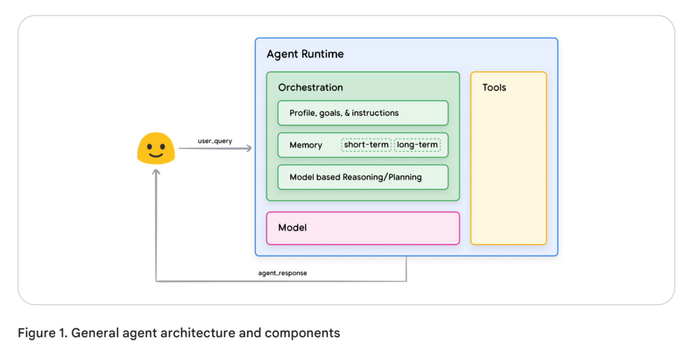
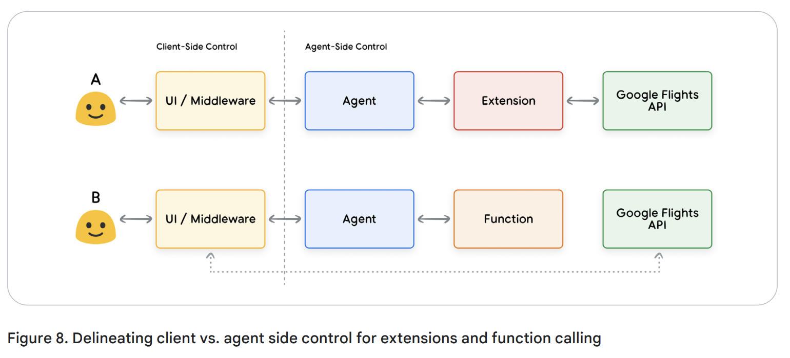
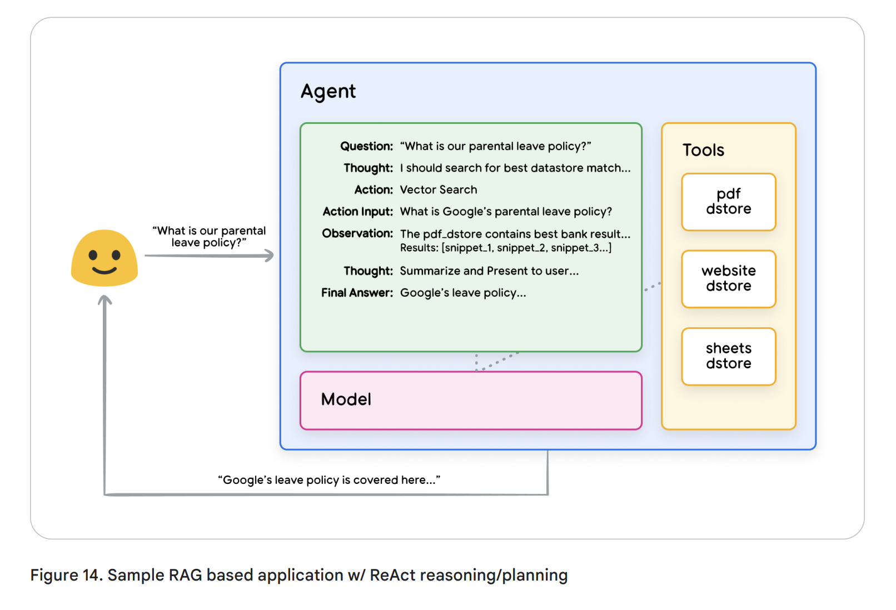

# AI Agents    

- [AI Agents](#ai-agents)
  - [생각의 틀 만들기](#생각의-틀-만들기)
  - [RAG Based DStore](#rag-based-dstore)


구글 에이전트 백서 : https://drive.google.com/file/d/1oEjiRCTbd54aSdB_eEe3UShxLBWK9xkt/view    


  

Orchestration  
- 1.생각의 틀 만들기 ReAct, CoT, ToT
- 2.생각을 저장하기 (캐시)  
- 3.모델 추론 및 계획  

Tools  
- 1.Extensions : 외부 API 호출을 위한 파라미터, 설명 등 LLM을 위한 메타데이터  
- 2.Functions : Live API가 아니며, AI Agent가 호출하지 않고 클라이언트에서 호출한다. 즉, AI는 어떤 Live API 호출할지 + 인자까지만 출력하고 실제 실행은 클라이언트 사이드에서 진행.  
  - 인증, 파일 삭제 명령어, 사용자 승인이 필요한 경우  
  - Client Side에서 데이터 정리, API 선택, 후처리 등이 필요한 경우




## 생각의 틀 만들기


1.ReAct (Reasoning + Acting)
- 추론(Reasoning)과 행동(Acting)을 반복하면서 문제를 해결하는 방식이.
- 외부 API, DB 등과 상호작용해야 하는 문제에 적합.  
- 예시: “7일 매출 데이터 뽑아줘”  
  - API 호출 → 영업이익 데이터만 있음  
  - 데이터 분석 → 매출 데이터가 필요하다고 판단 
  - 다시 API 호출 → 매출 데이터 확보  

👉 주요 특징: 문제 해결 과정에서 동적인 상호작용(행동)이 필요할 때 사용됨.  

2.Chain of Thought (CoT)
- 단계별로 논리적 추론을 명확하게 전개하며 문제를 해결하는 방식.
- 특히 수학 문제, 논리적 사고가 필요한 문제에 적합.
- 중간 추론 과정을 명시적으로 서술하면, 더 정확한 답을 도출할 수 있어요.

예제: “금리가 상승하면 부동산 시장에 어떤 영향을 미칠까?”
```
1.	금리 상승 → 대출 금리 증가
- 중앙은행이 기준금리를 올리면 시중은행의 대출 금리도 상승함.
- 주택담보대출, 기업대출 비용이 증가함.

2.	대출 비용 증가 → 주택 구매 감소
- 대출을 받는 것이 더 비싸지면서 주택 수요 감소.
- 투자자들도 높은 이자 비용 때문에 부동산 투자 축소.

3.	주택 구매 감소 → 주택 가격 하락 가능성
- 수요가 줄면서 매물이 늘어나면, 가격 하락 압력이 생김.
- 하지만 공급이 제한적이면 가격 하락폭이 제한될 수도 있음.

4.	장기적 효과 → 경기 둔화 가능성
- 부동산 시장 침체가 건설업, 인테리어, 가구 산업 등으로 파급됨.
- 소비 심리가 위축되고, 기업 투자도 둔화될 가능성 있음.

👉 결론: 금리 상승은 부동산 시장의 수요를 감소시키고, 결과적으로 가격 하락과 경기 둔화를 초래할 가능성이 큼. 다만, 공급 요인이나 정부 정책에 따라 그 영향이 달라질 수 있음.
```

3.Tree of Thought (ToT)
- 하나의 정답을 찾는 것이 아니라, 여러 가능성을 탐색하는 방식이.
- 의사결정 트리(Tree Structure)를 기반으로 다양한 옵션을 평가하고 최적의 선택을 찾아요.
- 예시: “새로운 사업 아이템 선정”
```
1.시장성 분석 → (A) 큰 시장 vs. (B) 작은 틈새시장
2.경쟁사 조사 → (A1) 경쟁 심함 vs. (A2) 경쟁 적음
3.수익 모델 검토 → (A1-1) 광고 기반 vs. (A1-2) 구독 모델
4.최적의 조합 선택
👉 주요 특징: 여러 경로(branch)를 탐색하면서 최적의 해결책을 도출.
```

## RAG Based DStore  



- Website content
- Structured Data in formats like PDF, Word Docs, CSV, Spreadsheets, etc.
- Unstructured Data in formats like HTML, PDF, TXT, etc.