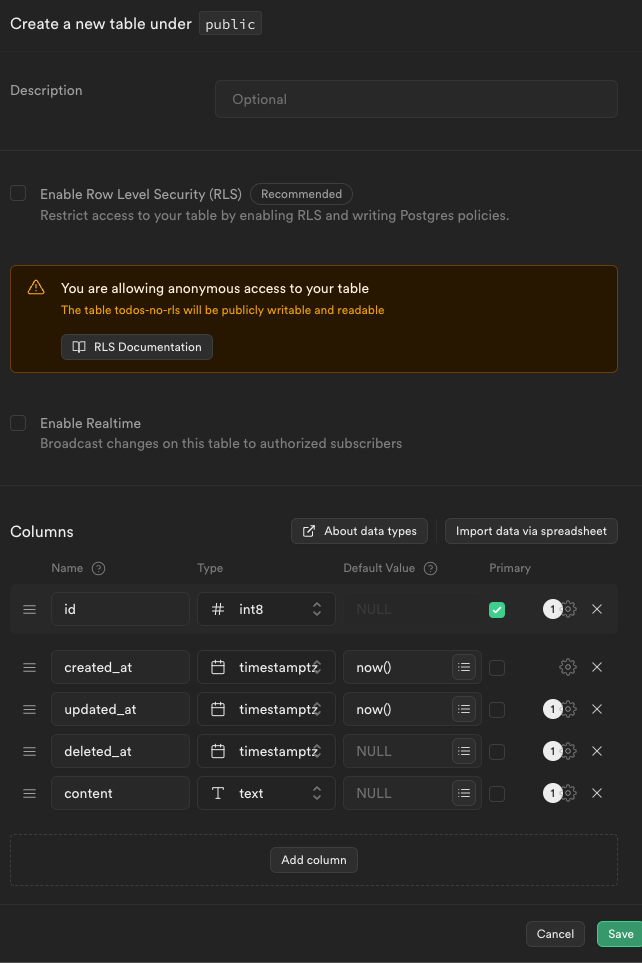
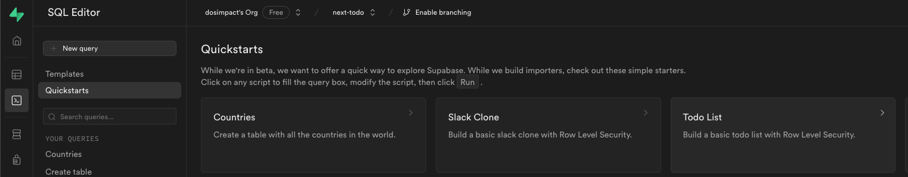

# Supabase DDL

- [Supabase DDL](#supabase-ddl)
    - [Row Level Security - RLS](#row-level-security---rls)
    - [anonClient/adminClient + RLS](#anonclientadminclient--rls)
  - [middleware](#middleware)
  - [todos with no-RLS](#todos-with-no-rls)
    - [REST API](#rest-api)
  - [todos with RLS](#todos-with-rls)
    - [DDL with editor](#ddl-with-editor)
      - [조회 정책](#조회-정책)
      - [Mutation 정책](#mutation-정책)
    - [USING expression](#using-expression)
    - [WITH CHECK expression](#with-check-expression)
    - [응용, 공개 설정 처리](#응용-공개-설정-처리)
  - [todo from template](#todo-from-template)
  - [stripe](#stripe)


### Row Level Security - RLS  

RLS는 테이블 단위로 적용시킬 수 있다.  
- enable을 하는것을 강력하게 추천.  
- RLS enalbe 되면 RLS 정책을 만들어야 테이블을 조회할 수 있다.  
- *"누구나 그 테이블을 읽을 수 있어 라는 정책"

- authenticated : 인증된 사용자만 
- anon : 누구나  
- service_role : 어드민 


### anonClient/adminClient + RLS

INSERT - anon - true : anonClient쓰기 가능  
INSERT - authenticated - true : anonClient가 로그인 해야 쓰기 가능  
INSERT : adminClient는 RLS 정책에 영향없이 쓰기 가능   

*service_role 왜 있는거지..?! 
// INSERT - service_role - true : adminClient 쓰기 가능  

## middleware

미들웨어  
- 특정 경로에 대해서 미들웨어를 통과시킬 수 있다.  
- 예를들어 로그인 된 사용자만 들어올 수 있는 경로, 
  - 로그인 안됨, 로그인 세션 풀림 -> 다시 로그인하라고 로그인 페이지로 리다이렉트  

## todos with no-RLS


```
[READ]
select * from public."todos-no-rls";

- id를 내림차 순으로 public."todos-no-rls" 조회 해줘
select  * from public."todos-no-rls" order by id desc;

- public."todos-no-rls" 에서 deleted_at이 null 인것만 모두 조회해
select  * from  public."todos-no-rls" where  deleted_at is null;

- 빨래라는 단어가 포함되는 조건을 추가해줘  
select * from  public."todos-no-rls" where  deleted_at is null and content like '%빨래%';

[CREATE]
insert into  public."todos-no-rls" (content) values  ('빨래를 세탁하기');

[UPDATE]
- content 값을 업데이트하는 sql 구문 만들어줘
update public."todos-no-rls" set content = '신발 세탁 2' where  id = 5;

- updated_at 을 현재시간으로 업데이트 하는 update 구문 만들어줘
update public."todos-no-rls" set  content = '신발 세탁 2', updated_at = current_timestamp where  id = 5;

[Delete]
- 특정 행을 지우는 구문 만들어줘
delete from public."todos-no-rls" where id = 5;

---

Hard delete를 지향해야 하는 이유는 다음과 같습니다:
1. 데이터 보안: Hard delete를 사용하면 삭제된 데이터가 완전히 제거되므로 민감한 정보가 유출될 위험이 줄어듭니다. Soft delete의 경우 데이터가 여전히 시스템에 남아 있으므로 보안 문제가 발생할 수 있습니다.
2. 데이터 무결성: Hard delete를 사용하면 시스템의 데이터 무결성을 유지할 수 있습니다. 삭제된 데이터가 완전히 제거되면 해당 데이터와 관련된 모든 연결이 끊어지므로 데이터베이스의 일관성이 유지됩니다.
3. 용량 절약: Soft delete를 사용하면 삭제된 데이터가 여전히 시스템에 남아 있기 때문에 데이터베이스 용량을 낭비할 수 있습니다. 반면에 Hard delete를 사용하면 더 많은 공간을 확보할 수 있습니다.
4. 개인정보 보호 규정 준수: 많은 규정 및 법률에서 개인정보를 보호하기 위해 데이터를 완전히 삭제해야 한다고 규정하고 있습니다. Hard delete를 사용하면 개인정보 보호 규정을 준수할 수 있습니다.
5. 데이터 관리 및 복구: Hard delete를 사용하면 필요한 경우 데이터를 복구하는 것이 어렵습니다. 그러나 이는 일반적으로 데이터 손실의 위험을 줄이는 측면에서 긍정적으로 작용합니다. 데이터를 복구해야 하는 경우에는 백업이나 다른 데이터 관리 도구를 사용할 수 있습니다.
따라서 민감한 정보를 다루는 시스템에서는 보안과 데이터 관리를 위해 Hard delete를 사용하는 것이 바람직합니다.

hardDelete를 지양해야 하는 이유는 다음과 같습니다:
1. 복구 가능성: 데이터를 완전히 삭제하면 복구할 수 없으므로 실수로 중요한 정보를 삭제했을 때 문제가 발생할 수 있습니다. softDelete를 사용하면 필요한 경우 데이터를 쉽게 복구할 수 있습니다.
2. 데이터 추적: 삭제된 데이터를 유지하면 데이터의 변경 이력을 추적할 수 있습니다. softDelete를 사용하면 데이터의 수정 및 삭제 이력을 추적하여 필요한 경우 추적할 수 있습니다.
3. 개인정보 보호: 일부 규정과 법률에서는 개인정보가 포함된 데이터를 영구적으로 삭제하는 것을 금지하고 있습니다. softDelete를 사용하면 개인정보를 보호하면서도 필요한 경우 데이터를 관리할 수 있습니다.
4. 데이터 일관성: hardDelete를 사용하면 데이터베이스의 일관성이 깨질 수 있습니다. 삭제된 데이터와 관련된 다른 데이터의 무결성이 손상될 수 있습니다.
5. 용량 관리: softDelete를 사용하면 데이터베이스 용량을 효율적으로 관리할 수 있습니다. 삭제된 데이터를 보관하면서도 용량을 효율적으로 활용할 수 있습니다.
이러한 이유로 hardDelete를 지양하고 softDelete를 사용하는 것이 더 바람직할 수 있습니다.

```

### REST API


## todos with RLS

### DDL with editor


#### 조회 정책

```sql
---누구나 조회가 가능함  
CREATE POLICY "Enable insert for authenticated users only" ON "public"."todos"
AS PERMISSIVE FOR SELECT
TO public  -- public | anon \ authenticated
USING (true)

-- 로그인 한 사용자만 조회가 가능함.(위 조건 없음??)
CREATE POLICY "Enable insert for authenticated users only" ON "public"."todos"
AS PERMISSIVE FOR SELECT
TO authenticated
USING (true)


--소유권자만 조회가 가능함  
CREATE POLICY "Enable insert for users based on user_id" ON "public"."todos"
AS PERMISSIVE FOR SELECT
TO public
USING (auth.uid() = user_id)

-- 문서 
-- 변환 설명 : https://supabase.com/docs/guides/auth/row-level-security#policies
create policy "Individuals can view their own todos."
on todos for select
using ( auth.uid() = user_id );
>>>.. 사용자가 todos 테이블에서 선택을 시도할 때마다 다음과 같이 변환됩니다.
select *
from todos
where auth.uid() = todos.user_id;
-- Policy is implicitly added.

-- 모든 roles : https://supabase.com/docs/guides/database/postgres/roles#supabase-roles 
```

#### Mutation 정책

- todo insert는 로그인 된 사용자만 가능하게 만들자.  
- todo update는 만든 사람만 가능하게 하자.  
- todo delete는 만든 사람만 가능하게 만들자.  

```sql
CREATE POLICY "Enable insert for authenticated users only" ON "public"."todos"
AS PERMISSIVE FOR INSERT
TO authenticated
WITH CHECK (true) -- WITH CHECK expression

CREATE POLICY "Enable delete for users based on user_id" ON "public"."todos"
AS PERMISSIVE FOR UPDATE
TO public
USING (auth.uid() = user_id)  -- USING expression
WITH CHECK (auth.uid() = user_id) -- WITH CHECK expression

CREATE POLICY "Enable delete for users based on user_id" ON "public"."todos"
AS PERMISSIVE FOR DELETE
TO public
USING (auth.uid() = user_id) -- 로그인한 uid 랑 이 테이블의 user_id가 같은지 체크한다.  

```

### USING expression

- where 처럼 생각하면 된다.  
- SELECT, UPDATE, DELETE 연산을 하기 전에 해당 Where 절이 먼저 실행된다고 생각하면된다.  
- 어떠한 작업을 하기 전에 사전에 실행되는 것이다.  

eg) SELECT에 auth.uid() = user_id을 걸면   
- 로그인 한 사용자의 Row만 보인다.  

설명  
- 이 식은 행 수준 보안이 활성화된 경우 테이블을 참조하는 쿼리에 추가됩니다.
- 표현식이 true를 반환하는 행이 표시됩니다. 식이 false 또는 null을 반환하는 모든 행은 사용자에게 표시되지 않으며(SELECT에서) 수정할 수 없습니다(UPDATE 또는 DELETE에서).
- 이러한 행은 자동으로 표시되지 않으며 오류가 보고되지 않습니다.

### WITH CHECK expression

- INSERT, UPDATE 연산을 하고 난 후에 체크할 부분  

설명  
- 이 식은 행 수준 보안이 활성화된 경우 테이블에 대한 INSERT 및 UPDATE 쿼리에 사용됩니다.
- 표현식이 true로 평가되는 행만 허용됩니다. 삽입된 레코드나 업데이트로 인해 생성된 레코드에 대해 표현식이 false 또는 null로 평가되면 오류가 발생합니다.
- 이 표현식은 원래 내용이 아닌 행의 제안된 새 내용에 대해 평가됩니다.


### 응용, 공개 설정 처리

```
--공개 설정 처리  
CREATE POLICY "Enable select for users based on is_open ON "public"."todos"
AS PERMISSIVE FOR SELECT
TO public
USING (is_open)
```

## todo from template



```
--
-- For use with:
-- https://github.com/supabase/supabase/tree/master/examples/todo-list/sveltejs-todo-list or
-- https://github.com/supabase/examples-archive/tree/main/supabase-js-v1/todo-list
--

create table todos (
  id bigint generated by default as identity primary key,
  user_id uuid references auth.users not null,
  task text check (char_length(task) > 3),
  is_complete boolean default false,
  inserted_at timestamp with time zone default timezone('utc'::text, now()) not null
);

--  RLS 적용
alter table todos enable row level security;

create policy "Individuals can create todos." on todos for
    insert with check (auth.uid() = user_id);

create policy "Individuals can view their own todos. " on todos for
    select using (auth.uid() = user_id);

create policy "Individuals can update their own todos." on todos for
    update using (auth.uid() = user_id);

create policy "Individuals can delete their own todos." on todos for
    delete using (auth.uid() = user_id);

```


## stripe

```sql
/**
* USERS
* Note: This table contains user data. Users should only be able to view and update their own data.
*/
create table users (
  -- UUID from auth.users
  id uuid references auth.users not null primary key,
  full_name text,
  avatar_url text,
  -- The customer's billing address, stored in JSON format.
  billing_address jsonb,
  -- Stores your customer's payment instruments.
  payment_method jsonb
);
alter table users
  enable row level security;
create policy "Can view own user data." on users
  for select using (auth.uid() = id);
create policy "Can update own user data." on users
  for update using (auth.uid() = id);

/**
* This trigger automatically creates a user entry when a new user signs up via Supabase Auth.
*/
create function public.handle_new_user()
returns trigger as
$$
  begin
    insert into public.users (id, full_name, avatar_url)
    values (new.id, new.raw_user_meta_data->>'full_name', new.raw_user_meta_data->>'avatar_url');
    return new;
  end;
$$
language plpgsql security definer;

create trigger on_auth_user_created
  after insert on auth.users
  for each row
    execute procedure public.handle_new_user();

/**
* CUSTOMERS
* Note: this is a private table that contains a mapping of user IDs to Strip customer IDs.
*/
create table customers (
  -- UUID from auth.users
  id uuid references auth.users not null primary key,
  -- The user's customer ID in Stripe. User must not be able to update this.
  stripe_customer_id text
);
alter table customers enable row level security;
-- No policies as this is a private table that the user must not have access to.

/**
* PRODUCTS
* Note: products are created and managed in Stripe and synced to our DB via Stripe webhooks.
*/
create table products (
  -- Product ID from Stripe, e.g. prod_1234.
  id text primary key,
  -- Whether the product is currently available for purchase.
  active boolean,
  -- The product's name, meant to be displayable to the customer. Whenever this product is sold via a subscription, name will show up on associated invoice line item descriptions.
  name text,
  -- The product's description, meant to be displayable to the customer. Use this field to optionally store a long form explanation of the product being sold for your own rendering purposes.
  description text,
  -- A URL of the product image in Stripe, meant to be displayable to the customer.
  image text,
  -- Set of key-value pairs, used to store additional information about the object in a structured format.
  metadata jsonb
);
alter table products
  enable row level security;
create policy "Allow public read-only access." on products
  for select using (true);

/**
* PRICES
* Note: prices are created and managed in Stripe and synced to our DB via Stripe webhooks.
*/
create type pricing_type as enum ('one_time', 'recurring');
create type pricing_plan_interval as enum ('day', 'week', 'month', 'year');
create table prices (
  -- Price ID from Stripe, e.g. price_1234.
  id text primary key,
  -- The ID of the prduct that this price belongs to.
  product_id text references products,
  -- Whether the price can be used for new purchases.
  active boolean,
  -- A brief description of the price.
  description text,
  -- The unit amount as a positive integer in the smallest currency unit (e.g., 100 cents for US$1.00 or 100 for ¥100, a zero-decimal currency).
  unit_amount bigint,
  -- Three-letter ISO currency code, in lowercase.
  currency text check (char_length(currency) = 3),
  -- One of `one_time` or `recurring` depending on whether the price is for a one-time purchase or a recurring (subscription) purchase.
  type pricing_type,
  -- The frequency at which a subscription is billed. One of `day`, `week`, `month` or `year`.
  interval pricing_plan_interval,
  -- The number of intervals (specified in the `interval` attribute) between subscription billings. For example, `interval=month` and `interval_count=3` bills every 3 months.
  interval_count integer,
  -- Default number of trial days when subscribing a customer to this price using [`trial_from_plan=true`](https://stripe.com/docs/api#create_subscription-trial_from_plan).
  trial_period_days integer,
  -- Set of key-value pairs, used to store additional information about the object in a structured format.
  metadata jsonb
);
alter table prices
  enable row level security;
create policy "Allow public read-only access." on prices
  for select using (true);

/**
* SUBSCRIPTIONS
* Note: subscriptions are created and managed in Stripe and synced to our DB via Stripe webhooks.
*/
create type subscription_status as enum ('trialing', 'active', 'canceled', 'incomplete', 'incomplete_expired', 'past_due', 'unpaid');
create table subscriptions (
  -- Subscription ID from Stripe, e.g. sub_1234.
  id text primary key,
  user_id uuid references auth.users not null,
  -- The status of the subscription object, one of subscription_status type above.
  status subscription_status,
  -- Set of key-value pairs, used to store additional information about the object in a structured format.
  metadata jsonb,
  -- ID of the price that created this subscription.
  price_id text references prices,
  -- Quantity multiplied by the unit amount of the price creates the amount of the subscription. Can be used to charge multiple seats.
  quantity integer,
  -- If true the subscription has been canceled by the user and will be deleted at the end of the billing period.
  cancel_at_period_end boolean,
  -- Time at which the subscription was created.
  created timestamp with time zone default timezone('utc'::text, now()) not null,
  -- Start of the current period that the subscription has been invoiced for.
  current_period_start timestamp with time zone default timezone('utc'::text, now()) not null,
  -- End of the current period that the subscription has been invoiced for. At the end of this period, a new invoice will be created.
  current_period_end timestamp with time zone default timezone('utc'::text, now()) not null,
  -- If the subscription has ended, the timestamp of the date the subscription ended.
  ended_at timestamp with time zone default timezone('utc'::text, now()),
  -- A date in the future at which the subscription will automatically get canceled.
  cancel_at timestamp with time zone default timezone('utc'::text, now()),
  -- If the subscription has been canceled, the date of that cancellation. If the subscription was canceled with `cancel_at_period_end`, `canceled_at` will still reflect the date of the initial cancellation request, not the end of the subscription period when the subscription is automatically moved to a canceled state.
  canceled_at timestamp with time zone default timezone('utc'::text, now()),
  -- If the subscription has a trial, the beginning of that trial.
  trial_start timestamp with time zone default timezone('utc'::text, now()),
  -- If the subscription has a trial, the end of that trial.
  trial_end timestamp with time zone default timezone('utc'::text, now())
);
alter table subscriptions
  enable row level security;
create policy "Can only view own subs data." on subscriptions
  for select using (auth.uid() = user_id);

/**
 * REALTIME SUBSCRIPTIONS
 * Only allow realtime listening on public tables.
 */
drop publication if exists supabase_realtime;
create publication supabase_realtime
  for table products, prices;

```