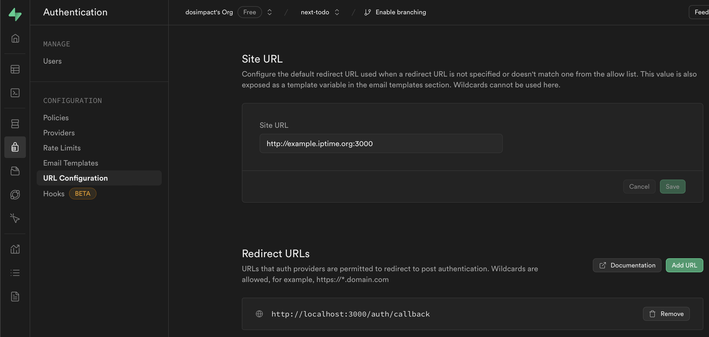

# Supabase Auth
- [Supabase Auth](#supabase-auth)
  - [Goal](#goal)
  - [Background](#background)
  - [install](#install)
  - [1.로그인](#1로그인)
    - [login flow](#login-flow)
    - [주의) getSession  vs getUser](#주의-getsession--vs-getuser)
    - [LoginUI](#loginui)
    - [Email login](#email-login)
      - [1.AuthUI or signInWithPassword](#1authui-or-signinwithpassword)
      - [2.callback 처리](#2callback-처리)
    - [GoogleLogin](#googlelogin)
      - [1.구글 클라우드 셋팅 + supabase Provider 셋팅](#1구글-클라우드-셋팅--supabase-provider-셋팅)
      - [2.AuthUI](#2authui)
      - [3.callback처리](#3callback처리)
    - [kakao login setting](#kakao-login-setting)
  - [참고](#참고)
  - [TroubleShooting](#troubleshooting)
    - [1.주의 브라우저,서버 모듈 분리](#1주의-브라우저서버-모듈-분리)
    - [2.주의 UI 깨지는 이슈](#2주의-ui-깨지는-이슈)
    - [3.주의 SiteURL, RedirectURLs 설정](#3주의-siteurl-redirecturls-설정)


## Goal 

```
1.로그인
- email login
- google login
- github login
- kakao login (사업자 등록필요..)


2.로그인 세션, 유지  
- getUser vs getSession
- 리프레시 토큰 어떻게 로그인세션이 다시 갱신 되는가 ? 

3.로그아웃
- 세션정보 어떻게 날라가는가?  
- 세션 아웃-  얼마 후 자동 로그아웃 되는가 ? 
- 세션 아웃-설정이 가능한가 ?
```

## Background 

OAuth 2.0, 2.1, PKCE 플로우 등 관련 이론은 다음 장에서 다룬다.  


## install

참고 문서  
- https://www.npmjs.com/package/@supabase/auth-helpers-nextjs  
- https://supabase.com/docs/guides/auth/auth-helpers/auth-ui  

```js
// install
yarn add @supabase/auth-ui-react // 로그인 UI제공
yarn add @supabase/auth-ui-shared // 테마 제공 
```

## 1.로그인

### login flow

- 최대한 많은 부분은 서버사이드에서 처리하는것을 원칙으로 한다.  
- basic : https://supabase.com/docs/guides/auth/server-side/nextjs 
- flow : https://supabase.com/docs/guides/auth/server-side-rendering#understanding-the-authentication-flow
- flow-pkce : https://supabase.com/docs/guides/auth/server-side/oauth-with-pkce-flow-for-ssr


### 주의) getSession  vs getUser

- 페이지를 보호할 때는 주의하세요. 서버는 누구든지 스푸핑할 수 있는 쿠키로부터 사용자 세션을 가져옵니다.  
- 페이지와 사용자 데이터를 보호하려면 항상 supabase.auth.getUser()를 사용하세요. 
- 미들웨어와 같은 서버 코드 내부의 supabase.auth.getSession()을 절대 신뢰하지 마십시오. 인증 토큰 재검증이 보장되지는 않습니다.  
- getUser()는 인증 토큰을 재검증하기 위해 매번 Supabase 인증 서버에 요청을 보내기 때문에 신뢰하는 것이 안전합니다.


### LoginUI

```js
"use client";
import React from "react";
import { Auth } from "@supabase/auth-ui-react";
import { ThemeSupa } from "@supabase/auth-ui-shared";
import { createSupabaseBrowserClient } from "@/lib/client/supabase";
import useHydrate from "@/hooks/useHydrate";
import { logout as logoutAction } from "@/actions/auth/auth.action";

const AuthUI = () => {
  const isMounted = useHydrate();
  const supabase = createSupabaseBrowserClient();

  const loginWithGithub = async () => {
    await supabase.auth.signInWithOAuth({
      provider: "github",
      options: {
        redirectTo: `http://localhost:3000/auth/callback`,
      },
    });
  };
  const loginWithGoogle = async () => {
    await supabase.auth.signInWithOAuth({
      provider: "google",
      options: {
        redirectTo: `http://localhost:3000/auth/callback`,
      },
    });
  };

  const logout = async () => {
    await logoutAction();
  };

  if (!isMounted) return null;

  return (
    <div>
      <div>AuthUI</div>
      <div onClick={loginWithGithub}>click github login</div>
      <div onClick={loginWithGoogle}>click google login</div>
      <div onClick={logout}>click logout</div>
      <div className=" max-w-[500px]">
        <Auth
          redirectTo="http://localhost:3000/auth/callback"
          onlyThirdPartyProviders={false}
          theme="dark"
          providers={["google", "github"]}
          supabaseClient={supabase}
          appearance={{
            theme: ThemeSupa,
            variables: {
              default: {
                colors: {
                  brand: "",
                  anchorTextColor: "",
                },
              },
            },
          }}
        />
      </div>
    </div>
  );
};

export default AuthUI;

---
// actions/auth/auth.actions.ts
"use server";
import { createServerSideClient } from "@/lib/supabase";
import { redirect } from "next/navigation";

export const logout = async () => {
  const supabase = await createServerSideClient();
  await supabase.auth.signOut();
  redirect("/");
};

```

onlyThirdPartyProviders 옵션 : https://github.com/supabase/ui/pull/245/files  
- 아니면 type파일을 봐도 된다.  

### Email login

과정  
- 회원가입 > 이메일 인증 대기 > 인증 완료시 DB 업데이트  

코드 작업  
- 1.AuthUI or signInWithPassword
- 2.callback 처리

#### 1.AuthUI or signInWithPassword
```
LoginUI 동일
```
#### 2.callback 처리

참조-공식문서 - https://supabase.com/docs/guides/auth/server-side/email-based-auth-with-pkce-flow-for-ssr#create-api-endpoint-for-handling-tokenhash


```js
// app/auth.confirm/route.ts
import { type EmailOtpType } from "@supabase/supabase-js";
import { type NextRequest, NextResponse } from "next/server";

import { createServerSideClient } from "@/lib/supabase";

export async function GET(request: NextRequest) {
  const { searchParams } = new URL(request.url);
  const token_hash = searchParams.get("token_hash");
  const type = searchParams.get("type") as EmailOtpType | null;
  const next = searchParams.get("next") ?? "/";

  const redirectTo = request.nextUrl.clone();
  redirectTo.pathname = next;
  redirectTo.searchParams.delete("token_hash");
  redirectTo.searchParams.delete("type");

  if (token_hash && type) {
    const supabase = createServerSideClient();

    const { error } = await supabase.auth.verifyOtp({
      type,
      token_hash,
    });
    if (!error) {
      redirectTo.searchParams.delete("next");
      return NextResponse.redirect(redirectTo);
    }
  }

  // return the user to an error page with some instructions
  redirectTo.pathname = "/error";
  return NextResponse.redirect(redirectTo);
}


```

### GoogleLogin

작업  
- 1.구글 클라우드 셋팅 + supabase Provider 셋팅  
- 2.AuthUI
- 3.callback처리

참고 문서  
- https://supabase.com/docs/guides/auth/social-login/auth-google  
- https://supabase.com/docs/guides/auth/auth-deep-dive/auth-google-oauth  

#### 1.구글 클라우드 셋팅 + supabase Provider 셋팅  
- https://console.cloud.google.com/welcome

```
Google Cloud 설정  
1.API 및 서비스 > OAuth 동의 화면  
- *승인된 도메인 : YOUR_SUPA_URL.supabase.co  

2.API 및 서비스 > 사용자 인증 정보  
Google Cloud에서 supabase Providers에 설정하기 위해 필요한 정보 

2.1 사용자 인증 정보 만들기 > OAuth 2.0 클라이언트 ID > 생성
  - Google Cloud > supabase 설정
  - 1.클라이언트 ID > Client ID (for OAuth)
  - 2.클라이언트 보안 비밀번호 > Client Secret (for OAuth)

3.
supabase Providers에서 Google Cloud에 설정하기 위해 필요한 정보 
- supabase 설정 > Google Cloud 설정
- 1.Callback URL (for OAuth) > 승인된 리디렉션 URI


```

#### 2.AuthUI

2.1 코드 작성  

```js
위 AuthUI 코드랑 동일
```

2.2 Redirect URLs 설정  

브라우저에서 로그인 시도 후 성공했다면, 새로운 경로로 이동하게 된다.  
- 예) 아래 주소는 로그인 시도 후 성공했을때 이동하는 경로이다. 
- code값이 포함되어 있는데 이는 PKCE flow에 사용된다.  
- http://localhost:3000/auth/callback?code=45c150a1-85e1-4e95-bcc0-1a1c9646b2da
- 하지만 위 http://localhost:3000/auth/callback 로 이동하기 위해서는 아래 Supabase 설정이 필요하다.   

   
Site URL
- 아래 Redirect URLs 에 없는 주소로 redirectTo 설정을 하게 되면 기본값(Site URL)로 리다이렉트 된다.  

Redirect URLs
- http://localhost:3000/auth/callback 를 추가해주자.  
- 코드의 redirectTo에 위 주소를 적게 되면 정상작동하게 된다.  

#### 3.callback처리


- 참고-공식문서 : https://supabase.com/docs/guides/auth/server-side/oauth-with-pkce-flow-for-ssr#create-api-endpoint-for-handling-the-code-exchange  

```js
import { NextResponse } from "next/server";
import { createServerSideClient } from "@/lib/supabase";

export async function GET(request: Request) {
  const { searchParams, origin } = new URL(request.url);
  const overrideOrigin = "http://localhost:3000";
  const code = searchParams.get("code");
  // if "next" is in param, use it as the redirect URL
  const next = searchParams.get("next") ?? "/";


  if (code) {
    const supabase = await createServerSideClient();
    const { error } = await supabase.auth.exchangeCodeForSession(code);
    if (!error) {
      return NextResponse.redirect(`${overrideOrigin}${next}`);
    }
  }

  // return the user to an error page with instructions
  return NextResponse.redirect(`${overrideOrigin}/auth/auth-code-error`);
}


```


### kakao login setting  

- *비즈니스 심사를 받아야 한다. (최소 3일 소요)  
- https://supabase.com/docs/guides/auth/social-login/auth-kakao

```
1.앱 만들기 
- 앱 키 > RESTAPI 키 복사 > supabase(REST API Key)  

2.내 애플리케이션>앱 설정>플랫폼
Web >사이트 도메인 등록 	
- http://localhost:3000

3.내 애플리케이션>제품 설정>카카오 로그인
3.1 활성화로 스위치  
3.2 Redirect URI에 supabase의 Callback URL (for OAuth) 추가 
3.3 동의항목에서 다음 필수 체크  
- profile_nickname  
- profile_image  
- account_email   

4.내 애플리케이션>제품 설정>카카오 로그인>보안
Client Secret 생성 > supabase(Client Secret Code) 넣기  

```

## 참고

- API REFERENCE DIRECTIVES 'use server'

https://react.dev/reference/react/use-server


## TroubleShooting  

### 1.주의 브라우저,서버 모듈 분리  

lib안에서 슈파베이스 서버용,브라우저용 클라이언트 모듈을 따로 분리하자.  
- 하나의 파일 안에 createBrowserClient, createServerClient를 동시에 정의를 못한다.  
- *하나의 파일(모듈)안에 next/headers을 사용하는 순간, 서버전용모듈이 된다.   

'use client', 'use server' 지시어란?
- 참고 : https://react.dev/reference/react/use-server
- 'use server'는 모듈(파일)단위, 함수단위에서 적용 가능하다.  
- 하지만 나는 파일단위로 구분짓고 싶다. 파일안에 특정 함수에 'use server'을 넣는것은 아직 원치 않는다. 


### 2.주의 UI 깨지는 이슈  

문제 : SSR된 Auth 컴포넌트는 스타일이 깨지는 이슈가 있다.  
- 그래서 hydration이 끝나면 보여주도록 하자.  

```js
import { useEffect, useState } from "react";

const useHydrate = () => {
  const [isMounted, setIsMounted] = useState(false);

  useEffect(() => {
    setIsMounted(true);
  }, []);

  return isMounted;
};

export default useHydrate;

```

### 3.주의 SiteURL, RedirectURLs 설정   


Site URL  
- Next.js의 주소를 입력해준다.
- 로컬 개발 환경 : http://localhost:3000
- 배포된 환경 : https://배포된주소.vercel.com  
- 슈파베이스 인증 서버가 인증 후 redirect를 위 경로로 해준다. (디폴트)    

Redirect URLs  
- 위 설정을 해야, 코드단 옵션 중 redirectTo가 작동한다.  
- *만약 위 설정을 해주지 않으면, 코드에서 redirectTo설정 및 배포를 해도 localhost로 계속 리다이렉트 될 것이다.   
- PKCE Flow 를 처리하기 위해 설정해준다.  


