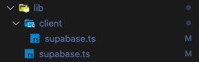

# Supabase install

- [Supabase install](#supabase-install)
  - [DB connection with DBeaver](#db-connection-with-dbeaver)
  - [Install with Nextjs AppRouter](#install-with-nextjs-approuter)
  - [env settings](#env-settings)
  - [next + @supabase/ssr setup](#next--supabasessr-setup)
    - [1.주의사항](#1주의사항)
    - [2.주의사항](#2주의사항)
    - [supabase 클라이언트는 여러버전 만들어야 한다.](#supabase-클라이언트는-여러버전-만들어야-한다)
    - ["server-only": "^0.0.1", 이 패키지 작동 원리](#server-only-001-이-패키지-작동-원리)
    - [createBrowserClient \& createServerClient](#createbrowserclient--createserverclient)
    - [createSupabaseAdminServerClient](#createsupabaseadminserverclient)
  - [트러블슈팅](#트러블슈팅)
    - [unhandledRejection: td \[Error\]: Cookies can only be modified in a Server Action or Route Handler.](#unhandledrejection-td-error-cookies-can-only-be-modified-in-a-server-action-or-route-handler)


## DB connection with DBeaver  

Settings > Database Settings  
- 비밀번호는 초기에 한번 세팅 가능하니 잘 기억해 둘 것  
- 직접 db connection 할 때 사용된다.  
```
host, port, user(username), password 입력 후 DBeaver 로컬에서 연결해 보기  
with PostgreSQL JDBC Driver    
```


## Install with Nextjs AppRouter  

```js
// javascript 클라이언트
yarn add @supabase/supabase-js // 통합 SDK

// next에서는 통합 SDK 대신 아래 사용
yarn add @supabase/ssr
- yarn add @supabase/auth-helpers-nextjs 대신 yarn add @supabase/ssr 사용할 것  
- 싱글톤 패턴 등 제공  

// react에서는 통합 SDK 대신 아래 사용
yarn add @supabase/auth-helpers-react

// 로그인 도와주는 유틸 라이브러리  
yarn add @supabase/auth-ui-react // 로그인 UI제공
yarn add @supabase/auth-ui-shared // 테마 제공 
- https://www.npmjs.com/package/@supabase/auth-helpers-nextjs

```

## env settings

Settings > API  
- Project URL : A RESTful endpoint for querying and managing your database    
- Project API keys > anon, public : 테이블에 대해 행 수준 보안을 활성화하고 정책을 구성한 경우 이 키는 브라우저에서 사용해도 안전합니다.   
- Project API keys > service_role(secret) :  > 이 키에는 행 수준 보안을 우회하는 기능이 있습니다. 절대 공개적으로 공유하지 마세요.   

```
# Update these with your Supabase details from your project settings > API
NEXT_PUBLIC_SUPABASE_URL=xxxx
NEXT_PUBLIC_SUPABASE_ANON_KEY=xxxx
SUPABASE_SERVICE_ROLE_KEY=xxxx
```


## next + @supabase/ssr setup

https://supabase.com/docs/guides/auth/server-side/creating-a-client
  
- 참고 : https://www.youtube.com/watch?v=XIj7nmIYtbo

### 1.주의사항

- yarn add @supabase/auth-helpers-nextjs 대신 yarn add @supabase/ssr 사용할 것   
- @supabase/ssr 패키지는 next.js뿐 아니라 Nuxt, Remix 사용 가능한 좀 더 일반화된 패키지이다.  
- 그래서 쿠키 설정같은 부분을 직접 해야하는 번거로움이 존재하긴 함.  
- 공식문서에서 제시한 방향이니 따라가자.  


### 2.주의사항 

- *supabase를 사용하는 next 서버, 브라우저 모두 클라이언트(상대적)    
- @supabase/supabase-js 에서도 클라이언트 만들 수 있음.   
- @supabase/ssr 에서도 서버, 브라우저 클라이언트 만들 수 있음.  
- 하지만 ssr 패키지가 싱글톤 패턴으로, createBrowserClient 마음껏 해도 괜찮음.  


### supabase 클라이언트는 여러버전 만들어야 한다.

아래는 next.js 기능을 크게 나눈 것   
- 1.Router handler : 정적 URL 처리      
- 2.middleware : 미들웨어    
- 3.Server actions : 동적 URL 처리    
- 4.RSC : 리액트 서버 컴포넌트  
- 5.RCC : 리액트 클라이언트 컴포넌트  

```
- 1.Router handler : createServerClient (createServerSideClient)
- 2.middleware : createServerClient (createServerSideClientMiddleware)
- 3.Server actions : createServerClient (createServerSideClient)
- 4.RSC : createServerClient (createServerSideClientRSC)
- 5.RCC : createBrowserClient (createSupabaseBrowserClient)
```

### "server-only": "^0.0.1", 이 패키지 작동 원리

`server-only` 패키지는 매우 간단하지만 영리한 패키지  

```ts
//1. 서버 파일 최상단에 import:
import "server-only";
---
// 2. 패키지 내부 구조 (실제 코드): package.json
{
  "name": "server-only",
  "exports": {
    ".": {
      "react-server": "./empty.js",   // 서버 컴포넌트에서는 빈 파일
      "default": "./index.js"         // 클라이언트에서는 에러 발생
    }
  }
}
//index.js (클라이언트용):
throw new Error(
  "This module cannot be imported from a Client Component module. " +
  "It should only be used from a Server Component."
);
// empty.js (서버용):
// 아무것도 없음 (빈 파일)

// ## 동작 방식
// 1. ✅ 서버에서 실행: `empty.js`가 import되어 아무 일도 안 함
// 2. ❌ 클라이언트 번들에 포함 시도: `index.js`가 import되어 빌드 타임에 에러 발생

// ---
// ## 사용 예)
import "server-only";

// ⬇️ 이 코드들은 절대 클라이언트에 노출되면 안 됨!
const SECRET_KEY = process.env.SECRET_KEY;
const adminClient = createAdminClient(SECRET_KEY);
```

보안 목적: 
- API 키, 시크릿 같은 민감한 정보가 클라이언트 번들에 포함되는 것을 컴파일 타임에 방지
- 개발자 실수로 서버 전용 코드를 클라이언트에서 import하는 것을 막음
- 반대로 `client-only` 패키지도 있어서, 클라이언트 전용 코드(window, document 사용 등)를 서버에서 실행하지 못하게 막습니다.  

참고  
- 프레임워크/번들러가 자체적으로 정의한 방식이 있다.  
```js
{
  "exports": {
    ".": {
      "react-server": "./rsc.js",        // 🔧 React/Next.js 커스텀
      "react-native": "./native.js",     // 🔧 React Native 커스텀
      "edge-light": "./edge.js",         // 🔧 Vercel Edge 커스텀
      "worker": "./worker.js",           // 🔧 Worker 환경 커스텀
      "development": "./dev.js",         // 🔧 개발 모드 커스텀
      "production": "./prod.js",         // 🔧 프로덕션 모드 커스텀
      "browser": "./browser.js",         // 🔧 번들러별 브라우저 조건
      "import": "./esm.js",     // ✅ 표준: ESM import
      "require": "./cjs.js",    // ✅ 표준: CommonJS require
      "node": "./node.js",      // ✅ 표준: Node.js 환경
      "default": "./index.js"   // ✅ 표준: fallback
    }
  }
}
```

### createBrowserClient & createServerClient


```js
// lib/supabase/browser-client.ts
'use client';

import { createBrowserClient } from '@supabase/ssr';
import { Database } from '../db/types/supabase';

export const createSupabaseBrowserClient = () =>
  createBrowserClient<Database>(
    process.env.NEXT_PUBLIC_SUPABASE_URL!,
    process.env.NEXT_PUBLIC_SUPABASE_ANON_KEY!,
  );

--- 

// lib/supabase/server-client.ts
import 'server-only';

import { createServerClient } from '@supabase/ssr';
import { cookies } from 'next/headers';
import { Database } from '../db/types/supabase';
import { NextRequest, NextResponse } from 'next/server';

// RouterHandler, RSC, ServerActions
export async function createSupabaseServerClient() {
  const cookieStore = await cookies();

  return createServerClient<Database>(
    process.env.NEXT_PUBLIC_SUPABASE_URL!,
    process.env.NEXT_PUBLIC_SUPABASE_ANON_KEY!,
    {
      cookies: {
        getAll() {
          return cookieStore.getAll();
        },
        setAll(cookiesToSet) {
          try {
            cookiesToSet.forEach(({ name, value, options }) =>
              cookieStore.set(name, value, options),
            );
          } catch {
            // The `setAll` method was called from a Server Component.
            // This can be ignored if you have middleware refreshing
            // user sessions.
          }
        },
      },
    },
  );
}

// Middleware
export const createSupabaseMiddlewareClient = async (
  request: NextRequest,
) => {
  let supabaseResponse = NextResponse.next({ request });

  return createServerClient<Database>(
    process.env.NEXT_PUBLIC_SUPABASE_URL!,
    process.env.NEXT_PUBLIC_SUPABASE_ANON_KEY!,
    {
      cookies: {
        getAll() {
          return request.cookies.getAll();
        },
        setAll(cookiesToSet) {
          cookiesToSet.forEach(({ name, value, options }) =>
            request.cookies.set(name, value),
          );
          supabaseResponse = NextResponse.next({
            request,
          });
          cookiesToSet.forEach(({ name, value, options }) =>
            supabaseResponse.cookies.set(name, value, options),
          );
        },
      },
    },
  );
};

```

서버 컴포넌트에서 createSupabaseServerClient의 작동
- next.js에서 서버측 로직의 플로우중 마지막 부분에서 리액트 서버 컴포넌트 로직 처리 된다.
- 서버 컴포넌트 실행 단계에서는 쿠키를 조작(set) 하는 것이 불가능하다.   
- 위 코드에서는 try-catch로 예외를 잡긴하지만,
- createSupabaseRSCClient 라는 이름으로 쿠키 조작하는 로직을 제거해둔 함수를 만들어도 좋다.


참고, 쿠키를 조작하는 일관된 방법    

미들웨어에서는 쿠키를 request객체안에서 까야한다.  
- import { cookies } from "next/headers"; 에서 가져올 수 없음.. 
- 쿠키 조작의 일관성을 제공하는 라이브러리 : https://www.npmjs.com/package/cookies-next
- 위 라이브러리 쓰면 어디서든 쿠키를 조작할 수 있다. 근데 라이브러리 사용을 자제한다면 무시하자..   
- before code : https://supabase.com/docs/guides/auth/server-side/creating-a-client?environment=middleware

### createSupabaseAdminServerClient    

목적 : RLS 우회 클라이언트 생성  
- @supabase/ssr는 유저컨텍스트를 따르니, supabase-js 에서 직접 임포트 해야 한다.    

```js
import "server-only";
import { createClient } from "@supabase/supabase-js";
import type { Database } from "./types/supabase.flin";

export function createSupabaseAdminServerClient() {
  return createClient<Database>(
    process.env.NEXT_PUBLIC_FLIN_AI_SUPABASE_URL!,
    process.env.FLIN_AI_SUPABASE_SECRET_KEY!, // Service Role Key 사용
    {
      auth: {
        autoRefreshToken: false,
        persistSession: false,
      },
    }
  );
}

```


## 트러블슈팅 

### unhandledRejection: td [Error]: Cookies can only be modified in a Server Action or Route Handler.

- 이유 : 서버액션을 사용하는데, SSR 과정에서 쿠키를 조작했다.  
- 해결 : 서버액션을 이곳저곳에서 사용해서 그렇다. 그중 SSR과정에서 문제가 발생 > 쿠키를 조작하되 try-catch로 감싸자.  
```
 ⨯ unhandledRejection: td [Error]: Cookies can only be modified in a Server Action or Route Handler. Read more: https://nextjs.org/docs/app/api-reference/functions/cookies#cookiessetname-value-options
    at Proxy.callable (/Users/dodonet-2/workspace/projects/supabase-next-poc/node_modules/next/dist/compiled/next-server/app-page.runtime.dev.js:36:12724)
```