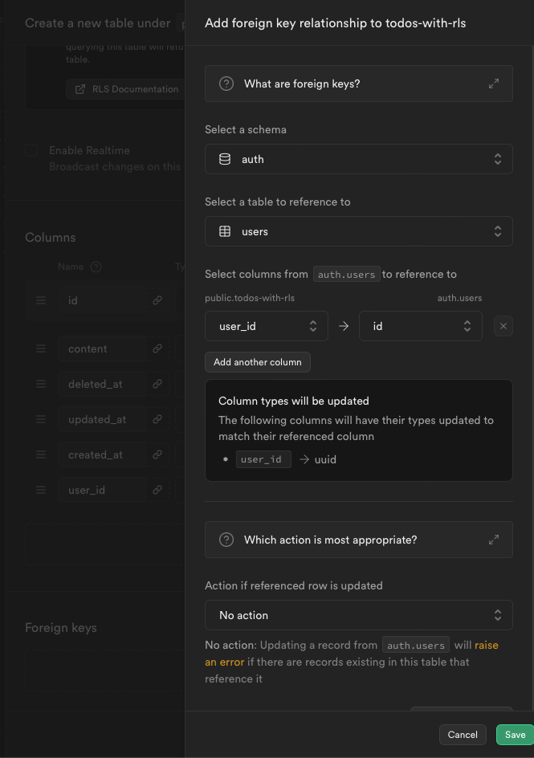

# Supabase DDL     

- [Supabase DDL](#supabase-ddl)
  - [Basic](#basic)
    - [📌 Datatype](#-datatype)
    - [📌 컬럼 설정](#-컬럼-설정)
    - [Snippets](#snippets)
  - [📌 Todo Table DDL (without RLS)](#-todo-table-ddl-without-rls)
  - [📌 Todo Table DML (without RLS)](#-todo-table-dml-without-rls)
    - [REST API](#rest-api)
    - [참고) 다른 스키마 조회하는 법](#참고-다른-스키마-조회하는-법)
  - [Todos with RLS (in editor)](#todos-with-rls-in-editor)
    - [DDL with editor](#ddl-with-editor)


## Basic  

### 📌 Datatype    

- boolean
- integer = int4 / bigint = int8 / numeric -- 자동 / numeric(5, 2) -- 최대 5자리 숫자, 소수점 이하 2자리  
- varchar(32), text  
- uuid
- timestamp with time zone  
- json, jsonb
Ref : https://supabase.com/docs/guides/database/tables?queryGroups=database-method&database-method=sql&queryGroups=language&language=js#data-types    

```sql
  "isNotified" boolean
  "id" integer
  "id" bigint
  "price" numeric
  "title" VARCHAR(255)
  "website" text
  "id" uuid
  "updated_at" timestamp with time zone
	"content" json 
  "content" jsonb 
```

### 📌 컬럼 설정 
- PK, FK, CONSTRAINT  
- generated by default as identity
- DEFAULT false | gen_random_uuid() | now()
- NOT NULL
- UNIQUE  

```sql
CREATE TABLE IF NOT EXISTS ai_chat_test.chat (...);

-- PK, FK Inilne  
  "id" bigint generated by default as identity primary key -- primary key 를 명시 
  "userId" uuid NOT NULL references "public"("id") -- REFERENCES 부모_테이블(id) 

-- PK, FK, CONSTRAINT (with table)  
  "id" bigint generated by default as identity NOT NULL,
  CONSTRAINT "gpts_quration_id_pk" PRIMARY KEY("id") -- PRIMARY KEY (id)  

  "id" uuid DEFAULT gen_random_uuid() NOT NULL,
	CONSTRAINT "suggestion_id_pk" PRIMARY KEY("id") -- PRIMARY KEY (id)  

  "userId" uuid NOT NULL 
  CONSTRAINT "chat_userId_profile_id_fk" FOREIGN KEY ("userId") REFERENCES "profiles"("id") -- FOREIGN KEY (fk_id) REFERENCES 부모_테이블(id)

-- PK, FK, CONSTRAINT (수정필요시)  
ALTER TABLE public.chat
  ADD CONSTRAINT "chat_userId_profiles_id_fk"
  FOREIGN KEY ("userId") 
  REFERENCES public.profiles(id) 
  ON DELETE NO ACTION ON UPDATE NO ACTION;

-- generated by default as identity
  "logId" uuid DEFAULT gen_random_uuid() NOT NULL

-- DEFAULT false | gen_random_uuid() | now()
  "isResolved" boolean DEFAULT false
	"id" uuid DEFAULT gen_random_uuid()
	"createdAt" timestamp with time zone DEFAULT now() NOT NULL,

-- NOT NULL
  "userId" uuid NOT NULL
	"documentCreatedAt" timestamp with time zone NOT NULL,
	"createdAt" timestamp with time zone DEFAULT now() NOT NULL,
	"updatedAt" timestamp with time zone DEFAULT now() NOT NULL,
	"deletedAt" timestamp with time zone NULL

-- UNIQUE  
  "username" text unique
```

### Snippets

```sql
-- bigint pk 
	"id" bigint generated by default as identity NOT NULL,
	CONSTRAINT "gpts_quration_id_pk" PRIMARY KEY("id")

-- uuid pk
	"id" uuid DEFAULT gen_random_uuid() NOT NULL,
	CONSTRAINT "suggestion_id_pk" PRIMARY KEY("id")

-- PL/pgSQL Block fk
DO $$ BEGIN
    ALTER TABLE public.chat
    ADD CONSTRAINT "chat_userId_profiles_id_fk"
    FOREIGN KEY ("userId") REFERENCES public.profiles(id) ON DELETE NO ACTION ON UPDATE NO ACTION;
EXCEPTION
    WHEN duplicate_object THEN NULL;
END $$; 

-- timestamps
	"createdAt" timestamp with time zone DEFAULT now() NOT NULL,
	"updatedAt" timestamp with time zone DEFAULT now() NOT NULL,
	"deletedAt" timestamp with time zone NULL
```

## 📌 Todo Table DDL (without RLS)    

```Sql
CREATE TABLE todos (
    id uuid DEFAULT gen_random_uuid(),  -- UUID로 고유 식별자
    -- id uuid PRIMARY KEY DEFAULT gen_random_uuid()
    user_id uuid NOT NULL,  -- 사용자 ID (필수)
    -- user_id uuid REFERENCES auth.users(id) NOT NULL
    title varchar(32) NOT NULL UNIQUE,  -- 할 일 제목 (고유, 필수)
    description text,  -- 할 일 설명 (선택적)
    is_completed boolean DEFAULT false,  -- 완료 여부 (기본값 false)
    priority integer CHECK (priority >= 1 AND priority <= 5),  -- 우선순위 (1~5)
    due_date timestamp with time zone,  -- 마감일
    created_at timestamp with time zone DEFAULT now(),  -- 생성 시간
    updated_at timestamp with time zone DEFAULT now(),  -- 업데이트 시간
    metadata jsonb,  -- 추가 메타데이터
    CONSTRAINT todos_pkey PRIMARY KEY (id),  -- 기본 키 제약 조건
    CONSTRAINT todos_user_id_fkey FOREIGN KEY (user_id) REFERENCES auth.users(id)  -- 외래 키 제약 조건
);
---
CREATE TABLE todos (
    id uuid DEFAULT gen_random_uuid(),  
    title varchar(32) NOT NULL,  
    description text,  
    is_completed boolean DEFAULT false,  
    created_at timestamp with time zone DEFAULT now(),  
    updated_at timestamp with time zone DEFAULT now(),  
    CONSTRAINT todos_pkey PRIMARY KEY (id),  
);
```

## 📌 Todo Table DML (without RLS)    

```
[READ]
select * from public."todos";

-- id를 내림차 순으로 public."todos" 조회 해줘
select  * from public."todos" order by id desc;

-- public."todos" 에서 deleted_at이 null 인것만 모두 조회해
select  * from  public."todos" where  deleted_at is null;

-- 빨래라는 단어가 포함되는 조건을 추가해줘  
select * from  public."todos" where  deleted_at is null and title like '%빨래%';

[CREATE]
insert into  public."todos" (title) values  ('빨래를 세탁하기');

[UPDATE]
-- title 값을 업데이트하는 sql 구문 만들어줘
update public."todos" set title = '신발 세탁 2' where  id = 5;

-- updated_at 을 현재시간으로 업데이트 하는 update 구문 만들어줘
update public."todos" set  title = '신발 세탁 2', updated_at = current_timestamp where  id = 5;

[Delete]
-- 특정 행을 지우는 구문 만들어줘
delete from public."todos" where id = 5;
```

### REST API


Check API Docs

```js
Read all rows
curl 'https://YOURS.supabase.co/rest/v1/todos?select=*' \
-H "apikey: SUPABASE_KEY"

Read specific columns
curl 'https://YOURS.supabase.co/rest/v1/todos?select=some_column,other_column' \
-H "apikey: SUPABASE_KEY"

Read referenced tables
curl 'https://YOURS.supabase.co/rest/v1/todos?select=some_column,other_table(foreign_key)' \
-H "apikey: SUPABASE_KEY"

With pagination
curl 'https://YOURS.supabase.co/rest/v1/todos?select=*' \
-H "apikey: SUPABASE_KEY" \
-H "Range: 0-9"

With filtering
curl 'https://YOURS.supabase.co/rest/v1/todos?id=eq.1&select=*' \
-H "apikey: SUPABASE_KEY" \
-H "Range: 0-9"
```

### 참고) 다른 스키마 조회하는 법    

Ref : https://supabase.com/docs/guides/api/using-custom-schemas

```
1.
Settings > Exposed schemas에 노출할  추가하기

---
2.
GRANT USAGE ON SCHEMA myschema TO anon, authenticated, service_role;
GRANT ALL ON ALL TABLES IN SCHEMA myschema TO anon, authenticated, service_role;
GRANT ALL ON ALL ROUTINES IN SCHEMA myschema TO anon, authenticated, service_role;
GRANT ALL ON ALL SEQUENCES IN SCHEMA myschema TO anon, authenticated, service_role;
ALTER DEFAULT PRIVILEGES FOR ROLE postgres IN SCHEMA myschema GRANT ALL ON TABLES TO anon, authenticated, service_role;
ALTER DEFAULT PRIVILEGES FOR ROLE postgres IN SCHEMA myschema GRANT ALL ON ROUTINES TO anon, authenticated, service_role;
ALTER DEFAULT PRIVILEGES FOR ROLE postgres IN SCHEMA myschema GRANT ALL ON SEQUENCES TO anon, authenticated, service_role;

---
3.
curl --location 'https://ID.supabase.co/rest/v1/todos?select=*' \
--header 'apikey: KEY' \
--header 'Accept-Profile: ai_chat_test'

---
4.
// Initialize the JS client
import { createClient } from '@supabase/supabase-js'
const supabase = createClient(SUPABASE_URL, SUPABASE_ANON_KEY, { db: { schema: 'myschema' } })

// Make a request
const { data: todos, error } = await supabase.from('todos').select('*')

// You can also change the target schema on a per-query basis
const { data: todos, error } = await supabase.schema('myschema').from('todos').select('*')

``` 

## Todos with RLS (in editor)  

### DDL with editor


|Add foreign key relation|Foreign Keys|
|------|---|
|  ||
