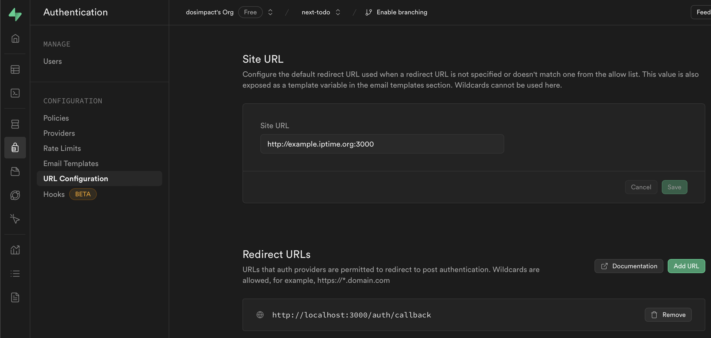
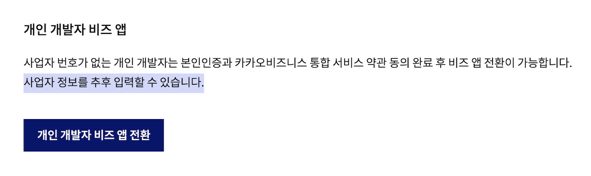
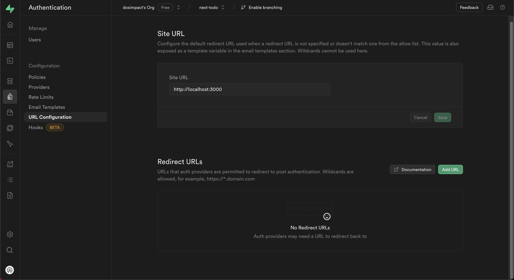

# Supabase Auth
- [Supabase Auth](#supabase-auth)
  - [Goal](#goal)
  - [install](#install)
  - [📌 로그인 공통 작업](#-로그인-공통-작업)
    - [Login flow Overview](#login-flow-overview)
    - [Common Logic](#common-logic)
      - [1.env](#1env)
      - [2.PKCE Callback](#2pkce-callback)
      - [3.LoginUI](#3loginui)
      - [4.White Listing Redirect URLs](#4white-listing-redirect-urls)
  - [📌 Google Login](#-google-login)
      - [1.구글 클라우드 세팅 + supabase Provider 세팅](#1구글-클라우드-세팅--supabase-provider-세팅)
  - [📌 kakao Login](#-kakao-login)
  - [📌 Github Login](#-github-login)
  - [📌 Email login](#-email-login)
      - [1.AuthUI or signInWithPassword](#1authui-or-signinwithpassword)
      - [2.callback 처리](#2callback-처리)
  - [TroubleShooting](#troubleshooting)
    - [1.주의 브라우저, 서버 모듈 분리](#1주의-브라우저-서버-모듈-분리)
    - [2.주의 UI 깨지는 이슈](#2주의-ui-깨지는-이슈)
    - [3.주의 SiteURL, RedirectURLs 설정](#3주의-siteurl-redirecturls-설정)

## Goal 

1.로그인
- email login  
- google login ✅  
- github login ✅  
- kakao login (사업자 등록필요.?!)  

2.로그인 세션, 유지  
- getUser vs getSession  
- 리프레시 토큰 어떻게 로그인세션이 다시 갱신 되는가 ?  

3.로그아웃
- 세션정보 어떻게 날라가는가?  
- 세션 아웃 - 얼마 후 자동 로그아웃 되는가 ? 
- 세션 아웃 - 설정이 가능한가?  

*OAuth 2.0, 2.1, PKCE 플로우 등 관련 이론은 다음 장에서 다룬다.  

## install

```js
// (optional install) 로그인 관련 UI 제공  
yarn add @supabase/auth-ui-react // 로그인 UI제공
yarn add @supabase/auth-ui-shared // 테마 제공 
```

- https://www.npmjs.com/package/@supabase/auth-helpers-nextjs  
- https://supabase.com/docs/guides/auth/auth-helpers/auth-ui  


## 📌 로그인 공통 작업  

### Login flow Overview  

최대한 많은 부분을 서버사이드 처리를 원칙으로 한다.    
- Basic : https://supabase.com/docs/guides/auth/server-side/nextjs 
- Flow : https://supabase.com/docs/guides/auth/server-side-rendering#understanding-the-authentication-flow
- PKCE : https://supabase.com/docs/guides/auth/sessions/pkce-flow  

⚠️ 주의) getSession vs getUser    
- 페이지를 보호할 때는 주의하세요. 서버는 누구든지 스푸핑할 수 있는 쿠키로부터 사용자 세션을 가져옵니다.  
- 페이지와 사용자 데이터를 보호하려면 항상 supabase.auth.getUser()를 사용하세요. 
- 미들웨어와 같은 서버 코드 내부의 supabase.auth.getSession()을 절대 신뢰하지 마십시오. 인증 토큰 재검증이 보장되지는 않습니다.  
- getUser()는 인증 토큰을 재검증하기 위해 매번 Supabase 인증 서버에 요청을 보내기 때문에 신뢰하는 것이 안전합니다.  

### Common Logic  

- 아래 로직은 공통 로직으로 필수 입니다.  

#### 1.env  

```
// .env
NEXT_PUBLIC_SUPABASE_URL=https://YOURS.supabase.co
NEXT_PUBLIC_SUPABASE_ANON_KEY=YOURS

//1.배포되는 환경의 도메인 주소  
NEXT_PUBLIC_ORIGIN=http://YOUR_DOMAIN

//2.PKCE Callback을 처리할 도메인 주소  
NEXT_PUBLIC_AUTH_REDIRECT_TO_PKCE=http://YOUR_DOMAIN/auth/callback?next=/
```

#### 2.PKCE Callback  

```js
// app/auth/callback/route.ts 
import { NextResponse } from "next/server";
import { createServerSideClient } from "@/lib/supabase";

export async function GET(request: Request) {
  const overrideOrigin = process.env.NEXT_PUBLIC_ORIGIN;
  const { searchParams, origin } = new URL(request.url);

  const code = searchParams.get("code");
  const next = searchParams.get("next");

  if (code) {
    const supabase = await createServerSideClient();
    const { error } = await supabase.auth.exchangeCodeForSession(code);
    if (error) return NextResponse.redirect(`${overrideOrigin}`);

    return NextResponse.redirect(`${overrideOrigin}${next}`);
  }
  return NextResponse.redirect(`${overrideOrigin}`);
}
```

#### 3.LoginUI

using Auth UI ( @supabase/auth-ui-react )

```js
// components/auth-modal.tsx

'use client';
import { Button } from '@/components/ui/button';
import {
  Dialog,
  DialogContent,
  DialogDescription,
  DialogHeader,
  DialogTitle,
  DialogTrigger,
} from '@/components/ui/dialog';
import { Session, User } from '@supabase/supabase-js';

import { Auth } from '@supabase/auth-ui-react';
import { ThemeSupa } from '@supabase/auth-ui-shared';
import { DotLoader } from 'react-spinners';
import { createSupabaseBrowserClient } from '@/lib/supabase/browser-client';
import useHydrate from '@/hooks/useHydrate';
import { useEffect, useState } from 'react';

interface AuthHeaderProps {}

export function AuthModal({}: AuthHeaderProps) {
  const isHydrate = useHydrate();
  const supabase = createSupabaseBrowserClient();
  const [userSession, setUserSession] = useState<Session | null>(null);
  const user = userSession?.user;
  const isLogin = user?.email;

  // without auth-ui
  const handleGoogleLogin = async () => {
    await supabase.auth.signInWithOAuth({
      provider: 'google',
      options: {
        redirectTo: process.env.NEXT_PUBLIC_AUTH_REDIRECT_TO_PKCE,
      },
    });
  };

  const handleLogout = async () => {
    await supabase.auth.signOut();
    window.location.reload();
  };

  useEffect(() => {
    const getUserSession = async () => {
      const { data: userSession } = await supabase.auth.getSession();

      if (userSession) setUserSession(userSession?.session);
    };
    getUserSession();
  }, []);

  if (!isHydrate) return <DotLoader color={'white'} size={16} />;

  return (
    <Dialog>
      {!isLogin && (
        <DialogTrigger asChild>
          <Button variant="outline">
            <div className="font-bold text-[16px] cursor-pointer">Login</div>
          </Button>
        </DialogTrigger>
      )}
      {isLogin && (
        <Button onClick={handleLogout}>
          <div className="font-bold text-[16px] cursor-pointer">Logout</div>
          <div>({user?.email})</div>
        </Button>
      )}

      <DialogContent className="sm:max-w-[425px]">
        <DialogHeader>
          <DialogTitle>Welcome</DialogTitle>
          <DialogDescription>Login completed in 3 seconds!</DialogDescription>
          <Auth
            redirectTo={process.env.NEXT_PUBLIC_AUTH_REDIRECT_TO_PKCE}
            supabaseClient={supabase}
            appearance={{
              theme: ThemeSupa,
            }}
            onlyThirdPartyProviders
            providers={['google']}
          />
        </DialogHeader>
      </DialogContent>
    </Dialog>
  );
}

```
cf
- Auth.onlyThirdPartyProviders 옵션 : https://github.com/supabase/ui/pull/245/files  

#### 4.White Listing Redirect URLs  

브라우저에서 OAuth 로그인 시도 후 성공 후, 새로운 경로로 리다이렉트한다.    
- 예) 아래 주소는 로그인 시도 후 성공했을 때 이동하는 경로이다. 
- http://localhost:3000/auth/callback?code=45c150a1-85e1-4e95-bcc0-1a1c9646b2da
  - code값이 포함되어 있는데 이는 PKCE flow에 사용된다.  
  - 하지만 위 http://localhost:3000/auth/callback 로 리다이렉트를 위해 화이트리스팅 설정이 필요.  

   
Site URL
- 아래 Redirect URLs 에 없는 주소로 redirectTo 설정을 하게 되면 기본값(Site URL)로 리다이렉트 된다.  

Redirect URLs
- http://localhost:3000/api/auth/callback 를 추가해주자.  
- 코드의 redirectTo에 위 주소를 적게 되면 정상작동하게 된다.  


## 📌 Google Login

해야 할 작업    
- 1.구글 클라우드 세팅 + supabase Provider 세팅  
- 2.AuthUI
- 3.callback 처리

참고 문서  
- https://supabase.com/docs/guides/auth/social-login/auth-google  
- https://supabase.com/docs/guides/auth/auth-deep-dive/auth-google-oauth  

#### 1.구글 클라우드 세팅 + supabase Provider 세팅  

- https://console.cloud.google.com/welcome

```
Google Cloud 설정   
- *새로운 프로젝트 만들기

1.API 및 서비스 > OAuth 동의 화면 탭 
- *승인된 도메인 입력 : Project_URL.supabase.co  

2.API 및 서비스 > 사용자 인증 정보 탭 
Google Cloud에서 supabase Providers에 설정하기 위함  

2.1 사용자 인증 정보 만들기 > OAuth 2.0 클라이언트 ID > 생성
  - (Google Cloud 정보 --> supabase 설정)  
  - 1.클라이언트 ID > Client ID (for OAuth)
  - 2.클라이언트 보안 비밀번호 > Client Secret (for OAuth)

3.supabase 돌아와서 > Authentication > Providers 탭  
- (supabase 정보 --> Google Cloud 설정) 설정해야 합니다.  
- 1.Callback URL (for OAuth) 복사 > 승인된 리디렉션 URI 넣기  

```

이하 공통로직를 따른다.    
- 2.1 로그인 코드 작성  - 공통로직의 AuthUI 코드  
- 2.2 Redirect URLs 설정  - 공통로직 = White Listing Redirect URLs  
- 3.1 PKCE Callback - 공통로직 = PKCE Callback 


## 📌 kakao Login   

kakao developers 접속 : https://developers.kakao.com/  
- https://supabase.com/docs/guides/auth/social-login/auth-kakao#overview  

```
kakao developers 설정   
0.새로운 애플리케이션 추가하기
- *아이콘을 필수로 올리기  

1.앱 설정>플랫폼 탭  
- Web 사이트 도메인	추가 eg) http://YOURS.supabase.co

2.Supabase의 Client ID, Client Secret 설정해야 합니다.  
  - (kakao developers 정보 --> supabase 설정)  
  - 앱 설정 > 앱 키 탭
  - 1.REST API 키	 > Client ID (for OAuth)
  - 제품 설정>카카오 로그인>보안 탭
  - 2.Client Secret 발급 > Client Secret (for OAuth)

3.제품 설정 > 카카오 로그인 탭
- (supabase 정보 --> kakao developers 설정) 설정해야 합니다.  
- 1.Callback URL (for OAuth) > Redirect URI 추가 eg) https://YOURS.supabase.co/auth/v1/callback  
- 2.카카오 로그인 > 활성화 설정 > ON  

4.임시로 비즈앱으로 전환 및 개인정보 동의를 받아야 합니다.  

4.1 앱 설정 > 비즈니스
- 개인 개발자 비즈 앱 전환 (완료하기)  

4.2 앱 설정>앱 권한 신청 탭
- 신청 자격 확인 (완료하기)

4.3 제품 설정>카카오 로그인>동의항목 탭  

동의항목에서 다음 필수 체크  
- profile_nickname  
- profile_image  
- account_email   
```




이하 공통로직를 따른다.    
- 2.1 로그인 코드 작성  - 공통로직의 AuthUI 코드  
- 2.2 Redirect URLs 설정  - 공통로직 = White Listing Redirect URLs  
- 3.1 PKCE Callback - 공통로직 = PKCE Callback 


## 📌 Github Login  

OAuth App -> https://github.com/settings/developers

```
Github OAuth App 설정   
- *New OAuth App 

1.Register a new OAuth app 탭 
- *Application name : 원하는 것으로   
- *Homepage URL : http://localhost:3000/  
- (supabase 정보 --> Github OAuth App 설정)
  - *Authorization callback URL : Project_URL.supabase.co  

2.General 탭
  - (Github OAuth App 정보 --> supabase 설정)
  - 1.Client ID > Client ID 
  - 2.Client secrets > Client Secret  

```

이하 공통로직를 따른다.    
- 2.1 로그인 코드 작성  - 공통로직의 AuthUI 코드  
- 2.2 Redirect URLs 설정  - 공통로직 = White Listing Redirect URLs  
- 3.1 PKCE Callback - 공통로직 = PKCE Callback 


## 📌 Email login

과정  
- 회원가입 > 이메일 인증 대기 > 인증 완료시 DB 업데이트  

코드 작업  
- 1.AuthUI or signInWithPassword
- 2.callback 처리

#### 1.AuthUI or signInWithPassword
```
LoginUI 동일
```
#### 2.callback 처리

참조-공식문서 - https://supabase.com/docs/guides/auth/server-side/email-based-auth-with-pkce-flow-for-ssr#create-api-endpoint-for-handling-tokenhash


```js
// app/auth.confirm/route.ts
import { type EmailOtpType } from "@supabase/supabase-js";
import { type NextRequest, NextResponse } from "next/server";

import { createServerSideClient } from "@/lib/supabase";

export async function GET(request: NextRequest) {
  const { searchParams } = new URL(request.url);
  const token_hash = searchParams.get("token_hash");
  const type = searchParams.get("type") as EmailOtpType | null;
  const next = searchParams.get("next") ?? "/";

  const redirectTo = request.nextUrl.clone();
  redirectTo.pathname = next;
  redirectTo.searchParams.delete("token_hash");
  redirectTo.searchParams.delete("type");

  if (token_hash && type) {
    const supabase = createServerSideClient();

    const { error } = await supabase.auth.verifyOtp({
      type,
      token_hash,
    });
    if (!error) {
      redirectTo.searchParams.delete("next");
      return NextResponse.redirect(redirectTo);
    }
  }

  // return the user to an error page with some instructions
  redirectTo.pathname = "/error";
  return NextResponse.redirect(redirectTo);
}


```


## TroubleShooting  

### 1.주의 브라우저, 서버 모듈 분리  

lib안에서 슈파베이스 서버용,브라우저용 클라이언트 모듈을 따로 분리하자.  
- 하나의 파일 안에 createBrowserClient, createServerClient를 동시에 정의를 못한다.  
- *하나의 파일(모듈)안에 next/headers을 사용하는 순간, 서버전용모듈이 된다.   

'use client', 'use server' 지시어란?
- 참고 : https://react.dev/reference/react/use-server
- 'use server'는 모듈(파일)단위, 함수단위에서 적용 가능하다.  
- 하지만 나는 파일단위로 구분짓고 싶다. 파일안에 특정 함수에 'use server'을 넣는 것은 아직 원치 않는다. 


### 2.주의 UI 깨지는 이슈  

문제 : SSR된 Auth 컴포넌트는 스타일이 깨지는 이슈가 있다.  
- 그래서 hydration이 끝나면 보여주도록 하자.  

```js
import { useEffect, useState } from "react";

const useHydrate = () => {
  const [isMounted, setIsMounted] = useState(false);

  useEffect(() => {
    setIsMounted(true);
  }, []);

  return isMounted;
};

export default useHydrate;

```

### 3.주의 SiteURL, RedirectURLs 설정   



Site URL  
- Next.js의 주소를 입력해준다.
- 로컬 개발 환경 : http://localhost:3000
- 배포된 환경 : https://배포된주소.vercel.com  
- 슈파베이스 인증 서버가 인증 후 redirect를 위 경로로 해준다. (디폴트)    

Redirect URLs  
- 위 설정을 해야, 코드단 옵션 중 redirectTo가 작동한다.  
- *만약 위 설정을 해주지 않으면, 코드에서 redirectTo설정 및 배포를 해도 localhost로 계속 리다이렉트 될 것이다.   
- PKCE Flow 를 처리하기 위해 설정해준다.  
